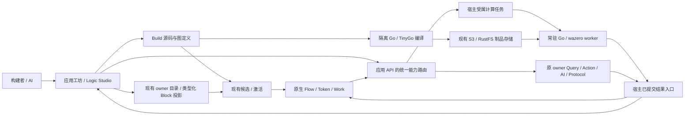

# ADR-0044：能力装配层——原生 Block、Go/Wasm 函数与统一流程 / Capability Fabric

## 状态与核心决定

**Accepted，2026-09-30，#139；关联 #123/#132/#133/#136。** 负责人已授权实施；当前范围见 §12。复用 K1–K9 与已有宿主/Flow/Work；Wasm 使用 Go 原生 wazero，不引入外部编排器或 Rust 构建链。一次统一改造，不保留双引擎或第二套恢复体系。

名称保持**能力装配层（Capability Fabric）**：在本体语义和应用体验之间，把原生能力与代码算法变成可发现、可连接、可调用的类型化 Block。产品入口是应用工坊中的 **Logic Studio / 逻辑工作台**。统一的是画布语法、能力契约与调用治理；生命周期、长流程、数据逻辑、AI 与行业执行保留各自语义主人。

| 决定 | 采用 |
|---|---|
| 执行归属 | 状态变更归原 Action/Lifecycle，长等待归原 Flow/Work，计算归 Operation，推断归 AI；共同复用 Work/Effect 和 accepted-result/journal |
| Wasm 运行 | Go + **wazero**，同仓库 Go worker；独立进程隔离计算，无新编排服务、数据库或日志 |
| 源码工具链 | 普通 Go/TinyGo 编译为 WASIp1 command；不采用 Reactor。制品语言中立，本次不增加 Rust 构建链 |
| 能力入口 | 现有 owner 目录和应用 API 的统一调用路由；原生方法、AI、代码函数使用同一发现/绑定/授权规则 |
| 可视化 | 已有 React Flow 共用画布；以 n8n 的节点创作/数据映射为主，借鉴 Retool 调试布局及 Blender 类型插口/插入让位；不搬执行栈 |
| 发布与恢复 | 新资产纳入现有候选/激活和已提交结果；不增独立 Wasm 上线按钮或外部执行历史 |
| 改造方式 | 同一次改造统一定义、目录、前后端和运行入口，移除被替代的重复结构；不保留临时执行路径 |

## 1. 先用我们自己的底座

K1–K9 是语言中立的语义契约，宿主和平台应用已经承接其主要执行责任。画布是创作界面，Wasm 是计算插件；二者不得重新实现决策、权威、策略或持久工作。

| 现有规范/能力 | 代码事实 | 本设计如何使用 |
|---|---|---|
| [K1 身份](../../contract/spec/K1-identity.md) | 稳定引用、重定向，`kernel.Identity` | 能力、对象、调用与节点使用稳定身份；显示名称不作为执行键 |
| [K2/K3 事实与来源](../../contract/spec/K2-K3-facts.md) | `FactLog` 与决策证据引用 | 查询/计算保留取材来源；算法输出是派生值或运行结果，不另立业务事实权威 |
| [K4 决策](../../contract/spec/K4-change-record.md) | `ChangeLog` 幂等键、修订与因果；同键同提议返回原接受结果 | Action Block 走原 canonical submission；不能让图或 worker 另写记录 |
| [K5 权威](../../contract/spec/K5-authority.md) | 权威按数据类别声明；跨应用通过协议路由 | 跨应用 Action 仍走协议；不直接读写另一应用私有状态，不承诺跨权威全图 ACID |
| [K6 策略](../../contract/spec/K6-tenancy-policy.md) | 接收次序、主体与租户检查 | 编辑可用性、发布校验与运行授权共用原 owner；前端隐藏不是授权 |
| [K7 Schema](../../contract/spec/K7-schema-evolution.md) | Schema 名称/版本和升级链 | 复用有效载荷演进；端口 JSON Schema/profile 是平台定义扩展，不冒称 K7 已提供完整结构类型推导 |
| [K8 连接器](../../contract/spec/K8-connectors.md) | 统一连接器描述符、游标/健康 | 外部数据与效果仍由原连接器/Effect 暴露为 Block；不给 Wasm 开任意网络替代集成 |
| [K9 所有权](../../contract/spec/K9-work-ownership.md) | generation、取消、过期结果、checkpoint 的规范与 Go 实现 | 异步计算采用现有工作所有权；不能把尚未接入宿主的 checkpoint 当现成断点续算 |
| [`flow`](../../capabilities/server/apps/flow/flow.go) / [`engine`](../../capabilities/server/apps/flow/engine.go) | 实例/Token、Wait/Ask、All/Any、子流程、重试/补偿、取消/跳过及追踪；声明 `AcceptedWork` | 仍是唯一流程执行状态与推进器，直接扩展 Step/Token/Data |
| [`acceptWork`](../../capabilities/server/accepted_work.go) / [`Replay`](../../capabilities/server/host.go) | 已选择工作保存 generation、业务映像、通知和意图；恢复 `work-result` 不再调用 runner/listener | 新图推进沿同一路径，不增外部 Event History |
| [`protocol`](../../capabilities/server/protocol.go) / [`stagedDecision`](../../capabilities/server/staged_decision.go) | 受权跨应用请求/应答和有界接受结果 | 新 Block 复用现有执行路由，不建设图专用跨应用事务 |
| [`effects.dispatches`](../../capabilities/server/effects.go) / [`settleAccepted`](../../capabilities/server/accepted_effect.go) | 锁外执行、锁内暂存完成/回调，再提交结果 | 作为异步 Compute 接入的现成模式；计算是新的受属任务种类，不是另一调度器 |

**当前真实缺口只有定义表达和接入：** 通用普通计算声明、类型化输入输出/绑定、声明式控制块、有界循环 frame，以及异步 Wasm 输入/占用/完成结果的持久适配。现有 `acceptWork` 的 Start→Finish 在同步提交锁内完成，不能直接把 Wasm 跑进去；All/Any 已有逻辑分支，也不等于已有物理并发计算池。

这些缺口在应用 API、Flow 和宿主主人处补齐，不需要扩大内核概念。未接入 accepted-result 的旧入口仍有输入重判边界；此次只确保新装配路径完整使用已有结果机制，不借机重开全宿主恢复工程。

## 2. 第三方选择：补缺口，不搬平台

选择优先级是**现有能力 → 有界扩展 → 职责单一的轻量依赖**。考察 API/协议的未来扩展性、Go 集成、资源/部署成本、活跃维护和可移除性；不因为“行业最稳”引入一整套系统，也不因为“更新”接受重复权威。

| 候选与一手依据 | 与现有平台的关系 | 决定 |
|---|---|---|
| [wazero](https://wazero.io/docs/) | Go 原生 Core Wasm 运行库，弥补目前没有受控算法执行器的实际缺口；无 CGO | **采用**；固定实施时核查过的版本，不使用浮动依赖 |
| [React Flow](https://reactflow.dev/learn/advanced-use/computing-flows) | 已在 NodeCanvas/Graph 使用；负责画布，不提供业务执行 | **复用**，无需换库 |
| [Retool Blocks](https://docs.retool.com/workflows/guides/blocks)、[Branch](https://docs.retool.com/workflows/guides/blocks/branch)、[Loop](https://docs.retool.com/workflows/guides/blocks/logic/loop) | 可借鉴目录、属性、分支/循环、运行反馈和校验交互 | **借鉴产品设计**，执行由我们的 Flow/Work 承担 |
| [n8n Loop](https://docs.n8n.io/flow-logic/looping/)、[数据映射](https://docs.n8n.io/data/data-mapping/data-mapping-ui/) | 显式循环、字段拖放与运行数据固定可改善体验 | 借鉴交互；不引入其 item 隐式执行或自由脚本模型 |
| [Restate 服务](https://docs.restate.dev/concepts/services/)、[调用协议](https://github.com/restatedev/service-protocol/blob/main/service-invocation-protocol.md) | 自有 invocation journal、状态/计时/消息与 runtime，会重叠本平台职责 | **不引入**。只有决定整体移交某个现有职责时才重新比较，不能旁挂第二恢复主人 |
| [River 可靠 worker](https://riverqueue.com/docs/reliable-workers)、[事务入队](https://riverqueue.com/docs/transactional-enqueueing)、[resumable jobs](https://riverqueue.com/docs/resumable-jobs) | Go/PG 队列较轻，也有可续接工作；入队去重不等于执行恰好一次 | **不引入**。现有调度足以承接当前任务；未来真正出现派发缺口时只评估该职责 |

Temporal 不进入本设计。Retool 采用什么部署组件，不能推出我们也需要它。Restate/River 的新机制值得参考，但“更轻”仍不能消除两个工作状态、两个日志或两个重试主人之间的复杂度。

## 3. 终态架构与单一入口

**能力只有一个规范主人和一个执行入口。** 共同 `Invoke` 只按类型选路到现有 Query、Submit/Protocol、RequestFunction 或新增 RequestOperation；它不重新接受 Action、不另判权限、不再存一份能力定义。页面、画布、AI 和代码 API 调用同一 owner 实现；worker 的私有执行通信不成为租户公开的第二入口。图中 Flow 表示需要持久编排的调用者；单次计算、实体状态转换和 AI 函数调用不必先创建 FlowInstance。

| 归属 | 增加/改造 |
|---|---|
| `capabilities/server/platform` | 普通 Operation、共同描述符、类型化绑定/控制节点和调用封套 |
| 宿主 `definitions.go` 与各 owner | 原目录生成可调用视图，执行时沿唯一 owner 入口校验 |
| `apps/build` | 同一 Process/代码资产的草稿、编译/测试与候选；不另建 Graph 项目或工具目录 |
| `apps/flow` | 原 Step/Token/frame 直接扩展；流程状态仍在原 FlowInstance |
| `apps/work` | 人工 Ask/审批与收件箱；不承载计算作业 |
| 宿主 Work/Effect 调度及接受结果 | 新 compute 任务、锁外派发、generation、完成与 Flow 续接 |
| 同仓库 Go `wasm-worker` 运行模式 | wazero 执行；不持有业务数据库、业务权限或恢复日志 |
| `FileStore` 与 artifact 生命周期 | 复用字节存储，代码制品引用/保留不进入业务附件清理 |
| `@platform/ui` / `@platform/app` / `@pkg/build` | 共享画布、语义绑定、Block IDE 和页面调用反馈 |

物理上 worker 与主宿主隔离是为了限制计算故障，逻辑上仍只有原宿主的工作与结果生命周期。常驻一个 Go worker 即可起步，不要求新集群、额外数据库或编排产品。

## 4. 原生能力与代码函数的共同契约

目录只有一个公开发现协议。原生资产是 owner 声明，代码制品是受控 compute 资产；二者在 UI 中可按来源筛选，但不分别维护规范注册表。

| 能力 | Block 输入/输出与语义 |
|---|---|
| Object / Relation | 数据资产；提供受权 Query 和 Action。实体本身不是可执行函数 |
| Query | 参数 → 声明的分页/集合/聚合结果；保留记录/字段来源与读取限制 |
| Compute | 输入 → 输出；可信 Go 方法或 Wasm 算法，不直接写业务/访问外部系统 |
| Action / Effect | 参数 → canonical 接受回执/任务或效果状态；原权限、审批、事务与回执有效 |
| AI Function / Agent | 受权输入 → 推断结果/受管运行；复用模型/工具/预算主人，不改称普通计算 |
| Flow / Subflow | 参数 → 运行/输出；运行主体、工作状态与恢复归原 Flow |
| Control | 条件、集合、等待、返回等内置步骤；不为每个 if/else 编译 Wasm |

新增 `platform.Operation` / `compute` 资产承载普通算法；不把 Wasm 塞入现有 `AIFunction` 的模型字段。`CapabilityDescriptor` 是 owner 资产的共同视图；前端 `BlockSpec` 从它投影，不再注册一次能力。

描述符包括限定 ID、owner、kind、英文/中文说明、输入/输出 Schema、配置 Schema、effects、权限/来源、执行绑定和资源策略。原生引用注册入口；Wasm 引用已发布模块摘要与 ABI。`BlockSpec` 另含图标/分组、输入端口、命名控制出口及检查器展示；展示信息不能改变执行。

共同调用接受稳定 requestKey、精确能力引用与 inputs，返回 completed（原回执/输出引用）、pending（调用/任务 ID）或 rejected（原错误封套）。等待审批不是已成功修改业务。直接 Compute 与流程内 Compute 使用同一 RequestOperation/受属任务，HTTP 可以等待有界响应，不另建同步“快速执行”路径。

**一份 Schema。** 复用 Field/Parameter 的原语义，结构类型由平台 `ValueSchema` 表达；以 [JSON Schema 2020-12](https://json-schema.org/draft/2020-12) 的结构约束为参考，公开的是有界平台 profile，`nullable/variant` 不是任意标准 Schema 的完整实现。限制对象/数组/字符串/深度和总大小，未知字段默认拒绝；禁止联网引用、任意递归和程序式校验。缺少结构定义的原生 JSON 参数保留 owner 的原 Field 元数据，不能伪装成 string 或编造封闭 Schema。金额、小数和对象引用沿原语义编码，不能自动冒充类型兼容。

绑定只能是常量、流程输入、当前 item/index、可达前序输出字段、对象字段、具名查询或注册转换；保存 node ID + 字段路径及作用域。比较、布尔组合、投影是平台内置有类型操作；复杂算法用 Compute。没有 `{{ 任意 JavaScript }}`、自由 SQL 或租户私有表达式解释器。首版采用明确类型匹配/投影/转换，不宣称可求解任意 JSON Schema 子集关系。

输入取材的受保护来源由宿主保存并传播到计算结果/运行详情/页面派生值，读取时重查当前权限。Wasm/AI 不能自己删除来源标签、伪造身份或宣称结果已脱敏；字段释放规则仍归原数据 owner。

## 5. Block 封装、连线与校验

### 5.1 五类流程，统一画布语法，保留执行职责

| 流程类别 | 关注点与定义 | 唯一语义/执行主人 | 画布表达 |
|---|---|---|---|
| 实体生命周期 / FSM | 单记录允许的状态转换、角色、条件；已有 `build.object` States/Actions | 原 Lifecycle/Action 与该对象 owner；不新建 FSM 引擎 | 状态节点和转换边；检查器编辑原 From/To、条件及角色 |
| 人工协同 / Human Workflow | Ask、认领/审批、长等待、会签/驳回等人机协作需求 | 原 `apps/flow` 的实例/Token，加 `apps/work` 人工任务；具体审批能力仍按现有实现边界 | 执行节点、等待/角色与任务状态；不是宣称完整 BPMN 标准实现 |
| 数据/集成 / Data Logic | Payload、Query、Transform、Compute、ForEach、Connector/Effect | 纯计算用内置 Go 算子/Operation；集成归 K8/Effect；需要持久等待/重试/多步效果时由原 Flow 编排 | 控制线与数据绑定分开，普通 DAG 加有界循环 scope |
| AI Logic / Agentic | 模型非确定输出、受权知识取材、工具循环、结构化结果与评测 | 原 `build.function` / 宿主 AI/Agent；人工确认或跨步骤长等待调用 Flow/Work | LLM、检索、工具与校验 Block；模型用量/评测归原治理 |
| 制造/物流执行 / Routing | 物料/批次、工位、设备、操作者和业务不变式 | 行业对象/Action/Protocol/Connector 组合平台能力；行业语义留在领域包 | 工艺/站点和运行状态适配；共用画布，不把工艺路由当通用 DAG |

所有类别共用连线、选中、缩放、键盘、属性面板和运行标记，但不互换边的含义。纯计算不创建人工 WorkTask 或长流程实例，也不在租户锁内开启长事务；其有界调用与结果仍遵守原执行/接受机制。微计算先采用具名算子、类型化 Binding/Predicate 与 Go/Wasm，不增加内嵌 JS 表达式语言。

设计态由构建者编辑定义/草稿与候选；运行态由操作员读取 owner 的真实状态和已保存中间产物，复用只读画布高亮。认领、答复、取消等操作使用原受权动作，不通过修改运行图来改变已发布逻辑。

### 5.2 统一 Block 族

| 族 | 节点与配置 | 复用/扩展 |
|---|---|---|
| 触发/入口 | 手动、页面、记录事件、协议事件、定时；严格输入 | 原事件、Job、Flow Start；增加声明式输入 |
| 数据读取 | Query、对象/集合/聚合读取 | 原具名查询/授权；参数绑定与输出描述符 |
| 操作/效果 | 原生 Action、审批请求、Connector/Effect | 原 Submit、Work、Protocol、Effect，不新造提交/审批 |
| 计算 | 原生 Operation、Go/TinyGo Wasm | 新普通计算类型及其受属执行适配 |
| AI/Agent | 已发布 AI Function、受管工具运行 | 原模型与 Agent 路径，公共目录投影 |
| 条件 | Branch、Switch、Filter、Transform | 结构化 Predicate/Binding、命名出口与结果类型 |
| 集合/并发 | ForEach、Map/Reduce、受限 While、Fork、BranchMerge、AllJoin、Race | 复用 Token All/Any，增加 loop frame/结果汇合；明确物理计算并发 |
| 等待/结束 | Wait、Ask、Subflow、Return、Fail、局部 Error/补偿 | 原等待/人工任务/子流程/重试/Undo；补类型化输出 |

每个 Block 只是 capability/control 引用、typed config、inputs/outputs 与控制出口，不内嵌另一种业务实现。代码源码留在 CodePackage，画布引用其公开契约。

### 5.3 控制线与数据绑定

主线决定执行顺序，出口明确 success/error、if/else、case/default、loop/done；属性面板引用上游字段，选中时可显示数据依赖线。数据线不产生新的调度，控制线也不能弥补缺少输入。

Branch 只执行命中路径并高亮；分支汇合只接收实际选择的路径。AllJoin 与明确 fork/scope 配对；`any` 定义为首个成功路径，全部失败才进入原错误/补偿路径。胜出后取消其余后续工作，不撤销已提交决策。数据合并只合并值，不提供调度等待。

循环是显式子作用域，保存 item/index、迭代路径、最大次数、concurrency/batch size、结果顺序和错误策略；任意回边拒绝。串行、并行和分批是同一节点的策略，不是三个执行器。break/continue 只在所属 scope 生效；部分失败用显式 result/variant 表达，不能向成功 Schema 塞 null。

Go 代码 Flow 与 Builder Process 最终使用同一 `platform.Flow/Step` 语义和同一 `apps/flow` 推进器。修订后的 Process 是唯一租户流程定义；Graph IR 是其校验/编译表示，不再保存另一份平行图真相。状态机和 AI 函数仍保存于各自 owner 定义，不强行改存为 Process。不反编译 Go 闭包；可信代码声明可保留函数，但公开成 Block 必须有完整具名契约。

### 5.4 三处校验，一份规则

| 时点 | 校验与反馈 |
|---|---|
| 编辑 | 缺参、Schema/端口类型、作用域、分支可空、错误出口；即时报出 node/port/field 路径 |
| 保存/测试/发布 | 同一服务端 compiler 检查可达性、受控循环、必填输出、作用域、依赖、能力效果及权限；不能只信任 React Flow isValidConnection |
| 执行/完成 | 再查实际输入、当前主体/源权限、预算和版本；worker 输出再次验证后才能被接受 |

画布位置、颜色、折叠、视口与布局是 presentation metadata；它们不决定入口或执行次序，也不进入语义摘要。React Flow node/edge JSON 不是业务规范。

## 6. 原生 Flow 的必要扩展

保留原 `FlowInstance`、Token、宿主受属任务、人工任务、追踪与接受结果，不新建 graph-run 数据库。需要增加的状态是有界运行 frame：作用域/父 Token、迭代路径与游标、已完成结果引用、待调用 ID、Join 激活集合、剩余预算。计算任务/generation 归宿主 `operations.go` / `kernel.Works`，人工 WorkTask 只用于 Ask/审批。

- Branch/Binding 作为类型化定义编译到原 Step；ForEach/While 使用 frame，恢复读取已保存游标和结果，不能只靠 Go Choose 回跳。
- Fork/Join 沿原 Token 模型，计算任务在已有锁外 worker 通道并发；结果按稳定 iteration/branch ID 汇合，不按物理完成顺序改写集合语义。
- 一次决策的推进/集合预算耗尽时保存 frame 和下一次受属推进意图，然后让出；不能把正常长集合一律当无限循环卡死，也不能在租户锁内无限推进。
- 等待、人工答复、子流程和补偿沿已有事件/Work/Flow；局部错误出口处理后，全局 handler 不重复处理同一错误。
- 定时/事件/重试继续归已有调度。需要更快唤醒或更大规模时优化该 owner 的到期索引/公平性，不为毫秒算法调用新建实时调度系统。

这些是扩展现有平台的执行表达力，不是自研另一套 Temporal。现有 journal、Decision、世代、任务、协议与效果继续承担持久工作保证。

## 7. Wasm 计算如何进入已有执行路径

### 7.1 调用意图 → 锁外计算 → 已接受结果

1. RequestOperation 解析 owner/输入/来源/模块/预算并检查权限。在现有接受决策中保存调用身份、固定输入、待计算状态与受属工作意图；Flow Token 保存同一 call ID 后等待。
2. 稳定调用键来自 tenant/run/node/iterationPath/invocationOrdinal；直接调用使用接受的 requestKey。重试 attempt/generation 不改变逻辑键，同键不同提议沿 K4/现有结果入口拒绝。
3. 宿主现有调度占用该工作，持久化当前 generation/待完成状态，在 tenant commit lock 外调用 Go/wazero worker。内存 busy 标记仅防同进程重复派发，不能代替持久所有权。
4. worker 只返回计算输出/错误/执行度量。宿主在原结果提交入口核对 call、有效 generation、输入/模块摘要和输出 Schema，将结果及受支持 Flow 续接映像/意图一起接受后才可见。
5. 已有完成结果直接读取；Replay 只应用保存的结果与 Token/frame，不重算 Wasm、不运行当前业务回调。计算完成但尚未入账的窗口可能再算一次，不能据此宣称物理执行恰好一次。
6. 取消沿 K9 与 Flow 原入口；旧 generation/迟到结果不得推进。取消只阻止后续工作，不撤销原生 Action 已接受的决策。

当前同步 acceptWork 不能直接包住第 3 步：需在原 owner 中扩展异步占用/完成适配。复用 effects 的锁外执行与 settleAccepted 结构、同一调度和 accepted-result 日志类别，新增必要的计算结果 payload；不伪装成任意外部 webhook，不复制一套日志/重试队列。

执行进程重启后，按已有工作所有权规则使失去运行器的 generation 失效并重新占用未决工作；其输出已接受则不再运行。仅恢复未决工作所需的状态，不为一次性短算法引入通用指令级 checkpoint。真正长集合的检查点是 Flow frame，复杂算法需要内部断点时再使用 K9 已有 checkpoint 契约。

### 7.2 业务写入仍走原 Action

Compute 可以返回建议或变更计划，不能直接提交业务。后继 Action 使用原 owner 的 canonical submission 与稳定幂等键；调用结果只是原接受回执的引用，不能另接受一次变更。取消/权限检查在原 Action 提交时生效，不能仅靠早先的调用许可。

跨应用动作走原 Protocol 和声明的消费关系；并行/循环不带来跨权威全局事务。需要同权威原子修改时注册一项原生 Action，不能以两个顺序 Block 冒充原子操作。AI/外部效果同样沿原 Request/Reply、审批与回执。

## 8. Go/TinyGo 编译与制品

本次正式提供普通 Go 与 TinyGo。普通 Go 使用 `GOOS=wasip1 GOARCH=wasm go build` 的 command 路线；TinyGo 固定支持版本的 WASI command 配置，不使用 Reactor/c-shared。见 [Go WASI](https://go.dev/blog/wasi)、[TinyGo WASI](https://tinygo.org/docs/guides/webassembly/wasi/)。Rust、其他语言可以以后通过同一语言中立制品协议接入，本次不安装其编译器/PDK 或增加对应服务。

SDK 从 Input/Output Schema 生成类型和 main 包装，一个制品首版公开一个计算能力。TinyGo 的 [reflection/标准库兼容](https://tinygo.org/docs/guides/compatibility/) 有边界，使用 Schema 生成的无反射编解码模板；不能承诺任意 encoding/json、cgo 或第三方包都兼容。普通 Go 与 TinyGo 是编译 profile，不产生两套注册/执行 API。

CodePackage 保留源码快照、锁文件、Schema、SDK、工具链镜像摘要及构建选项；BuildResult 记录输入摘要、诊断、模块摘要和 imports/exports 校验。构建工作仍归 Build 和已有受属工作，编译成功只产生可引用制品。

隔离构建使用临时无特权容器、固定模板/工具链、受控离线依赖和 CPU/RSS/时间限额；无生产凭据、宿主目录或 Docker socket，租户不能提交 shell/构建命令或共享可执行缓存。产出后验证格式、features、imports、固定 `_start`、体积、ABI 与 Schema；由宿主计算摘要并登记。

字节复用现有 `FileStore` 的 S3/RustFS；元数据复用 Build/定义发布。采用 artifact 存储类别/引用留存，不能将模块伪装成普通 files.file 而被 SweepUploads 清理。当前开发 store 是内存，磁盘 store 若需要也属于同一接口实现。

候选、已发布引用和非终态调用保留模块；admission 取得引用与 GC 判定协调。便携 `.wasm` 是权威制品，worker 编译缓存可重建；版本/依赖继续沿现有发布规则，不设计新的制品发布治理层。

## 9. wazero 执行配置与实际边界

### 9.1 一个 Go 计算执行器

同仓库 Go 程序提供常驻 wasm-worker 模式，生产与主宿主分进程/容器以控制计算故障；不引入 Rust、CGO、外部编排服务或专属数据库。worker 无业务权限/日志，只接受宿主授权的模块引用、输入、call ID、generation、deadline 和限额；返回结果给宿主。

使用 wazero 的 Compiler 模式与 CompilationCache，按模块摘要和固定运行配置共享只读编译代码。每个调用创建独立实例、线性内存、stdio 和 context，结束即关闭；不共享可变 guest 状态或并发调用同一个 Function。缓存版本/平台/配置由 worker 管理，租户不能写缓存目录或提交 native 缓存字节。依据见 [wazero API](https://pkg.go.dev/github.com/tetratelabs/wazero)、[Function API](https://pkg.go.dev/github.com/tetratelabs/wazero/api#Function)。

### 9.2 标准 WASIp1 command

输入是已校验且有界的 UTF-8 JSON，通过调用专属内存 stdin 一次提供并结束输入；输出为 stdout 的一个 JSON 值，stderr 是截断诊断。无 shell、每调用 OS 子进程或 OCI 冷启动。ABI `platform-wasip1-json/v1` 只规定封套与错误约定，不自造指针分配接口。

输出采用 `{ "ok": true, "value": ... }` 或 `{ "ok": false, "error": { "code": "...", "message": "..." } }`；要求正常退出、有效 UTF-8、单一 JSON 值后仅有空白，拒绝重复字段/非有限数。非零退出、trap、超时、无效输出是执行错误，不能采纳半截 stdout。成功还须通过 owner 的输出 Schema。

标准命令执行 `_start`；wazero 默认实例化也会执行配置的 start function，因此不能把整次 Instantiate 耗时误称为纯实例化。需要分别测量时，使用 `WithStartFunctions()` 暂不执行导出的 `_start`，然后显式 Call；仍只执行一次，并处理 WASI 正常退出语义。该配置不跳过 Wasm binary 的 start section，若模块包含它，其执行计入实例化预算/取消及耗时。当前设计不要求 Component Model/WASIp2/3 或 guest 线程支持。

### 9.3 预算与取消

显式启用 `WithCloseOnContextDone(true)`，设置 deadline、`WithMemoryLimitPages`、实例/并发/排队上限，以及源码、模块、输入、输出和诊断体积限制。内存 pages 只限制 guest 线性内存，不能冒充 worker RSS 总限额；编译缓存、Go 缓冲、表/栈还需结构限制、缓存预算和外层 CPU/RSS 限额。

wazero 当前公开配置没有确定性指令预算。本设计使用 guest context 取消与进程资源配额，CPU 度量与指令计数分开。host I/O 要自行遵守 context；输入来自有界内存，不接无法取消的管道。初始化/编译也有任务 deadline 和进程限额。依据见 [配置 API/源码](https://github.com/wazero/wazero/blob/main/config.go) 与 [运行原理](https://github.com/wazero/wazero/blob/main/RATIONALE.md)。

WASI 不预打开文件/网络，不继承宿主环境、生产凭据或 stdio，不注册通用数据库/HTTP host-call。时钟/随机源按 profile 显式配置，不能直接继承真实系统值再声称纯确定性；语言运行时需要的受控源与算法公开输入由 SDK 约定。确定性仍需验证，结果恢复不依赖重新计算同值。

### 9.4 毫秒目标，不额外造快通道

目标是在常驻 worker、编译缓存命中、模块 ≤ 5 MiB / 输入 ≤ 64 KiB 的基准下，进入 `_start` 前的实例/输入准备 p95 ≤ 10 ms；记录 CPU、并发、限额与取消启用后的实际配置。这是待测目标。

源码编译、首次下载/编译、排队、SDK 初始化、算法运行和宿主结果提交分别计量。Go 标准运行时的初始化成本尤其需实测；不能把纯实例化指标冒充端到端毫秒保证。达不到时先定位实际瓶颈，不引入另一个运行时/无持久化入口来优化演示数字。

## 10. Logic Studio：复刻操作思想与反馈

**n8n 是主交互参考。** 采用其[上下文添加节点](https://github.com/n8n-io/n8n-docs/blob/main/docs/build/understand-workflows/workflow-components/work-with-nodes.md)与[上游数据引用](https://github.com/n8n-io/n8n-docs/blob/main/docs/build/work-with-data/reference-data/reference-previous-nodes.md)：先选任务节点，再在同一检查器绑定输入、查看输出；拉线到空白处打开兼容节点目录。Retool 补充 [Block 创建、运行与连线反馈](https://docs.retool.com/workflows/guides/blocks)，Blender 补充类型插口和插入后让位。采用操作思想；表达式、身份、执行与结果仍归本平台。

Retool 的 1:1 标杆限定为工作布局、可操作能力和反馈完整度；不移植任意 JavaScript、资源查询解释器、凭据模型、调度栈或像素级测试矩阵。

| 工作区 | 用户能完成的操作 |
|---|---|
| 左侧能力目录 | 搜索/筛选 native/code/AI/control，查看类型、effects、来源和可用状态；拖放或拉线到空白处选择 Block |
| React Flow 画布 | 选择、命名出口连线、复制/删除、undo/redo、子 scope 展开、自动布局与键盘替代；显示命中路径/等待/错误 |
| 右侧检查器 | Settings/Input/Output，类型表单、上游字段选择/拖入、常量、循环配置、预算及权限提示；字段错误可定位到节点/端口 |
| Code 面板 | 同一资产的 Go/TinyGo 源码与生成类型，构建/诊断/候选状态；构建后直接回画布使用 |
| Test/Debug | 固定输入/前序数据，单块或整图运行，tree/table/JSON 输出、分支与迭代结果、错误/时延；结果点回原节点 |
| Runs | 原 Flow 运行详情、call ID、attempt 与 iteration 分开、任务/取消/重试、输出来源及资源度量 |
| Release | 原候选差异与激活：图、能力、模块、Schema 引用可追溯；不将 Compile 叫 Publish |

局部红色 error 出口与全局未捕获错误处理分开，参考 [Retool error handlers](https://docs.retool.com/workflows/guides/error-handlers)。测试可以复用保存的输入/固定数据，避免反复调用模型；读取历史不重新执行 Action，用旧输入调试产生新的明确测试运行。

候选测试复用已有 TestPlan/模拟与本次隔离 worker，使用测试数据/绑定，不借生产读写权限。单块测试声明输入来源，不能假装前序副作用已发生。“运行前置块”不能在生产重做已经接受的动作；不开放生产任意回滚/重跑调试。

生命周期、流程/AI 编辑、只读运行与审批图共用 React Flow core 的展示/编辑 adapter，删重复交互实现。各类别按 §5.1 选用语义适配，关系边、状态转换边、执行边保留各自含义。设计态与运行态是同一资产上下文中的编辑/观测模式，不是两份图定义。

页面仍由 `@platform/app` 绑定查询、算法/流程输入、异步输出和原 Action 回执；React 组件声明 props/slots/events。Wasm 算法不自动变为表单组件；本地选择/过滤属于页面状态，业务等待属于后端原 Flow。

## 11. 一次完整改造的范围与完成条件

原生 Flow 本身不替换；一次改造统一其可编写契约、能力入口和新增计算接入，不保留分期替换、双后端路由或临时 fallback。

| 修改位置 | 直接形成的终态 |
|---|---|
| `platform/app.go`、`definition.go`、`definitions.go` | 原目录包含 Operation/compute 与 BlockSpec 投影；页面/AI/Flow 无独立工具列表 |
| `platform/flow.go`、`apps/build/process.go`、`apps/flow` | 同一 typed Step/Binding/Loop frame，Process 编译同一 Flow；删除旧 Builder 独立分支/参数格式，不保留两套编译语义 |
| Work/Effect 调度、`accepted_work`/接受结果 payload | 异步计算占用/派发/完成进入原调度与 journal；无计算专属重试平台或第二执行历史 |
| Go worker、Build 源码构建、FileStore | Go/TinyGo 构建和 wazero 完整接入同一候选/调用路径；无 Rust 服务或 Wasm 独立上线通道 |
| `NodeCanvas`/`Graph`、Build 编辑器、`@platform/app` | 共用 React Flow core、同一类型绑定与运行反馈，去掉重复前端注册/交互 |

定义/持久载荷必要变更按原 K7/发布规则一次转换后切换，转换不能完成则不启用新写入；保留合法历史的结果解码/纯应用属于已有恢复职责，不是保留旧执行器。模块/定义引用固定沿现有候选与 Flow 绑定处理，不另写一套版本和恢复制度，也不丢弃有效客户数据。

整个改造的完成证据是同一应用工坊走通：**原生 Query → Go/TinyGo 算法 → Branch/有界集合 → 原生 Action/Work → 页面结果**；AI 能发现同一工具，生成代码、查看编译诊断和提议候选，发布权仍来自明确授权主体。

必要验证只有：同一 Schema 的 Go/TinyGo command 兼容；类型/无权/资源拒绝；已接受结果重试不重复提交、取消后迟到结果不续接及一次重启恢复；关键构建/测试/发布/操作行为。前端布局启动截图与人工看，自动化不做像素断言和设备/语言复制矩阵，不为 Compute 跑模型多轮评测或重开全宿主故障注入。

WMS 是陌生业务装配探针，不开发 WMS/MES 应用。数据关系、页面复杂组件或同权威批量动作若阻断这条路线，在原能力主人补必要部分；不将一次平台改造扩大成全行业功能开发。

## 12. 实际构建边界

代码函数测试按当前已发布输入 Schema 初始化，运行后明确显示状态、输出或失败原因，可展开本次实际输入；修改输入后提示重新运行，测试输入校验不阻塞源代码/契约编辑。编译由配置固定镜像的原构建 driver 负责，独立开发宿主需显式连接编译与执行 socket。

**As built：能力装配主路径已实现。** `CapabilityDescriptor` 从原 owner 定义投影；共同 API 将 Query/Action/AI/Compute 路由到原入口，计算和人工审批分别保留 pending 回执。类型化 Process 编译同一 Flow；scope/frame 支持分支、集合、并发、等待、人工任务、子流程、break/continue 和首个成功分支。旧定义与 Token 解码为当前模型，历史接受身份及发布字节保留；新写入使用当前格式。

`build.code` 拥有 Go/TinyGo 单源码、nullable/判别 variant 输入输出、生成的无反射 SDK、冻结编译快照和模块摘要。源码通过固定镜像的离线受限容器编译；独立 Go/wazero worker 经私有 socket 执行。模块使用原 FileStore 的 artifact 类别，候选激活固定模块/Schema 并保留后续草稿。派发在租户锁外，原 Work/K9 generation、取消和 accepted-result 接受/恢复结果；旧页面绑定通过已有合法候选保持精确版本。

`BlockCanvas` 是唯一 React Flow core；Graph/NodeCanvas 为适配器。工坊提供能力搜索、拖放/兼容连线、插入让位、自动布局、不重叠放置、复制/删除、undo/redo、输入输出检查器、固定测试和只读运行图。Code 编辑、编译/诊断、候选及已发布调用已贯通；页面计算组件可绑定常量/操作员输入/当前记录，宿主读取记录并自动保留字段来源。

验证使用真实 Go/TinyGo 隔离构建与独立 worker，贯通 Query→算法→分支/集合→原 Action/Work→页面来源调用；接受结果重放保留输出和动作修订，不重算。浏览器实际操作证明 Code 编译/激活/调用和 Compute→Return；工程检查及布局截图不等于负责人整体体验认可。

缓存命中基准：Linux/arm64 worker、2 CPU、外层 RSS 2 GiB、并发上限 4、guest 1024 pages、取消启用，各顺序 100 次。Go 2.15 MiB 模块实例化 p95 **2.330 ms**，TinyGo 492 KiB 为 **0.123 ms**，输入 11 bytes。此结果只覆盖两个样本的实例/输入准备；不包含排队、下载/JIT、`_start`、RPC 或结果提交，不承诺整图毫秒完成。

当前构建 profile 使用固定 SDK/标准库，不接受租户构建命令或在线依赖下载。候选模拟只读取显式合成样本与固定 AI/计算回答；原生业务动作或自定义组织权限需隔离 owner fixture，缺少时明确拒绝。通用 BPMN、完整自主 Agent/行业工艺、任意标准 JSON Schema 兼容及通用客户升级并未由此证明；仍按原能力主人及装配任务推进。

本 ADR 修订 ADR-0031 对受控租户代码的范围，扩展 ADR-0042 的节点/编写契约；其原生 Flow/Work 与单一运行时决定继续有效。ADR-0039 的候选权威、ADR-0040 的语义/UI 归属、ADR-0043 的模型治理保持。当前状态只放 WorkQueue，实现后合并更新本段，不追加过程日记。
