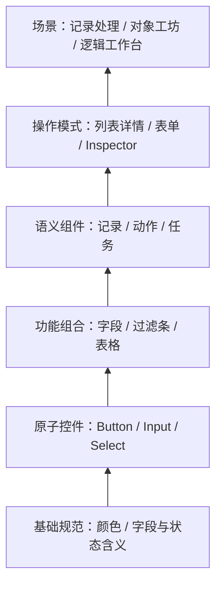

# ADR-0045：Platform Catalog——体验规范、复用资产与场景装配目录

## 状态与决定范围

**Accepted，2026-09-30，#140；关联 #123、ADR-0040 / ADR-0044。** 负责人认可总体方案，并授权按可用性收敛：彻底替换 Gallery，命名为 **Platform Catalog / 平台资产目录**，按原子组件到完整场景分层，同时服务开发人员、FDE、客户构建者与 AI。实施边界见 §11。

Catalog 的角色是平台的**体验规范与装配资产入口**：回答“有什么、什么时候用、怎样组合、从哪里引用、支持到什么程度”。组件展示、交互指导和代码引用共享同一份资产信息；场景示例让已有能力能被看见并复用。

## 1. 问题与现状证据

重构前基线（`074046a`）的 Gallery 按展示主题和行业分组，无法沿按钮→表单→记录操作→工作台追溯组合关系，也不能可靠告知 AI 哪个实现应该复用。下表是该基线的问题；当前产品入口为 [Catalog](../../web/apps/catalog/src/Catalog.tsx)。

| 当前代码事实 | 造成的缺口 |
|---|---|
| 旧 `web/apps/gallery` 手写 11 个 view，ShowcaseCard 只有标题、说明和内容 | 没有统一资产 ID、归属、导入方式、适用条件或生命周期；展示页数量不能说明资产覆盖 |
| [UI 公共入口](../../web/packages/ui/src/index.ts) 已暴露 RecordWorkspace、RecordPage、RecordHistory、Pivot、BlockCanvas 等；Gallery 只依赖 `@platform/ui` | 多项能力没有进入展示；[前端应用 API](../../web/packages/app/src/index.tsx) 的语义绑定与页面装配也未纳入 |
| [styles.css](../../web/packages/ui/src/styles.css)、[StatusTag](../../web/packages/ui/src/components/StatusTag.tsx)、[字段类型](../../web/packages/ui/src/fields/types.tsx) 已拥有颜色和显示/编辑语义 | 规则存在于代码，却缺少“如何选用”的可发现入口；Catalog 应暴露原规则，不能另写一套 |
| [escapes.sh](../../scripts/escapes.sh) 检查部分共享控件逃逸，范围主要是 `web/packages` | 不能检查公共组件漏登记，也不能保证示例、导入和声明一致；不能把现有检查当 Catalog 覆盖证明 |
| [platform.Catalog](../../capabilities/server/platform/actions.go) 与 [CapabilityDescriptor](../../capabilities/server/platform/block.go) 已有运行时职责 | 新产品必须引用原能力定义，防止名称相同导致第二注册表、授权或执行路径 |

展示必须忠实于实现。例如当前 Tree 的简单层级展示不代表完整的展开/收起与键盘导航能力；提交状态示例必须使用 `submissionStatuses` 的真实键，不能用另一套业务状态冒充同一契约。此次重构修正展示与声明，不顺带完善所有控件。

## 2. 采用的方式与参考边界

选择**owner 随代码维护结构化资产信息，生成统一索引，Catalog 提供浏览、预览、选型和查询**。Catalog 自身是遵循平台样式与应用架构的参考应用，以 `defineApp` 注册并复用共享 Workspace 外壳、UI Kit 与样式令牌。保留 React、Vite；本次不增加新的后端服务、数据库或设计系统。

| 方案 | 判断 |
|---|---|
| 只改名并继续维护展示页面清单 | 无法解决漏登记、组合知识及 AI 复用，拒绝 |
| 用 Storybook 全面代替平台目录 | 组件预览有价值，但不足以定义平台语义绑定、装配资格和场景路线；不作为此次替换方案 |
| owner 资产信息 + 生成索引 + Platform Catalog | 采用；代价是为现有公共资产补少量用途、分类和真实示例，后续随同代码修改 |

借鉴的是产品组织和内容维护方式：

- [SAP UI Elements](https://www.sap.com/design-system/fiori-design-web/v1-148/discover/get-started/ui-elements-sap-design-system) 区分简单/复合组件与用例模式；我们进一步加入已有的平台语义绑定与场景装配层。
- [Carbon Patterns](https://carbondesignsystem.com/patterns/overview/) 以用户目标、组合和操作序列定义模式；我们据此提供任务入口，避免按组件大小划分层级。
- [Atlassian 的设计系统内容入口](https://www.atlassian.com/blog/ai-at-work/giving-ai-agents-design-system-context-from-the-terminal-what-we-learned-building-a-cli) 将代码旁的结构化内容用于多个查询入口；我们采用一份数据供浏览器与本地 AI 查询。
- [Storybook AI manifests](https://storybook.js.org/docs/ai/manifests) 可从已有 stories 和类型提取信息，但文档标明其 schema 仍处于 preview。它不能证明未写 story 的公共导出已被收录；本次不引入其工具链或依赖其 schema。

### 审美、交互与代码品味

参照系沿 [Platform §10.1](../Platform.md#101-目标终点构建者与参考产品) 和 [ADR-0004](0004-web-ui-stack.md)：共享 UI 使用 shadcn 的设计约定与 Palantir 的紧凑信息质感，构建操作参考 Retool/Appsmith，语义绑定参考 Workshop；Apple HIG 补充清晰层级、一致性、上下文保留与反馈品质。应用到 Catalog 的标准是：

- 内容、预览与主要操作有清晰优先级；表格、字段、标题和数字对齐，密度支持实际阅读与操作，颜色使用原语义 token。
- 构建者先看用途和装配入口，开发者能直接找到 API；高级信息按需展开，选中上下文和未保存反馈保持连贯。
- 状态变化及时、原因可理解、恢复入口明确；动效服务定位和反馈，键盘、焦点与中文是基本使用条件。
- 实现优先组合既有公共能力；代码可读、归属清楚、依赖简单，不为六层分类添加等价组件或通用抽象。

首版以真实资产、代表场景和启动截图检验这些标准；当前任务可用且适用检查通过就收尾。审美标准不自动变成全站重画、全状态测试或无限打磨的门禁。

## 3. 六层资产体系

**层级按复用职责划分，不按 JSX 深度、代码量或视觉大小划分。** 每个资产有一个主层级，通过标签、依赖和示例进入其他使用场景；不为凑齐层级创建包装组件。

**L0–L5 只用于发现和学习。** 多种特征用标签表达；权限、装配资格、运行分派与兼容性只看原公共接口、绑定契约及 owner 校验。检查器和业务代码不得以“L3 可用、L2 不可用”等层级规则决定能力。

| 层 | 名称 | 负责什么 | 示例与边界 |
|---|---|---|---|
| **L0** | Foundations / 基础规范 | 视觉与交互的共同含义 | 语义颜色、排版/间距/密度、焦点、反馈、语言与可访问性；区分现有规则和设计缺口 |
| **L1** | Primitives / 原子控件 | 单一显示、输入或触发 | Button、Input、Select、Checkbox、Tag；按钮形态属于同一资产的变体 |
| **L2** | Composites / 功能组合 | 与业务模型无关的完整局部交互 | 字段编辑、过滤条、工具栏、Inspector 区块、EntityForm、DataTable、BlockCanvas；复杂画布也可属于这一层 |
| **L3** | Semantic UI / 语义组件 | 表达平台记录、字段、动作、关系、任务等契约 | RecordForm、RecordList、RecordActions、GeneratedForm；注明展示契约与宿主绑定的区别 |
| **L4** | Patterns / 页面与交互模式 | 组织一种可复用的操作任务 | 列表→详情、主区+Inspector、复杂表单、审批收件箱、三栏逻辑编辑器；可由已有实现承载，也可是一份装配配方 |
| **L5** | Scenarios / 场景装配 | 在明确上下文中走通一条完整任务路线 | 对象工坊、逻辑工作台、记录处理、审批处理；列明用到的模式、语义资产和能力边界 |

L2 的 EntityForm 处理传入 Schema 和字段，并不因此拥有业务实体；L3 的 RecordForm 提供字段语义展示，实际受权读取和提交仍由 `@platform/app` 与宿主负责。**按钮、Input、Select 和 Table 组合出来的是实体操作界面，实体身份、生命周期、关系和动作仍由原语义 owner 定义。** `ui.defineEntity` 是显示/校验声明，不能成为第二套本体模型。

Inspector 区块与完整 Inspector 工作台可以分属 L2、L4，因为它们解决不同任务；同一个组件实现不得以换名方式登记多次。已有 RecordWorkspace 用一个资产条目承载列表→详情模式；其他配方引用它，不再包装出等价工作台。

组合引用一般从高层指向低层，允许跳层。实际代码依赖继续遵守包归属与无环约束；“用于哪些场景”由反向索引生成，不形成代码反向依赖。

### 变体、状态与场景不是新层级

一个 Button 条目展示当前 `variant`、`size`、禁用、焦点、图标等实际支持项，提供可操作的控件和有意义的代表组合；不生成所有属性组合的页面或测试矩阵。尚不存在的 loading 等能力只标为缺口，不做假预览。

组件状态描述局部交互；业务状态由原 owner 映射为语义 tone。颜色不能独自表达结果，须配合文字、图标或其他可理解反馈。共享 UI 负责 loading、empty、error 等一致呈现；组件自身管理焦点与受控交互，`@platform/app` 负责读取、表单 dirty、提交 pending 及权限/冲突回执的绑定，业务授权与决定仍归宿主和原 owner。应用提供业务文字与恢复动作，不各自重造通用状态壳。

公共记录、表单、工作台声明实际适用的状态与默认反馈，Catalog 用原实现演示。不存在某项默认行为时标出缺口，在对应共享主人处补当前任务需要的部分；不要求 Button 等全部资产支持所有状态，不新增通用状态执行器。

## 4. 两种发现路线与资产详情

Catalog 同时提供**按层级查找**与**按任务选型**。前者适合查零件，后者直接回答“我要编辑一条记录”“我要处理审批”“我要构建一个有 Inspector 的编辑器”。搜索支持英文/中文名称、任务关键词、数据形态、owner、层级、成熟度与使用方式，默认优先平台推荐资产。

同一目录提供可切换的**构建使用**与**开发接入**视角；工作区构建入口默认前者，本地代码查询默认后者。构建视角突出实际可用的 Widget、Block 和 Studio 模板，以及用途和可配置项；开发视角突出导入、公共类型、事件和 TSX 参考。显示视角只是信息组织，授权仍由原 owner 判断，不新增角色体系。

仅支持代码的资产在构建视角注明“需平台开发者接入”，不给出粘贴 TSX 到租户草稿的操作。开发者/FDE 的代码参考用于受审查的仓库代码，继续使用 `@platform/ui` / `@platform/app`；租户受控定义仍不接受任意前端代码。两条使用路径都有明确产物。

任务指南维护在原规则/模式条目中，避免把选型表再复制成控制文档。例如：

| 任务或数据形态 | 推荐方向 | 必须说明的条件 |
|---|---|---|
| 同类记录的比较、选择和批量操作 | DataTable / RecordList 与过滤模式 | 分页/规模、选择和动作范围，以实际支持项为准 |
| 父子包含关系的导航或选择 | Tree；单层内容展开可用 Disclosure | 层级不是任意关联图；当前展开、键盘和选择限制必须可见 |
| 多对多关系或流程连接 | 对应 Graph / BlockCanvas 适配器 | 关系图、生命周期、流程有不同语义，复用画布不合并执行规则 |
| 记录编辑与受控操作 | 字段编辑器→RecordForm/GeneratedForm→动作模式 | 金额、日期、引用、只读及权限沿已有字段与 owner 契约 |
| 阅读详情并调整属性 | 主从或主区+Inspector 模式 | 保留选中上下文、未保存反馈和窄屏返回路径，声明实际实现边界 |

每个条目用同一详情结构提供：用途与不适用条件、真实预览、变体/状态、最小引用方式、相关契约、组合依赖和使用场景。API 细节按需展开，默认页面先帮助选用。

搜索与详情明确标出**规范 / 当前 API 事实 / 推荐做法 / 示例**及来源；实验或废弃示例不混入默认推荐。规范引用原 owner 文档或契约，API 事实来自对应构建，推荐与示例不能覆盖它们。AI 输出带同样标识，不使用一个模糊的“文档”类型。

### 场景入口与产物

组合视图回答“由哪些资产组成、如何绑定、替换哪里、在哪里使用”，操作按真实产物命名，不统一称为“复制”：

| 支持方式 | Catalog 操作 | 产物与归属 |
|---|---|---|
| 原 Page/Process 等受控结构可以表达的模板 | 在 Studio 创建 | Studio 按模板和当前绑定创建受控草稿；尚未绑定的对象/动作由用户填写，保存/发布沿原校验，不自动上线 |
| 已有代码组件或代码模式 | 复制开发者示例 | 公共 API 引用与最小 TSX；用于仓库代码，不是可上传的租户界面 |
| 无法完整实例化的场景 | 查看参考场景 / 打开相关工坊 | 任务路线、依赖、关键配方及真实支持边界；没有伪造的“一键创建” |

**模板只归 Studio 的 `build` owner。** Catalog 展示同一模板 ID 和描述，Studio 的模板入口消费同一来源；不另存一份模板 JSON 或模板数据库。本次只为能用现有 Page/Process 表达的少量代表配方提供 Studio 草稿创建入口，其他场景保留参考性质，不承诺通用模板实例化。

可实例化模板注明必填绑定与允许替换项，执行约束引用原 Widget/Block、Schema 和 owner 校验。自然语言只解释，不能成为执行规则。代码模式沿公共类型、事件和组件契约；尚不能机器验证的建议标为推荐，不冒称强制保证。不新增配方 DSL 或任意组合求解器。

## 5. 收录范围、资格与成熟度

**必须收录**共享公共视觉能力、字段显示/编辑能力、公开语义组件，以及对外提供复用的模式与场景配方。基础规范和数据选型规则在其 owner 信息中可查。类型、hook、转换函数等进入关联 API 参考，不要求每项创建视觉卡片。

**不独立收录**文件私有辅助组件、页面拆分函数、一次性业务内容、测试工具、原始第三方 API 清单或宿主内部实现。行业专用资产可以进入明确的领域分类，仍归原行业包；只有跨行业职责得到确认才提升为共享标准。示例不携带客户数据或秘密。

每个资产分别声明三个维度，不用一个“已登记”标签混淆它们：

| 维度 | 值与含义 |
|---|---|
| 适用范围 | 平台通用 / 领域专用；说明可复用的上下文。运行时能力另外标明实际宿主、租户/应用作用域，不能以“平台通用”代替调用授权 |
| 成熟度 | 推荐 / 实验 / 废弃；已有资产经核对后分类，缺口和未验证项明确展示；废弃项指向替代或说明无替代 |
| 使用方式 | 代码引用 / 声明式 Widget / 流程 Block / 场景配方 / 规则参考，可多选但必须有真实入口 |

**登记不自动授予设计台拖拽资格。** 声明式 Widget 的类型、属性与绑定由现有 Page/Section 契约决定；Block 由 ADR-0044 的 owner 描述符投影。Catalog 展示同一资格，不能把任意 React 组件变成可运行的租户定义。

未实现的建议放在已有条目的边界说明或原工作项，不创建占位资产混入可用目录。“推荐”说明当前适用任务与已知限制，不承诺所有状态、设备或访问方式均已验收。

## 6. 单一归属与元数据

| 位置 | 规范职责 |
|---|---|
| `@platform/ui` | 原子/组合实现、视觉与交互规范、字段显示/编辑、共享记录框架；资产说明与示例随实现维护 |
| `@platform/app` | 受权读取、动作与语义绑定、页面装配的前端 API；提供对应资产说明与例子 |
| 应用 UI / `build` 等 owner | 特定语义适配、工作台与场景配方；公开复用项通过公共入口提供 |
| 新 `web/packages/catalog` | 小型纯 TypeScript 元数据类型、生成索引格式与共享搜索；不导入 UI/宿主，不拥有组件或业务定义 |
| 新 `web/apps/catalog` | 浏览、预览、依赖展示与选型界面；消费上述资产信息，替换 `web/apps/gallery` |
| 原应用 API、宿主与能力 owner | 实体/动作/查询/函数定义、授权、运行、发布与恢复；保持原入口 |

owner 的 `src/catalog.ts` 维护人工判断：用途、分类、限制、组合引用及示例引用；例子在 owner 旁的 `catalog.examples.tsx` 或对应文件维护。目录契约只约束小而稳定的字段，特定控件的属性仍由原 TypeScript 类型定义。公共导出和源码引用生成；Props 文档只尽力提取，复杂类型保留公共类型名和源码链接，不手写复制参数表。

owner 元数据只引用纯 TypeScript 契约并保存示例引用，不导入 React 示例。仓库生成脚本收集 owner 元数据，产出数据索引与 Catalog 应用专用的预览加载表；后者按需导入 owner 的示例入口。`web/packages/catalog` 不反向导入 owner 包，普通 UI 公共入口也不加载演示库，避免形成 `ui→catalog→ui` 或增加业务页面的演示依赖。

Catalog 条目包含以下最小信息，按资产种类填写适用项：

| 信息 | 来源与约束 |
|---|---|
| 稳定限定 ID、owner、名称/用途 | owner 维护；如 `ui/button`、`pattern/master-detail`，不以翻译标题作身份；翻译来源见下文 |
| 主层级、范围、成熟度、使用方式、关键词 | owner 判断；规则参考和配方无需伪造组件导出 |
| 公共导出、导入路径、类型/源码引用 | 从公共入口提取；文档类型不可提取时保留源类型引用，不能编造 Schema |
| 适用/不适用条件、能力限制 | 简短且面向使用者；不记录开发过程 |
| 依赖与实现引用、示例入口 | 引用稳定 ID 和公共 API；反向列表注明是已声明配方/示例，不冒称全部消费者 |
| Widget / Block / 运行时资产关联 | 引用原契约或 AssetRef；权限、版本和执行含义由原 owner 提供 |
| 内容性质与来源 | 规范、API 事实、推荐或示例；来源版本和作用域一起展示 |

文字沿现有国际化机制：元数据保存英文原文，中文放入原 owner 的字典；UI 使用 `t()` / `register()`，业务应用声明继续使用其 `i18n/zh-CN.json`。索引从同一原文与字典生成按语言的数据，纯 TS 查询模块不依赖 UI 的浏览器语言状态。不手写第二套 `{en, zh}` 文案或汇集成新的全局翻译文件。现有逐字 `t()` 检查不能覆盖所有元数据，轻检查补必需翻译及占位符一致性；用途变更与改名在同一变更核对文字，机器不保证翻译语义正确。

生成索引随同对应前端构建发布，不手改生成文件；Catalog 不另立数据库、注册审批实体或资产发布生命周期。代码资产显示所属包/构建版本；运行时资产显示原定义/发布引用。打开旧构建的 Catalog 不得冒称正在运行最新代码。

稳定 ID 只表示身份，代码条目同时提供构建/source revision，运行时引用继续使用原精确版本。模板创建的草稿保留来源模板 ID 与 revision，内容实例化后沿原定义演进，不自动跟随模板最新版。修改代码资产会影响同一构建中的消费者，revision 本身不提供旧组件并存或兼容保证；真正的不兼容变更按原 owner 处理并给出替代/迁移说明。本次不建立逐组件发布库或版本解算器。

现有 `platform.Catalog` 是动作/部署目录。Platform Catalog 是产品发现入口，代码中以 `CatalogEntry` / `CatalogIndex` 区分；两者不互相取代。后端 Query/Action/AI/Compute 从现有 `/v1/definitions`、`/v1/capabilities` 按当前主体作用域读取；离线索引只含随代码发布的公共资产与说明，不缓存某个租户的私有目录。运行时能力与公共 UI/规则分区并带来源，实体与其前端呈现通过引用相遇。

## 7. 人与 AI 共用内容

浏览器与本地查询共享生成索引和搜索模块。AI 可以直接读构建好的本地紧凑索引，按 owner 分片的摘要不带源码和完整 Props；CLI 的 `search`、`get`、`batch` 是便利入口，不能成为每个组件的强制往返。查询不安装依赖、不启动宿主、不现场提取源码；一次进程可批量完成相关查询，同一会话可复用已读结果。

默认只返回最多 10 条摘要，并限制总响应为 8 KiB；包含 ID、用途、使用方式、成熟度、内容性质、来源及可用状态。类型、代码和依赖按字段请求，超出预算分页并返回继续查询入口，JSON 保持有效；不将整库、巨大泛型或整份示例源码自动塞进上下文。纯索引查询失败时可直接读取对应 owner 的紧凑信息与公共类型，不强迫重试 CLI。

静态代码资产查询不需要运行后端；受权运行时能力查询沿现有客户端/API，并使用当前身份。后续 MCP 若有实际需要只包装相同查询模块，鉴权沿 #124；本次不新增 MCP 服务或第二份 AI 专用长文档。

实施时在 AGENTS 的既有复用规则附近加入简短查询入口：改 UI 前按当前任务查相关资产，缺口在原 owner 扩展。不会要求 AI 每次全量读取全部条目。

## 8. 检查边界

检查负责**登记、引用与代码一致**；体验质量仍按 Testing 的截图和实际走查方法判断。

1. 以包的公共入口和小型导出清单为依据，轻量解析、核对视觉导出与字段能力。公共视觉和字段显示/编辑能力必须关联资产条目或该条目明确展示的子能力，并有适用的真实示例；只有类型、hook 和非视觉 helper 可以仅进入 API 参考。文件私有组件不纳入公共展示覆盖，不额外启动全仓库 TypeScript 类型推导。
2. 真正内部专用的导出优先取消公共导出。必须保留的例外逐项给出具体用途和限制；无通配忽略表。不得把共享控件标成 internal 来绕过登记。
3. 校验 ID 唯一、owner/分类有效、公共导入和示例引用可解析、依赖存在、废弃替代引用与必需翻译有效；能从原 Widget/Block 定义验证的资格必须一致。人工用途和限制不做机械“真实性评分”。
4. 生成结果与源码一致；示例使用公开接口，并进入现有类型检查/构建。阻止应用通过共享包的私有深路径导入绕过公共契约；复用现有逃逸检查，补齐 `web/apps` 的适用范围。结构检查优先解析代码，不用大量正则猜测语义重复。

上述轻检查接入现有 `scripts/verify.sh web`，复用原类型检查/构建；共享边界检查仍归 `composition`。首轮核对现有 UI/app 公共入口及 build 配方；后续新公共能力在同一代码变更中补登记和示例，方法见 [Testing](../Testing.md#自动检查的归属)。

完整 Props 文档提取是显式刷新步骤，按 owner 输入缓存；常规目录构建/检查只消费对应输入版本的已有结果，没有结果或输入已变就显示源类型参考，不能展示旧快照。提取失败仅影响该条目的补充文档并报告原因；登记/绑定错误和原 TypeScript 编译错误仍须失败。实施时测一次新增轻检开销，明显拖慢就缩减范围，不接受每次验证再做一遍全仓库文档分析。查询使用预生成结果。

“已声明的配方/示例”与“静态找到的消费者”分开显示。后者可从公共符号导入、Page/Process/资产引用补充；动态引用或外部仓库范围标为未知。修改/废弃公共能力时检索其公共符号与原资产引用，核对实际消费者；Catalog 声明不是完整影响面证明。

状态反馈、绑定规则、事件或可替换位置变化，即使 TypeScript 仍通过，也由 owner 明确受影响任务，更新相关模式/配方/调用者，并选择实际触及的行为检查或走查。原定义兼容与发布门禁继续有效；不宣称 Catalog 自动检测语义兼容，不要求全资产回归。

不承诺自动发现所有局部重复 UI；文件内新组合是否值得共享仍需要判断。新增公共组件漏登记可以阻断，任意业务组件是否“像另一组件”不能靠检查器可靠裁决。

不为每个条目建立浏览器路线、像素/尺寸断言、全变体矩阵或覆盖率门槛。自动行为验证只覆盖索引查询、选择/示例加载等目录核心行为及实际改变的绑定/权限；不复制原组件已有测试。样式与布局启动后截图检查，关键场景由人操作。

## 9. 预览与装配边界

离线示例用明确标记的合成 fixtures，不自动请求宿主，也不冒称真实授权、发布或恢复证明。可用状态独立于成熟度：**本地示例 / 需连接 / 当前可调用 / 当前不可用**；没有后端时显示 Schema/说明或适用的 fixture，不尝试真实调用后再报错。连接模式选择实际宿主、应用与身份，来源始终可见；权限不足按原 API 隐藏或拒绝，不自行披露不可发现的资产。断线后清除当前可调用标记，真实执行默认关闭。

Wasm 算法不直接访问租户数据库，取材由宿主的受权 Query/绑定完成，并保留来源限制（ADR-0044）。离线能看到公共算法说明不代表拥有该租户的运行数据、已发布制品或调用权。

每个示例按需加载，并由条目级 Error Boundary 隔离渲染错误；加载拒绝、事件处理和异步操作错误在预览内处理，显示该示例失败和重试，搜索、导航及其他资产继续可用。避免在元数据加载或列表初始化时执行示例。首版隔离常见导入/渲染/异步失败，不为可信仓库示例建设进程或全量 iframe 沙箱；同步死循环等任意代码隔离不在其保证内。

目录不执行用户任意源码。示例是仓库内随构建审核的代码；可调参数受原组件类型和受控配置约束。TSX 参考只进入受审查的仓库前端构建，模板沿 Studio 的定义校验与发布，代码工具扩展才沿 ADR-0044 的 Go/Wasm 路径。图片只能补充说明，不能替代可复用实现和当前能力边界。

## 10. 替换范围与停止条件

工程实施作为一次完整 Gallery→Catalog 替换：新名称、应用目录、构建入口、层级/任务导航、两种使用视角、真实预览、owner 元数据、AI 查询与轻检查一起落地；移除旧 Gallery 导航和独立手写清单，复用有价值的现有示例。不维持两个展示产品或永久迁移适配器。工作区提供 Catalog 入口，按资产 ID 定位同一目录内容。

Catalog 是平台的前端参考应用，使用唯一 `defineApp` 声明接入启动器、Apps 首页、应用导航及路由 owner；离线入口复用该声明和完整 Workspace 外壳。公共参考内容无需伪造后台成员角色，租户读取/动作仍检查原身份与权限。层级、资产和模式切换使用原 Workspace 路由，跳转 Studio 时由 build 接管当前应用；不把 Catalog 降为一个无应用上下文的全局页面。

内部实现按依赖先完成纯元数据契约与 owner 内容，再接索引、界面和检查；这不是分别发布的双路径迁移。Catalog 不要求先做完新的 Tree、甘特、审批引擎或 WMS/MES。

完成条件是：

- 在线目录作为应用进入统一启动器与应用导航，保留路由、标签及身份上下文；离线公共参考也使用同一共享外壳。普通示例展开为原工作区中的应用标签页，保留顶部栏、导航与标签上下文；仅 Workspace 壳示例可单独开窗，不用页面级全屏遮罩接管平台外壳。
- 六层可以浏览，按任务能找到推荐组合；现有公共视觉/字段/语义能力均已分类或逐项说明例外，缺口真实可见。
- 能从 Button 的真实变体出发，查看字段/表格组合、记录/动作绑定、列表详情模式及完整记录处理场景，并追溯公共实现；已有 RecordWorkspace、BlockCanvas 和 `@platform/app` 能力能被找到。
- 构建者能用至少一个代表模板在 Studio 创建有待填绑定的合法草稿；代码参考与只读场景有明确标记。对象工坊与逻辑工作台引用现有实现，没有借 Catalog 新建行业应用或执行器。
- 离线浏览不会自动调用后端；运行时能力带来源和连接/权限状态，一个错误示例不影响目录其余部分。
- 浏览器、本地索引与 AI 查询返回一致的 ID、用途和使用方式；输出有界。漏登记、失效引用和缺少必需翻译能被轻检查发现；常规检查不依赖全量 Props 提取成功。
- 旧 Gallery 已移除；适用检查通过，目录界面截图已检查。工程完成与负责人整体体验认可分别报告。

首版先满足上述发现、理解、预览与实际引用任务。跨租户缓存、逐组件版本并存、通用配方 DSL、完整引用图、自动语义兼容证明、AI 查询服务和全状态矩阵暂不建设；确有当前任务阻塞时才回到原 owner 评估。

## 11. 当前实现边界

- `web/apps/catalog` 已替换 Gallery；离线与工作区共用 Catalog AppUI、Workspace 外壳和界面，包含启动器、应用导航与路由/标签上下文；在线入口另有平台 Apps 首页和原身份上下文。导航直接提供 App Shell / Workspace 资产入口；普通示例展开使用工作区标签页，沙箱预览只展开应用内容，两者均保留外壳。提供六层/任务检索、构建/开发视角、真实预览、组合引用、公共导入与 owner API 参考。原图库代码和手写导航已移除。
- UI/app/build 随代码维护元数据、示例和原有中文词典；生成索引、懒加载表及有界 owner 摘要共用一个来源。公共视觉/字段能力有明确登记，类型与 helper 进入 API 参考。源码快照覆盖 owner 实现；不会仅凭 TypeScript 编译成功假定行为未变。
- 本地 `search/get/batch` 使用同一纯 TS 查询模块；默认最多 10 项/8 KiB，可按语言、字段和偏移继续查询。轻检查接入 Web，核对导出、真实示例、翻译、Widget 引用及私有导入；普通检查不运行完整类型推导。TypeScript 7 的原类型检查保持不变，开发期语法检查用显式的 TypeScript 5.4.5 parser alias，不进入产品运行时。
- 条目级懒加载/Error Boundary 与事件/Promise 错误反馈隔离普通示例失败；Workspace 外壳在独立窗口运行。可信仓库示例不具备任意同步死循环隔离保证。代表性按钮、记录工作台、画布、对象与逻辑示例已观察到无宿主请求；预览不能证明真实授权或执行。
- Studio 只提供首个 `build/record-handling` 模板：选择对象、字段和已有动作，沿原 `build.page.create` 创建并打开草稿，不发布。来源 ID/revision 保存在可编辑 description，仅作提示；原发布/执行版本才是受控绑定。没有任意 TSX 上传或新页面解释器。
- 租户能力只在已有 HostContext 中读取原 `/v1/capabilities`，标明来源和连接/失败状态；目录禁止执行真实能力。完整 Props 提取器、通用模板 DSL、完整消费者图、逐组件版本并存与自动语义兼容证明均未建设；源类型与有限静态消费者明确说明这些边界。

工程通过、截图观察与负责人整体体验认可分别报告；后者仍待集中走查。用法归 [Apps](../Apps.md#platform-catalog)，近期待办只归 [WorkQueue](../WorkQueue.md)。
