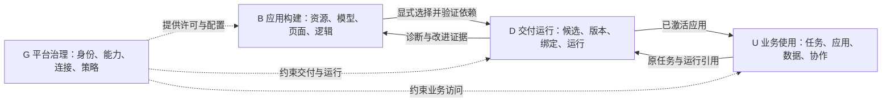

# ADR-0047：平台功能架构、用户入口与前端收敛

**意图：** 让业务人员知道在哪里完成工作，让构建者在同一个应用上下文中完成交付，让管理员能管理和恢复这份交付。以稳定的功能结构收敛现有菜单、应用、编辑器与后台，而不是继续按源码包和能力数量增加入口。

**状态：** 功能架构与 §11 的入口/组织取代原则已接受（2026-10-05，#141），负责人授权冻结基线后开始实施。按 §10.2 交付；独立分权、项目 ACL、生产直接安装替代及 §13 持续 Flow 仍按各批次的专项边界决定。
**设计日期：** 2026-10-05。静态源码基线：`87b830767f75`；工作区已有文档改动不视为代码实现。
**范围：** 前端功能架构、用户与权限职责、入口与页面、构建交付路线、能力归属及旧路径移除。原持续 Flow 提案保留在 §13，仍是独立待决专项。

## 1. 评审结论：原稿不足以指导这次改造

[Intent](../Intent.md)已经明确完整任务：接入数据与系统 → 语义建模 → 动作/流程/AI → 操作界面 → 测试发布 → 运营演进。问题是产品没有围绕这条路线形成稳定结构。**本次应重写产品功能架构；已有后端规范和执行主人继续作为底座。**

原稿的内核、权威、隔离和恢复边界有保留价值，但以下问题会让实施继续做加法：

| 对抗性问题 | 原稿为什么没有解决 | 本稿的裁决 |
|---|---|---|
| 用户能根据分块找到自己的工作吗？ | B0–B14 混合契约、服务、UI 和业务入口；技术职责表不能生成产品菜单 | 四个功能域回答任务，五个依赖层回答实现；二者分开 |
| 哪些人属于“后台用户”？ | FDE、发布者、租户管理员、服务运营被装进统一后台，权限职责仍然模糊 | 区分四类用户及细分职责；五种入口分别声明范围 |
| 每个入口究竟有哪些页面？ | “构建/管理/运行/资产”只有栏目名称，缺页面、主动作和上下文 | §6 给出页面树及责任，未实现项不得用空壳占生产导航 |
| Application 是起点还是最后的页面清单？ | 原稿仍以包、项目、资产为中心，应用任务容易继续被拆散 | 从应用目标开始；模型、页面、逻辑、测试、发布属于同一构建上下文 |
| App、包、资产和 owner 有何区别？ | 同一个词同时指源码模块、运行权威、启动器图标和用户交付 | §4 分别命名；没有“一 owner 一图标”或“一包一应用”的推断 |
| 不做插件热安装，能否先把平台整理清楚？ | 原顺序先做共同包/安装契约，前端任务被不必要的后台机制阻塞 | 先收敛入口和应用任务；可信制品装配仍可在构建/发布期完成 |
| 什么应该删掉，何时能删？ | 大部分条目继续扩展，旧路径只有笼统的“等价后替换” | §9 明确每类入口的去向和移除条件，保留一份执行实现 |
| 如何判断不是改名换菜单？ | BOM 探针和大量底层约束盖过完整用户路线 | 用构建者、发布者、业务人员、运维之间的实际交接验收 |
| 旧权限和版本会被“统一后台”绕开吗？ | 多角色、自引用、复合提交等被同时提出，容易全部塞进首批 | 导航可先沿旧权限重组；真正改变规则的依赖单独过门禁 |

当前源码支持上述判断：

- [工作区 App](../../web/apps/workspace/src/App.tsx)用固定包表加载 Catalog、Build、原生行业 UI 和 Settings；加载条件与 owner 角色相关。它是代码装配，不是租户在线安装。
- [Settings](../../web/packages/platform/src/index.tsx)在同一 AppUI 中组织权限、安装清单、开发诊断、AI、集成、运行、知识与审计；默认首页是成员。后台功能的归属与用户任务被混在一起。
- [Build 导航](../../web/packages/build/src/index.tsx)主要按对象、关系、属性、页面、查询、流程、函数分类；[Application 编辑器](../../web/packages/build/src/application.tsx)主要从已发布定义和流程中编组资源。
- [租户应用投影](../../web/apps/workspace/src/tenantApps.tsx)已按授权定义生成用户应用、页面分组与入口；这是业务工作台可复用的基础。
- 原生 ERP/MES/PMS 的专业导航来自受审 AppUI，不都具有 Application 描述符；当前 `build.app` 要求至少一页。共享资源和无页面自动化不能靠空应用承载。
- [AppUI](../../web/packages/app/src/index.tsx)仍将 ID 解释为后端 App 的 UI，并要求 view ID 全工作区唯一；[成员模型](../../capabilities/server/platform/app.go)是每个 owner 一个角色。
- 当前候选读取/激活要求 `build.builder`，平台审计与租户恢复要求 `platform.admin`；这些角色同时拥有其他操作，不能仅凭页面只读或隐藏菜单形成独立职责。
- ADR-0039 的直接安装与候选激活仍并存；`/v1/releases/active` 是租户最后激活指针，不是每个应用或运行实例的完整版本证明。
- [Catalog](../../web/apps/catalog/src/app.tsx)已有构建/开发两种视角，以及目录、沙箱和维护视图；它应服务发现与复用，不再与交付后的业务应用争夺默认启动器位置。

这是源码与设计审查。本轮没有启动浏览器、运行 Go/Web 测试或验证生产恢复。

## 2. 四个功能域：用、建、交、管

四域按任务划分，每域四个稳定模块。它们是功能归属，**不是让所有用户看到十六个菜单，也不是新建十六个服务或包**。一个功能有一个主入口；其他任务只通过上下文链接进入它。

| 功能域 | 四个模块 | 为谁解决什么问题 | 主要入口 |
|---|---|---|---|
| **U 业务使用 / Use** | 我的工作；业务应用；数据与分析；业务协作与助手 | 业务人员完成岗位任务、跟踪结果、处理审批与异常 | 业务工作台 |
| **B 应用构建 / Build** | 项目与资源；数据与语义；页面与体验；逻辑与 AI | FDE 和客户构建者把业务目标组装成可测试的应用 | 应用工坊 |
| **D 交付运行 / Deliver & Operate** | 验证与候选；版本与发布；环境与绑定；运行与异常 | 发布者交付确定版本，运维定位和处理这份交付的问题 | 工坊的交付区、租户控制台的运行区 |
| **G 平台治理 / Govern** | 身份与访问；包与能力；连接与模型；策略与审计 | 管理员决定谁可使用什么、哪些能力可安装、如何受控运行 | 租户控制台；平台提供者使用专属入口 |

具体边界：

- **业务数据与分析**使用已交付的列表、详情、保存视图、仪表盘和报表；对象结构、指标定义及页面编写在 B，执行和恢复在 D。
- **项目与资源**承载构建上下文、应用清单、可复用资产和模板。Catalog、租户定义目录是来源不同的投影，沿原 API 引用，不形成新的资产主库。
- **数据与语义**承载对象、属性、关系、查询、接入映射与知识来源设计；连接凭据、可用模型及租户级来源许可在 G，生产环境绑定在 D。
- **逻辑与 AI**承载动作、生命周期、流程、计算、AI 函数、智能体和评测定义。运行实例在 D，业务确认在 U；同一能力不能因为存在三个视图就有三份执行器。
- **验证与候选**是一处共同工作台：编辑器中的测试面板和交付区中的汇总引用同一报告。测试报告、封存候选、激活版本分别显示。
- **策略与审计**管理授权、预算及治理规则，并查阅原审计证据；专业业务规则归原业务 owner，不写进平台治理。
- 身份、租户、搜索、通知、个人偏好、标签和未保存保护是所有入口共用的 Shell 服务，不另立“第五功能域”。



图表示功能协作，不表示调用可以跳过鉴权。下层 owner 和 API 的归属仍由 §3、§10 决定。

## 3. 五个依赖层：谁提供能力，谁消费能力

这是面向本次前端改造的依赖视图，对 [Platform §2.1](../Platform.md#21-分层)中的既有归属做归组。它不取代 K1–K9、Platform 的数据平面或 ADR-0045 的六层资产分类；那些分类各回答自己的问题。

| 层 | 职责与归属 | 不承担的产品职责 |
|---|---|---|
| **L1 内核契约** | `contract/`：身份、事实、决定、权威、租户、演进、接入、工作所有权 | 不知道页面、项目、启动器或行业菜单 |
| **L2 可信宿主** | `capabilities/server/`：认证接收、注册、路由、日志、接受结果、制品与执行隔离 | 不因某个行业界面增加私有执行规则 |
| **L3 平台能力与公共 API** | 应用 API、平台应用、`@platform/app`：受权读取/动作、Work/Flow/AI/知识、定义与发布等 | API 是共同边界；平台 owner 数量不决定菜单数量 |
| **L4 应用与交付资产** | 原生业务包、租户受控定义、Application、项目关联、候选与版本绑定；应用间通过协议 | 组合不改变资源 owner；引用不会复制数据或授予权限 |
| **L5 产品界面** | Workspace Shell、五种入口、原生 UI 贡献、共享 Renderer；`@platform/ui` 提供交互零件与模式 | 不自行实现授权、提交、发布、工作流或恢复 |

前端使用 L3 的公开接口消费 L4 的资源；执行经原 owner 进入 L2，服从 L1。共享 UI 依赖平台语义绑定；业务规则不反向进入 UI Kit。L3 的实现接口与 L2 宿主保持既有抽象方向，不通过这张分层表引入循环导入。

前端自身再明确三种职责：Shell 管身份和导航；工坊及控制台管任务组织；页面/工作台管具体业务交互。调度、关系探索、流程编排和页面布局各用适合的专业界面，复用公共交互基础，不强迫放进一个万能画布。

## 4. 三种结构与统一术语

### 4.1 管理范围、构建关系、交付版本分开

| 结构 | 回答的问题 | 关系 |
|---|---|---|
| **管理范围** | 我在哪个客户、哪个运行环境，谁能管理这里？ | Host 承载 Tenant；环境是目标交付绑定，不自动成为新租户或权限边界 |
| **构建关系** | 我正在交付哪个应用，它使用什么？ | Project 关联 Application 与资源；资源可被多个应用引用，资源依赖是图，不是文件夹所有权 |
| **交付版本** | 本次到底交付了哪些字节，在哪里生效？ | 显式资源集合 → 验证/封存候选 → 发布版本 → 环境绑定与激活；包安装是供应能力的另一种生命周期 |

不强制用户逐层创建“租户 → 方案 → 项目 → 包 → 应用 → 页面”。租户由管理员开通；构建者从应用目标进入，单应用可获得默认项目上下文。跨应用项目只有在实际协作需要时才建立。环境、项目均须声明实现范围，不能用 UI 下拉框冒充隔离或部署能力。

### 4.2 “App”拆成可辨认的对象

| 名称 | 唯一含义 |
|---|---|
| **Owner / 后端能力主人** | 当前 `platform.App` 及其权威 ID；负责实体、读取、动作和规则，不保证有同名业务图标 |
| **Application / 用户应用** | 产品层面向岗位的稳定业务入口；可由受审原生 UI 或租户受控定义供应，二者可组合。当前 `build.app`/`platform.Application` 是页面型定义 profile，不是所有原生应用的等价表示 |
| **Asset / 资源** | 有 owner、身份、类型、来源、草稿/发布版本和使用处的对象、页面、查询、流程或函数 |
| **Project / 构建项目** | Build 负责的任务组织与关联草稿上下文；首期不形成资产编辑 ACL，归项目不授予或收窄原 owner 的权限 |
| **Package / 能力包** | 可信代码或受控定义的版本化分发单元；可贡献多个能力和多个默认应用 |
| **Installation / 安装实例** | 某租户选择某包版本及其受支持绑定的状态；安装不复制业务记录或成员授权 |
| **UI contribution / 界面贡献** | 已审查的页面、编辑器、命令或专业工作台贡献；AppUI 是现有承载接口，不是身份主体 |
| **Release / 发布版本** | 明确封存的资源与依赖集合；与记录 revision、BOM 业务版本、安装包版本分别绑定 |
| **Runtime instance / 运行实例** | 按固定定义版本与主体启动的流程、计算或智能体；关闭界面不等于取消实例 |

一包可供多个应用使用，一应用可引用多个 owner 的能力；一页可被多个应用复用，链接仍保留所选应用上下文。名称是显示和检索信息，不能靠改名改变 owner、历史实体 type 或资产身份。

业务启动器对两种来源做同一入口投影：稳定入口身份、名称、来源、获权导航及首页。原生来源沿既有 AppUI 保留 views、nav、home、dashboard、opens 与记录/协议跳转；租户定义沿原 Application/Renderer 投影。M1 不要求把原生工作台先转写成 `build.app` 或普通部件页面，也不增加第二个启动器。入口身份与后端 authority 的绑定显式声明；菜单改名不改写现有 ID。

`solutions/`继续称为“宿主装配/参考部署”。客户的交付内容可以是一个或多个 Application，单应用继续使用原候选和发布路径，不新增平行的 Solution 发布器。

### 4.3 发布标识、当前资源和运行启动版本分开

控制台与业务页区分三种证据：租户最后激活的候选；当前应用所用资源闭包与该候选的实际一致性；某个实例的启动定义/发布版本。发布应用 B 不能把应用 A 或 A 的旧运行标成 B 的版本。原生贡献显示可核实的代码/契约版本；未提供版本证据时明确未知。

M1 沿原接口显示真实作用域，保留直接安装产生的漂移说明；有指针但不能核对当前闭包时，不显示“整个应用已运行该版本”。M3 扩展候选时沿原发布闭包核对，M4 按应用关联运行时读取实例自己的版本；不新增应用私有激活指针来绕过原发布主人。

## 5. 四类用户、细分职责与五种入口

用户分类说明工作意图，不是权限等级。同一个人可兼任多项职责；切换入口不会增加权限。下表细分职责是目标，首期映射和仍未分离的权限见 §5.1；审批、发布、租户管理与平台运营的目标授权分别表达。

| 大类 | 细分职责 | 默认入口与范围 | 授权边界 |
|---|---|---|---|
| **业务使用者** | 操作员、审批主管、业务分析者 | 业务工作台；指定租户内已交付的应用和岗位任务 | 按记录/字段/动作授权；主管审批权限不等于租户管理权 |
| **应用构建者** | FDE、客户侧构建者 | 应用工坊；获权租户内的应用、项目与资源上下文 | 共用编辑路径；首期按原租户/owner 授权，项目/应用分组不证明编辑隔离；受委派的更细范围需后端支持 |
| **租户治理者** | 发布者、运行维护者、租户管理员、审计员 | 租户控制台；工坊可链接到其获权交付页面 | 发布者不必能改模型；运维不必能改授权；审计员只读；管理员不默认拥有所有业务字段 |
| **平台提供者** | 平台/能力开发者、宿主与服务运营者 | 开发者门户或宿主控制台 | 写源码不授予客户生产权限；跨租户开通、恢复和支援有独立委派，不能由租户管理员反推 |

五种入口是同一平台的任务界面，不预设五套登录或五个网站：

| 入口 | 顶层问题 | 可见范围与默认首页 |
|---|---|---|
| **业务工作台 / Work** | 今天要做什么？ | 当前租户；“我的工作”，可继续最近应用或直接打开业务深链 |
| **应用工坊 / Studio** | 如何构建并交付这个应用？ | 当前租户与项目/应用；“我的应用与项目”，继续最近草稿 |
| **租户控制台 / Tenant Console** | 这份交付是否可运行，这个租户如何受控？ | 单租户；“运行概览”，治理权限不足时只显示获权分区 |
| **开发者门户 / Developer Portal** | 可复用什么，怎样开发和接入能力？ | 公共或受权技术参考；“能力与接入”，不隐式进入客户数据 |
| **宿主控制台 / Host Console** | 如何开通、维护和恢复承载这些租户的服务？ | 显式授权的 Host/租户集合；“宿主与租户概览” |

业务、构建、治理是常用模式；开发者与宿主入口按职责提供，普通用户的菜单不出现它们。单一职责成员直接进入其首页，多职责成员可选择并记忆上次入口。深链可直接到达目标页面，仍执行相同授权检查。

AI、Agent、服务账户和连接器是执行主体，使用原 API、权限与预算；它们没有与人员并列的“超级入口”。它们的配置、运行及人工确认分别出现在 G、D、U。

### 5.1 首期授权映射与职责分离的实施条件

| 职责 / 操作 | 当前授权依据 | 当前限制 | 目标及实施条件 |
|---|---|---|---|
| 业务操作 / 审批 / 知识内容维护 | 原 owner 的角色、动作与记录/字段读取规则 | 不由入口或应用身份授予；同 owner 仍只有一个角色 | 沿原授权投影到业务工作台 |
| 构建 / 编辑定义 / 测试 | `build.builder` 及原测试读取检查 | Build 定义编辑是租户级；已有 Builder 业务数据特例仍存在 | M1/M2 如实保留；项目委派或收窄数据权先设计后端范围与兼容 |
| 候选审查 / 保存 / 激活 | 当前要求 `build.builder` | 同时可编辑定义和直接安装；没有“仅发布”授权 | 独立发布职责是后续授权专项，不能在 M1 宣布完成 |
| 平台审计读取 | 当前 Console 要求 `platform.admin` | 同一角色可管理成员等；没有只读平台审计角色 | 只审计职责需原 owner 增加独立读权，不能靠禁用界面按钮 |
| 租户诊断 / 重试恢复 | 目标租户的 `platform.admin` | 不等于 Host 操作或独立恢复专员授权 | M1 保留原租户恢复路径；更细恢复权按专项实现 |
| 流程、Work、Agent、效果运维 | 对应 owner 的原读取/动作检查 | 不能用一个前端“运维”名称推断全部权限 | 逐项显示原可用动作，独立运维授权按实际需要补齐 |

M1 依据现有成员、读取和动作权限重组入口，不通过授予更宽角色让页面可达；也不验收独立发布、只读平台审计或同 owner 多职责。现有角色授予会替换同 owner 的旧角色，不能把“兼任”做成重复授予或无范围并集。

首期 Project 只组织任务，不能把租户级 Builder 宣称为“只可编辑项目 A”。共享资产仍由原 owner 授权，应用引用不转移编辑权；修改时展示获权使用处与影响，不自动发布其他应用。若客户任务要求只维护指定项目/应用，先决定资产编辑范围、共享资源和候选依赖的后端权限检查及旧角色迁移，再提供该委派功能。

## 6. 每种入口包含哪些页面

以下是**目标页面结构**。详情页、编辑器和上下文面板通常不是左侧菜单项；二级菜单按有效权限和实际可用能力投影。缺失但阻塞当前任务的页面进入对应实施批次，其他目标页面暂不出现，不摆“建设中”入口。

### 6.1 业务工作台

```text
业务工作台
├─ 我的工作：待办 / 待审批 / 我的申请 / 最近任务与通知
└─ 业务应用：获权应用 / 收藏与最近 / 当前应用的岗位导航
   ├─ 业务页面：列表、详情、专业工作台、分析与报表
   └─ 上下文能力：评论、文件、依据与 AI 建议
```

“业务应用”打开 Application 的导航，按工作目标组织，例如订单、排程、收货、异常处理。列表 → 记录详情 → 动作/审批 → 结果是主路线；专业调度、关系与分析工作台由应用贡献。共享任务、通知、附件和助手使用原主人，不各应用另建一份。

四个 U 模块是功能地图，不生成四个常驻主菜单。分析页留在原应用的规范导航，例如 ERP 的试算平衡；统一分析发现若需要，只索引已交付页面并链接回原应用，不复制报表。协作与助手在任务上下文展开；跨应用视图必须是显式交付和获权资源。全租户技术 Records/Definitions 不作为业务首页，AI 建议的提交仍走原业务权限。

知识内容读取/维护通过获权业务应用或原生知识工作台提供，不要求先有某条任务。Documents/Glossary 是业务记录，编辑规约、手册、术语走原知识动作，不进入定义发布；来源配置/映射在 B，模型和凭据许可在 G，索引或摄取异常在 D。

### 6.2 应用工坊

```text
应用工坊
├─ 我的应用与项目：新建 / 最近 / 目标与模板
├─ 共享资源库：获权资产 / 使用处与影响 / 未被应用引用的资源 / 后台自动化
└─ 当前应用〔项目上下文、草稿状态、目标版本〕
   ├─ 概览：业务目标 / 目标岗位 / 页面导航 / 资源与依赖 / 待解决问题
   ├─ 数据与语义：接入映射 / 对象 / 属性 / 关系 / 查询 / 知识来源
   ├─ 页面与体验：页面 / 表单与布局 / 导航与交互 / 应用变量与接口
   ├─ 逻辑与 AI：动作与规则 / 流程 / 代码计算 / AI 函数 / 智能体
   └─ 验证与交付：角色预览 / 测试与评测 / 候选与差异 / 发布与运行链接
```

工坊使用四个构建模块，交付区消费 D 的共同能力，不另做发布系统。资源浏览器和编辑器保持当前应用、选中资源、依赖版本、返回位置和草稿状态。对象/关系图、页面画布、流程画布、代码编辑器是专业编辑面，列表和图引用同一资产，不复制定义。

可复用资源从工坊内发现：先按任务与能力筛选，再显示 owner、来源、可用 profile、依赖、权限和版本。技术 Catalog 的 SDK/TSX 参考通过开发者视角打开；构建者选择引用或模板实例，不通过复制示例实现业务能力。

应用交付默认以应用为上下文；共享资源、未被应用引用的资产和无页面自动化可从资源库直接维护。资源库打开同一专业编辑器，显示资源 owner、编辑范围、使用处和返回来源，不复制定义或建设第二个目录。纯流程/计算交付按原支持的资源根形成候选，不伪造一页空 Application；尚不支持的根明确阻塞。来源连接、后台工作与无页面运行的管理仍分别归 G/D。

测试输入、运行结果、评测、问题及使用处围绕当前资源展开，共同汇总到交付区。生产记录、测试 fixture、草稿预览必须标识清楚；物理隔离和候选权限按实际实现说明，不能由“预览模式”推导。

### 6.3 租户控制台

```text
租户控制台〔当前租户〕
├─ 概览：已交付应用 / 最后激活与当前资源一致性 / 运行健康 / 待处理事项
├─ 交付与运行
│  ├─ 验证与候选：报告 / 已封存候选 / 差异与影响 / 发布审查
│  ├─ 版本与发布：当前激活 / 发布历史 / 受支持升级与退役计划
│  ├─ 环境与绑定：目标环境 / 应用设置 / 来源、模型与制品绑定
│  └─ 运行与异常：流程、计算、Agent、Work、外部效果 / 失败定位 / 恢复
└─ 平台治理
   ├─ 身份与访问：成员 / 组织 / 服务主体 / 职责与范围 / 有效权限
   ├─ 包与能力：已启用能力 / 安装状态 / 依赖与兼容 / 受支持安装计划
   ├─ 连接与模型：来源、端点、凭据引用 / 可用供应商与模型
   └─ 策略与审计：配额预算 / 治理策略 / 授权与发布审计 / 原读取审计
```

工坊和控制台的同名交付页面是**同一页面能力的不同进入路径**，保留来源上下文。独立发布权实现后，发布者可直接审查候选而不获权编辑器；M1 当前仍按 §5.1 的 Builder 权限开放，不能把仅隐藏编辑器当成分权。

运行列表按可核实的应用/资源使用关系和实例启动版本筛选，再按实例、节点及原因深入；没有应用归属的后台自动化保留资源/租户入口，不能仅用租户最后激活 ID 筛掉旧实例。由一条失败业务任务进入其原动作、Flow、审批、计算或外部效果；可用恢复动作、权限、已接受结果及后续影响同时可见。运行页链接到原定义，构建页也可链接到原运行，诊断不复制日志。

安装、环境晋级、通用升级等尚缺的能力不得伪装为已有按钮；初期允许如实展示受控构建/发布期装配及单目标环境。日常租户运维与 Host 级故障修复不同，超出委派范围时给出明确原因和受权支援入口。

### 6.4 开发者门户

```text
开发者门户
├─ 能力与资产目录：UI / App API / Block / 模式 / 场景 / 兼容与成熟度
├─ 开发与接入：契约与 SDK / 包与贡献点 / 类型与示例 / 本地工具
├─ 示例与沙箱：受控示例 / 组合验证 / 从模板进入工坊
└─ 质量与兼容：目录检查 / 版本差异 / 引用影响 / 接入规范
```

复用 ADR-0045 的 Catalog、索引、公共导出、示例和 CLI。这里的“质量与兼容”是代码/目录维护，不能与租户授权治理、生产发布审查混为一谈。源码包开发仍可在 IDE/CLI 完成；门户不是任意上传 JS/Go 后在线执行的承诺。线上示例访问租户资源时使用当前授权，公开参考内容不要求伪造后台角色。

### 6.5 宿主控制台

```text
宿主控制台〔受权 Host 与租户集合〕
├─ 宿主与租户概览：服务健康 / 租户状态 / 隔离与资源占用
├─ 租户生命周期：开通 / 可信基线与装配配置 / 委派 / 受支持停用
├─ 服务与制品：受信发布 / worker 与制品可用性 / 兼容与保留
└─ 恢复与支援：隔离原因 / 备份恢复入口 / 受权支援记录与审计
```

这是独立管理范围，不能藏进某个客户的 Settings 并继承其管理员权限。现有租户诊断与重试恢复继续由租户控制台的恢复路径（含租户隔离时的独立恢复页）处理，保持目标租户的 Admin 检查；日志修复、备份恢复与进程维护属于可信部署运维。

Host 控制台只有在独立主体/委派契约建立后，才接入跨租户管理与支援；不得为实现“受权租户集合”批量授予客户 Admin。初期可链接受权部署工具，不要求先建设完整云控制台；自助开通、跨租户治理和备份控制未实现时明确保留目标边界。

### 6.6 导航、寻址与页面形态

导航只保留三层：**入口 → 当前范围内的任务模块 → 具体应用/资源/实例页面**。业务 Application 可按岗位组织自身页面，不在 Shell 再复刻一份全租户技术导航。全局搜索分清业务记录、构建资产与技术参考；搜索结果使用原读取授权，搜索不扩大视野。

目标路由显式携带 surface、tenant、project/application、contribution/view 和 resource/instance。贡献与 view 有命名空间；路由不是权限凭据。旧链接及保存布局通过单向译码进入同一规范路由，不挂载第二套旧 view。支持期内保持原资源和应用上下文；有歧义时要求选择，无法译码或明确退役时显示原引用及原因，不静默丢弃标签或打开同名应用。

旧菜单、重复实现与旧地址格式分别退役。UI/App API 主人声明支持的地址格式及停止支持条件；M6 不自动结束兼容支持，旧书签也不能靠删除菜单“完成迁移”。译码器只寻址同一功能，不构成永久重复产品路径。

页面统一使用五类交互形态：概览/目录；列表与详情；专业编辑器；审查与确认；运行与诊断。它们复用共享组件和反馈模式；不是给每页造一个新框架，也不是所有页面都改成表格。

Session、导航、草稿、Application/Page runtime 和异步请求的生命周期分开管理。切换主体/租户隔离缓存、标签和会话，处理 dirty 提示与迟到响应；切项目不把草稿自动改属，切入口不丢原返回路径。关闭 UI 只停止属于 UI 的请求，已受理保存仍有回执，生产 Work/Flow 按原 owner 生命周期继续。

## 7. 一条完整构建路线与四方交接

应用交付应在开始构建时就明确业务目标、目标岗位和稳定应用身份，随后逐步补齐资源；共享资源及无页面自动化可从资源上下文开始。工坊支持在同一图中组织草稿和既有发布依赖；**不能为了编辑一个应用，要求先把每个依赖逐个发布到生产。** 当前对此的缺口需要由原 Build/候选能力补齐，不能仅靠菜单调整声称完成。

| 步骤 | 页面和主动作 | 产出与进入下一步的条件 |
|---|---|---|
| 1 明确交付 | 工坊新建/选择应用，写目标与岗位，复用模板 | 应用身份、默认项目上下文及获权范围；不创建新租户 |
| 2 接入与建模 | 选择获准来源，预览映射；定义/引用对象、关系与查询 | 有来源、类型和权限的资源；缺连接许可时链接 G，凭据不进草稿 |
| 3 定义行为 | 编写动作、规则、流程、计算或 AI；选择固定能力版本 | 显式输入输出、依赖、主体、预算及人工确认点 |
| 4 组织体验 | 组合页面、表单、专业工作台、导航与交互 | 面向目标岗位的可运行体验；模型、行为和页面允许往返完善 |
| 5 验证任务 | 预览岗位权限，运行 fixture/评测，检查拒绝和依赖 | 可追溯报告与待解决问题；预览与生产作用域不混淆 |
| 6 形成候选 | 显式选本次草稿与已发布依赖，检查闭包和影响，封存 | 固定版本/字节与报告；缺依赖则阻塞，不自动纳入无关草稿 |
| 7 审查与发布 | 发布者审查差异、权限、兼容和测试证据 | 原发布路径的不可变版本；保存候选不等于激活 |
| 8 绑定与激活 | 获权人员选择受支持目标与配置，检查升级条件并激活 | 可辨认的当前版本与绑定；失败保留旧版本及诊断 |
| 9 业务使用 | 业务人员从工作台完成岗位任务或审批 | 原动作结果、业务状态和任务引用；不需要进入工坊 |
| 10 运行与演进 | 运维定位实例，使用受支持恢复；将问题带回原应用 | 原版本/任务证据；修改成为新草稿和新候选，不改写旧发布 |

四个交接点须明确：构建者交付候选给发布者；发布者交付已激活应用给业务人员；业务问题交给运维时带原任务/版本；运维反馈回构建者时保留原证据。兼任人员仍执行各环节授权。

资产草稿状态、测试状态、候选状态、激活状态和业务记录状态分开显示。外包导入和 AI 生成都是草稿来源，经过相同的检查与发布，不能因为“导入成功”跳过交付。生产运行绑定启动版本，后续编辑不改变在途实例；不支持的升级须阻塞，不能以改绑页面冒充数据迁移。

### 7.1 直接安装的替代与退场

现有直接安装会立即改变运行定义，完整 Module 导入也依赖逐页发布；它不具备本节完整候选交付的含义。M1/M2 保留必需能力并显示“立即改变当前工作区”、开发/导入用途及发布漂移，不能先删按钮而破坏现有路线，也不能将其包装成正式版本交付。

M3 以“新对象＋新页面＋应用”以及已支持完整 Module profile 的显式联合草稿候选证明替代路径：不预先直接安装依赖即可验证、封存并经原激活交付，失败保留旧定义与草稿。达到条件后，正式业务交付仅经候选激活，移除生产直接安装入口，并由后端权限/profile 拒绝其旁路；仅隐藏按钮不算退场。确有必要的开发/探针 profile 可保留同一编译、安装与恢复实现，须显式限定，不能继承生产权限。历史 Published 映像、版本解码与恢复仍保留，不因操作入口退场删除。

## 8. 不能被菜单改造削弱的边界

| 边界 | 本设计要求 |
|---|---|
| 读取与执行权限 | 入口资格、定义编辑、测试、发布、运行恢复、租户管理、业务记录/字段/动作分别检查；导航只投影有效权限 |
| 当前单角色模型 | 先沿既有 owner 角色重组入口；职责模板是目标，未经策略/兼容设计不得把多个角色字符串简单做权限并集 |
| Builder 特权 | 定义管理不得被产品承诺为自动拥有生产数据与审批权；现有生成对象的 Builder 特例需显式迁移，未实现前保留限制说明 |
| 候选与环境 | 草稿、封存候选、活跃版本、环境配置分别标识；环境选择不证明物理隔离，测试沙箱按 ADR-0039 的实际范围说明 |
| 原动作与权威 | 跨 owner 使用公开能力/协议，各 owner 验证自身数据；页面和项目不直接写别人的账本 |
| 原子性 | 同租户宿主暂存批次与独立系统的分布式事务分开；使用 ADR-0038 已支持路径，不由 UI 串行请求推导整体原子保存 |
| 版本与恢复 | 旧候选、实例、收据、必要解码器及制品保留；恢复使用已保存结果的覆盖范围按 ADR-0038/0039 声明 |
| 代码与插件信任 | 可信 Go 和前端贡献随受审制品交付；租户计算沿 ADR-0044 的受控编译与隔离执行；安装不授予任意宿主访问 |
| 停用与取消 | 注册清理、停止新调用、在途工作排空和业务数据退役分别处理；卸载不撤销已接受动作，迟到结果检查 generation |
| 专项规模能力 | 集合、层级、复合编辑、持续 Flow 和大制品需要各自的语义与预算，不静默削减外包配置来报完成 |

K4/K5 的动作权威、同宿主日志提交单元与远端权威不是一个概念。ADR-0026 与 ADR-0038 的解释应按实际受支持路径对齐；本稿不另定跨系统原子承诺。拒绝回执、接受结果与内核 ChangeLog 也不因统一诊断页变成一种日志。

## 9. 做减法：现有入口和重复路径的去向

迁移只保留一份功能实现。旧菜单和重复编辑路径在对应任务、权限达到等价条件后移除；旧地址按 §6.6 的支持规则单向译码，不以“删除全部别名”作为收尾条件。用户不在两套菜单或编辑器间选择。

| 当前组织 | 目标去向 | 移除/收敛条件 |
|---|---|---|
| 启动器并列展示 Build、Settings、Catalog 与业务 App | 原生 AppUI 与租户定义供应同一获权业务入口投影；工具放对应入口 | 新入口保留原生专业导航/记录跳转及租户应用任务，深链与返回保持；删除旧工具图标，不删除原生业务能力 |
| Settings 的统一巨型导航 | 运行进入 D，成员/配置进入 G，技术诊断进入开发者视角 | 各功能页面和原权限接通后删除旧导航，不更换 owner ID |
| Build 的全租户资产类型导航 | 应用资源浏览＋共享资源库，二者打开同一专业编辑器 | 原资源、草稿、历史与返回正确，共享/未引用/无页面资源有明确入口后删除重复导航 |
| Application 作为最后的资源勾选清单 | 应用概览、任务与导航、资源图、交付工作台 | 当前草稿与已发布依赖可完成原候选任务后收敛旧编组表单 |
| Catalog 的构建/开发内容混进业务入口 | 工坊资源发现与开发者门户的两种投影 | 继续复用唯一索引、AppUI/示例与离线入口；调整在线入口后删除重复菜单 |
| Catalog 的“Governance”与租户治理同名 | 明确为目录质量/兼容维护 | 文案和寻址能区别技术维护与生产治理，不生成第二套授权后台 |
| 全租户 Records / Definitions | 获权数据诊断与资产检查工具 | 工坊的模型/资源和业务数据入口完整后退出业务导航；原规范读取保留 |
| Settings 与工坊分散的 AI/Agent 内容 | 定义在 B，供应商/许可在 G，运行/用量在 D，确认在 U | 四种视图链接同一定义/实例/主体；不复制 Agent 或评测执行器 |
| Settings 的 Documents / Glossary | 获权业务应用或原生知识工作台；配置、来源设计、索引异常分别归 G/B/D | 文档/术语仍可沿原动作维护，业务记录不走定义发布后移除旧知识导航 |
| 流程、Work、计算、外部效果各自孤立运行入口 | 共同运行目录加原 owner 的实例详情与恢复动作 | 从一条失败任务能定位原运行；保留原实例 ID/证据后移除孤立入口 |
| 固定前端包表 | 构建期可验证的贡献清单；按作用域与版本发现已审贡献 | 能重建现有获权 UI 且路由兼容后替换；不先引入远端 npm 加载 |
| 裸全局 view ID | contribution/view 命名空间及旧链接译码 | 同名贡献不冲突、旧链接可解析、会话键隔离后删除裸 ID 新增路径 |
| 开发发布/直接安装与正式候选交付并存 | §7.1 的联合草稿候选及显式开发 profile | M3 替代现有创建/导入任务后，删除生产直接安装入口并阻止 API 旁路；保留历史恢复 |
| 研究示例、模拟源与未实现页面 | 技术参考/沙箱或删除；生产仅保留真实可用功能 | 有任务替代或确认不被使用后移除死代码；模拟能力不能假扮生产 |
| 行业 App 自建的共性 UI/机制 | 原共享能力主人；行业仅持有规则与专业组合 | 按实际触及项迁移，escapes 白名单只减不增；有效行业探针保留 |

不以组件数、页面数、分包数或图标数作为完成标准。代码实现、租户定义、外包导入共用一份编辑/编译/渲染/发布路径；不能在“整理”过程中再增加一个 Studio、总 Context、资产数据库或 Flow 引擎。

## 10. 能力归属、实施顺序与安装边界

### 10.1 只在规范主人处扩展

| 改造内容 | 主人及复用边界 |
|---|---|
| 身份、入口、导航、路由、标签与上下文保留 | Workspace 与 UI Kit；使用原 Shell，`@platform/app` 提供具型贡献/会话边界 |
| 当前应用、项目关联、草稿图、资源使用处 | 原 Build 与定义 API；目录只投影，资产身份不由前端重建 |
| 数据、动作、流程、计算、AI 与知识编辑 | 各 owner 及原专业编辑器；工坊负责组织，不取得私有执行权 |
| 测试、候选、封存、激活、兼容检查 | Build、宿主与 ADR-0039；复用原发布，不创建平行部署状态机 |
| 成员、组织、凭据、模型许可、策略与审计 | 原平台控制台、org、ai 和对应主人；前端重组不将全部权限搬给 Build |
| 运行定位、取消、恢复及制品保留 | 原 Flow/Work/Agent/compute/effect 与宿主；共同页面使用它们的公开能力 |
| 技术目录与质量工具 | ADR-0045 的 Catalog、公共导出和生成索引；不手写第二目录 |
| 信任、装配、安装及租户开通 | 宿主/控制面；沿 Manifest 演进，业务插件不能替换接收与认证守卫 |

### 10.2 按完整任务实施，先整理轮廓再补机制

下表只规定依赖与退出条件；活动批次、优先级与状态只由 [WorkQueue](../WorkQueue.md)管理。设计接受后再把一个可交付批次纳入队列，不能自动并行启动所有模块。

| 顺序 | 可交付变化 | 停止条件与必要依赖 |
|---|---|---|
| M0 功能设计决定 | 确定四域、五层、用户入口、页面及取代条款 | 负责人接受功能结构与入口/组织取代原则；专项运行规则仍在依赖批次前决定 |
| M1 入口与菜单收敛 | 沿现有授权重组业务/工坊/租户入口；原生与租户应用、资源库、知识与 Catalog 有明确归宿 | 对照受影响贡献清单不丢原任务；选一条现有 WMS 构建→候选→业务→诊断路线及一项 PMS 原生任务，核对旧链接/dirty/切租户、真实发布标识；不验收独立发布/只审计/项目 ACL，不以新安装系统或新 RBAC 为前提 |
| M2 应用与资源构建上下文 | 从同一应用编辑对象、页面与逻辑，共享/无页面资源从资源库进入同一编辑器 | 通用应用修改与共享资源维护均可完成，重复编辑入口移除；复用现有租户授权，项目仅补组织关联，不宣称项目编辑隔离 |
| M3 草稿到可交付候选 | 显式联合草稿图、测试/差异、封存与原激活；替代生产直接安装 | 新对象＋新页面＋应用及已支持完整 Module profile 可不预先安装依赖而交付；失败和旧数据/在途版本保持，再阻止生产直接安装旁路；必要编译、profile 与权限变更先设计 |
| M4 运行与治理交接 | 由活跃应用/失败业务任务定位原实例、权限原因和恢复；配置可追溯 | 选定任务在固定持久环境可诊断并续接；不新建运维系统或全入口故障矩阵 |
| M5 按任务补装配与高级能力 | 仅在复用、交付或停用任务需要时补受控安装、升级、复合编辑或持续 Flow | 每个专项有自己的契约及真实任务证据；§13 独立决定，不能阻塞已可完成的入口收敛 |
| M6 集中收口 | 删除已替代菜单/重复实现，按已声明支持政策清理地址译码，核对两行业任务与完整交接 | 产品只有规范路径，支持期内的书签/保存布局仍可解析；数据/权限/版本保证保持，体验和阶段证据按 Platform §10.6 |

M1 的页面重组不能被报告为 M3 的草稿闭包、M4 的持久恢复或 M5 的安装能力完成。每批以一条用户任务为停止条件，不按单个图标、组件或内部对象拆成无限微批次。

### 10.3 包与插件是受控供给机制

保留原稿的可组合目标，缩小其作为首批前置条件的范围。包声明身份、不可变制品版本、能力/贡献、required/optional 依赖、scope、权限请求、兼容、配置、迁移及退出规则。包依赖不得循环；业务引用图和流程迭代另按各自语义处理。

先支持**声明、预检和可重建的构建/发布期装配**。可信 Go 可要求重建/重启，前端贡献随已审制品交付，租户定义沿原候选激活，计算沿 ADR-0044，外部适配器沿原受控协议。安装许可与业务权限分开，包只请求能力，不自动获得授权。

动态变化只对已有完整激活/退出协议的贡献开放：缺 required 依赖须阻塞；激活失败撤销未接受注册；停用先阻止新调用并处理在途工作；保留历史所需版本/制品。配置来源区分宿主基线、租户选择、交付绑定、客户扩展和个人偏好，后层不能覆盖安全守卫或改写封存资产。安装模板不复制生产记录、密钥、成员授权或运行状态。

## 11. 取舍、取代关系与仍需专项决定的事项

可行方案是：只改菜单；按完整任务收敛现有平台；先全面替换装配/授权/执行基础。**推荐第二种。** 第一种不能解决应用只是最后编组的断点；第三种会把产品轮廓再次推迟到大量底层机制之后。推荐方案仍需重组大量前端代码，并补原资源/候选接口的实际断点，但不重复已有执行能力。

已接受的入口/组织取代原则如下；具体授权与执行规则按相应专项实施，不整体废止旧 ADR：

| 原决定 | 本提案拟改变的范围 | 保留部分 |
|---|---|---|
| [ADR-0010](0010-platform-host-and-apps.md)、[ADR-0018](0018-one-workspace.md) | Settings/启动器按功能入口组织；职责与授权操作分别表达 | 统一登录、租户隔离、owner 自主授权与共同工作区；多授权实现须专项兼容设计 |
| [ADR-0025](0025-one-shape-for-every-app.md) | 后端 owner、包、用户应用和 UI 贡献的身份不再推断为一对一菜单 | 独立能力主人、公开协议、命名空间、禁止私有依赖；required 依赖的修订另定 |
| [ADR-0036](0036-an-application-a-tenant-hands-to-its-people.md) | 应用从构建起点贯穿草稿、候选与交付，而非最后编组已发布页面 | Application 身份、导航、原 Renderer、按受权注册表投影 |
| [ADR-0045](0045-platform-catalog.md) | 在线 Catalog 进入工具/发现入口，退出默认业务启动器 | 统一 AppUI、索引、两种视角、CLI、示例、原 Shell 与离线技术参考 |
| [ADR-0046](0046-application-studio-fusion.md) | 专业设计台归入统一应用上下文及本稿功能导航 | 已实现画布、部件、语义绑定、导入与原生执行范围；剩余缺口继续保留 |
| [ADR-0038](0038-accepted-results-and-tenant-recovery.md)、[ADR-0039](0039-minimal-definition-release.md)、[ADR-0044](0044-capability-fabric.md) | 调整入口/能力使用关系，明确 §7.1 的生产直接安装替代与发布标识语义 | 接受结果、原发布主人、受控编译/隔离及各自当前保证边界；历史解码/恢复不退场 |

已接受的产品决定是：四域五层、四类用户五入口、应用与资源构建上下文、唯一规范路径与上述菜单去向。M1 按现有权限开始实施；以下事项仅在依赖它们的批次启动前专项决定：

- 独立发布/审计/运维授权、多授权策略、项目/应用资产编辑委派、Builder 数据特权及旧审批角色的兼容迁移；
- 稳定资源身份/alias、草稿/自引用图、复合集合命令与发布闭包的接口版本；
- 新包安装/排空/退役种类、旧制品保留及客户扩展升级；
- 候选物理隔离、跨环境晋级与真实数据迁移的支持范围；
- §13 持续 Flow 的方案 A/B，以及调用专属数据通道。

原稿提出的宽命名、无主对象页面、递归读取、任意层级和更大内联预算均不在首批自动放开。按实际阻塞任务在原 owner 扩展有界 profile；不支持时给出明确限制，不能把暂缓项删掉后声称支持。BOM 可检验复合/层级能力，但不是平台重组必需的首个应用；既有 ERP 组件清单不等于完整多层 BOM，业务真理只能有一个 owner。

## 12. 如何对抗性验收这份结构

结构必须能回答“谁、从哪里、做什么、交给谁、失败怎么办”。页面清单只是目标；验收以实际任务和保证为证据，不以十六个模块都出现为证据。下面明确适用批次，M1 不以未实现的目标职责代替现有授权证据。

| 对抗性场景 | 必须观察到的结果 | 适用批次 / 门禁 |
|---|---|---|
| 普通业务人员登录 | 进入我的工作/业务深链，能完成任务；默认菜单没有构建、技术 Catalog 或租户管理混入 | M1 |
| 原生 PMS/ERP 专业任务及知识维护 | 原首页、专业导航、记录跳转与知识内容动作仍可达；不要求转写空应用或提高角色 | M1，删除对应旧入口前 |
| FDE 修改应用的一处字段、页面和规则 | 同一应用上下文完成，复用稳定资源，清楚草稿/候选/最后激活与实际一致性，返回不丢上下文 | M2/M3；M1 先保留现有路线 |
| 维护共享资源或无页面自动化 | 资源库有规范入口，同一编辑器保留 owner 与影响；交付不造空页或自动发布其他应用 | M1/M2 的入口；M3 的受支持候选 |
| 只获发布权/审计读权的人打开后台链接 | 可执行获权操作，直调 API 也不能编辑定义/授权；不通过更宽角色伪造分权 | 独立授权专项后；不是 M1 验收 |
| FDE 只获委派维护项目 A | 直调 API 也不能改无权资产，共享资源及候选依赖分别检查；列表过滤不冒充隔离 | 项目委派专项后；M1/M2 如实声明租户级范围 |
| 运维打开一条失败业务任务 | 到达其原运行/启动版本和原因，只执行获权恢复；能带原证据回构建任务 | M4；独立运维权限按专项 |
| 同一用户兼任构建、审批、管理 | 切入口保留任务并检查既有授权；不会替换原角色来伪造兼任，也不新增 Builder 特权 | M1 沿现有角色；同 owner 多职责及收窄特权按授权专项 |
| 同名 view、复用页面或旧书签/布局 | 规范路由无冲突并保留原上下文；支持期旧地址可译码，歧义/退役显式反馈 | M1，M6 不自动终止支持 |
| dirty 草稿切租户，旧请求晚到 | 有未保存保护；原租户数据、结果和标签不进入新租户上下文 | M1 |
| 缺依赖、未支持环境/迁移/持续 Flow | 说明缺口并阻塞相关动作；没有假按钮、模拟生产成功或降配冒充完整支持 | 各批如实呈现，能力实现按对应专项 |
| 停用贡献或出现持久化失败 | 业务历史与在途版本按原边界保留，不把隐藏菜单当作安全停用或恢复 | M4/M5 的实际支持路径 |
| 在第二行业复用同一构建/交付任务 | 沿共享主人和同一路线，只增加必要业务资源；不改内核或复制公共机制 | M6 / 阶段集成 |

实施检查按 [Testing](../Testing.md#检查选择与停止)及影响面选择：日常 Go/Web 轻检查；路由/权限/草稿/候选和关键交接的行为回归；样式、画布及信息层次用启动截图与实际走查；改变持久结果/激活/恢复或部署时才运行对应持久检查。两行业完整任务与负责人视觉认可在集中集成/阶段节点验证，不作为每次改菜单的前置要求。

目标与当前实现分别说明：入口收敛的当前边界见 §14；项目关联草稿、细分授权、安装/环境管理及完整交接没有因设计接受而变成已实现。各能力的执行保证仍归原 ADR 的 As built；本批状态及下一步只在 WorkQueue。

## 13. 专项保留：持续 Flow 的原生适配

以下保留原专项问题、选项、契约与完成条件。它属于构建域的流程设计与交付运行域的持续实例能力，由接入、计算、Flow 和制品主人协作实现；当前仍待负责人选择，不改变其他已接受能力的范围，也不先行实施。

### 13.1 问题与证据

默认来源 Flow 包含 telemetrySource → window → aggregate → threshold → alertOutput / variableOutput，以及 late → deadLetter，共七节点、六连线；声明 stream、并发 8、checkpointEvery 5000、deadLetter。不能将它改写成串行手动流程或忽略未支持节点。

来源 `flowEngine.ts` 的 windows/cursors/hysteresis/delays/deadLetters 存在浏览器 Map 中；checkpointEvery 按运行次数打印内存计数，并未形成持久检查点。telemetrySource 还会从模拟列存启动数据；生产适配必须显式绑定真实来源。来源窗口使用事件时间和调用时间、按 key 去重、有限留存及 late/overflow 输出；风险函数、阈值与动作不能只按节点名字推断。

本平台已有 K8 接入与游标、`accepted_connectors.go` 的分发前驱校验和同批接受结果；`apps/flow` 是唯一实例/Token/frame 推进器，`platform.Run.Outputs` 保存已完成结果；Operation 已走原受属工作及接受结果。ADR-0044 明确复用这些主人，不引入第二调度器、日志或 graph-run 数据库。缺的是持续订阅、算子状态和批次完成的原生适配。

目前 Operation 声明输入最多 1 MiB、输出最多 48 KiB，流程固定绑定值还有自身预算。连续窗口与原 100 信号配置可能超过内联结果预算。不能静默减少批量/信号/窗口或放宽限制来让默认配置通过。

### 13.2 原子块的选择

| 方案 | 结果与代价 |
|---|---|
| A：原 Flow 加持续批次 frame 与受控数据制品（推荐） | 保持唯一运行主人；明确扩展输入订阅、状态引用和 worker 的调用专属数据输入/结果通道。能保留完整窗口，但需要新增应用 API 与接受结果适配 |
| B：继续只支持当前手动、内联 profile | 不增加 worker 数据通道；默认持续 Flow 保持原文并拒绝导入，ADR-0046 的此部分仍未实现 |

复制外包浏览器执行器、旁挂 Kafka/Flink/Temporal/独立状态数据库不作为推荐实现；它们会重复已有执行、授权和恢复主人。

### 13.3 推荐的职责与契约

```text
真实来源适配器（原 K8 主人）
  → 接受的批次身份 / 数据类别 / 分区 / 游标范围 / 事件时间 / 内容摘要
  → 原 Flow 持续实例与批次 frame（原实例 ID、启动版本、主体、取消入口）
  → 固定版本算子（Query / Go/Wasm Operation）
  → 原接受结果：算子状态 + 水位线 + 批次完成 + 输出引用
  → 原 Action/Effect 或应用拥有的只读输出资产
  → Workshop 的原授权查询/资源端口
```

Build 保存显式来源、对象/字段、事件时间与 key、分区、固定算子/动作版本及预算；候选冻结完整依赖。stream 与 scheduled 分别声明启动策略，不能靠浏览器定时器保持运行。Flow 的原暂停/取消/重试入口控制后续批次，租户代码不得自行访问网络、修改 Flow 或提交业务。

原 Flow Token/frame 扩展批次身份、消费前驱、watermark、每个节点的状态摘要/引用及待调用 ID。窗口/迟到输出、滞回/防抖、限速、延迟、去重与死信是有状态规则，必须声明版本、状态 schema 和预算；pure Operation 接收状态与批次，返回结果及新状态，状态只在原接受结果提交后可见。业务效果仍由原 Action/Effect 执行，稳定逻辑键绑定实例、节点、分区及批次身份，不把重试 attempt 当成新业务请求。

输入接收游标与 Flow 消费游标分开：K8 接受不等于业务已处理。消费游标、新状态、输出引用和后续意图在一个原接受结果中提交；前驱不符、旧 generation、迟到或重复答复不能推进。已有结果重放，不重新读取“最新”数据或重新计算；取消不撤销已接受动作。逐批接受保证恢复正确性，checkpointEvery 5000 保留为显式运行检查点/压缩策略，不以来源的一条打印日志冒充实现。

超出内联预算的数据由原 Files/版本化制品主人持有，使用租户、调用和摘要绑定的短期只读句柄。宿主在调用前按当前主体投影需要的字段，固定输入字节与状态摘要；worker 只能读取本次受权且校验摘要的封存输入，不能枚举文件、读取其他租户、使用任意路径/URL或获得通用网络。计算结果仍走原 schema、generation、输入/模块摘要与接受结果校验，不能仅相信 worker 的成功状态。大型新状态或结果也不能再塞回 48 KiB stdout：由宿主分配本次调用专属、有界的结果暂存通道，结束后宿主校验大小、Schema、摘要与来源，接受结果只引用已封存字节。worker 不获得通用 Files 写权限；暂存成功不等于发布，未被接受的结果由原制品主人回收。Go 算子沿同一封存/接受规则，Wasm 若需要此通道须使用显式版本化 ABI，保留合法历史内联调用的解码。输入句柄及结果通道尚未被当前 ADR-0044 的 stdin/stdout 内联 profile 实现，需负责人确认后才开工。

Backpressure 必须有界且可见：输入接受与消费队列各有预算。达到预算时暂停/拒绝接入或按明确策略路由 overflow，不能静默覆盖；并发 8 必须同时有分区状态互斥、真实工作占用与取消保证。deadLetter 是原版本化资产，保留批次/节点/原因/已接受效果引用，重放仍走原授权和幂等路径。variableOutput 显式映射到应用拥有的只读结果资产，不把后端持续任务写入某一个浏览器的 PageSession。

### 13.4 实施与完成条件

按原默认 Flow 一次交付闭环：受权真实批次 → 原状态窗口及 late/overflow → 原聚合与滞回阈值 → 真实动作/只读结果/死信 → Workshop 消费 → 停止、重启和同版本续接。接口和状态规范先于实现；Go、生成 TS、Build 导入/检查器与运行定位共同接线，不交付仅能展示的节点。

日常使用 Go 全量与 web-check；集中集成点沿一条完整路线检查。运行验收必须证明已接受游标/状态与效果不会丢失或重复推进、旧版本/主体/取消及迟到答复正确处理、worker 无权输入拒绝，以及原规模配置没有被削减。真实持久恢复在对应交付节点运行；单元、内存重放或模拟源不代替生产接入/吞吐和负责人体验验收。

### 13.5 当前边界

此文件是可审阅设计，不是已实现保证。方案 A 的批次 frame、状态/数据通道和持续输出尚未接通；当前六类手动 Flow、七页组件、页头及 slots 沿 ADR-0046 的既有边界继续有效。选择 B 只延后持续部分，不能把完整 ADR-0046 标为完成。

## 14. 当前实现边界

- 原 Workspace 增加任务入口切换：业务、工坊、租户控制台和开发参考。AppUI 声明 surface、serves 和授权导航投影，技术包、authority 与显示入口分别绑定；现有 views/路由/专业工作台仍是同一实现，尚未改为通用贡献命名空间或在线插件安装。
- 业务启动器保留原生 ERP/MES/PMS 等 AppUI 和租户 Application，移出 Build、Settings 与 Catalog。知识/术语及现有 AI Playground/Usage 作为业务内容贡献；组织、连接、模型供应商、审计和生产运行由租户控制台分区提供。Host 控制面未新增，租户恢复继续检查原 Admin。
- 工坊首页是应用清单，共享资源入口复用原资源图、库存及编辑器；对象/关系/查询、页面、逻辑和交付有明确导航归属。Catalog 的构建发现可留在工坊上下文，开发接入由开发参考提供；目录维护明确为质量与兼容。尚无项目持久关联、应用内统一资源编辑上下文或联合草稿候选。
- 入口选择与标签布局按租户/主体隔离；切入口不重建 Workspace，未保存编辑继续挂载。切身份/租户经原 dirty 守卫后清理旧导航目标；声明和包的迟到读取失效，普通 `/me` 刷新不重建编辑器。原深链和保存布局使用原 view ID，当前无需撤掉旧地址解码。
- 发布标识明确为租户最后激活的候选，并保留直接安装漂移与实例启动版本说明；共享候选/测试页可从工坊或控制台进入，后端仍要求 Builder。独立发布/只审计/项目 ACL、生产直接安装退场、按应用关联全类运行和环境晋级均未由此实现。

证据入口为 Workspace/AppUI、Build 与平台前端的贡献声明，`workspaces.spec.ts` 的受控收货应用交付/原生 PMS/知识入口，以及原 Catalog、草稿保护、业务授权、发布版本路线。入口变化不扩大原权限、候选隔离或持久恢复保证；负责人体验认可另按实际范围记录。
