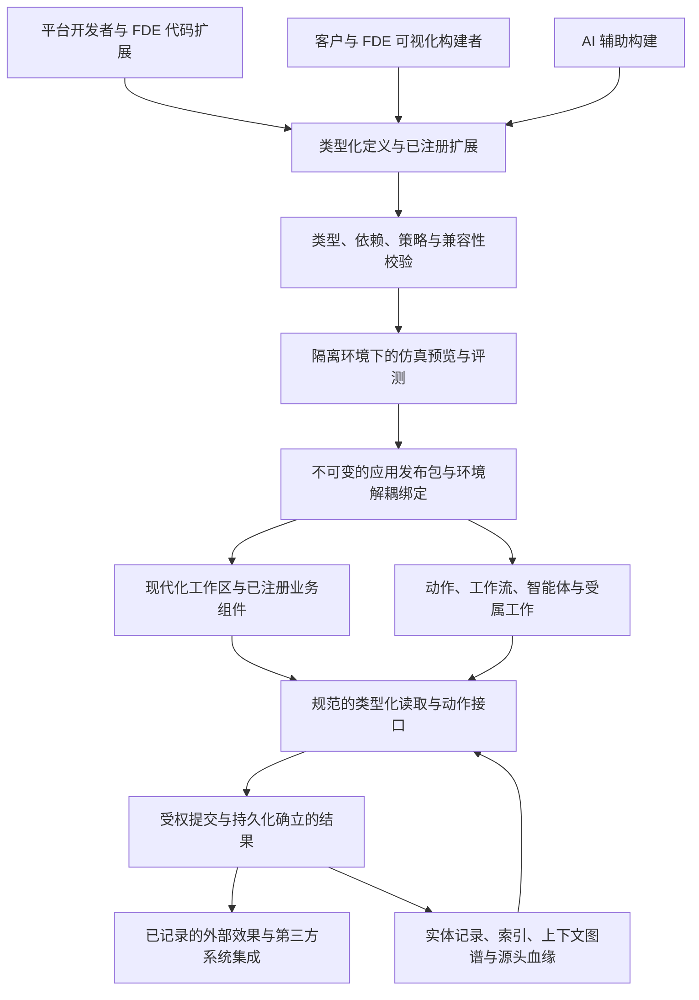

# 平台架构

业务平台的规范说明文档。具有持久成本的决策记录在 [ADR/](ADR/) 中；当前工作记录在 [WorkQueue.md](WorkQueue.md)；负责人的意图记录在 [Intent.md](Intent.md)。当本文档与代码不一致时，代码是既成事实，本文档陈述目标——将差距记录在工作队列中。

请与 [Intent.md](Intent.md) 一同阅读本文档。**§10 是未来一年的最高层级设计**，已于 2026-09-27 通过 [ADR-0031](ADR/0031-ai-application-platform.md) 接受。§2.4 归属已实现的能力地图；§2.9 跟踪未完成的 ADR 承诺；§10.2 对照产品目标解读审计出的差距；§10.3–10.6 定义目标及其验收标准。仅 WorkQueue.md 拥有任务状态。ADR 中早期的编号阶段属于历史；新的年度四阶段 W1–W4 不对其重新编号。

## 1. 目标

主线：**构建、编排、运行和演进业务软件**。应用定义各自的对象、关系、规则和动作，并贡献 UI 与运行时工作；软件由它们编排而成；当产品、流程、结构或业务本身发生变化时，能力得以添加、修改、替换或淘汰，而数据、历史、权限和正在进行的工作保持连续。内核概念和共享能力凭借它们对该主线的贡献而确立其地位。

多租户**业务平台，具备服务端与边缘/客户端运行时**。它支持多用户组织级应用（其中服务端为权威），以及支持离线工作的边缘客户端。**目标应用是 CRM、MES 和 ERP**（Intent.md）：这是它必须首先承载的业务软件，通过协议相遇。PMS、HCM 和 CSM 是参考应用。它们全部用于演练和证明平台能力；没有任何一个应用是平台的真理来源。

平台并不固化组织或应用当下的形态。它提供应用走向其*下一形态*所需的能力——新产品、新流程、新结构、新运营模型，乃至不同的主营业务——而无需重写底座。业务领域注定会发生重大变化；唯有当发现真正缺失的跨领域通用能力时，内核才应变更。

下一阶段将其打造为**面向 FDE 交付与客户自主构建的 AI 业务应用平台**：由统一的类型化模型支撑的受管对象、页面、工作流与 AI 构建器，辅以用于行业规则的代码扩展。目标是完整的应用生命周期（§10），同时内核保持不含领域词汇。

## 2. 产品模型

**当前实现**。本节描述 2026-09-27 审计时的代码现状，包括其局限性。特别是，代码编排的应用和多数旧入口的输入重放（input replay）仍是当前实现；受限提交与受属工作已有已入账结果的纯应用路径，但覆盖全部入口的基于结果的恢复仍是 §10 与 ADR-0038 的未完成目标。

### 2.1 分层

| 层级 | 承载内容 | 所在位置 | 变更时机 |
|---|---|---|---|
| **内核 (Kernel)** | 语言中立契约 K1–K9：身份标识、事实、决策、权威归属、租户隔离、模式版本、连接器、工作所有权（§4） | `contract/`（规范、测试向量、Go） | 内核假说被修订时（规范与测试向量先行） |
| **宿主运行时 (Host runtime)** | 编排、路由、日志与重放、快照、记录存储、受属工作、效果分发、模型调用；实现 `platform.Runtime` | `platformserver` | 平台扩展机制时 |
| **应用 API (App API)** | 应用所见表面：`Member`、`Caller`、`Manifest`、各项声明（实体、生命周期、动作、读取、工作流、智能体、作业、设置、效果类别）及 `Ledger`。应用仅通过 `Runtime` 访问宿主 | `platformserver/platform`；UI 层为 `@platform/app` | 应用需要宿主已具备的能力时 |
| **平台级应用 (Platform apps)** | 作为应用运行的跨行业通用能力：`platform`（控制台）、`org`、`relations`、`work`、`flow`、`ai`、`agent`、`knowledge` | `platformserver`（§9 风险 6） | 跨行业需求在第二个应用中出现时 |
| **协议 (Protocols)** | 应用提供和消费的版本化接口，附带一致性测试 | `protocols/` | 出现第二个提供方或消费方时 |
| **交付应用 (Apps)** | 某个行业或职能的规则、实体、工作流、智能体及 UI | `apps/`、`web/packages/*` | 其业务发生变化时 |

今天操作员配置数值（设置、绑定、端点、启用的模型）；结构性定义由代码表达。ADR-0031 将其扩展为类型化的客户定义模型、页面和规则（§6）。依赖项仅向下单向指向；内核不含领域词汇；宿主和平台级应用不感知具体应用。模型是一项工具，而非必须强行塞入每个文件的分类法：当实践表明边界有误时，通过 ADR 变更模型。必须成立的性质是：**当下层能力不随某个领域的演进而变更**。

归属裁决问题：在不同的行业中它是否仍然成立？在同一行业内转型后是否依然成立？它是“必须如此”还是“若干实现方式之一”？谁有权编写它、谁有权发布它、哪项不变式约束着它、以及哪项既有能力负责执行它？

### 2.2 整体协作方式

```text
 编排      解决方案 (Go，每个宿主一个) ─▶ 租户 ─▶ 各应用，每个为一个 Manifest：
             实体类型 · 生命周期 · 动作 · 读取 · 工作流 · 智能体 · 作业 · 设置 · 效果类别
             应用仅通过协议相遇（提供方 ◀─ 消费方），绝不直接相识

 写入      调用者：人员 · 服务账户 · 智能体 · 连接器 · MCP 或 A2A 客户端
             │ 提交 (submission，在目标上的动作) 或输入 (input，连接器页面、应答、模型步骤)
             ▼
           接收：认证 ─▶ 目录与角色 ─▶ 策略 (K6) ─▶ 需审批？（由 `work` 暂留）
             ─▶ 应用规则与决策 (K4)、事实 (K2, K3)、内存记录/意图
             ─▶ 记入日志被接受的输入 ─▶ 返回结果

 工作      记录/事件/意图 ─▶ 工作流 · 智能体的等待 · 订阅方
                          └─▶ 效果分发（Webhook、邮件、A2A；已声明的不可逆智能体效果被暂留）
                          └─▶ 通知 · 任务 · 时间线链接

 读取      记录 ─▶ 通用读取 · 聚合 · 上下文图谱 · 搜索 · 仪表盘
           派生的、可重建的状态：投影（PostgreSQL） · 知识段落与向量 · 快照

 人员      成员在每个应用中拥有一个角色；带有日期的组织结构中的单元限定其视野和审批者
 智能体    已声明的主体；每次运行的步骤、草稿、引用与人员反馈信号均被保留；
           评估以空跑形式重新执行已标记信号的运行；记忆是人员保留或遗忘的记录
```

写入流展示了大多数入口仍使用的直接提交顺序：`Tenant.Submit` 调用应用，其账本在内存中应用，随后将接受的输入记入日志。生产环境中日志追加失败会终止进程。ADR-0038 的受限例外包括已选择的生成动作、构建器发布、审批和多记录决定，以及部分受属工作：宿主私有暂存这些决定与意图，原子追加已接受结果后才应用其映像；新结果恢复不调用当前业务决策。其他入口仍在暂存边界外；§10.3 D 定义的是尚未完全实现的目标提交边界。

这些概念归入五个平面。每个平面拥有一个所有者。

| 平面 | 概念 | 所有者 |
|---|---|---|
| 编排 (Composition) | 解决方案、租户、应用、清单、协议、绑定、设置 | 代码（解决方案、应用）；绑定与设置属于控制台决策 |
| 真理 (Truth) | 提交、输入、决策、事实、日志分录、效果结果、用量 | 对目标数据类别拥有权威的应用（K5）；宿主记入日志 |
| 读取 (Reads) | 记录、历史、聚合、上下文、搜索、投影、段落、快照 | 宿主，从真理中派生 |
| 人员与工作 (People and work) | 成员、角色、单元、结构、审批请求、任务、通知、已存视图 | `platform`、`org`、`work` |
| 智能体 (Agents) | 智能体、运行、步骤、草稿、信号、评估、记忆、文档、对话抄录 | `agent`、`knowledge`、`ai` |

### 2.3 数据归宿

| 类别 | 包含内容 | 存储位置 | 重建方式 | 丢失成本 |
|---|---|---|---|---|
| **真理 (Truth)** | 每项被接受的顶级输入：提交、连接器页面、分发与作业结果、智能体步骤及其知识搜索结果、附带应答的效果结果、模型用量、启动的工作流版本 | PostgreSQL 日志，每个租户一个，故障即停 (fail-stop) | — | 一切；备份保存该日志 |
| **派生状态 (Derived state)** | 记录及其历史、内核日志、受属工作与队列、效果意图、通知、工作流实例、智能体运行、记忆 | 内存；快照 (ADR-0019) | 已支持的结果族直接应用已保存映像；其他旧入口仍通过相同代码重放 | 启动时间 |
| **派生索引 (Derived indexes)** | 投影 `tenant_<id>`（每个实体类型的类型化数据表）、按段落哈希索引的知识向量 | 位于日志旁的 PostgreSQL 中 | 启动时重建；向量作为受属工作重新生成嵌入 | 重建时间；嵌入模型成本 |
| **外部且有保留期 (Outside, with retention)** | 模型调用的完整对话抄录（默认保留 30 天）；密钥（按名称，位于部署环境中） | PostgreSQL 数据表；环境变量 | 不重建 | 旧模型调用的完整文本 |
| **易失性状态 (Volatile)** | 心跳、连接器上次拒绝原因、端点健康状态；个人读取审计（最近 5,000 条条目）。**注意**：受支持的 `work-result` 已保存作业 generation 与下次执行时间，旧作业路径仍可能不记无变化的运行 | 内存 | 受限工作从已接受结果恢复；其余 — | 运维诊断和未记入日志的旧式作业状态 |
| **代码 (Code)** | 声明：实体类型、动作、生命周期、工作流、智能体、协议、指令 | Go 和 TypeScript，随二进制文件版本化 | — | — |

**原始遥测数据绝不进入日志**（2026-09-26）：机器速率的采样在边缘（网关）按时间窗口聚合成具有明确含义的观察值——状态批次、停机、计数——仅将这些记入日志，以使重放体积保持较小；用于原始信号的流处理平面属于后续阶段门禁。应用所裁决的业务状态是**记录** (ADR-0016)。来自外部的观察与断言是**事实** (K2)，决策将其引用为证据；工厂将机器状态、ERP 断言与派生的停机时间保留为事实。从其他数值计算出的数值是派生值，绝不作为真理存储。

### 2.4 能力地图（当前已存在的能力）

内核状态见 §4。“使用者”列出了证明该能力的应用；当平台级应用像普通应用一样使用另一项能力时也计入其中。

| 能力 | 层级 | 应用获得的能力 | 代码位置 | 使用者 |
|---|---|---|---|---|
| 身份标识与重定向 (K1) | 内核 | 不透明稳定 ID、合并与拆分重定向 | `kernel.Identity` | MES（以及 2026-09-26 前的 Music） |
| 事实、观察与断言 (K2, K3) | 内核 | 带有来源与时间的事实；决策引用其作为证据 (C11) | `kernel.FactLog` | MES、PMS |
| 决策 (K4) | 内核 | 变更记录：幂等性、修订版本 (C12)、因果关系 | `kernel.ChangeLog` | 全部 |
| K4 幂等性有界证明 (ADR-0041) | 内核研发工具 | 重放保留收据且不重判、冲突/拒绝不追加、重复重放和租户键作用域；实现前提与未证明边界显式列出 | `contract/lean`、`scripts/verify.sh formal` | Go 性质序列及酒店/制造提交探针提供对应证据 |
| 权威归属与发件箱 (K5) | 内核 | 按数据类别划分权威归属；Go、Rust 与 TypeScript 的边缘发件箱 | `kernel.Authorities` | 全部 |
| 租户隔离与策略 (K6) | 内核 | 接收顺序，每次决策执行一次策略评估 | `kernel.Receiver` | 全部 |
| 模式版本演进 (K7) | 内核 | 版本化有效负载；Webhook 载荷携带版本；接收方可以获知启动时不存在的模式 (S7)，这也是租户发布的对象变得可被裁决的机制 | `kernel.SchemaRegistry`、`Learn` | 全部（已声明） |
| 连接器 (K8) | 内核 | 用于推送与轮询的统一描述符、游标、健康状态 | `kernel.Connectors` | MES、PMS |
| 工作所有权 (K9) | 内核 | 世代标识 (generation)、过期结果作废、所有者关闭（检查点暂未使用） | `kernel.Works` | 宿主 |
| 编排与路由 | 宿主运行时 | 启动时校验清单；按动作、读取与输入进行路由 | `NewTenant`、`checkManifest`、`Tenant` | 每个宿主 |
| 日志、重放与快照 | 宿主运行时 | 每个租户一个保序日志；受损日志/快照或提交后应用错误隔离该租户，健康租户继续运行；数据库故障仍影响全宿主。大部分输入通过相同代码重放；受限的生成动作、构建器可变发布、审批、多记录/协议嵌套、关系链接、Console 成员目录、动作内的连接器投递标记、ERP 适配器轮询输入及部分受属工作从已提交的结果应用；快照对生成它的代码有效 | `Journal`、`Tenant.Replay`、`CheckReplay`、`snapshot.go`、`quarantine.go` | 每个宿主 |
| 记录存储与通用读取 (ADR-0016) | 应用 API、宿主运行时 | 作为 Go 结构体的实体类型；附带作用域、搜索、排序与分页的通用读取；按角色划分视野范围；历史；关联记录；自动生成的创建、编辑、归档与表单；生成编辑对已提供的顶层字段整体替换其嵌套内容，未提供字段保留；参与者（请求的申请人与审批人、任务的候选人、工作流的发起人）不论角色均可读取记录，因此知情人均可打开记录 (#118)；支持关联引用的下拉选项及作为表格行编辑的子项明细 (ADR-0024) | `platform.Entity`、`Caller.Put`、`Get`/`Find`、`/v1/entities`、`/v1/records` | CRM、PMS、MES、HCM、CSM、ERP |
| 编号序列 (ADR-0024) | 应用 API、宿主运行时 | 按序列和年度根据模板生成单据编号（`GJ/{year}/{n:5}`），仅由已接受的决策占用，因而无断号；通过重放重建，保存在快照中 | `platform.Sequence`、`Caller.Next`、`sequence.go` | ERP（日记账分录）、CSM（工单） |
| 聚合与投影 (ADR-0019) | 宿主运行时 | 在视野范围内进行分组与度量；每个实体类型对应类型化的 PostgreSQL 表，每个租户拥有只读角色 | `/v1/aggregates`、`-project` | CRM、PMS、MES |
| 动作目录 | 应用 API、宿主运行时 | 已声明的动作；每个调用者仅收到其角色所允许的动作；启动时停用机制 | `platform.Action`、`/v1/actions` | 全部 |
| 已安装定义与有界页面 (ADR-0032 13a–13b) | 应用 API、宿主运行时、`@platform/app`、`@platform/ui` | 限定作用域的代码对象/动作/页面引用与依赖，在编排时校验；即使无依赖的资产也返回空的 `requires` 数组，使工作区目录保持开放；单一的调用者过滤 API/SDK；覆盖单个对象与显式动作的 `list-detail` 页面；带有禁用效果的本地样本数据预览；响应式列表/详情框架、窄屏外壳导航与带作用域搜索的引用查找 | `platform.AssetRef`、`Manifest.Pages`、`Tenant.Definitions`、`/v1/definitions`、`useDefinitions`、`PageWorkspace`、`PagePreview`、`RecordWorkspace`、`RecordLookup`、`Workspace` | CRM、MES、HCM（页面/审批探针） |
| 发布候选审查与活跃闭包（ADR-0039 20a–20b） | 应用 API、平台应用 `build`、宿主、`@pkg/build` | 从代码清单与 `build` 已安装定义及一份已保存草稿生成只读闭包、规范字节和候选差异；构建者可见增删改引用及坏依赖/定义诊断；禁止无角色或其他租户成员读取未裁剪描述符。互引对象合法，结构循环与缺失引用拒绝；对象候选和开发期对象发布共用宿主安装校验，检查闭包内已安装页面的字段绑定，显式页面不会被同名自动页绕过（不保证旧任务兼容）。构建者可将精确候选字节持久保存并激活租户唯一活跃指针；激活要求定义已安装且相符，尚不执行安装或记录迁移 | `platform.Candidate`、`Build.DraftReleaseAssets`、`Tenant.PreviewRelease`、`POST /v1/releases/preview`、`ReleaseReview`、`Tenant.PublishRelease`、`Tenant.ActivateRelease` | 酒店与制造的真实组合测试、浏览器路线 37、41；旧审批版本保护、双行业激活/操作员探针；读取携带确切版本与激活即安装尚未完成 |
| 具名查询 (ADR-0040 21c) | 应用 API、宿主运行时、共享页面与智能体工具 | 应用声明一次固定条件、排序及可选引用参数的纯查询；成员读取、页面表格和智能体工具共用调用者权限下的读取。页面发布候选包含其绑定查询的完整描述符依赖，遗漏依赖的候选被拒绝 | `platform.NamedQuery`、`Tenant.RunQuery`、`platform.PageReleaseAsset` | CRM 进行中商机、MES 已下达工单；C39、浏览器路线 40 |
| 租户原生流程编写 (ADR-0042 23a–23c) | 平台应用 `build`、`flow`、`work`、宿主 | 三栏类型化编写/固定计划/独立内存模拟与原生人工协同已接通；候选闭合源对象/动作及传递依赖。实例绑定启动版本与精确闭包，覆盖时保存激活发布；在途依赖改变拒绝，恢复校验绑定；首批旧/新任务跨重启和完整日志重建保持各自路径 | `build.Process/TestPlan`、`WorkflowEditor`、`FlowReleaseDescriptor`、`hostView.BindFlow`、`SimulateCandidate` | C41、路线 43；双行业 Docker/PostgreSQL 内部演练；负责人体验未验收 |
| 固定数据候选测试 (ADR-0040 21d) | 宿主、平台应用 `build`、共享 UI | 保存的对象草稿与同构建器依赖在全新内存租户中运行最多 20 个固定时间/动作步骤；构建者可保存并重载固定计划，逐步匹配接受/拒绝预期；原生权限、字段脱敏和快照恢复生效，不复制生产记录或外部绑定。跨应用依赖与审批失败封闭；进程内隔离，非物理沙箱 | `build.TestPlan`、`Tenant.SimulateCandidate`、`POST /v1/simulate/candidate`、`CandidateTest` | 双行业代码探针、C40、浏览器路线 41–42；页面/AI 沙箱未支持；旧 `/v1/simulate` 返回结果另按请求构建者的视野/字段/来源裁剪 |
| 租户交付的应用 (ADR-0036) | 平台应用 `build`、宿主运行时、`web/apps/workspace` | 拥有构建者角色的成员将已发布的页面编组在名称与图标下并完成交付；它会出现在每位有权打开其至少一个页面的成员的启动器与导航中，与来自代码的应用并列，其页面通过相同的页面视图渲染。它不授予额外权限：成员无权打开的页面会被排除，若所有页面均不可见则不展示该应用。若交付声明引用未安装的页面，宿主将予以拒绝 | `platform.Application`、`Tenant.InstallApplication`、`AssetApp`、`tenantApps` | 酒店向其前台交付包含编排页面的应用（路由 31） |
| 由组件布局的页面 (ADR-0035) | `@platform/app`、`@platform/ui`、平台应用 `build`、宿主运行时 | 编排的页面由区块组成，每个区块承载一个绑定到当前租户拥有资源的组件：对象记录的表格、选中项的详情、在其上提供的动作、基于宿主聚合的图表或度量指标、或者纯文本。表格输出详情、动作、时间线与任务所读取的选中项；过滤器输出第二个变量——即它将对象收敛到的记录集——由该对象上的表格、图表和度量读取；表单通过对象自身的创建动作生成记录。引用主对象的关联对象可在检查器中选作子表格，其记录随主选中项按引用字段收敛；它不是具名关系。宿主在发布页面时校验每项绑定并明确指出错误；被拒绝的编排不会影响运行中的页面。编辑器包含布局面板、覆盖在真实记录上但不产生写操作的画布、以及配置当前选中组件的面板；它展示页面是草稿还是已发布，提示未保存的工作，并将拒绝原因保留在屏幕上（`Decision.onRefused`）而不是一闪而过。字段可声明为 `aside`，以便由专用编辑器管理；UI 库的对话框支持长表单滚动；标签切换器拥有单一归属 | `platform.Section`、`Tenant.checkSections`、`ComposedPage`、`PageEditor`、`FieldInfo.Aside`、`Toggles`、`RecordHistory` | 酒店在机会对象上布局表格、详情及 CRM 的关闭动作（路由 30）；在客户账户上布局关联商机子表格、过滤器、表单、时间线与任务（路由 30、33） |
| 租户编排的页面 (ADR-0034 15b) | 平台应用 `build`、宿主运行时、`@pkg/build`、`@platform/ui` | 拥有构建者角色的成员在当前租户拥有的对象（租户自定义对象或应用内置对象）上编排列表/详情页面，选择列表与详情的字段以及提供的动作，并发布该页面。宿主在提供页面前校验对象、字段和动作，确保注册表提供的页面能够被正常打开；页面仅向有权读取其对象的成员展示，其上的所有读取与动作仍遵循其原有权限。工作区导航基于注册表构建，使代码页面与编排页面并存。自由输入的 `tags` 字段现已在 UI 库中可编辑（人员输入的词汇） | `build.page`、`Tenant.InstallPage`、`Host.definitions`、`field.tags` | 酒店在 CRM 机会上编排包含其关闭动作的页面（路由 30） |
| 租户定义的对象 (ADR-0034) | 平台应用 `build`、宿主运行时、`@pkg/build` | 拥有构建者角色的成员定义对象——名称、展示名称、字段及其类型、选项与引用——并发布。宿主构建其类型，在记录存储中声明，向账本传授其数据类别与生成的动作 (K7 S7)，并注册该对象、其动作及列表/详情页面。它随即成为一个普通类型：享有生成的表单、列表与详情页面、搜索、聚合、导入与导出、链接、评论、文件、日志与重放。再次发布时可接纳新字段，已有记录保留原内容。每个对象的角色与视野见下方的 ADR-0037 行 | `apps/build`、`Tenant.Install`、`Ledger.Extend`、`recordStore.install`、`web/packages/build` | 酒店解决方案（酒店在 CRM 与 PMS 之外自定义的对象），路由 29 |
| 租户定义的状态与动作 (ADR-0037 18a, ADR-0040 21a) | 平台应用 `build`、`@pkg/build`、账本生命周期 | 自定义对象可拥有状态与动作：每个动作从某些状态发起，使记录迁移到目标状态（或保持原状），要求输入参数，从输入、操作人或当前时间设置字段，并需要满足约束条件（失败提示信息由构建者编写）。发布操作会对赋值与规则操作数进行类型检查，随后将其编译为平台内置的生命周期与状态迁移，使记录页面的状态栏、编排页面、目录、AI 工具与重放机制像对待代码步骤一样执行它们。可选标量字段在记录与动作条件中保持缺失状态与显式零值/假值的严格区分。应用工坊在带有递进式属性检查器的统一编辑器中打开对象的字段、生命周期与访问控制 | `build.State`、`build.Action`、`checkProcess`、`lifecycle`、`ProcessEditor`、`RecordActions` `steps` | 前台登记拾得遗失物并归还，贵重物品被拒绝（路由 34） |
| 租户定义的访问控制 (ADR-0037 18b) | 平台应用 `build`、宿主运行时（`Scope`、`Standard`、账本） | 按构建器应用的角色配置：读取哪些记录（全部、自己创建的、无），是否允许创建、编辑与归档；哪些角色执行各项动作；哪些角色读取和设置各个字段。编译为与代码应用声明相同的视野范围、动词级别角色与字段安全机制，使列表、搜索、页面、智能体上下文与动作全面受控。对成员读取视野之外的记录执行生成动作或生命周期步骤，对所有应用均拒绝为未找到 | `build.Access`、`checkAccess`、`access`、`Scope.Owner = "created"`、`ScopeNone`、`Standard.CreateRoles`、`inScope` | 前台仅见自己的申报单，审计员可见全部单据及其金额（路由 35） |
| 租户动作的审批 (ADR-0037 18c) | 平台应用 `build` 编译定义；平台应用 `work` 拥有请求、任务与决策 | 租户动作可在独立的挂起状态中等待按顺序排列的审批层级，每级指定 `build` 应用的一个角色。审批人在与代码动作相同的收件箱中进行决策；最终审批通过执行被暂留的动作，驳回则将记录迁移至声明的驳回状态或初始状态。发布时检查状态与角色；审批某记录的角色必须拥有全量记录的读取权限 | `build.ActionApproval`、`checkProcess`、`lifecycle`、`Transition.Approval`、`work` | 前台请求归还物品；经理审批（路由 36） |
| 读取与读取授权 | 宿主运行时 | 命名读取；在应用内的角色，或对所有成员开放。每个面向成员的读取入口（命名读取、记录页面与详情、聚合、导入与导出、对话抄录）在统一位置拒绝其他租户的成员，命名读取返回的记录仅包含读取者角色有权阅读的字段 | `Tenant.Read`、`Tenant.admits`、`Tenant.narrowed`、`Manifest.Everyone` | 全部 |
| 派生内容声明其来源 (ADR-0033, #130) | 应用 API、宿主运行时 | 实体声明其内容的来源依据（`Entity.Derived`：引用字段、其包含列表内的路径、拼接为类型和 ID 的两个字段、针对全部的 `*`、或某个命名读取的权威），以及表示内容已被隐蔽的布尔字段。每当内容被记入日志后，宿主在每次面向成员的读取时再次检查每个来源——智能体运行查阅过的记录、每一步的参数与结果、按记录与按字段划分的引用、其草稿、最终结果以及智能体保留的事实——清空这些字段或剔除该元素，将它们排除在聚合之外，告知读者，在每个读取入口拒绝外来租户的成员，并仅向有权读取该运行所读内容的主管提供该运行的模型调用。不健全的声明会阻止租户启动 | `platform.Derivation`、`Entity.Derived`、`Entity.Withheld`、`Tenant.narrowed`、`Tenant.mayRead`、`Tenant.TranscriptsFor`、`RunStep.Sources`、`Memory.Sources` | 智能体应用，在酒店（CSM 分诊）与制造（MES 助手）中得到证明 |
| 应用包账本 (Package ledger) | 应用 API | 为单个应用装配内核、检查目录角色、发布 | `platform.Ledger` | 每个应用 |
| 受属工作：分发与作业 (ADR-0013, ADR-0027) | 宿主运行时 | 作为受属工作分发的事件（带重试）；作为应用运行的定时作业；轮流处理租户与应用的轮次，按订阅者与事件目标保序分发，超出配额的每应用每分钟尝试次数予以顺延；按租户对日志加锁 | `Manifest.Jobs`、`Tenant.Work` | MES、PMS 与 memstay（超时保留）、`work`、`flow`、`agent`；`Manifest.Subscribes`：CRM 获知提供方释放了预留 |
| 托管连接器 | 宿主运行时 | 通过调用者分发；游标、健康状态、最近拒绝记录；受限结果动作内的投递标记原子入账，ERP 适配器的轮询输入、MES 设备状态及 PMS 渠道预订以独立结果保存输入、事实/记录、游标和应用私有状态，未接入结果协议的新持久输入在正式结果宿主中拒绝，旧式历史仍按旧逻辑重放；启用与停用作为决策记入日志 | `Tenant.Connect`、`Caller.Deliver` | MES（推送）、ERP 适配器（轮询）、PMS |
| 外部效果 (ADR-0014, 0022) | 宿主运行时 | 针对事件的 Webhook；应用发出的效果类别；通知邮件；发送给外部智能体的 A2A 消息；基于稳定键的至少一次交付；向应用回传应答；智能体引发的不可逆类别暂留等待人工审批 | `Tenant.Dispatch`、`Caller.Emit`、`Answerer`、`mail.go`、`a2a.go` | 酒店、MES、CSM、ERP 适配器 |
| 部署 | 宿主运行时 | 通过一组统一标志提供开发令牌、或日志加 OIDC 模式；工作运行器；针对日志为空的租户的种子数据 (ADR-0024) | `Deployment`、`Deployment.Seed`、`RunWork` | manufacturing-server、hospitality-server、pms-server、每个应用的开发宿主 |
| 身份提供商 | 宿主运行时 | OIDC 身份凭据；人员目录将其映射为成员 | `OIDC`、Rauthy | 每个部署的宿主 |
| 多语言支持 (ADR-0023) | 应用 API、宿主运行时、Web | 随每个应用的清单与 UI 包附带的词典，以英文原文为键；以成员偏好语言呈现的声明（其选择，或浏览器语言，或租户默认语言），附带翻译后标题的选项值；通过模板以读取者语言呈现的通知、任务与邮件；工作区中的 `t()` 与语言切换器；智能体以运行所选语言应答 | `platform.Languages`、`languages.go`、`@platform/ui` `i18n.ts` | 每个应用（英文、简体中文） |
| 含义与词汇表 (ADR-0023) | 应用 API、平台应用 `knowledge` | 随实体类型、字段与状态声明的描述、帮助、示例与同义词；提供给人员、表单、工具模式与智能体提示词；按类型的多名称搜索；叠置其上的租户词汇表，绝不篡改基础声明 | `Entity.Description`、标签 `help`、`synonyms`、`example`、`knowledge.term` | CRM、MES、CSM（测试应用） |
| 宿主 API 契约 (ADR-0023) | 宿主运行时 | 从 Go 类型自动生成的覆盖全部路由与命名读取的 OpenAPI 3.1，附带调用者的实体类型与动作负载；由此生成的 TypeScript 类型 | `api.go`、`/v1/openapi.json`、`cmd/api-types`、`@platform/kernel` `Api` | 每个 Web 包 |
| 开发者工具套件 (ADR-0023) | 应用 API、宿主运行时 | 应用指南、生成已具备全部六个步骤（实体、生命周期、工作流、翻译、包含 `CheckReplay` 的测试、开发宿主、UI 包）的应用脚手架，以及 `new-app` 技能；CI 生成一个脚手架并运行其测试，且无须显式列表自动检查 `apps/` 下的每个应用 | `docs/Apps.md`、`cmd/new-app`、`.claude/skills/new-app` | CI |
| 智能体对外门户 | 宿主运行时 | 作为 MCP 工具暴露的调用者目录；通过 A2A 1.0 发布智能体（JSON-RPC，智能体卡片） | `POST /mcp`、`/a2a/<tenant>/<agent>`、`cmd/mes-agent` | 每个宿主；CSM 已发布 |
| 控制台 | 平台应用 `platform` | 成员、角色、服务账户与智能体；审计与分发；应用设置；租户默认语言与货币（`platform/currency`，账簿货币与人员输入金额的默认值）；协议绑定；端点；效果的审批与重试 | `console.go` | 每个宿主 |
| 组织架构 (ADR-0012) | 平台应用 `org` | 带有日期的结构中的单元、成员从属关系；规则依据输入发生时的时间查询成员的从属单元；单元上的工作日历，供工作日维度的审批与工作流超时使用 (ADR-0028) | `capabilities/server/apps/org`（一个 Go 包，ADR-0025 D4）、`Caller.Units` | MES、HCM、酒店 |
| 关联、时间线、评论与关注者 | 平台应用 `relations` | 实体之间的关系，在每条记录的页面上列为关联记录；在关联时间线上呈现的协议事件，作为记录的动态展示；任意记录上的 @提及 评论与关注者，可读性与记录本身一致——人员在记录上书写的内容即为评论，拥有唯一所有者 (ADR-0028, #129) | `capabilities/server/apps/relations`（一个 Go 包，ADR-0025 D4）、`Caller.Link`、`Caller.Links` | CRM |
| 字段安全性与个人数据 (ADR-0028) | 应用 API、宿主运行时 | 字段上的 `read`、`write` 与 `personal` 标签；记录读取、搜索、过滤、聚合、表单与历史均应用字段限制；投影与知识索引忽略受限字段。知识字段与附加文本现已在检索时检查源记录的视野范围（#130 第一批次），字段限制延伸至从该字段派生的内容——在记录本身可读的情况下，对该字段的引用将被隐蔽（#130 第二批次）；个人读取审计当前为易失性状态 | `FieldInfo.Read`、`Write`、`Personal`、`viewOf`、`/v1/personal-reads` | HCM、CRM |
| 文件管理 (ADR-0028) | 平台应用 `files`、宿主 | 上传至 S3 兼容存储（本地为 RustFS）的字节流，通过包含 SHA-256 的决策附加到任意记录；可读性与记录本身严格同步（`Scope.Through`）；下载作为附件提供；文本文件作为知识摄入；未关联的上传定期清理 | `capabilities/server/apps/files`、`capabilities/server/filestore.go`、`POST /v1/files`、`GET /v1/files/{id}` | MES、CSM、ERP（任意记录） |
| 导入与导出 (ADR-0028) | 宿主运行时、`@platform/app` | 任意实体类型在其列表中导入导出 CSV：每行通过该类型生成的创建或编辑动作生成决策，先进行预览，再次发送相同文件不会重复决策；导出与列表读取一致，受字段安全控制 | `POST /v1/import/{type}`、`GET /v1/export/{type}` | ERP、CRM、HCM |
| 图谱呈现 (#122, ADR-0040 D4 第一批次) | `@platform/ui`、`build` 中的语义适配器 | 统一的 React Flow 视口、控制器与分层布局：用于工作流、工艺路线、审批流和智能体运行的只读 `Graph`，以及具备显式节点目录、类型化端口与连接的受控可编辑 `NodeCanvas`。二者均可缩放或展开；编辑器将节点拖拽保留在局部视图状态中，仅将连接变更应用至对象动作的 `From/To`，不设图执行器亦不持久化布局坐标。非法连接会在操作后解释被拒端口、重复或容量规则，包括无障碍提示。页面和流程编辑器在窄屏下以完整栈向下滚动，而非将三栏压缩至固定高度 | `CanvasFrame`、`Graph`、`NodeCanvas`、`validateCanvasConnection`、`ProcessGraph`、`PageEditor` | CSM、MES、HCM；租户对象（路由 24, 30, 34） |
| 通知系统 | 宿主、`platform` 中的读取状态 | 发送给成员、单元角色或应用角色；去重；通过邮件端点发送邮件；任务关联的通知在任务关闭时标记已读，打开的通知标记已读 (#118) | `Caller.Notify` | MES、PMS、CSM、`work` |
| 生命周期、审批、任务、收件箱 (ADR-0017) | 应用 API、平台应用 `work` | 实体类型上的状态与迁移；沿组织架构层级的审批链，在审批人决策期间记录处于挂起状态，驳回附带批注；带有截止时间与升级机制的任务；统一收件箱；已存视图；将成员的审批权限授权代办若干天 (ADR-0028) | `platform.Lifecycle`、`platform.Approval`、`Caller.Assign`、`/v1/inbox`、`work.delegation.add` | MES、HCM、CSM |
| 工作流 (ADR-0020) | 应用 API、平台应用 `flow` | 已声明的长时间运行流程：动作、等待、提问、并行分支、子工作流、智能体步骤、超时、补偿、版本、每一步走向原因的完整追踪；失败且无故障恢复路径的步骤在回退前回拨给工作流拥有者与发起人一项任务 (#118)；记录页面列出与其相关的工作流（`Flow.Subject`，ADR-0026 D4） | `platform.Flow`、`flow.go`、`capabilities/server/apps/flow/engine.go` | MES、CSM |
| AI 提供商与模型 (ADR-0015, ADR-0029) | 平台应用 `ai` | 官方厂商、OpenAI 兼容、Anthropic 及本地提供商；带有访问控制的已启用模型；通过宿主调用并记录日志用量；两条线路上均支持工具；所有调用必须通过门禁限制（每人、每智能体、每模型每天的 Token 限额，每分钟调用次数，成员自身配额）；以服务端发送事件 (SSE) 流式传输回答；应用通过请求向租户的模型寻求服务，模型回答由应用的回复动作接收 | `capabilities/server/apps/ai/ai.go`、`aicall.go`、`anthropic.go`、`/v1/ai/chat` | 每个宿主 |
| 智能体 (ADR-0021, 0022) | 应用 API、平台应用 `agent` | 作为主体的已声明智能体，拥有各方授权的交集权限；逐个步骤记入日志的运行；人员确认的草稿；信号反馈；通过空跑重新运行进行评估；记忆；对话抄录；作为工具的上下文图谱与搜索；统揽全部已声明及外部智能体的概览面板，展示运行、动作、成本及人员对其工作的评价，并具备停止其运行和拒绝其调用的总开关 (ADR-0029)。代办运行在成员或应用角色被移除后随即停止；成员的运行与应用智能体随后读取但隐匿这些旧痕迹/指令 (#130 第一批次) | `platform.Agent`、`agent*.go`、`context.go`、`/v1/context`、`/v1/search` | MES、CRM、CSM |
| 知识库 (ADR-0022) | 平台应用 `knowledge` | 文档与带有 `knowledge:"true"` 标签的字段；段落分块；根据应用访问权限与源记录当前视野范围过滤的混合搜索（BM25 与向量）；排除受限字段与受限展示标题；引用随智能体步骤记入日志 (#130)。索引首次读取租户全量后跟随变更记录，以文本指纹为键，BM25 仅对包含问题词汇的段落打分——20,000 个知识字段约在 1 秒内完成索引，并在微秒至数十毫秒内响应 (ADR-0033 14b)；配合嵌入模型时所有段落仍均为候选 | `knowledge.go`、`index.postings`、`/v1/knowledge` | CSM |
| 协议 (ADR-0011) | 协议 | 带有形式化一致性测试的具名、版本化动作、读取与事件。跨应用协作 (ADR-0026)：决策规则仅探测另一应用；一旦接受，其请求在提供方执行，每个应答返回应用自身的回复动作，在无提供方绑定时可由人工执行；二者均作为提交记入日志。支持带有到期时间的暂留预订 (hold)，随后确认或释放 | `platform.Protocol`、`Caller.Probe`、`Caller.Request`、`platform.Answer`、`protocols/lodging`、`protocols/production` | PMS 与 memstay 提供带暂留的住宿协议，CRM 消费之（团队用房预留）；ERP 应用或面向外部 ERP 的适配器提供生产订单协议，MES 消费之 (ADR-0024) |
| UI 库 | Web | 组件、可停靠工作区、实体路由、记录视图（列表、页面、表单）、透视表、基于平台可视化规范构建的图表 (ECharts 6)、流程视图；表格网格键盘导航与编辑、记录失败重试、共享 Markdown 展示/编辑及 Gallery 状态陈列。自动化检查不等于 N4 的实际视觉/岗位验收 | `@platform/ui`、`apps/gallery` | 每个 Web 应用 |
| 工作区与 UI 应用 API (ADR-0018) | Web | 每个宿主统一登录；UI 包贡献的应用；通过引用跨应用打开记录；仪表盘；智能助手、运行记录页面与全局搜索 | `@platform/app`、`web/apps/workspace` | 每个应用 UI |
| 边缘客户端与登录 | Web | 发件箱、HTTP 客户端、带 PKCE 的 OIDC、宿主拒绝原因体系——每次拒绝均携带明确原因：应用通过 `platform.Refuse` 抛出，或者宿主根据错误代码、动作与目标自动阐述（`explained`，#129） | `@platform/kernel` | 工作区、PMS 前台台式端 |
| 设置中心 | Web | 成员、组织架构、应用、系统设置、协议、集成、AI、业务流程（工作流、智能体、评估、记忆）、知识库、审计日志 | `@pkg/platform` | 每个宿主 |
| 应用 UI 包 | Web | 为任意工作区提供应用或协议的视图 | 覆盖每个应用的 `@pkg/<id>`（`crm`、`csm`、`erp`、`erpadapter`、`hcm`、`mes`、`pms`）；平台页面展示的内容（关联到当前记录的其他应用记录、其上的协议事件）不归属于特定应用 (#129) | — |

### 2.5 术语与归属权

容易混淆的概念：
- **应用 (App)** 是一项能力单元：一个 Go 清单 (manifest)，通常附带一个 UI 包。**平台级应用 (Platform apps)** 即 §2.1 中列出的 8 个应用。**参考应用 (Reference apps)** 位于 `apps/` 目录下（在 2026-09-26 内核验证阶段前曾被称为 `slices/`）。ADR-0008 和 ADR-0009 中的“应用包 (Package)”均指交付应用。
- **解决方案 (Solution)** 是针对某个特定宿主的一组应用编排，按其行业命名：`solutions/hospitality`、`solutions/manufacturing`；独立应用可在其开发宿主 `cmd/<id>-server` 上单独运行 (ADR-0025)。
- **事件 (Event)** 是已接受的决策在外部观察者眼中的形态。业务领域自身的术语“事件”（例如设备停机事件）不是此概念。

| 术语 | 含义 | 归属方 | 持久化形态 |
|---|---|---|---|
| **动作 (Action)** | 应用提供的声明式操作：模式、目标类型、角色、说明 | 应用的清单 (`Catalog`) | 代码 |
| **提交 (Submission)** | 在实体上执行某动作的请求 | 调用者 | — |
| **决策 (Decision)** | 被接受的提交：在对目标数据类别拥有权威的应用账本中的 K4 变更记录；受限结果路径上的拒绝另有不产生变更的持久答复 | 该应用的 `Ledger`；拒绝答复由宿主保存 | 受限动作、审批、嵌套及关系链接为 `accepted-result`；该路径的拒绝也使用同一日志类别但不应用记录；其他路径仍为 `submission` |
| **输入 (Input)** | 非提交类的顶级输入条目：连接器的批次或页面 | 声明该输入的应用 | 日志分录 `<input name>`；心跳不记入日志 |
| **事实 (Fact)** | 来源处真实发生的事情：**观察 (observation)**（亲眼目睹，如机器状态或 ERP 应答）或**断言 (claim)**（由来源声称，如计划工单） | 应用的事实日志 (K2) | 从记录该事实的输入或结果中重建 |
| **实体类型 (Entity type)** | 应用声明的 Go 结构体：字段、视野、生命周期、种子数据 | 应用 | 代码 |
| **记录 (Record)** | 单个实体的当前字段、版本与历史 | 由应用账本裁决，由宿主保存 | 从决策中重建 |
| **固定测试计划 (Fixed test plan)** | 对象草稿引用、固定成员/时间/动作输入及接受或拒绝预期；不存测试状态或对后续草稿的通过承诺 | 平台应用 `build` | `build.testplan` 标准记录，经已有接受结果与快照恢复 |
| **生命周期 (Lifecycle)** | 实体类型上的状态与迁移；每次迁移为一个动作 | 应用 | 代码 |
| **节点目录 / 画布 (Node catalog / canvas)** | 用于编辑语义定义的已注册视觉节点类型和类型化端口；节点与边属于视图/适配器，绝非独立的执行引擎 | `@platform/ui` 拥有交互与端口校验；资产所有者将编辑映射为其规范定义 | 当前为 UI 表现状态；未来持久化的布局遵循资产的版本契约 |
| **审批请求 (Approval request)** | 暂留的提交，直至各级审批人达成一致；最后一级审批通过后以申请人身份执行之 | `work` | 决策 |
| **任务 (Task)** | 分配给成员、角色或单元的工作，附带截止时间与回答操作 | `work`，由审批、工作流、智能体与应用开启 | 决策 |
| **事件 (Event)** | 提交后被接受的决策，以其动作模式或协议事件命名（`<protocol>#<event>`） | 宿主 | 从决策中重建 |
| **订阅 (Subscription)** | 应用对其自身决策或所消费协议事件声明的关注 | 应用的清单 | 代码 |
| **分发 (Delivery)** | 为单个订阅者排队的单个事件，作为受属工作尝试执行，按订阅者保序 | 宿主（分发类型的 `Task`） | 已选择的 `AcceptedWorker` 保存 `work-result`；其他旧分发重放 `delivery` 输入 |
| **作业 (Job)** | 应用声明并以 `app:<id>` 身份运行的定时工作 | 由应用声明，由宿主运行 | 已选择的 `AcceptedWorker` 保存 `work-result`，包括无业务写入的 generation/到期时间；其余旧路径仅在有决定或通知时记录 `job` |
| **工作 (Work)** | 对分发或作业的 K9 所有权：所有者、世代、状态 | 宿主，通过 `kernel.Works` | 通过重放重建；作业计数器属于易失性数据 |
| **工作流 (Flow)** | 已声明的长时间运行流程；**实例 (instance)** 是带有标记点、撤销栈与追踪信息的记录 | 由应用声明，由 `flow` 执行 | 代码；实例属于决策 |
| **连接器 (Connector)** | 入站源：一个 K8 描述符，其 ID 即为其登录所代表的成员 | 由部署环境连接，由宿主持有，由 `platform` 开关控制 | 游标与开关状态可重建；心跳与最近拒绝属于易失性数据 |
| **端点 (Endpoint)** | 出站目的地：Webhook、邮件服务器或外部 A2A 智能体 | `platform` 决策，由宿主持有 | 决策 |
| **效果类别 (Effect kind)** | 应用声明其发出的出站消息 (`Manifest.Emits`) | 应用的清单 | 代码 |
| **效果 (Effect)** | 针对单个端点的单个意图，源于事件、`Caller.Emit`、模型请求或通知；其键即为其 ID。当智能体引发不可逆类别时暂留等待人工确认 | 宿主 | 受限接受结果保存意图；旧输入重新生成意图；审批与废弃属于决策；尝试结果仍为 `effect` |
| **结果应答 (Answer)** | 端点针对应用效果返回的内容；应用将其记录为一项观察 | 应用 (`Answerer`) | 日志分录 `effect` |
| **通知 (Notification)** | 发送给成员的消息，在输入发生当日解析 | 由应用创建 (`Caller.Notify`)，由宿主存储；已读状态属于 `platform` 决策 | 从其输入中重建 |
| **设置 (Setting)** | 应用声明的类型化配置值 | 由应用声明；数值由 `platform` 决策设定 | 决策 |
| **提供商 (Provider)**、**模型 (Model)** | 模型来源，以及为全员或 AI 用户启用的某个具体模型 | `ai` 决策 | 决策 |
| **用量 (Usage)** | 单次模型调用的计量读数：成员、模型、Token、成本、延迟、结果 | 宿主，由 `ai` 应用记账 | 日志分录 `usage` |
| **智能体 (Agent)** | 已声明的主体 `agent:<app>.<name>`：指令、工具、预算、防护栏、接管人 | 应用 | 代码；通过设置经由 A2A 对外发布 |
| **运行 (Run)** | 智能体的单个目标求解过程：附带推导理由的步骤、草稿、引用、已消耗预算、最终结果 | `agent` | 日志分录 `agent`，决策 `agent.run.*` |
| **反馈信号 (Signal)** | 人工对智能体工作的反馈：已确认、已修改、已驳回、已批准、已丢弃、已撤销 | `agent` | 决策 |
| **评估 (Evaluation)** | 使用候选模型对已有反馈信号的运行进行空跑复现，与人工接受的结果进行比对 | `agent` | 日志分录 `agent` |
| **记忆 (Memory)** | 智能体保留的关于某人或针对全部运行的简要事实；除非人工决定保留，否则会自动过期 | `agent` | 决策 |
| **文档 (Document)**、**段落 (Passage)** | 知识库文本及其切分出的片段；向量属于派生数据 | `knowledge` | 决策；向量由其派生 |
| **术语 (Term)** | 租户词汇表中的词汇：在当前租户的含义、同义词、所引用的声明；叠置于模型之上，绝不修改模型本身 | `knowledge` | 决策 |
| **对话抄录 (Transcript)** | 模型调用的完整请求与应答文本 | 宿主，位于日志之外 | 受保留期设置控制 |

归属权规则：宿主持有共享运行时状态；`platform` 应用裁决管理员所做的每一次变更，各个领域裁决各自的目标类型；应用仅裁决属于自身数据类别的内容，通过 `Caller` 访问平台，应用彼此之间仅通过协议交互。

### 2.6 外部效果：生命周期与重放

```text
  智能体 + 不可逆类别 ──▶ 暂留 (held) ──批准 (人工决策)──▶ 待处理 (pending)
决策或应用输入 ──发出 (emit)──▶ 待处理 (pending) ──尝试──▶ 已分发 (delivered)
                                   ▲    │            ▶ 已拒绝 (4xx 除 408/429 外；私网地址；非法协议)
                           重试    │    └─ 5xx、408、429、超时、网络错误 ─▶ 重试中 ──(12次尝试)──▶ 失败
                         (决策)    │                                                     │
                                   └────────────── 失败 / 已拒绝 ◀────────────────────────┘
  暂留、待处理或重试中 ──废弃 (决策)──▶ 已废弃      端点被移除 ─▶ 其未决效果全部废弃
```

1. **创建**。在输入内部：
   - `emit` 将订阅了某决策对应事件的端点转化为效果。ID 为 `<tenant>:<app>:<change id>:<endpoint>`。
   - `Caller.Emit` 将应用发出的已绑定类别效果转化为效果。ID 为 `<tenant>:<app>:<kind>:<key>:<endpoint>`。当类别为不可逆且调用者为 AI 智能体时，该效果被暂留，并通知管理员。智能体的 `emit:<kind>` 工具执行相同逻辑并等待应答。
   - `Caller.Notify` 将发送给具备邮箱地址的成员的通知转化为邮件，发送给承载该应用的每个邮件端点。ID 为 `<tenant>:notice:<notification>:<endpoint>`。

   效果本身没有独立的日志分录。它是引发它的输入的一部分，重放时会以相同的 ID 重新生成。
2. **尝试**。`Dispatch` 获取每个端点到期效果的队列头部（按端点保序；被暂留的效果在顺序之外等待），并在租户锁之外发送。
   - Webhook 按照 Standard Webhooks 规范签名，`webhook-id` 和 `Idempotency-Key` 均设为该效果的 ID。
   - 邮件通过 SMTP 发送（支持时采用 STARTTLS），以效果 ID 作为其 Message-ID。
   - A2A 消息是发送给端点对应智能体的 `SendMessage`；任务的最终结果即为应答。
   - 除非端点明确允许，否则在连接建立时拒绝私有网络地址。
   - 在日志重放期间绝不调用 Dispatch。
3. **结果**。在启用接受结果的宿主中，每次尝试以一条 `effect-result` 封套入账，原子保存效果状态、应用回调的受支持记录/子决策、通知/意图和模型请求的用量；旧宿主仍写入 `effect` 分录。封套记录执行结果（delivered、rejected 或 retry）、详细信息、所发送报文主体的摘要，对于应用效果还包括应答数据（JSON，最大 64 KiB）。重试会设定下次执行时间：从 5 秒指数退避倍增至 1 小时，附带源自 ID 的抖动；自上次手动重试以来尝试达到 12 次后，该效果标记为失败。
4. **结果应答**。对于应用发出的效果，一旦完结，宿主在私有视图中调用应用的 `Answer` 接口并传入结果；提交成功后仅从保存的结果应用回调观察与子决策。旧 `effect` 历史仍重新调用当时的应答代码，尚未获得相同保证。
5. **幂等性**。至少一次分发：尝试与写入日志分录之间的系统崩溃会导致效果保持待处理状态；重启后会使用相同的 ID 再次发送；接收方按 ID 保证仅保留一份。
6. **审批、手动重试与废弃**属于 `platform` 决策。只有人类才能批准被暂留的效果；无论智能体拥有何种角色，其发起的审批都会被拒绝。批准或废弃智能体运行引发的效果，构成对该次运行的一项反馈信号。
7. **重放**从输入中重建意图，应用所有记录在案的结果，并将应答回传给应用。重放过程中绝不发起任何外部调用：`CheckReplay` 在检测到任何出站调用时均会导致测试失败。重放完成后，宿主在正常运行时使用原有的 ID 发送仍处于待处理状态的效果。

### 2.7 各类日志分录的重放语义

| 分录类别 | 写入时机 | 重放时的行为 |
|---|---|---|
| `accepted-result` | 已选择的生成动作（含构建器固定测试计划的记录映像）/生命周期转移、构建器可变发布、审批、多记录嵌套、关系链接和 Console 成员目录在正式状态可见前单行入账；ERP 适配器轮询、MES 设备状态及 PMS 渠道预订的 `input-result` 独立保存输入/答复、游标、事实/记录及应用私有状态；受属 `work-result` 独立占用工作键命名空间，原生构建器流程记录映像含启动依赖/发布绑定（ADR-0042）；出站尝试的 `effect-result` 在同一封套中保存效果结果、受支持的回调状态和模型请求用量；同路径的拒绝以无变更封套入账 | 校验版本、摘要、权威、前序及收据，纯应用记录/历史、编号、通知、观察投影、出站与模型请求意图、受支持的回调及用量、部分应用归属状态、受限动作及三个已接入应用输入的连接器标记和工作 generation；拒绝直接返回已保存答复，不重新运行规则或发送效果 |
| `submission` | 顶级决策被接受时 | 运行相同的应用规则而不重新鉴权；重新将其事件排队；重新生成 Webhook 效果 |
| `<input>`（旧连接器批次或页面） | 旧式持久输入曾被接受时；新声明输入在正式结果宿主中必须接入 `input-result` | 历史分录仍运行当前的应用代码（包含游标校验），尚未完成版本化历史迁移 |
| `delivery` | 为订阅者尝试分发事件的每一次 | 再次尝试，必须达到完全相同的结果，否则重放终止 |
| `job` | 产生了决策或通知的作业运行 | 在记录的时间再次运行，必须达到完全相同的结果 |
| `agent` | 智能体模型选取的每一步骤，包含知识搜索到的内容；评估报告 | 应用记录的选择——工具被再次使用，其动作被再次决策——绝不调用模型、生成嵌入或执行搜索 |
| （任何分录，带有 `versions`） | 在处理该分录期间启动的工作流实例 | 在记录的版本上启动它，无论代码在此之后发生了何种声明变更 |
| `effect` | 旧宿主的外部效果尝试；正式宿主使用上述 `effect-result` | 旧分录应用记录的结果，并重新执行应用应答代码；绝不实际对外发送 |
| `usage` | 直接 Chat、智能体评估等旧模型调用路径；正式模型出站尝试的用量并入上述 `effect-result` | 应用计量读数；绝不实际调用模型 |

移除日志中已存在的动作模式、输入或效果类别需要执行数据迁移：否则重放过程会遭遇无代码能够接纳的分录。

**快照** (ADR-0019 D6) 在不改变重放语义的前提下缩短重放耗时：在特定日志位置保存租户的状态，仅对写入它的代码（二进制文件及其应用版本）有效，启动时恢复快照，随后仅重放后续日志分录。其他版本的代码会忽略该快照并完整重放整个日志。隔离租户在权威日志修复后可由其管理员原地重建新代际；验证成功后替换隔离代际并修复派生快照，损坏的权威日志仍拒绝恢复（ADR-0038，#135 受限路径）。

### 2.8 不变式及其守卫检查

这些检查覆盖当前的输入重放模型。它们不证明任意代码/声明变更后的正确性、完全的权限闭包或进程级租户隔离。目标不变式见 §10.3 及 ADR-0031。

| 不变式 | 守卫检查 |
|---|---|
| 重放能够重现一致性快照覆盖的持久状态，且不发起任何外部调用；在日志任意位置生成快照、恢复并重放剩余分录同样成立。易失性诊断数据（如个人读取审计）除外 | 宿主、MES、PMS、CRM、HCM 及酒店解决方案测试中的 `platformserver.CheckReplay`（每个测试均验证四个快照点）；演练环境的重启与恢复演练 |
| 重放绝不调用模型、生成嵌入或发起搜索 | 当重放发起模型调用时宿主测试报错失败（`TestAgents`、知识库测试） |
| 宿主无法履行的清单在编排时即被拒绝：未描述的动作、类型错误的设置、缺失执行间隔的作业、重复的效果类别、未声明的公开读取、工作流与智能体引用不存在的步骤或工具、引用无早期应用提供的协议 | `checkManifest` 和 `NewTenant`，由每次编排的测试执行 |
| 没有任何应用依赖另一个应用；协议不依赖任何应用；应用与协议仅导入应用 API，绝不导入宿主运行时 | `scripts/boundaries.sh`（验证步骤 `app-boundaries`） |
| 业务规则以输入发生时的时间划定视野范围，确保重放做出完全一致的决策 | `Caller.Units(structure, now)`；组织架构测试 |
| 每位调用者仅获得其角色所允许的动作；智能体执行的操作绝不超越其所代理的人员 | 目录测试、`TestAgents`、环境演练 |
| 每项被接受的顶级输入在向外部应答前，均严格记入日志一次 | 宿主测试与演练（重启与恢复） |
| 内核词汇始终保持无领域术语 | 验证步骤 `contract-vocabulary` |

### 2.9 已接受 ADR 的未完成承诺

“已接受”代表决策已敲定，而非已经构建完毕。已构建的承诺记录在每个 ADR 的“实际构建 (As built)”节中；下表仅保留部分完成、推迟、修订或被取代的事项。

| ADR | 承诺内容 | 当前状态 |
|---|---|---|
| 0008 | 客户模型、仪表盘与应用包组装 | 由 ADR-0031 修订：类型化客户扩展与独立发布的定义资产是最终目标；当前应用保持为代码编排 |
| 0009 | 应用包之间的桥接 | 由 ADR-0011 取代；桥接路径已在 #104 中彻底移除 |
| 0010 | 应用之间的依赖图谱；基于成员属性的范围授权 | 由协议图谱 (ADR-0011) 与组织架构 (ADR-0012) 取代 |
| 0010 | 作为记录决策为每个租户启用与停用应用 | 现状：代码编排与启动时停用。ADR-0031 增加了受管的应用发布与激活；尚未构建 |
| 0010 | 设置中的有效权限展示 | 部分完成：展示了每个应用的角色，但尚未展示每个成员最终生效的动作目录 |
| 0010 | 日志与关联标识；健康检查 | 部分完成：OpenTelemetry 追踪与度量、`/healthz` 以及带有宿主启动时间与构建版本的租户健康状态 (ADR-0027 10c)；日志仍未结构化 |
| 0010 | 分析数据集、保留期策略、偏好设置 | 部分完成：已存在文件、编号序列与已存列表视图；分析型编排与保留期策略依然未完成 |
| 0011 | 协议多版本并行；将已有实体上的动作路由至其提供方 | 推迟 |
| 0011 | 跨行业协议（主体、文档、日历） | 部分完成：通知、链接与时间线是平台级通用能力 |
| 0012 | 合并或拆分单元的继承者；岗位；授权代办；组织联合 | 推迟 |
| 0013 | 将工作保存在 K9 `Works` 中 | 部分完成：仅支持世代标识；检查点未被使用 |
| 0013 | 应用停用时其对应工作终止 | 推迟（与按租户停用应用一并处理） |
| 0014 | 单端点限流；按目的地的熔断机制 | 已构建 (ADR-0027 10b)：每个端点拥有熔断器，各端点并行发送；固定的 10 秒超时与 64 KiB 应答上限保持现状 |
| 0014 | 根据事件可见权限对 Webhook 过滤 | 已修订 (#104)：端点拥有管理员视野 |
| 0015 | 配额与速率限制、作为效果的应用调用、流式传输 | 已构建 (ADR-0027 10a, ADR-0029 12a：每分钟尝试次数、熔断器、每成员/模型/智能体每日 Token 配额、SSE 流式传输)；应用调用作为效果推迟 |
| 0016 | 对协议实体类型的引用 | 推迟；生成的表单为引用提供选项选择 (ADR-0024 7a) |
| 0017 | 委托代办与替补人选 | 审批代办已构建 (ADR-0028 11e)；其他任务代办推迟 |
| 0018 | 面向前端的后端令牌 (BFF Token)；运行时加载 UI 产物包 | 未完成。ADR-0031 优先考虑发布定义资产而非注册组件代码包；远程可执行包需要其自身的沙箱隔离设计 |
| 0019 | 在无租户锁情况下捕获状态；并行恢复；工厂停机时间作为记录 | 推迟 |
| 0020 | 可视化图表绘制 | 只读图谱已构建 (#122)。ADR-0031 取代了禁止人工编排工作流的旧规：ADR-0042 首批原生编写/固定计划/候选/启动闭包绑定及恢复已接通，复用同一 Flow/Work；广义目标及负责人体验未验收 |
| 0022 | A2A 流式传输与 HTTP+JSON 绑定；当租户数据超出内存搜索时引入 pgvector；PDF 文本解析；从连接器摄入文档 | 推迟 |
| 0026 | 提供方不可用时请求支持重试；外部提供方稍后通过相同回复动作应答 | 推迟：宿主内的提供方立即应答 (D2)；ERP 适配器的延迟应答仍通过其工作流到达 MES；#120 |
| 0023 | 选定语言下的日期格式；租户内一词两义的处理；应用读取接口的类型化与校验；开发者 MCP；协议与智能体脚手架 | 推迟 |
| 0024 | 资产负债表与利润表等深度财务报表；部分收货、部分开票、退货与付款；不允许出现负库存；部分确认与按组件领料消耗；真实的 SAP 系统对接 | 推迟：ERP 保持轻量（Intent.md） |
| 0025 | 用于对账的记录外部业务主键；入站 Webhook 与邮件作为连接器输入 | 推迟（§10.4） |
| 0025 | 宿主自身的内置应用按普通应用实现 | 已构建（8a 至 8c）；智能体运行时与控制台依据修订后的 D4 留在宿主内部 |
| 0027 | 评估任务的检查点；执行中作业与整个 HTTP 请求的分布式链路跨度 | 推迟（10a 至 10c 已构建） |
| 0028 | 实体类型上声明的文件字段；个人数据擦除抹除；每日工作工时；自动关注创建者 | 推迟（文件已支持通用附加到记录，字段安全性与日历已构建；#121 正由负责人测试） |
| 0029 | MCP 登录与资源模型 (12f)；应用深度证明（ERP 发票分类、MES 案例） | 未完成（12a 至 12e 已构建）；随 AI 构建主线共同排期，任务状态在 WorkQueue.md 中跟踪 |
| 0030 | 生产进度跟踪：开工报告、逐批确认、部分工单完工 | 已接受，推迟 (#125)；可通过明确的交付证明按需提前 |
| 0031 | 分层构建器与应用生命周期；语义定义；前端与 AI 构建；已接受结果日志、租户监督、发布闭包与 Lean 形式化 | 已接受的设计方向。ADR-0032 13a–13b 建立了已安装定义与有界页面分片；构建、发布、可靠性、视觉验收与证明目标仍然未完成；§10 拥有目标体系，WorkQueue.md 拥有其任务 |
| 0036 | 租户交付给其人员的应用 | 已接受并构建完成 (17a, 17b)：`build.app` 及其导航中的分类标题、发布校验、按成员裁剪的注册表应用资产、工作区启动器与导航、编辑器中的页面设置、成员无权访问页面时的清晰友好提示。未完成：支持拖拽排序的专用应用编辑器 (#132) |
| 0037 | 租户在自定义对象上定义的动作与访问控制 | 已接受；18a–18c 已构建（状态与动作编译为生命周期迁移；按角色的访问控制——记录读取范围、动词、动作与字段——编译为视野、动词角色与字段安全性；生成的动作拒绝访问成员视野外的记录；流程与访问编辑器现已支持配置动作的审批层级）。已发布的不可变修订版本仍然未完成 (#132, #135, #136) |
| 0035 | 编排页面是由已绑定组件构成的布局 | 已接受并构建完成 (16a, 16b)：区块与十种组件（表格、详情、动作、图表、指标、文本、过滤器、表单、时间线、任务），选中项与过滤器的收敛作为页面的两个核心变量、发布校验、编排渲染器与编辑器。未完成：嵌套布局、选项卡标签页、跨页面的命名变量 (#132) |
| 0034 | 租户定义的对象 | 已接受并构建完成：15a 对象（安装、演进、重放与恢复），15b 在租户可读的任意对象上编排页面，以及 15c 通过 ADR-0037 实现的动作、审批与访问控制。未完成：租户编写的工作流、不可变修订版本与正式发布、配额限额 (#131, #132, #136) |
| 0033 | 派生内容声明其来源 | 已接受并构建完成 (14a)：应用 API 声明、宿主强制执行、编排校验以及两个行业探针验证。14b 依然未完成：带有实测延迟指标的知识库源数据同步，以及在智能体应用之外声明自身来源的业务应用 (#130) |
| 0032 | 共享定义与代码/可视化应用构建 | 13a 已安装对象/动作注册表与 13b 具备本地预览的有界代码页面已构建。13b 的独立视觉/交互验收尚未单独记录（21a 编辑器走查已通过）；不可变修订版本、其他页面/组件/工作流/AI 描述符、租户草稿、发布、激活、升级闭包与构建者权限仍然未完成；#131–#136 承担该工作 |
| 0038 | 已接受结果与租户恢复 | D1–D4 已接受。已选择的生成动作、可变构建器发布、审批（保留原请求身份）、多记录嵌套与 ERP 编号、协议请求/回执、模型出站意图及其回执/用量、关系链接、Console 成员目录、受限动作的连接器标记、ERP 适配器轮询、MES 设备状态、PMS 渠道预订输入以及部分受属工作使用私有暂存、PostgreSQL 单行持久结果、纯应用/幂等重试；结果还保存通知、观察投影与出站意图。隔离一个损坏的租户不会停止健康租户；真实 PostgreSQL 跨连接、酒店/制造编排与 Docker 重启/备份演练覆盖受限路径；隔离租户可在完整日志校验后原地更换代际并修复派生快照，已有 PostgreSQL 测试与 Docker 演练。**完整 ADR 仍部分实现**：旧式输入历史、直接 AI 用量/智能体模型步骤、Console 其他宿主操作、其余应用自有状态及未接入的旧入口仍可能重新运行当前代码；升级全故障矩阵与真实操作员诊断路线未验收。受限结果不等于全租户写入原子性；不可变 Hash 发布属于 #136 |
| 0039 | 最小化租户定义发布 | D1–D4 已接受。构建器的对象/页面/应用候选清单、名称校验与恢复安装现按 500 条读取页覆盖原有 1000 定义上限，错误或超界失败封闭。20a 的只读候选格式、规范内容摘要、依赖闭包校验、精确字节读取校验和差异函数已接入真实代码清单及 `build` 已安装定义；构建者可通过受权 UI/API 对比一份已保存草稿，看到依赖影响及拒绝诊断；对象候选和开发期对象发布共用宿主安装校验，已安装页面字段失效可检出，酒店/制造组合测试与浏览器路线 37 已覆盖。`capabilities`、`composition`、`ci` 与 `web` 检查在当前批次通过。20b 首批：构建者可将审查过的候选以精确字节存为已接受结果，并把租户唯一活跃指针移到与当前运行定义一致的候选（重放/快照保留）。在途审批记录其启动发布，改变其持有动作的激活被拒绝；制造生产订单页面有构建者→激活→操作员探针。尚无激活即安装、操作员读取与新动作的发布标识、旧求值器保留、激活崩溃点与 `rehearse.sh`；开发期发布仍覆盖可变定义 (#136, 20c) |
| 0040 | 语义关系、动作/页面绑定与类型化图谱构建 | D1–D4 已接受。21a 代码路径已构建：包含可选标量字段缺失与显式零值/假值区分在内的类型校验、以对象为中心的编辑器，以及带有非法连接明确驳回原因的受控生命周期节点画布；通过统一的 UI 库图谱框架修复了负责人反馈的拖拽、连线路由与视口缺陷，恢复了对象流程菜单。页面与流程编辑器现已在窄屏下以完整面板栈纵向滚动；浏览器路由 30 和 34 覆盖了布局边界。21a 的桌面端/窄屏/中文/键盘构建操作已由负责人于 2026-09-28 走查通过；21b 首批：引用字段声明具名反向关系，被引记录页跨应用列出（两端可读才显示），组合页面分区按关系过滤并在发布时校验。未完成：独立版本化链接资产（基数/删除规则）、类型化页面变量/事件、更广的同权威多记录编辑（已支持原子创建关联记录）、页面/AI 的物理隔离仿真与完整发布旅程（已支持对象候选在独立内存租户中用固定样本测试，并持久保存输入与接受/拒绝预期；路线 41–42 覆盖保存/重载/重跑及测试→开发期安装→保存/激活一致闭包→操作员任务）、工作流/AI 节点图谱适配器以及持久化的版本化画布元数据 (#138/#123/#133) |
| 0041 | 首个内核幂等性证明 | 已接受（#137）：工具链选择已授权，固定 Lean 4.34.1；首项已构建：8 个 K4 定理、Go 对应及双行业探针在本机与 Linux CI 通过。修订号、提交/恢复精化及其他形式化目标仍未完成 |
| 0042 | 类型化工作流编写 | 23a–23c 首批可用增量按最小范围收尾：有界原生版本、节点编写/固定计划、候选闭包/独立模拟、精确启动绑定及双行业 PostgreSQL 恢复；仍先安装后激活，不含广义代码流程描述符、跨应用/审批/AI 节点、迁移或物理隔离。负责人体验未验收，整个 #132 不计完成 |

## 3. 运行时与语言

```text
服务端运行时 (Go，参考实现)
  租户隔离 · 主体/策略 · 变更记录 · 身份标识/重定向 · 断言与裁决
  同步端点 · 服务端权威应用 · 工作流 · 智能体 · 连接器 · 外部效果 · 审计/运维
  Rust 仅用于经过实测证明收益的场景（求解器、撮合算法、文本指纹生成、网络协议栈）
        ▲  内核契约：语言中立的模式 + 语义规则 + 一致性测试向量
边缘 / 客户端运行时
  Web (TypeScript, React, @platform/ui)：每个宿主对外提供的工作区
  桌面端 (Tauri/Rust)：PMS 前台台式机，离线运行，附带 Rust K5 发件箱
  边缘网关 (候选 Rust/Go)：现场设备、PLC、传感器、离线物理网点
```

**内核是契约，而非代码库** ([ADR-0002](ADR/0002-kernel-as-contract.md))。它由模式、语义规则和一致性测试向量共同定义；Go 首先实现它。一个运行时要么完整实现该契约并通过完全相同的测试向量，要么在其边界上向其映射。跨语言边界仅在确有充分理由时才设立——绝不在四个端并行重复实现所有逻辑。边缘客户端原生实现该契约，而非共享一个 Rust 边缘核心库 ([ADR-0005](ADR/0005-no-shared-edge-core-yet.md))；Swift 的实现已随 Music 产品的下线而删除 ([ADR-0025](ADR/0025-one-shape-for-every-app.md) D5)。

内核契约涵盖边缘端与服务端为了交换决策所必须达成一致的规范。宿主的 HTTP API——动作、实体、记录、收件箱、上下文、搜索、知识库——是所有 Web 客户端、系统集成者和智能体使用的接口；其契约从宿主的 Go 类型自动生成为位于 `/v1/openapi.json` 的 OpenAPI 3.1 规范，Web 边缘端的 TypeScript 类型均由此规范生成 (ADR-0023 D7)。

## 4. 内核——当前定义（验证中的假说）

每一项均为可证伪的科学陈述。状态标记：**H** 假说 (hypothesis) · **2D** 在两个不同高压业务领域中经过验证且无特例 · **E** 经受住了演进演练的考验 · **S** 稳定 (stable，变更必须通过 ADR)。唯有标记为 S 的条目处于冻结状态；降级或删除某个条目同样是工程认知的进步。证据存在于代码、测试与工作队列中。

| # | 陈述 | 证伪条件 | 状态 |
|---|---|---|---|
| [K1 身份标识](../contract/spec/K1-identity.md) | 实体拥有平台分配的、不透明且稳定的全局唯一 ID；引用均为类型化的 ID；外部业务 ID 是断言而非身份本身；合并/拆分通过重定向表保持旧 ID 始终可解析 | 某个领域必须在 ID 中编码特定含义；重定向无法表达拆分场景；跨运行时引用需要领域专属知识才能完成解析 | **2D**（Music 重定向；制造领域的 SFC 与派生停机实体；创建规则 I10） |
| [K2 事实种类](../contract/spec/K2-K3-facts.md) | 持久化业务数据分为：**观察 (observation)**（仅追加，来源即权威）、**断言 (claim)**（多方共存，待裁决）、**决策 (decision)**（需权威归属，可能被拒绝，仅能通过新决策撤销）或**派生数据 (derived)**（可重新计算） | 出现了无法归入上述四类的业务数据，或需要第五种冲突解决语义 | **2D**（酒店渠道观察；制造状态批次、ERP 断言、派生停机） |
| [K3 来源出处](../contract/spec/K2-K3-facts.md) | 每项观察/断言/决策均记录来源（主体凭据或连接器）、发生时间以及置信度/权威依据 | 即使进行批处理，记录来源出处的开销在高频观察场景下依然不可接受 | **2D**（每 600 个样本批次记录一次来源已足够） |
| [K4 变更记录](../contract/spec/K4-change-record.md) | 每项被接受的决策均产生一个信封：变更 ID、租户、主体凭据、权威归属、目标引用、模式版本、生效时间、记录时间、因果关系/关联标识、幂等键。保留完整历史；事件与订阅均构建于其上 | 正确性要求该信封无法表达的跨变更原子性；审计保留要求与数据删除/隐私合规职责发生不可调和的冲突 | **E**（Music 数据修正，酒店客房预订；历经演练 E1、E2 及阶段 1–5 未受改动）。跨权威的全局原子性已被明确拒绝：一项决策仅变更单个应用，随后异步向其他应用提出请求 (ADR-0026) |
| [K5 权威归属与同步](../contract/spec/K5-authority.md) | 权威归属（设备端 / 租户服务端 / 外部系统 / 协商）按数据类别声明；同步行为由其直接推导；权威支持在线迁移 | 某个数据类别必须同时具备两个对等权威；推导的同步逻辑必须依赖按领域的特例代码 | **2D**（酒店与制造业的服务端权威，Music 的设备权威）；演练 E2 增加了 A10 采纳机制 (ADR-0006) |
| [K6 租户隔离与策略](../contract/spec/K6-tenancy-policy.md) | 租户是强隔离边界（数据、密钥、配置、配额、审计），而非组织架构模式。每项决策记录其操作主体；授权是一次可审计的统一策略评估（主体、动作、目标、上下文）。组织层级属于领域数据。个人空间是退化的单人租户 | 策略评估必须深度理解领域层级结构；个人单体应用必须背负沉重的企业租户开销 | **E**（酒店角色、制造产线；演练 E2 中的家庭角色；组织架构明确保持在内核之外，ADR-0012） |
| [K7 模式版本演进](../contract/spec/K7-schema-evolution.md) | 所有存储或传输的有效负载均附带版本与升级路径；实体类型可通过 K1 重定向进行拆分/合并；旧客户端与新服务端可以无缝共存（扩展 → 迁移 → 收缩） | 某次业务演进演练必须依赖全局停机的数据迁移 | H |
| [K8 连接器](../contract/spec/K8-connectors.md) | 外部系统通过单一描述符接入：能力集、身份映射 (K1)、同步游标、健康/认证状态；具体传输协议保留在能力/领域层 | 能力集需要的参数无法通过集合表达；推送源与轮询源必须拆分为两种完全不同的描述符 | H（推送网关与轮询 ERP 在统一描述符中表达；酒店渠道在 #98 中迁移至该机制） |
| [K9 工作所有权](../contract/spec/K9-work-ownership.md) | 长时间运行的工作具备明确所有者、取消机制、过期结果作废与可恢复检查点；关闭所有者绝不会静默回滚已提交的决策 | 服务端工作流与客户端前台任务无法共享这套语义 | H（宿主受属工作使用世代标识；检查点未被使用；客户端逻辑在 MSRU 的 `FeatureHost` 中） |

阶段 1–5 在没有改动内核的前提下构建了记录、生命周期、分析、工作流与智能体；Go 内核仅增加了用于快照的恢复函数，未引入任何新规则。明确**不属于**内核的范围：跨时间的容量分配、工作流引擎、资金流转、组织层级树、UI 外壳与路由系统、图计算工具包、多媒体播放。动作目录被所有应用和客户端广泛使用；一旦 TypeScript 之外的客户端明确需要它，它便成为内核契约的晋升候选（规范与测试向量先行）。

### 内核契约

内核由六大部分定义，全部位于 `contract/` 目录下。任何一部分均不可互相替代：模式仅阐明数据结构长什么样，绝不定义其业务含义。

| 组成部分 | 解决的问题 | 表现形式 |
|---|---|---|
| 数据契约 | 数据长什么样？ | `contract/proto` 中的 Protobuf 定义，由 `buf lint` 校验 |
| 语义规则 | 数据的业务含义是什么；什么才是合法的？ | 带有明确编号的规则条款 (MUST/MUST NOT)，附带每项违反所返回的精确错误码，见 [contract/spec/](../contract/spec/README.md) |
| 错误规范 | 所有运行时是否以完全相同的方式拒绝非法操作？ | 统一的错误代码全集，见 [contract/spec/errors.md](../contract/spec/errors.md)；仅错误代码属于契约本身 |
| 兼容性法则 | 如何在不破坏旧客户端或历史数据的前提下演进？ | 下文所述的具体兼容性规则 |
| 一致性与证明 | 实现如何与指定规则对应？ | `contract/vectors` 的语言中立向量由 Go 参考实现运行，Rust 与 TypeScript 运行 K5；选定 K4 分支的有界 Lean 模型及未证明前提见 [证明映射](../contract/lean/README.md)。向量通过不等于完整实现精化证明 |
| 范畴边界 | 哪些内容绝不属于内核；谁有权变更它？ | 本节、§4 晋升规则、各项 ADR |

**版本规范**。模式包、规范和测试向量共享统一标识符：当核心概念仍处于假说阶段时采用 `v1alpha1`（允许破坏性变更，但每次变更必须逐项列出），一旦概念彻底稳定则晋升为 `v1`（任何破坏性变更必须升级大版本号并撰写专项 ADR）。

**兼容性规则**。字段编号和枚举值绝不复用；废弃的字段编号予以保留 (reserved)。若某项变更导致任何既有测试向量失败、改变了既有错误码的返回时机、或在模式未变的情况下改变了字段的原有语义，则该变更视为破坏性变更 (breaking)。新增可选字段、新增错误代码或为先前未明确规定的行为补充测试向量属于次要变更 (minor)。读取端必须保留未知字段。

**一致性验证**。某项实现若能完整通过某个概念对应的全部测试向量，则视作其在该版本下与该概念完全一致。向量文件格式：`{contract, concept, vectors: [{id, rules, given, steps: [{<operation>, expect}], expectLog?}]}`。模式对象使用 Protobuf JSON 字段名并进行严格解析。由实现内部动态生成的值采用间接引用（`"$step:N"` 代表第 N 步生成的变更 ID；`sameAs: N` 代表第 N 步的重放结果）。权威时钟在每一步显式指定（`at`），以确保结果绝对确定。

**当前覆盖度** (`v1alpha1`)：K1 至 K9 全部具备形式化规范条款与 Go 参考实现完整通过的测试向量；边缘端实现已通过 K5。规范中记录的未闭合边界：协商权威 (K5)；跨权威的原子事务组已被正式拒绝 (K4, ADR-0026)；除错误码之外的详细拒绝原因 (F-23)；跨日志因果关联维持派生键与关联 ID 方案 (F-22)。

### 跨领域的业务事实种类

| 事实种类 | CRM | MES | ERP | PMS |
|---|---|---|---|---|
| 观察 (Observation) | 外部记录的邮件往来或通话记录 | 传感器读数、设备运行状态、计数器数值、ERP 的应答 | 银行对账单明细、收货入库时清点的实物数量 | 外部渠道发来的原始预订报文 |
| 断言 (Claim) | 来自第三方数据富化服务的线索企业信息 | 来自 ERP 的计划工单、供应商批次检验数据 | 供应商发票、供应商价格清单或交期承诺 | OTA 平台的住客档案、渠道挂牌价格 |
| 决策 (Decision) | 新建商机、推进商机赢单或输单 | 下达工单、开工与完工 SFC、发起不合格品处置 | 审批采购订单、过账日记账分录、下达生产订单 | 确认/排房/取消客房预订 |
| 派生数据 (Derived) | 销售管道总值、业绩预测 | 设备停机时间、OEE 指标、在制品 (WIP) 统计 | 会计科目余额、当前可用库存、MRP 计算出的计划订单 | 房态可用性、经营报表 |

## 5. 权威归属、同步与提交

- **设备端权威**（人员保存在自己本地设备上的数据，例如离线草稿；Music 的曲库在 2026-09-26 前证明了这一点）：本地变更立即生效应用；服务端作为从属副本与备份。
- **服务端权威**（客房预订、制造工单）：边缘端提交*操作意图 (intents)*；UI 界面在操作被接受或拒绝前展示挂起中状态。
- **观察数据**在其来源处即具备不可置疑的权威性，绝不产生“业务冲突”——它们仅以追加方式记录，后续可能被判定为不准确或无效。
- **权威迁移**（个人 → 共享、设备 → 服务端、外部系统 → 平台内部）必须能够在不重构业务领域模型的前提下完成。制造工厂证明了这一点 (ADR-0024)：其原有的 ERP 连接器与效果分发无缝转变为统一协议的提供者（ERP 应用或外部 ERP 适配器），而未对工厂既有规则做任何修改。

服务端权威意图的提交状态机：`pending → sending → confirmed | conflict | rejected | unknown`。状态 `unknown`（网络超时、连接断开）使用**相同的操作 ID 与参数**自动发起重试；出现业务冲突 (conflict) 或被拒绝 (rejected) 时保留草稿状态，绝不发起自动重试；用户修改后发起的重试视为一项全新的操作。瞬时网络错误与业务逻辑冲突绝不共享无限重试队列。切换租户或账号会彻底隔离队列与结果；旧身份的操作结果绝不展示给新登录的身份。增量同步机制必须健壮处理游标过期、分页一致性、墓碑标记 (tombstones)、权限撤销以及重复事件；服务端推送仅作为刷新建议提示，绝不作为唯一的数据来源。

## 6. 类型化代码与受管定义

平台代码实现底层核心机制与扩展接口。FDE 代码提供复杂的行业专属算法与高阶组件。客户定义通过受管编排组合已注册的对象、关系、动作、页面、条件约束、工作流与 AI 能力。单纯出现一个判断条件、引用关系或有界循环，绝不构成将开发人员强行赶去写 Go 语言代码的理由。恰恰相反，这正是严格明确其数据类型、求值语义、计算开销上限、授权范围与版本管理的理由。

所有构建路径均基于统一的、经过校验的定义模型，并共享完全相同的底层运行时能力 (§10.3)。代码支撑的扩展函数对外暴露严格类型化的输入/输出、所需能力集与外部效果边界；序列化的业务定义引用这些强类型函数，绝不直接序列化任意无约束的 Go 闭包代码。声明式规则绝不能逾越动作本身的业务不变式约束、权限检查或外部效果边界。纯计算表达式必须有界且无副作用；持久化的等待与重试机制必须收敛归属于工作流/受属工作。本平台绝不承诺支持无限制的外部 JavaScript、裸 SQL 或租户插件的任意执行。

[Apps.md](Apps.md) 中现有的开发者构建路径保持完全可执行。新的编辑器、资产注册表、发布体系与定义持久化属于未来要落地的新能力。运行时的迁移演进必须在声明的退出标准达成后，彻底淘汰旧有的竞争路径。编写权限、发布权限与最终的业务执行权限必须严格清晰分离，并在各自独立的边界上接受强校验。

## 7. 按关注点划分的立场

| 关注点 | 平台层（内核、宿主、平台级应用） | 应用层 |
|---|---|---|
| 状态与持久化 | 身份标识、变更信封、版本控制、记录存储、数据迁移职责；底层存储引擎具备可替换性 | 实体类型、业务规则、所保留的事实 |
| 寻址 / 路由 | 跨运行时可解析的稳定引用（带重定向表）；工作区内部的实体路由 | 应用内部的视图组织与页面导航 |
| 权限控制 | 主体凭据、按角色划分的动作目录、源自组织架构的记录视野、策略切入点、审计追踪 | 声明的角色、执行拒绝裁决的具体规则 |
| 业务流程 | 受属工作、生命周期、审批链、任务流、流程引擎、流程取消、故障恢复 | 具体的生命周期状态机与业务工作流定义 |
| 业务事件 | 变更记录是唯一不变式；因果关系/关联标识；作为受属工作的可靠分发 | 哪些工作流被触发启动或等待哪些特定事件 |
| 外部集成 | 连接器描述符、外部端点、出站效果、MCP、A2A | 领域协议（OTA 渠道、ERP 报文、OPC UA/MQTT） |
| 人工智能 (AI) | 提供商适配、用量计量、智能体底座、知识库引擎、记忆系统、离线评估体系 | 智能体的业务提示词、可用工具集与防护栏规则 |
| 时间概念 | 生效时间 (valid time) 与 记录时间 (recorded time) 的严格区分 | 业务日历、班次安排、酒店间夜、生产节拍 (takt) |

任何面向企业组织部署的底线运行要求：跨租户非法访问绝对被拒绝；重复提交的操作绝不生效两次；版本并发冲突绝不导致数据静默覆盖；本地草稿在离线或重启后完好存活；备份数据绝对可成功恢复，恢复流程必须经过日常演练；旧版本客户端通过“扩展/迁移/收缩”机制与新服务端保持良好兼容；权限撤销立即生效；日志包含端到端关联 ID 且绝不泄漏敏感业务机密。主从复制与网络同步绝不是备份。运行底线上当前尚未彻底闭合的事项：在令牌依然有效期间的实时权限撤销、日志的全面结构化、以及身份提供商运行时数据的自动备份。

## 8. 验证策略

业务应用是平台的受压验证环境，而不是平台的真理来源。

| 业务领域 | 性质定位 | 施加的架构压力 | 无法验证的盲区 |
|---|---|---|---|
| PMS (酒店管理) | 参考应用，参考 OPERA Cloud 与 Mews 建模 | 服务端绝对权威、多操作主体协同、跨时间维度的容量管理、外部渠道连接器 | 业务真实性——它可能只是印证了我们自身预设的假设 |
| 制造 (MES) | 参考应用，参考 Opcenter 与 SAP ME (ISA-95 规范) 建模，桌面推演，尚未对接实体工厂 | 高频观察数据流、物理设备边缘端、复杂组织层级、质量管理体系、工单流转、ERP 协同 | 真实工业现场的极端吞吐量与复杂异常场景 |
| CRM | 目标应用 | 客户主体模型、销售商机漏斗、拜访跟进动态、跨应用业务协议、销售助手 | — |
| ERP | 目标应用，正在构建 (ADR-0024；会计财务、采购管理、库存管理与生产订单已构建)，参考 SAP S/4HANA 与 Odoo 建模 | 资金与计量单位、复式记账（多个变更必须同生共灭：K4 的未决边界）、保序单据编号序列、会计期间控制、采购与库存核算、交由 MES 负责执行的生产订单 | 业务深度：特定单一企业的完整会计科目表、复杂税法体系、深度本地化 |
| HCM, CSM | 极轻量参考应用 | 实体生命周期、审批工作流、任务流、智能体、知识库 | 任一领域深度的垂直业务功能 |

下一阶段还将对“从构建者到业务操作员”的全链路用户旅程进行端到端验证：FDE 搭建并调整应用，客户执行被允许的定制化修改，终端人员顺畅完成业务任务。这是全新的验收职责，绝非宣称既有的路由测试已经覆盖了构建者体验。详见 §10.6 与 [Testing.md](Testing.md)。

针对每一项核心抽象的两大考验机制：**跨领域对比**（是否有任何应用需要特殊补丁、绕行后门、重复的基础设施或别扭的映射？我们是在抽象通用能力，还是将两个无关的概念混为一谈？）以及**业务演进演练**：

| 演练代号 | 演练变更内容 | 当前进展状态 |
|---|---|---|
| E1 | 酒店 → 服务式公寓与共享办公空间 | 已完成 (#82)：内核契约无需改动；`EntityForm` 增加了日期时间字段支持；容量管理逻辑保留在领域业务代码中 |
| E2 | Music 个人曲库 → 共享家庭曲库 | 仅在内核层面完成验证 (`apps/drills`, #82)：形成了 K5 A10 采纳机制 (ADR-0006)；不再继续推进应用实现，因为 Music 已不再是平台的目标范围 |
| E3 | ERP：单一法人公司 → 相互发生关联交易的两家法人企业集团 | 尚未运行；用于检验组织架构模型 (ADR-0012)、多租户与跨法人实体财务过账 |
| E4 | 制造产线重组或引入全新工艺路线流程 | 尚未运行；用于检验组织架构模型 (ADR-0012) 与工作流多版本共存 (ADR-0020) |

**各阶段积累的核心工程经验**（架构模型背后的代码证据；细节详见各 ADR）：
1. **重放能发现代码走查漏掉的盲区**。它揭示了无状态变更却未被记入日志的静默决策 (#87)、作业计数器与测试种子数据漂移 (#103)、以及拆分后死灰复燃的派生 ID。每次编排测试中的 `CheckReplay` 是不可动摇的永恒守卫。
2. **人工参与决策的派生实体必须拥有不透明的全局 ID** (F-6)：从业务内容直接哈希派生的 ID 会让已淘汰废弃的实体意外复活。
3. **前置检查条件属于内核，而业务层级结构绝不属于内核**。两个垂直领域都需要期望的版本修订，因此其晋升为 K4 C12；双人复核电子签名与工厂产线层级规则严格属于领域代码 (F-7, F-8)。
4. **推送与轮询本质上属于同一种连接器** (F-9, K8)。
5. **点对点点桥接会导致应用强耦合，而标准化协议不会**。借助一致性测试套件，在 CRM 完全不改一行代码的前提下，第二个住宿提供方无缝替换了第一个 (#95, #99)。
6. **仅靠口头约定的软件边界终将腐化**。应用 API 必须收敛为独立的独立包并通过静态导入规则加以强约束 (#104)。
7. **外部效果必然归属于引发它的那个顶级输入**。意图随输入生成，尝试在租户锁之外发起，结果记入日志，重放过程中绝不发起实际网络调用 (#100)。完全相同的规则随后完美承载了模型调用、智能体执行步骤与知识库搜索。
8. **实体类型声明一次，处处受益**。手写的列表与表单彻底从代码库消失 (#106)，多维数据分析自然收敛为通用的读取接口 (#109)。
9. **好的架构积木能够自然组合**。工作流仅需引入一个全新的日志字段——版本号 (#110)；智能体无需编写任何新的权限策略代码，因为动作目录、权限探测与 D6 已经天然赋予了权限交集计算与离线空跑能力 (#111)。
10. **在“大功告成”之前，至少拉入两个不同行业的应用进行验证**。每个阶段的架构形态在引入第二个应用时都经历了关键调整（酒店在 #98 中引入的应用角色受众，服务台在 #111 中引入的动态到期时间）。

### 参考应用的工业参照系

参考应用均严格依照各自行业中最成熟的标杆软件建模，绝不凭空捏造概念，确保所有架构摩擦力均真实源自真实的业务本质。但内核依然绝不直接借用这些系统的专有行业词汇。

| 业务领域 | 标杆系统参考 | 应用遵循的核心业务概念 |
|---|---|---|
| PMS (酒店管理) | Oracle OPERA Cloud, Mews; SiteMinder 风格的渠道直连管理器 (OTA/HTNG) | 按房型和间夜划分的库存控制（带超售限额配额）；客房预订生命周期；价格代码方案；住客档案；账单 Folio；附带外部确认号的渠道报文分发（含消息去重）。已构建：带超售的库存管理、创建/修改/取消预订、渠道直连分发 |
| 制造 (MES) | Siemens Opcenter Execution, SAP ME / Digital Manufacturing | 批次或单件 SFC 穿行于由设备工位构成的工艺路线、每工步开工/完工采集、工序数据收集、不合格品处置判定、暂挂/解挂、全链路物料追溯、设备资源状态、符合 21 CFR Part 11 的电子签名、向 ERP 确认生产订单执行 |
| CSM (客户服务) | ServiceNow ITSM 与 CSM | 按照服务优先级驱动的服务等级协议 (SLA) 工单、智能分诊、服务知识库、工单升级流转 |

**摩擦力**（特例补丁、绕行后门、代码重复、别扭映射、抽象泄漏、缺失能力）在应用开发活跃期简要记录在工作队列中，并闭环收敛为应用级改进、平台能力演进或带有专项 ADR 的内核变更。已解决的事项从队列中删除；沉淀下的持久结论合并至本文档。

## 9. 长期风险

1. **四种语言并行开发**具有极高的真实维护成本；每额外引入一种语言，其收益必须能够击败重新实现一次契约的高昂代价。
2. **目前尚未有真实的外部企业组织在生产中运行该平台**。PMS 是合成的，MES 是基于规范推演的；真实客户的使用对假设的证伪力度将远超任何内部演练。
3. **ERP 的庞大复杂度可能吞噬整体规划**。它是所有目标应用中最庞大深邃的一个；必须坚决让其保持轻量。它对平台的价值在于带来资金流、复式记账、会计期间控制和生产订单下达的强架构压力，而非广袤的边缘特性。
4. **构建语言过度膨胀无界的风险**。类型化编排需要足够的表达力来承载真实工作，并依靠代码扩展支撑复杂算法。引入多套表达式引擎、未经校验的脚本或权限边界割裂的配置体系，将摧毁平台的可维护性。
5. **服务端实现绝不等于内核本身**；将其混为一谈会把平台强行重新绑定到单一的特定部署形态上。
6. **宿主运行时收容了其自身的内置应用** (#113, ADR-0025 D4, 8c 已构建)。`relations`、`org`、`work`、`flow`、`ai` 和 `knowledge` 是位于 `capabilities/server/apps` 下的独立包，仅依赖应用 API 与 `internal/host`，通过宿主检测到的角色接口（`Attached`、`Observer`、`Linker`、`Directory`、`Tasks`、`Processes`、`Runs`、`Listener`）进行交互，并由 `scripts/boundaries.sh` 实施强校验。智能体运行时与控制台依据决策（D4 修订）保留在宿主内部：前者属于宿主执行核心——模型调用、全应用工具调用、搜索、逐步骤记入日志——而后者是宿主每次请求都必须读取的全局配置；若将它们移出，几乎整个宿主都要暴露在 `internal/host` 之后。经验 6 同样适用于宿主自身。
7. **文档内容漂移滞后**。在本次梳理之前，相同的状态在五个不同地方维护，且全部发生了陈旧滞后。每项事实必须有且仅有一个唯一归宿（本文档头部的权威声明）；每次代码批次必须伴随文档更新一同收尾（AGENTS.md 规则 8）。
8. **在单机环境下验证的局部性风险**曾经是核心短板，直到 CI 落地 (#112)；Docker 全组件演练目前仍仅在负责人的 Mac 上运行，时间边界测试仅在 `PLATFORM_TIMING` 不为 `0` 时激活。
9. **智能体严重依赖平台不可控的外部基础模型**。反馈信号机制与离线评测体系是核心守卫；调用配额与速率限制守卫在每次调用必经的唯一关口 (ADR-0029 12a)。
10. **能力抽象泄漏与业务过度拟合** (2026-09-27)。由人类或 AI 逐个任务编写代码时往往走阻力最小的捷径：应用手工拼凑一个 UI 库已有的表格，或者自建私有的面板、时间线或签名组件，系统直到同一种事物出现两套不同行为时才会暴露问题；通过应用做测试很容易退化为单纯测试应用本身的业务深度。防御措施：每项能力明确单一归属方与唯一规范路径（AGENTS.md 规则 11，`scripts/escapes.sh`，其已知豁免白名单只减不增，#129），应用仅作为探针角色（规则 12），测试步骤必须清晰陈述其所验证的平台底层保证 (docs/Testing.md)。
11. **详尽的能力清单可能掩盖一个不可用的实体产品**。组件与自动生成的页面只是底层机制存在的证据。构建器闭环、前端质感与客户成功交付，必须通过真实观察到的用户任务与显式验收来确立。
12. **规划范畴可能超出证据积累与团队带宽**。目前尚无真实的客户生产部署或独立的 FDE 交付团队确立时间、吞吐量或复用率指标。各阶段推进周期是规划时间窗口；在人力受限时必须优先保卫完整的产品增量。
13. **已知的授权与故障恢复缺口**。#130 第一批次修复了知识库源记录视野、上下文链接/任务/工作流摘要读取的权限漏洞，并防止被注销的主体凭据残留为自动运行脚本。第二批次将先前已记入日志的智能体观察、引用、草稿、结果与记忆事实，严格收敛至读取者当前依然有权读取的源数据与字段，对运行记录的模型调用施加完全相同的门禁，并在每个读取入口坚决拒绝外来租户的成员。#130 中仍未闭合的事项：更大体量数据下的源数据同步与实测延迟，以及其他业务应用持有的派生数据是否声明了其来源。输入重放当前与不断变动的代码声明强耦合 (F-44)，部署期底层失败可能导致宿主直接退出。这些阻碍了平台做出更高等级的安全与稳健性承诺 (§10.2)。

## 10. 未来方向

**已接受的设计方向，2026-09-27；规划周期 2026 年 10 月 – 2027 年 9 月。** 本节为后续所有由人类与 AI 进行的架构重构与长期工作提供最高指导原则。[ADR-0031](ADR/0031-ai-application-platform.md) 记录了修订早期限制的核心决策。代码事实保留在 §2.4；具体任务状态由 [WorkQueue.md](WorkQueue.md) 唯一归属。

### 10.1 目标终点、构建者与参考产品

最终目标是打造这样一个业务平台：FDE（前线部署工程师）能够在其上连接行业既有系统、清晰表达其业务含义与规则、拼装出高品质的操作级 UI、注入受管的 AI 智能体，并交付出客户能够安全自行演进修改的企业级应用。三层构建体系共享统一底座：平台开发者编写通用底层能力；FDE 编排并扩展特定行业解决方案；客户侧构建者在受控范围内编排允许的模型、页面、流程与 AI 逻辑。AI 通过相同的开放 API 协助各个层级的构建工作。业务操作人员获得清晰易懂的现代化业务软件，而无需面对平台底层的晦涩实现概念。

前端工程在 2026-09-27 确立了自己的最高标杆：**构建体验看齐 Retool 与 Appsmith，组件所绑定的语义本体模型看齐 Palantir Workshop。** 我们构建的每一处构建器界面——今天的页面构建器、后续的工作流与 AI 逻辑构建器——都以此标准严加审视，工作区自身的原生页面亦是如此。下表汇总了我们的设计灵感来源以及从各家汲取的精髓。

“达到与 AIP 相当的水准”意味着提供一条端到端无缝衔接的完整闭环体验：**连接 (connect) → 语义对齐 (ground) → 组装构建 (construct) → 测试仿真 (test) → 正式发布 (publish) → 运维运营 (operate) → 持续优化 (improve)**。AIP Logic 是官方针对可组合 AI 函数能力的产品命名。模型接入、智能体运行和可视化执行追踪只是该体验的部分组成拼图；仅靠其中任何一块都不足以建立对等竞争力。

基于 2026-09-27 深度查阅的原厂一手技术文档，我们确立了如下采纳边界与评估标准。各产品名称均为学术与设计参考，绝不构成系统依赖或特性 1:1 复刻的承诺。

| 参考产品 | 值得借鉴的核心能力 | 明确的采纳边界 |
|---|---|---|
| Palantir [AIP 架构](https://www.palantir.com/docs/foundry/architecture-center/aip-architecture), [Logic](https://www.palantir.com/docs/foundry/logic/overview), [Evals](https://www.palantir.com/docs/foundry/aip-evals/overview) | 基于企业本体 (Ontology) 的业务上下文对齐；可复用的类型化 AI 函数；构建、测试、评估、发布与运营反馈闭环 | 构建于我们自身动作、工作流与智能体底座之上的统一 AI 资产全生命周期；绝不搞重复的执行引擎或全盘复刻 Foundry |
| Palantir [Workshop](https://www.palantir.com/docs/foundry/workshop/overview), [Ontology SDK](https://www.palantir.com/docs/foundry/ontology-sdk/overview) | 绑定业务对象的现代化操作组件、布局/事件响应系统，以及面向同一套语义模型的类型化代码编程访问 | 基于我们原生规范读取/动作接口的页面编排器与前端代码 SDK；完整保留类型化代码扩展能力 |
| ServiceNow [App Engine 逻辑与自动化](https://www.servicenow.com/docs/r/application-development/app-engine-studio/add-automation.html) | 应用构建器内部由业务人员编写的业务决策与流程自动化能力 | 严格受限的类型化规则与可复用工作流能力；绝不引入 ServiceNow 庞杂专有的对象分类体系 |
| Salesforce [组件目标标准](https://developer.salesforce.com/docs/platform/lwc/guide/use.html) | 代码组件对外暴露标准元数据，使可视化构建器能够将其无缝拼装进应用与流程画布 | 具备明确输入、输出、权限与兼容性标准的已注册组件契约；绝不引入第二套 UI 组件库 |
| SAP CAP [领域模型](https://cap.cloud.sap/docs/guides/domain/), [可扩展性机制](https://cap.cloud.sap/docs/guides/extensibility/) | 共享语义领域模型、可复用切面 (aspects) 与受控的客户化扩展机制 | 一次建模，全面服务于 API、UI、规则与 AI；设立明确的扩展切入点与版本升级兼容性校验 |
| Microsoft [解决方案与 ALM](https://learn.microsoft.com/en-us/power-platform/alm/solution-concepts-alm), [Copilot Studio ALM](https://learn.microsoft.com/en-us/microsoft-copilot-studio/guidance/alm) | 具备清晰依赖关系、多环境部署与可复用构件的应用及智能体资产包 | 软件定义资产的发布与环境凭据彻底解耦；面向自闭合的资产集合进行严格测试与环境晋级 |
| Odoo [Studio 字段系统](https://www.odoo.com/documentation/19.0/applications/studio/fields.html), Frappe [DocTypes](https://docs.frappe.io/framework/user/en/basics/doctypes) 与 [Studio](https://docs.frappe.io/studio/introduction) | 从对象模型到生成表单的高速开发体验，加上直观的布局与交互编排 | 保持元数据高复用带来的极速构建能力，超越简单的 CRUD 界面，迈向工业级完整工作区 |
| Oracle [APEX 应用构建器](https://apex.oracle.com/en/learn/getting-started/app-builder/) | 页面可视化设计、共享通用组件与打包支撑对象 | 可复用的页面资产与交付包；绝不将所有业务语义与特定单一数据库 UI 绑死 |
| [Retool 经典应用 IDE](https://docs.retool.com/apps/concepts/ide), [全新 AI 辅助构建器](https://docs.retool.com/build/apps) 与 [组件库](https://docs.retool.com/apps/concepts/components/); [Appsmith 的组件体系](https://docs.appsmith.com/reference/widgets) 与 [数据绑定](https://docs.appsmith.com/core-concepts/building-ui/dynamic-ui) | **编辑体验本身**：左侧组件调色板、中间实时交互画布、右侧上下文属性检查器，以及所见即所得的即时反馈。Retool 现将上述三栏 IDE 标为经典版并力推其 AI 辅助构建器；我们将其经典交互范式作为体验参考，而非对其最新产品的对等宣称 | 我们所有构建器界面乃至工作区自身页面的前端基准交互体验：统一的三栏交互语法、一致的即时反馈感、单一位置完成配置。但绝不照搬其数据模型、JavaScript 绑定机制或在租户端执行任意代码——组件只能绑定到平台能够形式化校验的已声明对象、字段与动作上 (ADR-0035) |

### 10.2 已审计能力矩阵与稳健性

**审计基线：2026-09-27 工作树，对应运行时提交 `49fd4cf`，包含静态代码审查及下文注明的针对性宿主测试。** “具备 (Present)”表示存在覆盖所述范围的完整代码；“部分具备 (Partial)”表示存在底层实现机制但缺失目标产品生命周期；“缺失 (Absent)”表示在审查的代码中未发现闭环路径。上述结论均不代表生产就绪评估。平台负责人曾反馈对前端现状不满意；本次审计未开展新的视觉验收评估。

| 核心能力 | 当前代码证据 | 对照终极目标的差距评估 | 后续演进要求 |
|---|---|---|---|
| 内核契约 | [spec 与 vectors](../contract/spec/README.md)、K1–K9、Go 参考实现与 K5 边缘端 | 具备：无领域词汇的身份、证据、权威归属与版本语义。尚无 Lean 形式化项目；K7 模式演进在大规模变更下仍属于假说 | 建立关于提交 (commit)、版本与发布的显式形式化模型；将选定核心证明与测试向量紧密绑定 |
| 应用 API 与编排 | [app.go](../capabilities/server/platform/app.go)、[entity.go](../capabilities/server/platform/entity.go)、纯代码构建的解决方案 | 对专业开发者具备：实体、动作、生命周期、工作流与智能体。结构体字面量与 Go 回调函数不是可持久化的客户定义资产 | 提供强类型的可序列化定义规范，以及对代码级扩展的版本化引用机制 |
| 语义模型 | 字段含义/同义词、引用关联、关系链路、[context.go](../capabilities/server/context.go)、自动生成的 [API](../capabilities/server/api.go) | 部分具备：具备高价值的通用元数据与上下文；缺乏一体化的语义可视化编排、稳定的资产依赖图谱与完整历史查询模型 | 建立对象/链接/动作/函数的全局唯一标识符、标准化查询契约、源数据血缘追踪与兼容性校验 |
| 持久化与演进 | [journal.go](../capabilities/server/journal.go)、[snapshot.go](../capabilities/server/snapshot.go)、[conformance.go](../capabilities/server/conformance.go) | 具备基于兼容代码的恢复能力；重放会重新执行业务处理代码。Submit 先在内存中生效后追加日志；追加失败采用故障即停。F-44 暴露出代码声明漂移会摧毁重放恢复。PG 的持久性不能使内存中的变更具备事务回滚能力 | 转向已提交结果日志 (committed-result journal)，具备原子的状态/工作意图、确定性状态应用与显式数据迁移机制 |
| 租户运维 | [deploy.go](../capabilities/server/deploy.go)、工作公平调度/重试/配额 | 部分具备：具备公平调度与租户日志锁机制。日志追加/启动失败可能导致宿主进程退出；尚无成熟验证过的租户监督隔离边界 | 建立租户生命周期、检疫隔离/故障恢复机制；在必要时支持显式进程级物理隔离；补充故障注入测试 |
| 授权与访问控制 | [records.go](../capabilities/server/records.go)、带视野的读取与字段脱敏、智能体权限交集计算 | 具备扎实底座，但存在具象漏洞：[knowledge.go](../capabilities/server/knowledge.go) 此前使用宿主全局权限建立记录索引并仅按应用角色过滤段落，绕过了单条记录的视野范围。上下文中的任务/工作流摘要使用了全量自动化读取，需复现整改。（两项缺陷在此基线后均已修复，并补全了派生追踪与引用校验；详见下文审计后说明） | 实现涵盖知识库、对象引用、上下文、搜索、聚合、引用归属、追踪日志及构建器预览的完全权限闭包 |
| 集成与数据入驻 | 连接器、[protocol.go](../capabilities/server/platform/protocol.go)、CSV 导入导出、外部效果与 ERP 适配器 | 具备标准的传输层与动作边界；映射逻辑与分发依然严重依赖手写代码；F-28 中外部应答必须依赖轮询 | 提供字段映射/身份对齐对账工具、样本数据实时校验、沙箱试运行、血缘分析、游标/错误精细处理及可复用连接模板 |
| 前端运行时 | [AppUI/Host](../web/packages/app/src/index.tsx)、[pages](../web/packages/app/src/pages.tsx)、[workspace](../web/packages/ui/src/shell/Workspace.tsx) | 具备：统一的共享外壳、自动生成的通用页面、目录动作触发、事件订阅、已存视图及具备本地预览的有界代码页面。布局与应用包仍与源代码绑死；已存视图与预览不能独立发布交付应用 | 构建高聚合的工作区外壳、统一组件绑定模型、已发布页面体系与可视化构建工具链 |
| UI 与业务组件 | [UI kit](../web/packages/ui/src/index.ts)、[Records](../web/packages/ui/src/records/Records.tsx)、设计令牌、表格、表单、图表与图谱视图 | 部分具备：基础图元高度复用，拥有首个响应式列表/详情框架与带作用域分页的引用选择器；复杂布局与高级输入范式仍然偏弱。尚无成熟的已注册页面组件构建器 | 补充复杂高级表单、条件联动字段、跨组件交互联动能力与构建器专用组件目录；由共享业务场景驱动看板/时间排程视图 |
| 视觉与交互质感 | [Gallery](../web/apps/gallery/src/Gallery.tsx)、[组件测试](../web/packages/ui/src/components.test.tsx)、[浏览器端到端路由](../web/e2e/tests/routes.spec.ts) | 具备基础行为测试覆盖。基于 jsdom 的虚拟窗口测试无法代表浏览器真实渲染性能；缺乏公认的视觉设计规范、无障碍标准与窄屏移动端验收基线 | 确立经负责人正式审定的设计规范模式、视觉快照比对、全键盘操作/无障碍测试以及量化的关键任务耗时与交互流畅度标准 |
| 交付应用构建 | [new-app](../capabilities/server/cmd/new-app/main.go)、静态配置的 [工作区应用包](../web/apps/workspace/src/App.tsx)、[Apps.md](Apps.md) | 具备面向专业开发者的代码脚手架与已安装页面的本地预览；缺失面向业务人员的对象/页面可视化创建、持久化草稿、版本发布与升级全生命周期管理 | 构建器专用的管控平面，初期优先覆盖已注册的核心底层能力集 |
| 业务流程构建 | [Flow](../capabilities/server/platform/flow.go)、运行时引擎、迁移与补偿机制、只读 FlowGraph 呈现 | 具备强劲的运行时能力；缺失可视化编辑器、仿真器与独立发布的流程定义资产 | 提供类型化工作流编排器，完全复用现有流程语义；实现流程实例与特定流程版本的显式版本绑定 |
| AI 模型访问与智能体 | [aicall.go](../capabilities/server/aicall.go)、[Agent](../capabilities/server/platform/agent.go)、[agent_engine.go](../capabilities/server/agent_engine.go) | 具备成熟的多提供商适配、流式响应、配额控制、工具调用、人工草稿确认、追踪痕迹与人工接管机制。智能体提示词写在源码中；运行实例缺乏不可变版本绑定 | 提供不可变版本化的智能体与强类型 AI 函数，支持与确定性逻辑函数、知识检索和业务动作自由组合 |
| AI Logic 与评测 | [agent_eval.go](../capabilities/server/agent_eval.go)、[智能体总控](../capabilities/server/agent_control.go)、前端运行及评测视图 | 具备测试用例集、声明用例的三次跑批、用户反馈闭环、多模型横向对比与熔断暂停机制。当前的离线空跑重放并非固定数据集且具备上下文状态的有态测试环境。缺失可复用发布的 AI 函数构建器 | 节点级逐步调试诊断、完全隔离的多步骤沙箱测试、版本化基准数据集、专业评估指标与发布质量门禁 |
| 外部 AI / 开发者接入 | [mcp.go](../capabilities/server/mcp.go)、[a2a.go](../capabilities/server/a2a.go)、OpenAPI/TS 类型生成 | 具备已授权动作/读取的 MCP 工具暴露以及 A2A 协议能力。MCP 登录/资源模型与构建器相关操作尚不完整 | 提供面向代码开发、可视化编辑器与 AI 辅助构建的统一开放 SDK、元数据发现与兼容性校验工具 |
| 交付交付与行业复用 | Go/TS 应用包、解决方案编排配置、[CI 自动化流水线](../.github/workflows/verify.yml)、[本地部署环境](../deploy/local/README.md) | 具备源码级构建与本地全链路演练；缺失面向客户交付的自包含解决方案资产包、客户扩展平滑升级机制与多环境晋级发布产品 | 交付发布清单 (Release manifest)、依赖闭包检查、环境解耦绑定、自动迁移方案、运维诊断工具与标准化的 FDE 交付体系 |

**架构优势：** 共享的通用内核契约、唯一的规范动作路径、高复用的通用 UI、成熟的受属工作/流程/智能体运行时以及完善的日志重放测试，已经提供了极其雄厚且高度可复用的底层工程机械。**主要短板：** 系统灵活性在很大程度上依然只属于源码编写者；前端 UI 编排、通用语义本体、AI 资产体系与发布分发尚未融合成面向应用构建者的成熟产品。更高维度的安全稳健性承诺必须在每个读取和写入路径上实施强检查，而绝不能仅凭内核原语的存在而想当然地推断成立。

审计后落地的实现（交付应用构建，ADR-0034–0037，当前代码树）：上述审计表格中“缺失面向业务人员的对象创建”一栏已不再缺失。构建者如今可以自由定义并发布对象、页面与交付应用；租户自定义的动作、访问控制与审批流均能被直接编译为现有的生命周期引擎、权限视野与工作应用（§2.4，Testing.md 中的路由 29–36）。目前依然缺失：租户自主编写的工作流与 AI 逻辑的可视化编辑器、不可变的已发布修订版本、正式交付发布包与平滑升级机制。上述矩阵依然真实反映提交 `49fd4cf` 时的审计切片。

审计后落地的实现（#130 第二批次，当前代码树）：在每次面向组织成员的读取操作中，派生内容均由宿主执行强制鉴权——`Tenant.narrowed` 深度扫描读取返回的结果，对敏感受限字段进行脱敏，并严格应用各实体在应用 API 中声明的派生溯源规则（ADR-0033：`Entity.Derived`、`Entity.Withheld`），坚决剔除任何源自读取者当前无权阅读的底层记录的内容；智能体应用为运行追踪记录、引用来源、草稿、执行结果及沉淀记忆声明了完整的派生规则，每一步骤均如实记录所查阅的源数据（`RunStep.Sources`），包括应答并非实体记录的命名读取对应的权威来源。`Tenant.admits` 在所有读取入口严格拒绝外来租户的成员，`Tenant.TranscriptsFor` 仅向有权查看该次运行所读源数据的主管开放模型调用对话抄录。`TestAgentTraceScope`、酒店领域的 `TestCSMTriage` 以及制造领域的 `TestCorrectedByTheAgent` 测试探针完整覆盖了正反向场景（所有者与组织单元变更、特定角色专属字段、未被授予业务角色的系统管理员、跨租户非法渗透），`TestDerivedDeclarationIsChecked` 覆盖了非法不健全声明的拦截。轻量化的 `list-detail` `PagePreview` 构造合成样本数据，不读取任何真实的租户记录。与之不同，复杂编排页面编辑器使用经过当前成员鉴权的真实生产数据源，但严格禁用了任何写操作；二者目前均非完全物理隔离的有状态候选版本测试沙箱。当前未覆盖：超大租户海量数据下的性能延迟，以及其他业务应用在未显式声明源头的情况下私自持有的派生数据。

**针对构建器的专项审计，2026-09-28，21a 实施前代码树（静态代码审查与现有浏览器截图分析，非负责人最新视觉验收）。** §10.3 中的目标资产体系远比现有的四个导航菜单更为宽广。[ADR-0040](ADR/0040-semantic-builder-and-relationship-model.md) 现已正式接受 D1–D4；下表记录审计基线，而非当前完备性。

| 构建器评估维度 | 当前代码实现现状 | 对照 §10.3–10.4 目标标准的差距 |
|---|---|---|
| 模型与关系网络 | 租户对象具备强类型字段与单一引用；关联关系应用仅存储无类型的通用记录弱链接 | 缺失具名的实体间关系类型资产、基数/逆向关系语义、强类型关系图谱遍历与可视化的关系建模工具 |
| 业务行为与权威归属 | 租户动作是针对单条记录的生命周期状态迁移，包含参数输入、约束条件、字段变更集、授权角色与可选的审批流集成 | 无法支持跨多对象/多关系的原子复杂动作，缺失可复用的业务函数/查询资产；发布时对比较操作数与输入字段类型的强校验不完备；全租户对象共用单一的 `build` 角色 |
| UI 界面编排 | 提供了十种组件类型；内置隐式的选中记录状态与针对单个对象的过滤器状态；宿主在发布时对组件数据绑定实施校验 | 缺失通用的类型化页面变量与事件交互网络、缺乏基于关系的真正主从联动 (master/detail)、缺少可复用的标准组件契约与实时的依赖断言诊断 |
| 编辑与即时校验 | 提供了三栏式页面/流程编辑器，以及只读的动作表单预览面板 | 对象与应用自身的创建依然依赖于自动生成的表单；流程属性检查器信息密度过载；动作预览无法直接推演拟议的状态变更；绝大多数流程设计错误只有在点击发布时才抛出 |
| 发布与沙箱预览 | 采用可变草稿覆盖最后一次发布的 JSON 数据，重新发布直接热替换已安装的描述符；提供简单的假数据预览与基于生产只读数据的实时画布 | 缺失不可变修订版本与自闭合的正式发布交付物 (#136)、缺失原子化的故障恢复门禁 (#135)、缺少基于固定测试夹具的有状态真实仿真沙箱与改动影响面分析机制 |

审计后 21a 第一批次落地（ADR-0040）：类型化的条件/赋值静态校验机制与以对象为中心的全新应用工坊 (Application Studio) 现已构建就绪。UI 库引入了强类型的 React Flow 节点画布与统一节点目录，并为租户对象的生命周期连接提供了首个适配器。实体间语义关系、页面级变量/事件标准契约、工作流/AI 节点图谱适配器、完全物理隔离的仿真测试沙箱与不可变版本发布体系依然是后续目标；21a 的编辑器视觉与操作体验已于 2026-09-28 获负责人走查认可；这并非 #123 全面前端品质或 §10.6 年终门禁的验收。

更早的审计后落地进展：#130 已经全面启动。当前的知识库检索能够严谨校验源记录的视野范围，附加文本文件继承其宿主归属记录的权限，上下文图谱通过当前成员的受限读取接口严格过滤关联记录、工作流摘要与任务摘要。知识库字段索引机制突破了宿主单页 500 条记录的硬限制；其性能延迟在后续完成了实测，数据同步实现了增量处理 (ADR-0033 14b)。代办性质的智能体运行在成员或应用角色被撤销后立即阻断终止；成员的个人运行记录与智能体目录随即对他们隐匿先前的敏感痕迹与提示词。专项回归测试集完整覆盖了记录所有者、组织单元、Through 穿透、跨租户隔离、501 个数据源边界及智能体主体凭据失效等场景；完全的权限闭包门禁依然在 WorkQueue.md 中持续推进。上述审计矩阵依然忠实代表提交 `49fd4cf` 时的历史基准。

审计验证命令：在 `capabilities/server` 目录下执行 `go test . -run 'Test(Agents|Knowledge|A2A|Flows|MCP|AI)$' -count=1` 全部通过；命中的测试用例覆盖 A2A、Agents、Flows、Knowledge 和 MCP（无 `TestAI`）。测试均基于本地模拟服务与内置模型。本次审计未开展大规模生产高并发压测、真实商用模型的输出质量评测、PostgreSQL 极端断电崩溃演练或新一轮的前端视觉验收。现有的知识库自动化测试主要覆盖跨应用角色隔离，未覆盖本次新识别出的同一应用内单条记录视野隔离场景。

### 10.3 目标架构与不变式

本节定义即将落地实现的目标软件架构，而非当前已可直接调用的 API 现状。在确定最终序列化格式或增设代码包之前，必须首先确立其核心命名与边界。



#### A. 统一的语义定义模型，多元的构建创作界面

应用 API 拥有对外公开的定义契约；宿主负责对定义实施严格校验与执行。构建器作为一项平台级能力，通过该公开 API 管理草稿、校验、仿真预览与正式发布。`@platform/app` 负责前端数据/动作绑定以及与构建器底座的无缝集成；`@platform/ui` 拥有所有组件并确立其交互规范标准。各垂直行业的业务资产对这些通用图元进行声明与装配。在正式构建该能力时，由专项实现 ADR 决定最终的代码包归属；绝不允许在构建器内部私自塞入第二套业务运行时。

| 资产类型 | 必须满足的标准契约 |
|---|---|
| 对象与关系类型 | 具备全局唯一的限定命名身份标识、版本控制、字段与关系的强类型定义及基数约束 (cardinality)、明确的业务含义说明、数据源映射映射、读取/写入视野范围、可扩展性与版本演进规则 |
| 动作与确定性函数 | 严格强类型的输入/输出参数、权威归属归宿、静态校验逻辑与业务不变式约束、所需底层平台能力、可能引发的外部效果；必须将纯粹的无副作用计算与已接受的业务状态变更严格区分 |
| 页面与组件 | 已注册组件的全局唯一标识与版本号、类型化属性 (props)/插槽 (slots)/事件 (events)、允许绑定的查询与动作范围、局部交互状态管理、响应式弹性布局、国际化本地化支持与无障碍 (a11y) 标准 |
| 工作流与智能体 | 不可变的版本化定义、输入参数集、各执行步骤与可用工具集、权威归属与资源预算、挂起等待/异常重试/超时熔断/人工接管机制、流程实例与特定版本的版本绑定策略及数据迁移规则 |
| AI 函数 | 严格类型化的输入/输出；由确定性转换、受权上下文检索、大模型推理与拟执行动作草稿构成的结构化步骤；显式的模型策略控制、权限范围、调用预算限额、验证测试用例集与离线评测指标 |
| 集成与查询 | 数据源/连接器类型、字段映射与身份对齐机制、同步游标/数据质量校验/血缘归属、参数集与结果类型定义、有界的读取范围与授权边界；所有敏感凭据与网络地址均作为环境绑定注入 |
| 交付应用/行业方案包 | 全局稳定标识与不可变发布版本；所引用的全部资产依赖项及所需的底层代码/运行时版本；自闭合的依赖图谱、面向客户的安全扩展切入点、权限集、自动化测试集与平滑升级方案 |

应用定义是具有严格形式化语义的数据本身，绝非任意可执行的无约束字符串。无论是代码导出工具、可视化拖拽编辑器还是 AI 辅助生成的修改，都必须面对这同一套模型进行严苛校验。纯代码编写的扩展函数依然保留为源码形态，并通过强类型、版本化的契约向外暴露；系统绝不追求将任意由人类编写的 Go 或 React 源码无损双向转译为可视化编辑图表。唯一 ID 用于标识资产本身；内容哈希摘要 (content digest) 用于精确锁定不可变的特定版本；业务对象即使在其内容被修改更新后，其不透明的身份标识始终保持绝对不变。

客户侧的扩展允许添加经过审批的定制字段、对象、关系、专属视图与运营逻辑。但受保护的核心行业不变式依然必须由其归属的原生动作强制捍卫。基础核心应用包、客户个性化扩展与具体环境绑定三者属于截然不同的资产实体，具备显式的优先级覆盖规则、冲突检测机制与升级兼容性校验体系；绝不允许为每个客户全量复制拷贝一整套基础应用源码。

#### B. 前端与构建器产品体验

构建三大高内聚的核心界面：**业务运营 (operate)**（针对特定岗位的操作级工作区与业务任务中心）、**组装构建 (build)**（对象、页面、业务规则、工作流与 AI 的可视化构建器），以及**系统治理 (administer)**（权限访问控制、第三方集成、发布管理与系统健康度监控）。同一个用户可以根据被授予的角色权限同时跨入多个界面。全面保持共享的设计令牌 (tokens) 与基础组件的一致性，同时全面重构导航拓扑、应用多标签页、信息层级树、内容展示密度、高级表单以及上下文悬浮解释机制。自动生成的通用记录页面只是一个开箱即用的兜底默认界面，绝非现代化操作型软件的唯一形态。

首批标准组件契约覆盖：列表/数据表格、单条记录/详情视图、分区面板与复杂表单、动作触发器、主从联动视图 (master/detail)、任务/审批中心、文件附件/动态评论、交互式图表以及实体关系导航网格。每个组件均需显式声明其支持的数据绑定与事件抛出契约。通过共享的选中项、过滤器与导航控制器，实现组件之间的深度联动。仅当两个行业核心业务旅程充分证明其必要性时，才正式引入看板 (Kanban) 与甘特/时间排程视图；3D 渲染与复杂 GIS 地图根据后续实测的真实业务诉求按需引入。所有组件都必须原生优雅处理加载中、空状态、网络错误、无权访问、数据过期/并发冲突、只读禁用以及故障恢复状态。基于查询支撑的关联引用选择器必须支持服务端分页与实时搜索。

针对复杂的语义构建场景，构建界面配备由 UI 库统一归属的**类型化节点目录与可视化画布**，并由具体语义资产承载其垂直能力适配器。画布节点与端口严格映射到已注册的对象/关系/动作、工作流及 AI 函数资产；它们的图谱视图共享完全一致的交互规范，但每个资产所有者必须自行严格校验其环路检测、权威边界、执行逻辑与版本机制。FDE 能够通过严格受控的节点类型、端口连线与右侧上下文属性面板，顺畅审查和修改图谱。画布的排版布局绝对不能退化成底层的代码执行模型。首先落地租户生命周期适配器 (ADR-0040 D4)，随后伴随规范落地逐步引入实体关系网、工作流及 AI 函数图谱适配器。多媒体与物联网物理世界拓扑图谱，仅在平台明确需要对应具体能力时复用此画布；二者目前均不属于内核概念。

构建者在画布中修改草稿，系统在源头处实时标红显示类型与引用错误，支持在完全隔离的沙箱中仿真预览候选版本，清晰呈现上下游依赖与修改影响面，随后在独立的专属发布授权保护下完成正式发布。生产运行时与构建期预览均通过完全相同的底层组件系统进行渲染展示。AI 辅助可以为构建者生成可供人类审查的定义变更方案与自动化测试用例，提供直观的 diff 差异比对与沙箱预览，且必须走完全相同的正式发布门禁。AI 绝无可能静默扩大系统的执行权限。

#### C. AI 的构建组装与运行治理

将 **AI 函数** 作为可复用、强类型的标准资产对外暴露，与智能体及持久化工作流并驾齐驱。单个 AI 函数可以有机融合：确定性的数据转换、受权限管控的对象/知识库检索、大语言模型推理请求、结构化 JSON 输出校验，以及最终拟执行的业务动作草稿生成。长时间跨度的异步等待、重试机制的所有权归属以及需要人工介入的待办任务，完全复用现有成熟的工作流/受属工作语义。页面、业务动作与工作流均可通过明确声明的 API 规范调用同一个已发布的 AI 函数；任何不可逆的实际业务执行，仍然必须遵循统辖该动作的既有鉴权规则与人工审批流策略。

调试器必须完整提供每一步骤的输入/输出明细、所调用的具体工具、知识引用溯源、错误堆栈、耗时统计、Token 成本以及面向用户的公开解释。离线评估系统严格绑定：候选定义版本、大模型参数配置、基准评测数据集、评测指标规则以及用于打桩的外部数据/依赖环境测试夹具；通过重复多轮跑批暴露大模型输出的随机波动方差。测试用例允许在物理隔离的环境中模拟推演真实的业务状态变更。绝不能仅仅因为提示词文本完全一致，就想当然地宣称测试结果绝对可重现。生产环境中捕获的执行失败与终端用户的负向反馈信号，均可一键归档转化为经过人工审查的回归测试用例集。完整保留并继承既有的调用配额、紧急熔断暂停、调用全链路追踪与自动化测试套件，并将其深度融入全生命周期管理中。

每一次运行都必须在日志中如实记录其所依据的定义版本号以及所有关键依赖项的具体版本。正在执行中的长工作流与智能体实例，始终严格保持在其启动时绑定的旧版本语义下运行，直至触发被官方明确支持的数据迁移方案。上下文组装与知识检索必须严格遵守单条记录与单个字段的访问控制权限，包括关联引用、数据源标题、结果引用及历史追踪。在扩大应用暴露面前，必须彻底闭合已知的所有知识库权限漏洞。彻底统一横跨外部效果分发与系统协议的不可逆动作治理策略 (F-29)。

#### D. 持久性保证、时间模型与故障恢复边界

目标设计的业务日志必须记录**已接受的已提交结果 (accepted commit result)**：全局标识、操作主体/权威归属与当前定义版本、经过严格合法性校验的最新状态变更增量、引用的客观证据溯源、系统自动生成的确定性标识符，以及持久化的受属工作/外部效果执行意图。在达成持久化落盘确认之前，提交过程绝不对外发布任何事件。将已保存的结果应用到内存状态中时，**绝不能重新运行当前的业务决策代码，绝不能对历史记录重新执行授权鉴权，绝不能向外部系统发起任何实际网络调用**。校验失败或写入日志失败的操作，绝不能向外泄漏任何部分生效的中间状态。具体实现必须形式化明确其保序逻辑、序列化格式/版本机制、幂等状态存储、底层原子性及系统崩溃点假设；仅仅依赖泛型的消息有效负载或单个 PostgreSQL 数据库事务，无法自动成立此项保证。

重放机制通过严格按版本应用已落盘的确定性结果来无损重构系统内存状态。重建只读投影视图、迁移历史存储数据、恢复未决的实时生产工作，以及出于审计比对目的使用新算法重新评估历史业务决策，在概念与实现上必须严格区分为四项完全独立的操作。全新设计完整保留因果关系证据链并全力支持显式的追溯更正。必须将生效业务时间 (valid time)、记录/事务发生时间 (transaction time)、源头物理采集时间 (source time) 以及定义版本号进行严格的形式化区分；提供一个基于特定事务时间点的快照视图，绝不自动等于系统拥有了完整的双时态 (bitemporal) 业务模型。

PostgreSQL 依然是整个平台最坚固的事务性持久化基石。明确最小化的原子提交边界，充分利用数据库的强外键约束、行级排他锁与事务机制来守护其中的持久化真理。日志追加落盘后在 Go 内存中应用状态的过程，必须能够完全从该持久化提交记录中实现百分之百的幂等恢复，在真正落盘前绝不允许提前向调用方返回成功应答或对外分发异步事件。面对跨多个权威以及外部异构系统的大协同，必须通过显式的业务协议、全局幂等键与反向补偿工作流来实现最终一致；绝不假定存在跨系统的分布式两阶段提交事务，亦不妄言全链路全局绝对的“恰好一次 (exactly-once)”外部效果交付。

租户在系统中必须具备显式且可实时观测的生命周期状态：正在启动中、健康运行中、降级/检疫隔离中，以及灾难恢复中。针对某个特定租户的日志损坏或恢复失败，必须立即阻断该租户内部的所有不安全操作并将其安全检疫隔离；而其他健康的正常租户必须在既定承诺的边界内不受丝毫干扰地继续平稳运行。针对 Go 运行时引发的进程级崩溃恐慌 (panic)、底层硬件资源耗尽以及共享主数据库的突发宕机，必须建立独立的故障假设体系，并在必要时实施基于独立操作系统进程或容器的物理资源强隔离。监督树重启机制仅允许无缝重启那些具备确定性幂等恢复逻辑与自洽状态定义的受损工作。

平台负责人明确批准建立全新的开发期日志基线。系统不需要为了兼容旧代码而背负沉重的历史废弃开发数据迁移包袱。一旦系统面向真实生产发布并开始承载真实客户数据，严格的版本兼容与平滑迁移承诺将全面生效。这是为架构师赋予设计一个纯粹、优雅的目标架构的宝贵许可，绝不是要求随意抹除生产业务数据的长期通行令。

#### E. 业界标杆工程借鉴：在恰当的架构边界上吸纳其理论保证

| 业界标杆参考 | 值得全面采纳的技术机制 | 适用的具体架构范畴与明确边界 |
|---|---|---|
| [Palantir Ontology](https://www.palantir.com/docs/foundry/architecture-center/overview) | 将对象、关系、动作与权威归属作为统一的顶层业务语义标准 | 仅作为应用模型与代码 SDK 的设计规范；绝不搞整个 Foundry 产品的无脑复刻 |
| [Datomic](https://docs.datomic.com/reference/filters.html) | 不可变事实累加的客观证据模型与历史事务时间旅行视图 | 显式厘清并规范自身的时间维度模型；绝不更换底层通用数据库，亦不空想全量双时态支持 |
| [PostgreSQL 事务机制](https://www.postgresql.org/docs/18/tutorial-transactions.html), [MVCC 原理](https://www.postgresql.org/docs/18/mvcc-intro.html) | 强持久化的原子提交保证、表级/行级完整性约束与高并发无锁读取 | 仅作用于关系数据库边界内部；绝不虚妄宣称 Go 内存中的全部状态都能随数据库事务自动回滚 |
| [Kubernetes 控制器模式](https://kubernetes.io/docs/concepts/architecture/controller/) | 期望状态声明、持续观察与闭环对账调和机制 (reconciliation) | 专用于环境解耦绑定、发布状态维系、只读索引刷新与托管云资源治理；而日常业务决策依然严格属于动作范畴 |
| [Temporal 工作流引擎](https://docs.temporal.io/workflow-definition) | 确定性的持久化执行历史回放与严格显式的版本演进/重试语义 | 专门统辖长生命周期运行的业务工作流；而日常的普通同步业务规则坚决保持为普通的简单动作 |
| [Erlang/OTP](https://www.erlang.org/docs/27/system/design_principles.html) | 分层监督树架构、故障物理隔离与有界限的自愈重启语义 | 专用于租户管控平面与后台工作运行器的异常容错处理；重启自愈绝不能替代底层数据的一致性保障 |
| [Rust 所有权模型](https://doc.rust-lang.org/book/ch04-00-understanding-ownership.html) | 显式的所有权转移控制与强类型能力边界约束 | 专用于指导底层资源生命周期管理与内部 API 的强契约设计；跨网络分布式权威依然依赖协议本身 |
| [Git 内部原理](https://git-scm.com/book/en/v2/Git-Internals-Plumbing-and-Porcelain) | 基于内容哈希的不可变资产唯一标识与基于 DAG 的版本依赖溯源图谱 | 专用于业务应用定义与交付发布包的生命周期治理；而动态的实时业务数据绝不是一个 Git 仓库 |
| [Nix 可重现性理论](https://reproducible.nixos.org/) | 自闭合的完备依赖图谱、严格锁定的确定性环境与严苛的构建可重现性检验 | 专用于构建制品与正式发布包的输入源管理；依赖闭包本身并不能直接证明二进制完全相同，亦无法让活的业务数据变成纯函数 |
| [Lean 定理证明器](https://lean-lang.org/doc/reference/latest/) | 形式化显式模型与经过机器严格检查的数学不变式证明 | 专用于形式化证明关键核心有限边界状态，并与实际可执行的自动化测试建立强追踪映射；绝非试图形式化证明所有海量繁杂的行业业务逻辑 |

下述条款为平台**未来必须兑现的形式化形式化证明与自动化测试职责**，而非对当前代码现状的既成事实陈述。设 `S` 为租户持久化状态，`c` 为落盘接受的不可变业务结果，`apply(S,c)` 为其按特定版本规则的状态应用函数，`R` 为一个正式发布的交付应用版本。

| 形式化理论职责 | 必须精确形式化定义并严格验证的边界 |
|---|---|
| 提交与恢复正确性 | 在声明的数据格式与版本假设下，严格满足：`recover(log ++ [c]) = apply(recover(log), c)`；故障恢复重放过程中绝对不发起任何外部网络调用。业务校验失败或底层持久化追加失败的任何操作，绝不能被系统当成已确认提交的成功结果 |
| 业务幂等性保障 | 在指定的作用域操作键与业务契约范围内，使用相同操作键重复发起重试，必须直接返回前一次已确立的执行结果，而绝不产生第二次状态变更；将一个已经应用过的提交结果再次应用，基于提交标识符必须被明确拒绝或等价于空操作 (no-op)。使用相同操作键但携带了不同的业务参数，必须返回显式的非法错误 |
| 发布自闭合性 | 从发布版本 `R` 出发可达的任意资产引用，必须能够无歧义解析为一个兼容的不可变版本或一个已明确声明的环境解耦绑定；发布校验引擎坚决拒绝包含任何悬空未决引用的发布包。所有可执行依赖项必须锁定具体版本并拥有完备的测试验证 |
| 授权完全闭包 | 任何派生读取表面，绝对不能向外泄露当前有效主体凭据在源头无权阅读的受保护源字段、实体标题或关联引用；任何已发布的界面或规则编排，绝对不能在运行时暗中越权放大底层的实际执行权限 |
| 工作所有权单调性 | 任何来自已被取消或已被新世代取代的旧工作实例的执行结果，绝对不能被当前所有者接受提交。被系统接受的外部效果必须具备持久化的意图记录与稳定的重试唯一标识；绝不在对外通信层盲目推断全局绝对的“恰好一次”交付 |
| 租户强隔离边界 | 在技术文档明确公开的共享底层资源假设下，租户 `a` 内部发生的任何业务动作或异常崩溃，绝对不能篡改租户 `b` 内部已持久化接受的业务状态；服务高可用性与进程级崩溃隔离必须通过专项的故障注入测试给予证明 |
| 软件版本连续性 | 运行中的长流程实例必须始终在其被绑定的特定定义版本下平稳执行，或者通过官方明确支持的数据迁移机制升级；新版定义的发布生效绝对不能暗中对已经持久化提交的历史记录产生语义篡改 |

**形式化证明推进路线图。** 在阶段 W1 中正式启动 Lean 项目，绑定严格锁定的工具链版本，梳理出具备技术文档支撑的明确信任边界，并率先针对操作幂等性、版本修订/世代所有权安全及资产定义引用解析建立轻量级的形式化模型。W2 阶段扩展至事务提交/故障恢复状态机与持久化工作状态迁移的形式化证明；W3 阶段覆盖多权威归属/能力组装编排及特定的跨版本数据迁移；W4 阶段面向最终形式化假说严格审验系统编排与平滑升级机制。每一个数学定理都必须清晰标注其所对应的内核规范条款、底层前置假设、所关联的可执行测试向量/基于属性的测试 (property-based tests)，以及哪些边界依然处于该定理证明之外。诚实公开追踪尚未被证明的形式化职责；绝不允许用一个与实际运行代码完全脱节的空洞数学模型，去自欺欺人地替代真实的一致性测试、集成测试或故障注入演练。

### 10.4 应用如何生长

平台对外交付的最小商业化产品单元，是**一个版本化的、能够由人类顺畅构建并稳定运营的行业解决方案**。无论是在高精度的离散制造业还是在充满温情的酒店客房服务业，尽管底层的业务语义大相径庭，该产品单元在平台内部的全生命周期完全统一。

| 推进阶段 | 构建者或操作人员执行的动作 | 平台底层所赋予的技术支持 | 沉淀出的可复用资产产出物 |
|---|---|---|---|
| 场景发现 (Discover) | 梳理定义核心业务活动、参与角色主体、预期交付结果及各种异常边界分支 | 提供项目标准模板入口与可量化的业务任务基准基线 | 行业标准化业务任务规范与全链路验收测试用例集 |
| 数据连接 (Connect) | 映射接入外部业务系统数据记录与事件报文；完成各方身份标识的对齐消歧 | 提供标准的连接器契约、映射工具、即时预览沙箱、血缘追踪与错误处理机制 | 剥离了敏感生产凭据的通用连接与字段映射配置模板 |
| 语义建模 (Model) | 命名并构建业务对象、关联关系类型、业务动作与合规校验规则 | 提供强类型的可视化语义编辑器/代码 SDK、权威归属划分与静态类型校验 | 具备不可变版本的领域模型与确定性业务函数资产 |
| 界面组装 (Assemble) | 编排装配面向不同岗位的操作工作区、业务页面与复杂协同工作流 | 提供已注册的工业级业务组件库、有界规则编排器与业务流程建模工具 | 标准业务页面、UI 组件装配包与工作流定义规范 |
| 注入 AI (Add AI) | 对齐具体业务任务、组装编排 AI 函数/智能体，并设定人工接管规则 | 提供统一模型网关、受权上下文检索、工具集调用、配额预算与离线评测底座 | 版本化的 AI 函数资产、智能体包与标准基准测试集 |
| 仿真验证 (Validate) | 全面演练正常业务流、无权非法访问、突发故障注入与灾难恢复流程 | 提供物理隔离的沙箱预览、业务仿真器、依赖自闭合检查与版本兼容性比对 | 与发布候选版本紧密绑定的、可供人类全面审查的验证报告证据链 |
| 正式发布 (Publish) | 将经过严格测试验证的版本正式晋级发布至目标生产部署环境 | 生成不可变的正式交付发布包、角色授权集、环境解耦绑定与数据平滑迁移方案 | 具备明确自闭合依赖图谱的、高度可重现的系统安装实例 |
| 运营演进 (Operate and evolve) | 顺畅完成日常业务生产、快速排查定位运行故障、敏捷迭代修改业务应用 | 提供立体化监控告警、用户反馈闭环、全链路血缘追踪、平滑升级/快速回滚或前向修复工具 | 持续优化演进的共享行业资产包，以及被完好保留的客户专属定制扩展 |

首批业务探针全面依托现有的离散制造（MES/ERP 协同）与酒店客户服务业务应用。平台核心开发者负责打磨共享通用的构建组装与运行治理底层能力；上述两套业务应用仅负责提供足以证伪或验证这些通用平台能力的最精简代表性业务任务。更大范围的专业 FDE 行业交付工作，必须严格等待 §10.6 中定义的平台基石门禁实质性达成后方可全面展开。验证探针必须包含：一项受控的客户专属业务规则与页面定制调整、一次外部异构系统的通信中断故障、一次受管控的 AI 智能体业务决策建议生成，以及一次在业务生产进行中的不停机平滑升级演练。当获得真实的外部 FDE 渠道并能提供更强有力的验证证据时，允许使用一个此前陌生的全新行业场景替换现有的某个内部探针；但绝不允许把两套内部合成的虚构演示配置，自欺欺人地宣称为两次真实的商业客户生产落地部署。

### 10.5 一年期主线与支撑路线

整个平台演进的最核心关键路径是：**共享类型化定义 → 对象/页面可视化构建器 → 业务工作流与 AI 深度编排 → 外部系统集成与跨行业资产复用 → 坚不可摧的交付发布与平滑演进**。现代化前端工程设计、安全权限漏洞闭环整改与系统级稳健性建设，与首批核心定义体系并肩同步启动。最小化可行发布与版本管理机制必须在第一阶段 W1 中扎实落地；W4 阶段负责全面加固与工业级硬化，而绝不允许把发布分发设计盲目推迟到最后一刻。平台负责人坚定确立战略定力：优先深耕平台通用底座建设，直至其关键基石门禁实质性达成（以大约 80–90% 作为战略导向信号，而非一个可以在今天代码上精细计算的量化百分比）。在越过该基石门禁之前，业务应用代码的改动必须严格限制在极少数经过明确立项的验证探针范围之内；平台核心开发团队当前坚决不承担沉重的 FDE 行业垂直交付作为日常即时队列。

下述规划周期属于指导性时间窗口，其推进节奏严格受制于实际工程研发带宽与真实用户的接触条件。阶段推进顺序与阶段退出所必须交付的客观证据，是主导版本交付的最高法则。在每个阶段的退出评审节点上，如实记录实测指标成果，在必要时勇于裁剪业务广度，全力守护下一段端到端闭环的用户完整旅程。WorkQueue.md 拥有可执行批次与即时优先级的唯一归属；下表统揽长期持久的战略产出。

| 推进阶段 | 主线产品工作与战略目标 | 支撑保障技术路线 | 阶段退出所必须达成的客观证据 |
|---|---|---|---|
| **W1 · 2026年10月–12月：首个可视化构建闭环** | 确立经负责人正式审定的工作区/复杂表单/详情视图现代交互规范设计；建立强类型的对象/动作/关系/组件定义体系与开发者 SDK；打造首个有界的对象/页面可视化构建器，打通草稿、实时校验、沙箱预览与正式发布全链路 | 彻底修复授权安全闭包；确立平台构建者与终端操作员基线业务任务；确立已提交结果日志契约并完成首个垂直切面的原子提交/故障恢复；确立租户故障状态机设计；完成 Lean 形式化工具链锁定并交付首批关键不变式证明 | 构建者能够独立定义一个简单对象及其对应的列表/详情/动作页面，顺畅完成沙箱预览并正式发布。手写代码扩展与声明式可视化构建遵循完全相同的权限拦截与错误提示。桌面端与窄屏移动端的现代化操作样例获得负责人验收认可。崩溃注入测试成功证明首个持久化提交原子边界；剩余数据迁移路径被完整显式追踪记录 |
| **W2 · 2027年1月–3月：业务流程与 AI Logic** | 可视化编排业务工作流、人工协同任务与可复用的强类型 AI 函数；支持中间执行结果的节点级逐步调试诊断，维护基准评测用例集并支持发布经过严格测试的成熟版本；拓展复杂高级表单与主从联动联动任务 | 将运行时实例与静态定义版本进行严格绑定；实现完全物理隔离的有状态仿真预览与外部接口打桩测试夹具；彻底统一横跨系统协议与外部效果调用的不可逆动作 AI 审批治理；全面闭合官方支持的结果应用/恢复路径并实现逻辑租户监督隔离机制；交付提交原子性与受属工作的形式化证明 | 客户侧构建者能够自主修改受权范围内的工作流与 AI 函数；同一个 AI 函数能够同时为前台页面与后台长流程提供强类型推理服务。仿真预览操作严格仅篡改物理隔离的沙箱环境。既有执行中的实例始终忠实保持在其启动时的旧版本下平稳运行。受损故障的租户被迅速安全检疫隔离，而健康正常的租户在技术文档声明的边界内不受任何干扰地继续平稳运行 |
| **W3 · 2027年4月–6月：跨行业平台级验证** | 推出工业级可复用配置模板、数据映射与租户入驻自动化工具链；正式支持客户安全自定义扩展机制；在确有必要时落地看板与时间排程视图；推出 AI 辅助定义修改能力，自动提供直观 diff 差异、影响面评估与自动化测试生成 | 建设支持权限安全穿透的血缘追踪/上下文检索与高扩展性查询引擎；实现发布包全依赖自闭合检查、数据源头/业务结果强对齐对账、版本平滑升级前置演练预检机制；交付版本连续性与权威归属组合的形式化证明 | 平台能够在不修改任何宿主内核/基础 UI 图元的前提下，纯依靠组装编排直接承载第二个垂直行业的代表性业务任务；两家独立客户的不同个性化定制扩展，在底层基础应用包发生大版本平滑升级后依然完好保留其各自差异。若暂时缺乏真实商业客户，必须明确标注为受控的内部演练实验 |
| **W4 · 2027年7月–9月：可重现运营与工业级平滑升级** | 推出行业解决方案目录与多环境晋级发布系统；构建端到端打通业务数据、资产定义、AI 运行与外部效果的深度运维诊断中心；打磨成熟非本团队 FDE 人员亦能顺畅上手的极简入驻与平滑升级体验 | 实现锁定依赖的完全自闭合发布、构建制品的严格可重现性校验、自动化备份与快速恢复演练、大规模极端故障注入/极限高并发压测/严格的 SLO 达成演练及有界限的进程级物理强隔离；完成剩余未闭合形式化证明与跨业务领域演进演练 | 外部独立的专业 FDE 能够完全自主独立完成 §10.4 中规定的全生命周期流程；客户能够安全执行被授予的业务定制修改；系统平滑升级与灾难恢复能够完美保留所有个性化定制扩展以及正在进行中的业务工作流。§10.6 中规定的年终度量门禁全部高标准通过，或对其未达标的具体差距进行极其精确的形式化记录 |

**主线技术路线：** 语义本体与应用可视化构建；前端现代化交互与工业级业务组件；AI 资产构建编排与运行时治理；高复用系统集成与发布部署工具链。**支撑保障技术路线：** 持久化稳健性与租户级可靠性；现代化开发者工具与发布工程体系；企业级系统安全与形式化定理证明。在需要为其提供底层确定性保证的场景下，支撑保障技术路线是绝对的发布前置强依赖，而绝非可有可无的次席待办事项。深度细琐的 ERP 垂直业务特性、大而全的外部异构连接器大卖场、任意执行第三方不受信任代码的应用托管沙箱、面向公众的开放应用市场、超高频海量物联网遥测数据平台以及复杂的 3D 渲染，在未被明确立项的主线探针提出强要求之前，一律无限期推迟。

平台绝不推倒重来搞全局休克式的彻底重写。必须像保护生命一样保护经过高强度实战检验的内核契约、动作管线、工作流引擎、智能体底座与核心通用组件。对于每一个推进切片，必须明确定义被替换的旧路径、统一的唯一归属方、平滑迁移演进路线以及彻底删除旧代码的硬性条件。建立崭新的开发期日志基线是为了避免去维护无意义的临时开发期脏日志；它绝不构成将已经平稳运转的高价值成熟能力随意推倒抛弃的借口。

### 10.6 验收与证据

任何一个推进阶段的正式收官，必须建立在人类亲眼观察到的构建任务与真实业务任务的顺畅达成之上，而绝不能仅仅依赖资产数量的堆砌或搞出了一套新模式草案。[Testing.md](Testing.md) 统揽平台的严格测试规程与所有浏览器端真实交互路由。下表统揽年度最终成功评判标准；具体任务的即时推进状态与实测数据在闭环前由 WorkQueue.md 拥有，闭环后沉淀进对应 ADR 的“实际构建 (As built)”节中。

**全面展开大规模垂直行业应用开发前的基石门禁。** 必须严格满足：统一的共享语义注册表与代码/构建器双向契约彻底确立；一套高度可用、覆盖对象/页面/流程/AI 的可视化构建与发布全闭环；桌面端与窄屏移动端全链路业务操作任务获得负责人正式验收认可；基于派生读取的授权完全闭包与仿真沙箱预览彻底物理隔离；具备坚不可摧的持久化故障自愈恢复与租户故障隔离表现；在完全不引入第二套并行引擎的前提下，顺利通过第二个垂直行业的组装编排探针。针对每一道门禁，必须以确凿的客观证据将其状态诚实标注为：通过、部分通过、或未完成。负责人提出的“80–90%”深刻表达了平台通用底座应当在多大程度上大幅领先于具体应用开发的战略决心；它绝非一道我们今天能从现有代码库里靠做算术统计出来的虚假数字。只要基石门禁未实质性达成，除了最小化的验证探针之外，垂直行业的复杂特性交付一律坚决排除在平台核心开发团队的即时工作队列之外。

| 评估维度 | 年度终极交付门禁标准 | 必须具备的客观证据与判定边界 |
|---|---|---|
| FDE 独立交付能力 | 平台研发团队之外的专业人员，能够完全依托共享的底层平台底座，在两个不同的垂直行业场景中自主走通 §10.4 的全生命周期流程 | 详细记录：任务范畴、数据源准备完备度、端到端交付耗时、编写的定制代码量、引发的平台底层改动次数及返工成本。初期的规划校准目标：针对具备成熟准备数据的一个业务切片在 **5 个工作日** 内完成交付上线，针对平台原生支持的常规业务调整在 **1 个工作日** 内快速交付。上述指标属于在 W1 阶段需要逐步校准的预期目标，绝非已实测达成的现状宣称，更不是承诺在五天之内从零手写出一整套庞大的商业 ERP |
| 客户自主构建体验 | 被授予权限的客户侧业务构建者，能够在完全不触碰、不编写任何一行 Go 源码或 React 代码的前提下，自主修改业务页面、扩展对象字段、调整业务工作流与 AI 函数，并正式发布一个完全合法且经过安全校验的交付版本 | 全程实测观察记录构建者的任务完成度、操作遇到的阻碍以及系统提供的辅助提示；任何越权的能力调用与非法的坏依赖项，必须在服务端被绝对拦截拒绝 |
| 现代化前端品质 | 平台负责人正式验收通过桌面端与窄屏移动端完整的全流程业务交互旅程；所有被双方敲定的关键业务操作，必须具备极其清晰的进度反馈、完备的操作成功状态与优雅的故障容错自愈能力 | 画布组件陈列室展示完备状态、浏览器端深度视觉比对/无障碍 (a11y) 检查全部通过、全流程支持纯键盘顺畅流转操作、填充真实工业级业务数据并精确测量真实用户的任务操作耗时；在 W1 阶段针对指定设备与数据集，正式建立可量化的数字化交互响应与渲染性能预算红线 |
| 语义一致性体系 | 系统底层代码、前端 UI 界面、AI 智能体、对外 API 接口以及后台自动化任务，全部严格遵循完全相同的资产身份标识体系、强类型定义及受权动作目录 | 跨越所有交互表面的强形式化一致性证明；重命名或修改任意核心资产时，在正式发布前必须能够向构建者清晰列出所有上下游影响面；整个系统内部绝对杜绝出现两套各自为政的领域真理来源 |
| AI 品质与治理掌控 | 不可变版本化的 AI 函数能够同时被前台业务页面与后台长流程直接无缝复用；候选版本在正式晋级发布前，必须在任务专用的基准评测集上高标准跑赢质量、成本与延迟设定的硬性阈值 | 评测用例集/基准真实数据集/打分规则必须与资产版本号强力绑定归档；一旦模型输出置信度不足或发生异常，必须平滑降级转交人类介入；各项红线阈值必须根据每个具体的真实业务场景因地制宜量身定制，绝不盲目依赖通用的基准大模型宣称的所谓准确率数值 |
| 物理隔离与授权完全闭包 | 未经当前身份被授予权限阅读的任何底层源数据内容，绝对不能在任何经过测试的派生界面上发生泄露；沙箱预览绝对无法篡改真实的生产状态或触发实际的外部效果；单一租户发生极端故障绝对无法侵蚀损坏任何其他租户 | 在同一应用内部全面通过基于所有者/组织单元/Through 穿透及跨租户边界的严苛渗透测试；完成故障注入演练、外部凭据安全隔离，并对共享物理进程的极限边界建立清晰的技术文档界定 |
| 故障自愈恢复与系统演进 | 已经持久化落盘确认的业务状态与持久化受属工作/外部效果意图，在遭遇系统突然崩溃并在重启恢复后完好无损地继续推进；系统底层代码的修改绝对不会篡改历史已决事实的裁决结果；官方支持的版本平滑升级能够百分之百完好保留执行中的流程版本以及客户的个性化定制扩展 | 通过精细的断电崩溃点测试套件、基于新基线的已接受结果重放测试、数据迁移自动化套件以及生产级真实恢复演练。仅当数据完全向前兼容时才允许系统回滚；否则必须强制采用显式的前向修复手段解决故障 |
| 代码复用度与可维护性 | 第二次针对新行业交付应用时，能够高度复用平台通用底座与行业共享资产，仅添加确有充分业务依据的定制扩展；绝不在平台内部形成永久性的重复运行时引擎，绝不允许发生底层的能力抽象泄漏 | 严格 diff 比对两次交付所产生的代码差异与资产定义变更集合；通过依赖图谱审查、所有权边界检查、升级差异报告、关闭的过渡迁移路径审查以及高聚焦的专项测试来加以保障 |
| 形式化理论保证 | 针对系统选定的关键核心不可变业务规则，必须提供经过 Lean 形式化定理证明器严格检查的数学证明，并与实际可执行的一致性测试建立双向映射追踪，且必须将所有底层未证明的信任前置假设诚实公开 | 在 CI 持续集成流水线中集成固定的 Lean 证明检查构建，建立从规范条款到数学定理再到自动化测试的清晰全链路映射；绝不空谈虚无缥缈的所谓“全系统完整形式化证明” |

若在阶段推进中暂时缺乏外部真实商业客户的合作渠道、团队研发带宽受限或生产运营数据暂时匮乏，必须实事求是地诚实对外报告，并严格使用具有清晰标明的“受控内部演练实验”来推进工作；绝不允许把一场由内部合成虚构的演示场景，包装吹嘘成具有真实生产说服力的工业级成果。在阶段退出评审会议上，可以根据现实情况审时度势地动态微调业务广度或交付日期，但是任何对平台核心战略宗旨的偏离修改，或者对已经正式接受的底层质量保证的随意削弱妥协，都必须通过正式立项并撰写专门的 ADR 决策记录方可生效。
