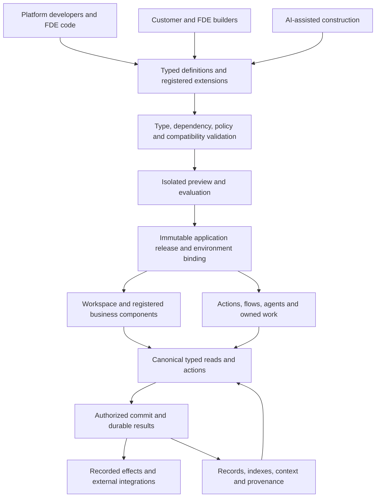

# Platform Architecture

Canonical description of the business platform. Decisions with lasting cost are recorded in [ADR/](ADR/); current work is in [WorkQueue.md](WorkQueue.md); the owner's intent is in [Intent.md](Intent.md). When this document and code disagree, the code is the fact and this document states the target — record the gap in the work queue.

Read this document with [Intent.md](Intent.md). **§10 is the highest-level design for the next year**, accepted through [ADR-0031](ADR/0031-ai-application-platform.md) on 2026-09-27. §2.4 owns the implemented capability map; §2.9 tracks open ADR promises; §10.2 interprets the audited gaps against the product goal; §10.3–10.6 define the target and its acceptance. WorkQueue.md alone owns task status. Earlier numbered stages in ADRs are historical; the new annual waves W1–W4 do not renumber them.

## 1. Purpose

The main line: **building, composing, running and evolving business software**. Apps define their objects, relations, rules and actions and contribute UI and runtime work; software is composed from them; when products, processes, structure or the business itself change, capabilities are added, changed, replaced or retired while data, history, permissions and work in progress stay continuous. Kernel concepts and shared capabilities earn their place by what they contribute to this line.

A multi-tenant **business platform with server and edge/client runtimes**. It supports multi-user organisational applications where a server is authoritative, and edge clients that keep working offline. The **target apps are CRM, MES and ERP** (Intent.md): the business software it must carry first, meeting through protocols. PMS, HCM and the CSM are reference apps. All of them exercise and demonstrate capabilities; none is the platform's source of truth.

The platform does not encode what an organisation or application looks like today. It provides the capabilities an application needs to move to its *next* shape — new products, processes, structure, operating model, even a different primary business — without rewriting the foundation. Domains are expected to change substantially; the kernel should change only when a genuinely missing cross-domain capability is discovered.

The next stage makes this an **AI business application platform for FDE delivery and customer construction**: governed object, page, workflow and AI builders backed by a common typed model, with code extension for industry rules. The target is the complete application lifecycle (§10), while the kernel remains free of domain vocabulary.

## 2. The product model

**Current implementation.** This section describes the code audited on 2026-09-27, including its limitations. In particular, code-composed apps and input replay remain the implementation; published application definitions and result-based recovery in §10 are accepted targets, not available APIs.

### 2.1 Layers

| Layer | Holds | Where | Changes when |
|---|---|---|---|
| **Kernel** | The language-neutral contract K1–K9: identity, facts, decisions, authority, tenancy, schema versions, connectors, work ownership (§4) | `contract/` (spec, vectors, Go) | A kernel hypothesis is revised (spec and vectors first) |
| **Host runtime** | Composition, routing, journal and replay, snapshots, the record store, owned work, dispatch of effects, model calls; it implements `platform.Runtime` | `platformserver` | The platform grows a mechanism |
| **App API** | What an app sees: `Member`, `Caller`, `Manifest`, the declarations (entities, lifecycles, actions, reads, flows, agents, jobs, settings, effect kinds) and `Ledger`. Apps reach the host only through `Runtime` | `platformserver/platform`; for UIs `@platform/app` | An app needs something the host already does |
| **Platform apps** | Cross-industry capabilities run as apps: `platform` (the console), `org`, `relations`, `work`, `flow`, `ai`, `agent`, `knowledge` | `platformserver` (§9 risk 6) | A cross-industry need appears in a second app |
| **Protocols** | Versioned interfaces apps provide and consume, with conformance tests | `protocols/` | A second provider or consumer appears |
| **Apps** | An industry's or a function's rules, entities, flows, agents and UI | `apps/`, `web/packages/*` | Its business changes |

Today operators set values (settings, bindings, endpoints, enabled models); structural definitions are code. ADR-0031 extends this to typed customer-authored models, pages and rules (§6). Dependencies point downward only; the kernel knows no domain vocabulary; the host and platform apps know no specific app. The model is a tool, not a taxonomy every file must be forced into: when experience shows a boundary is wrong, change the model through an ADR. The property that must hold is that **lower layers do not change when a domain evolves**.

Placement questions: Would it still hold in a different industry? After a pivot within the same industry? Is it "must be so" or "one of several implementations"? Who may author it, who may publish it, which invariant constrains it, and which existing capability executes it?

### 2.2 How it fits together

```text
 COMPOSE   solution (Go, per host) ─▶ tenant ─▶ apps, each a Manifest:
             entity types · lifecycles · actions · reads · flows · agents · jobs · settings · effect kinds
             apps meet only through protocols (provider ◀─ consumer), never each other

 WRITE     caller: person · service account · agent · connector · MCP or A2A client
             │ submission (an action on a target) or input (a connector page, an answer, a model's step)
             ▼
           receive: authenticate ─▶ catalog and role ─▶ policy (K6) ─▶ approval? (held by `work`)
             ─▶ app rules and decision (K4), facts (K2, K3), in-memory records/intents
             ─▶ journal the accepted input ─▶ return the result

 WORK      records/events/intents ─▶ flows · agents' waits · subscribers
                                  └─▶ effect dispatch (webhook, email, A2A; declared irreversible agent effects held)
                                  └─▶ notifications · tasks · links on timelines

 READ      records ─▶ generic reads · aggregates · context graph · search · dashboards
           derived, rebuildable: projections (PostgreSQL) · knowledge passages and vectors · snapshots

 PEOPLE    members hold one role per app; units in dated structures scope what they see and who approves
 AGENTS    declared principals; each run's steps, drafts, citations and people's signals are kept;
           evaluation re-runs signalled runs dry; memory is records people keep or forget
```

The write line shows the current direct submission order: `Tenant.Submit` calls the app, whose ledger applies in memory, then journals the accepted input. Production journal append failure currently terminates the process. This is not a staged database transaction over all Go state; §10.3 D defines the target commit boundary. Other journal entry kinds have the specific semantics in §2.7.

The concepts group into five planes. Each has one owner.

| Plane | Concepts | Owner |
|---|---|---|
| Composition | Solution, tenant, app, manifest, protocol, binding, setting | Code (solutions, apps); bindings and settings are console decisions |
| Truth | Submission, input, decision, fact, journal entry, effect outcome, usage | The app that holds authority over the target's data class (K5); the host journals |
| Reads | Record, history, aggregate, context, search, projection, passage, snapshot | The host, derived from the truth |
| People and work | Member, role, unit, structure, approval request, task, notification, saved view | `platform`, `org`, `work` |
| Agents | Agent, run, step, draft, signal, evaluation, memory, document, transcript | `agent`, `knowledge`, `ai` |

### 2.3 Where data lives

| Class | What | Kept in | Rebuilt by | Losing it costs |
|---|---|---|---|---|
| **Truth** | Every accepted top-level input: submissions, connector pages, delivery and job outcomes, agent steps with what their knowledge search found, effect outcomes with answers, model usage, flow versions started | The PostgreSQL journal, one per tenant, fail-stop | — | Everything; backups hold the journal |
| **Derived state** | Records and their history, kernel logs, owned work and queues, effects' intents, notifications, flow instances, agent runs, memories | Memory; snapshots (ADR-0019) | Replay through the same code | Start-up time |
| **Derived indexes** | Projections `tenant_<id>` (typed tables per entity type), knowledge vectors by passage hash | PostgreSQL beside the journal | Rebuilt at start; vectors re-embedded as owned work | Rebuild time; embedding cost |
| **Outside, with retention** | Transcripts of model calls (30 days by default); secrets (by name, in the deployment) | PostgreSQL table; environment | Not rebuilt | The full text of old model calls |
| **Volatile** | Heartbeats, a connector's last refusal, endpoint health, a job's run count and next due time; personal-read audit (last 5,000 entries) | Memory | — | Operational diagnostics and personal-read audit history; not accepted business state |
| **Code** | Declarations: entity types, actions, lifecycles, flows, agents, protocols, instructions | Go and TypeScript, versioned with the binary | — | — |

**Raw telemetry never enters the journal** (2026-09-26): samples at machine rates are windowed at the edge (a gateway) into observations that mean something — a state batch, a stop, a count — and only those are journaled, so replay stays small; a stream plane for raw signals is a later gate. Business state an app decides is **records** (ADR-0016). Observations and claims from outside are **facts** (K2) that decisions cite as evidence; the plant keeps its machine states, ERP claims and derived downtime as facts. A value computed from others is derived and never stored as truth.

### 2.4 Capability map (what exists)

Kernel status is in §4. "Used by" names the apps that prove a capability; a platform app counts when it uses another capability as an app would.

| Capability | Layer | What an app gets | Code | Used by |
|---|---|---|---|---|
| Identity and redirects (K1) | Kernel | Opaque stable IDs, merge and split redirects | `kernel.Identity` | MES (and Music, before 2026-09-26) |
| Facts, observations and claims (K2, K3) | Kernel | Facts with source and time; decisions cite them (C11) | `kernel.FactLog` | MES, PMS |
| Decisions (K4) | Kernel | Change records: idempotency, revisions (C12), causation | `kernel.ChangeLog` | all |
| Authority and outbox (K5) | Kernel | Authority per data class; edge outbox in Go, Rust and TypeScript | `kernel.Authorities` | all |
| Tenancy and policy (K6) | Kernel | Receiving order, one policy evaluation per decision | `kernel.Receiver` | all |
| Schema versions (K7) | Kernel | Versioned payloads; webhook bodies carry the version | `kernel.SchemaRegistry` | all (declared) |
| Connectors (K8) | Kernel | One descriptor for push and poll, cursors, health | `kernel.Connectors` | MES, PMS |
| Work ownership (K9) | Kernel | Generations, stale results, owner close (checkpoints unused) | `kernel.Works` | the host |
| Composition and routing | Host runtime | Manifests checked at start; routing by action, read and input | `NewTenant`, `checkManifest`, `Tenant` | every host |
| Journal, replay and snapshots | Host runtime | One ordered journal per tenant; fail-stop; replay through the same code; snapshots valid for their code | `Journal`, `Tenant.Replay`, `CheckReplay`, `snapshot.go` | every host |
| Record store and generic reads (ADR-0016) | App API, host runtime | Entity types as Go structs; generic reads with domain, search, sort and pages; scope per role; history; related records; generated create, edit, archive and forms; participants (a request's requester and approvers, a task's candidates, a flow's starter) read a record whatever their role, so whoever is told about it can open it (#118); with choices for references and child lines edited as rows (ADR-0024) | `platform.Entity`, `Caller.Put`, `Get`/`Find`, `/v1/entities`, `/v1/records` | CRM, PMS, MES, HCM, CSM, ERP |
| Number sequences (ADR-0024) | App API, host runtime | Document numbers per sequence and year from a pattern (`GJ/{year}/{n:5}`), taken only by accepted decisions, so without gaps; rebuilt by replay, kept in snapshots | `platform.Sequence`, `Caller.Next`, `sequence.go` | ERP (journal entries), CSM (tickets) |
| Aggregates and projections (ADR-0019) | Host runtime | Group and measure within scope; typed PostgreSQL tables per entity type with a reader role per tenant | `/v1/aggregates`, `-project` | CRM, PMS, MES |
| Action catalog | App API, host runtime | Declared actions; each caller receives only what its role permits; start-up deactivation | `platform.Action`, `/v1/actions` | all |
| Reads and read authorization | Host runtime | Named reads; role in the app, or open to every member | `Tenant.Read`, `Manifest.Everyone` | all |
| Package ledger | App API | The kernel wired for one app, catalog role check, publishing | `platform.Ledger` | every app |
| Owned work: deliveries and jobs (ADR-0013, ADR-0027) | Host runtime | Events delivered as owned work with retries; scheduled jobs run as the app; rounds that take tenants and apps in turn, deliveries ordered per subscriber and event target, attempts per app per minute deferred past a quota; the journal locked per tenant | `Manifest.Jobs`, `Tenant.Work` | MES, PMS and memstay (holds past their date), `work`, `flow`, `agent`; `Manifest.Subscribes`: the CRM hears a provider release a hold |
| Connectors, managed | Host runtime | Deliveries through the caller; cursor, health, last refusal; enable and disable as decisions | `Tenant.Connect`, `Caller.Deliver` | MES (push), ERP adapter (poll), PMS |
| Outbound effects (ADR-0014, 0022) | Host runtime | Webhooks for events; effect kinds apps emit; email of notifications; A2A messages to external agents; at least once with a stable key; answers back to the app; irreversible kinds an agent causes held for a person | `Tenant.Dispatch`, `Caller.Emit`, `Answerer`, `mail.go`, `a2a.go` | hospitality, MES, CSM, ERP adapter |
| Deployment | Host runtime | Development tokens, or journal plus OIDC, from one set of flags; the work runner; a seed for a tenant whose journal is empty (ADR-0024) | `Deployment`, `Deployment.Seed`, `RunWork` | manufacturing-server, hospitality-server, pms-server, every app's development host |
| Identity provider | Host runtime | OIDC subjects; the directory maps them to members | `OIDC`, Rauthy | every deployed host |
| Languages (ADR-0023) | App API, host runtime, web | Dictionaries shipped with each app's manifest and UI package, keyed by the English text; declarations in the member's language (their choice, else the browser's, else the tenant's default), choice values with translated titles; notifications, tasks and mail said in the reader's language through patterns; `t()` and a language switch in the workspace; agents answer in the run's language | `platform.Languages`, `languages.go`, `@platform/ui` `i18n.ts` | every app (English, Simplified Chinese) |
| Meaning and glossary (ADR-0023) | App API, platform app `knowledge` | Descriptions, help, examples and synonyms declared with entity types, fields and states; served to people, forms, tool schemas and agents' prompts; search by a type's names; the tenant's glossary layered on top, never changing a declaration | `Entity.Description`, tags `help`, `synonyms`, `example`, `knowledge.term` | CRM, MES, CSM (test app) |
| Host API contract (ADR-0023) | Host runtime | OpenAPI 3.1 of every route and named read, generated from the Go types, with the caller's entity types and action payloads; TypeScript types generated from it | `api.go`, `/v1/openapi.json`, `cmd/api-types`, `@platform/kernel` `Api` | every web package |
| Developer kit (ADR-0023) | App API, host runtime | The app guide, a scaffold that writes an app already on all six steps (entity, lifecycle, flow, translations, tests with `CheckReplay`, development host, UI package), and the `new-app` skill; CI scaffolds one and runs its tests, and checks every app under `apps/` without a list | `docs/Apps.md`, `cmd/new-app`, `.claude/skills/new-app` | CI |
| Agent doors | Host runtime | A caller's catalog as MCP tools; published agents over A2A 1.0 (JSON-RPC, agent cards) | `POST /mcp`, `/a2a/<tenant>/<agent>`, `cmd/mes-agent` | every host; CSM published |
| Console | Platform app `platform` | Members, roles, service accounts and agents; audit and deliveries; app settings; the tenant's default language and currency (`platform/currency`, the books' currency and the default of amounts people enter); protocol binding; endpoints; approval and retry of effects | `console.go` | every host |
| Organisation (ADR-0012) | Platform app `org` | Units in dated structures, memberships; rules ask for a member's units at the input's time; working calendars on units, used by approvals and flow timeouts in working days (ADR-0028) | `capabilities/server/apps/org` (a package, ADR-0025 D4), `Caller.Units` | MES, HCM, hospitality |
| Links, timeline, comments and followers | Platform app `relations` | Relations between entities, listed on each record's page as its linked records; protocol events told on linked timelines, shown as the record's activity; comments with @mentions and followers on any record, readable when the record is — what people write about a record is a comment, the one owner (ADR-0028, #129) | `capabilities/server/apps/relations` (a package, ADR-0025 D4), `Caller.Link`, `Caller.Links` | CRM |
| Field security and personal data (ADR-0028) | App API, host runtime | Tags `read`, `write` and `personal` on fields; record reads, search, filtering, aggregates, forms and history apply field restrictions; projections and knowledge indexes omit restricted fields. Knowledge fields and attached text now check the source record's scope at retrieval (#130 first slice); personal-read audit is currently volatile | `FieldInfo.Read`, `Write`, `Personal`, `viewOf`, `/v1/personal-reads` | HCM, CRM |
| Files (ADR-0028) | Platform app `files`, host | Bytes uploaded to an S3-compatible store (RustFS locally) and attached to any record by a decision naming their SHA-256; readable exactly when the record is (`Scope.Through`); downloads served as attachments; text files as knowledge; unattached uploads swept | `capabilities/server/apps/files`, `capabilities/server/filestore.go`, `POST /v1/files`, `GET /v1/files/{id}` | MES, CSM, ERP (any record) |
| Import and export (ADR-0028) | Host runtime, `@platform/app` | CSV of any entity type in and out of its list: each row a decision through the type's generated create or edit, previewed first, a file sent again deciding nothing new; exports read as the list does, field security included | `POST /v1/import/{type}`, `GET /v1/export/{type}` | ERP, CRM, HCM |
| Graphs (#122) | `@platform/ui` | One read-only canvas (React Flow, laid out in layers by the kit): flow definitions in Settings and instances with where they wait, an SFC's routing with its operation and nonconformances, a record's approval chain, an agent run's steps and sources | `Graph`, `FlowGraph`, `ApprovalGraph` | CSM, MES, HCM |
| Notifications | Host, read state in `platform` | To members, a unit's role or an app role; deduplicated; mailed through an email endpoint; a task's notifications are read once it closes, and a notification opened is read (#118) | `Caller.Notify` | MES, PMS, CSM, `work` |
| Lifecycles, approvals, tasks, inbox (ADR-0017) | App API, platform app `work` | States and transitions on an entity type; approval chains along the organisation, the record pending while approvers decide and rejected with their note; tasks with due times and escalation; one inbox; saved views; delegation of a member's approvals for some days (ADR-0028) | `platform.Lifecycle`, `platform.Approval`, `Caller.Assign`, `/v1/inbox`, `work.delegation.add` | MES, HCM, CSM |
| Flows (ADR-0020) | App API, platform app `flow` | Declared long-running processes: acts, waits, questions, parallel branches, sub-flows, agent steps, timeouts, compensation, versions, a trace of why each step went where it went; a step that fails with no fault path gives the flow's owners and its starter a task before it undoes (#118); a record's page lists the flows about it (`Flow.Subject`, ADR-0026 D4) | `platform.Flow`, `flow.go`, `capabilities/server/apps/flow/engine.go` | MES, CSM |
| AI providers and models (ADR-0015, ADR-0029) | Platform app `ai` | Vendor, OpenAI-compatible, Anthropic and local providers; enabled models with access; calls through the host with usage journaled; tools on both wires; limits at the door every call passes (tokens a day per person, agent and model, calls a minute, a member's own); answers streamed as server-sent events; apps ask the tenant's model for apps through a request whose answer their reply action takes | `capabilities/server/apps/ai/ai.go`, `aicall.go`, `anthropic.go`, `/v1/ai/chat` | every host |
| Agents (ADR-0021, 0022) | App API, platform app `agent` | Declared agents as principals with the intersection of grants; runs journaled step by step; drafts people confirm; signals; evaluation by dry re-runs; memory; transcripts; the context graph and search as tools; an overview of every agent, declared and outside, with runs, actions, cost and what people made of its work, and an off switch that stops its runs and refuses its calls (ADR-0029). An on-behalf run now stops when its member or app role is removed; the member's runs and app agents read then hide those old traces/instructions (#130 first slice) | `platform.Agent`, `agent*.go`, `context.go`, `/v1/context`, `/v1/search` | MES, CRM, CSM |
| Knowledge (ADR-0022) | Platform app `knowledge` | Documents and `knowledge:"true"` fields; passages; hybrid search (BM25 and vectors) filtered by app access and the source record's current scope; restricted fields and restricted display titles omitted; field indexing walks all 500-record host pages; citations journaled with an agent's step (#130 first slice) | `knowledge.go`, `/v1/knowledge` | CSM |
| Protocols (ADR-0011) | Protocols | Named, versioned actions, reads and events with conformance tests. Across apps (ADR-0026): a decision's rules only probe another app; once accepted, its requests run at the provider and each answer comes back to the app's own reply action, which a person may take when no provider is bound; both are journaled as submissions. Holds with an expiry, then confirm or release | `platform.Protocol`, `Caller.Probe`, `Caller.Request`, `platform.Answer`, `protocols/lodging`, `protocols/production` | PMS and memstay provide lodging with holds, CRM consumes it (the group block); the ERP app, or the ERP adapter to an ERP outside, provides production orders, the MES consumes them (ADR-0024) |
| UI kit | Web | Components, docking workspace, entity routes, records (lists, pages, forms), pivot, charts from the platform's visualization spec (ECharts 6), flow view | `@platform/ui` | every web app |
| Workspace and the UI app API (ADR-0018) | Web | One sign-in per host; apps contributed by UI packages; records opened across apps by reference; dashboards; the assistant, run pages and global search | `@platform/app`, `web/apps/workspace` | every app UI |
| Edge client and sign-in | Web | Outbox, HTTP client, OIDC with PKCE, a host's reasons for refusing — every refusal carries one: an app's through `platform.Refuse`, else the host's from its code, the action and the target (`explained`, #129) | `@platform/kernel` | workspace, PMS desk |
| Settings | Web | Members, organisation, apps, settings, protocols, integrations, AI, processes (flows, agents, evaluations, memories), knowledge, audit | `@pkg/platform` | every host |
| App UI packages | Web | An app's or a protocol's views for any workspace | `@pkg/<id>` for every app (`crm`, `csm`, `erp`, `erpadapter`, `hcm`, `mes`, `pms`); what the platform's pages show (records of other apps linked to one, a protocol's events on it) is not an app's (#129) | — |

### 2.5 Terminology and ownership

Words that are easy to confuse:
- An **app** is a unit of capability: a Go manifest and, usually, a UI package. **Platform apps** are the eight listed in §2.1. **Reference apps** live under `apps/` (called `slices/` until 2026-09-26, from the kernel-validation phase). "Package" in ADR-0008 and ADR-0009 means app.
- A **solution** is a composition of apps for one host, named for its industry: `solutions/hospitality`, `solutions/manufacturing`; an app alone runs on its development host `cmd/<id>-server` (ADR-0025).
- An **event** is an accepted decision as others see it. A domain's own word "event", such as a downtime event, is not this.

| Term | Is | Owned by | Durable as |
|---|---|---|---|
| **Action** | A declared operation an app offers: schema, target type, roles, description | The app's manifest (`Catalog`) | Code |
| **Submission** | A request to take an action on an entity | The caller | — |
| **Decision** | An accepted submission: a K4 change record in the ledger of the app holding authority over the target's data class | That app's `Ledger` | Journal entry `submission` |
| **Input** | A top-level entry that is not a submission: a connector's batch or page | The app declaring the input | Journal entry `<input name>`; heartbeats are not journaled |
| **Fact** | What is true at a source: an **observation** (seen, such as a machine state or an ERP answer) or a **claim** (asserted by a source, such as a planned order) | The app's fact log (K2) | Rebuilt from the input or outcome that recorded it |
| **Entity type** | A Go struct an app declares: fields, scope, lifecycle, seed | The app | Code |
| **Record** | One entity's current fields, revision and history | Decided by the app's ledger, kept by the host | Rebuilt from decisions |
| **Lifecycle** | States and transitions on an entity type; each transition is an action | The app | Code |
| **Approval request** | A submission held until the approvers of each level agree; the last approval runs it as the requester | `work` | Decisions |
| **Task** | Work for members, a role or a unit, with a due time and answers | `work`, opened by approvals, flows, agents and apps | Decisions |
| **Event** | An accepted decision after commit, named by its action schema or a protocol event (`<protocol>#<event>`) | Host | Rebuilt from the decision |
| **Subscription** | An app's declared interest in its own decisions or a consumed protocol's events | The app's manifest | Code |
| **Delivery** | One event queued for one subscriber, attempted as owned work, in order per subscriber | Host (`Task` of kind delivery) | Journal entry `delivery` per attempt |
| **Job** | Scheduled work an app declares and runs as `app:<id>` | Declared by the app, run by the host | Journal entry `job`, only when a run decided or notified something |
| **Work** | K9 ownership of a delivery or a job: owner, generation, state | Host, through `kernel.Works` | Rebuilt by replay; job counters are volatile |
| **Flow** | A declared long-running process; an **instance** is its record with tokens, undo stack and trace | Declared by the app, run by `flow` | Code; instances are decisions |
| **Connector** | An inbound source: a K8 descriptor whose ID is the member it signs in as | Connected by the deployment, held by the host, switched by `platform` | Cursor and switch rebuilt; heartbeat and last refusal volatile |
| **Endpoint** | An outbound destination: a webhook, an email server or an external A2A agent | `platform` decisions, held by the host | Decisions |
| **Effect kind** | An outbound message an app declares it sends (`Manifest.Emits`) | The app's manifest | Code |
| **Effect** | One intent for one endpoint, from an event, `Caller.Emit` or a notification; its key is its ID. Held while an irreversible kind an agent caused waits for a person | Host | Intent rebuilt from its input; approval and discard are decisions; each attempt's outcome is journal entry `effect` |
| **Answer** | What an endpoint returned for an app's effect; the app records it as an observation | The app (`Answerer`) | Journal entry `effect` |
| **Notification** | A message to a member, resolved on the input's day | Created by apps (`Caller.Notify`), stored by the host; read state is a `platform` decision | Rebuilt from its input |
| **Setting** | A typed value an app declares | Declared by the app; values set by `platform` decisions | Decisions |
| **Provider**, **model** | A source of models, and one of its models enabled for everyone or for AI users | `ai` decisions | Decisions |
| **Usage** | One model call's meter reading: member, model, tokens, cost, latency, outcome | Host, applied by `ai` | Journal entry `usage` |
| **Agent** | A declared principal `agent:<app>.<name>`: instructions, tools, budget, guard, who takes over | The app | Code; published over A2A by a setting |
| **Run** | One goal of an agent: steps with rationale, draft, citations, budgets used, result | `agent` | Journal entries `agent`, decisions `agent.run.*` |
| **Signal** | A person's answer to an agent's work: confirmed, changed, rejected, approved, discarded, undone | `agent` | Decisions |
| **Evaluation** | Signalled runs re-run dry with a candidate model, compared with what people accepted | `agent` | Journal entry `agent` |
| **Memory** | A short fact an agent keeps about a person or for every run; expires unless a person keeps it | `agent` | Decisions |
| **Document**, **passage** | Knowledge text and the pieces it is cut into; vectors are derived | `knowledge` | Decisions; vectors derived |
| **Term** | A word of the tenant's glossary: what it means here, its synonyms, the declaration it refers to; layered on the model, never changing it | `knowledge` | Decisions |
| **Transcript** | A model call's full request and answer | Host, outside the journal | Retention setting |

Ownership rule: the host keeps shared runtime state; the `platform` app decides every change an administrator makes, each area deciding its own target type; apps decide only about their own data classes, reach the platform through `Caller` and each other through protocols only.

### 2.6 External effects: lifecycle and replay

```
  agent + irreversible kind ──▶ held ──approve (a person's decision)──▶ pending
decision or app input ──emit──▶ pending ──attempt──▶ delivered
                                  ▲    │            ▶ rejected (4xx except 408/429; private address; bad scheme)
                          retry   │    └─ 5xx, 408, 429, timeout, network ─▶ retrying ──(12 attempts)──▶ failed
                        (decision)│                                            │
                                  └──────────── failed / rejected ◀────────────┘
  held, pending or retrying ──discard (decision)──▶ discarded      endpoint removed ─▶ its unsettled effects are discarded
```

1. **Creation.** Inside an input:
   - `emit` turns a decision whose event an endpoint subscribes to into an effect. The ID is `<tenant>:<app>:<change id>:<endpoint>`.
   - `Caller.Emit` turns an app's effect of a bound kind into an effect. The ID is `<tenant>:<app>:<kind>:<key>:<endpoint>`. When the kind is irreversible and the caller is an AI agent, the effect is held, and the administrators are notified. An agent's `emit:<kind>` tool does the same and waits for the answer.
   - `Caller.Notify` turns a notification to a member with an email address into a mail for each email endpoint carrying that app. The ID is `<tenant>:notice:<notification>:<endpoint>`.

   An effect has no journal entry of its own. It is part of the input that caused it, and replay recreates it with the same ID.
2. **Attempt.** `Dispatch` takes the due head of each endpoint's effects (ordered per endpoint; held effects wait outside the order) and sends it outside the tenant's lock.
   - A webhook is signed as Standard Webhooks, with `webhook-id` and `Idempotency-Key` both set to the effect ID.
   - A mail goes over SMTP (STARTTLS when offered), with the effect ID as its Message-ID.
   - An A2A message is a `SendMessage` to the endpoint's agent; the task's result is the answer.
   - Private addresses are refused at connect time unless the endpoint allows them.
   - Dispatch is never called during replay.
3. **Outcome.** Every attempt ends in a journal entry `effect` holding the result (delivered, rejected or retry), the detail, the digest of the body sent, and for an app's effect the answer (JSON, up to 64 KiB). A retry sets the next due time: 5 s doubling to 1 h, with jitter derived from the ID; after 12 attempts since the last manual retry the effect is failed.
4. **Answer.** For an app's effect, once settled, the host calls the app's `Answer` with the outcome. The app records the answer as an observation and may notify or decide. Replay makes the same call with the journaled answer.
5. **Idempotency.** At least once: a crash between an attempt and its entry leaves the effect pending; after restart it is sent again with the same ID; receivers keep one copy per ID.
6. **Approval, manual retry and discard** are `platform` decisions. Only a person approves a held effect; an agent's approval is refused whatever its role. Approving or discarding an effect an agent's run caused is a signal on the run.
7. **Replay** rebuilds intents from their inputs, applies every recorded outcome and hands answers to apps. It calls nothing: `CheckReplay` fails the test on any outbound call. After replay, effects still pending are sent by the running host with their original IDs.

### 2.7 Replay semantics for every journal entry kind

| Entry kind | Written when | Replay does |
|---|---|---|
| `submission` | A top-level decision is accepted | Runs the same app rules without re-authorizing; queues its events; recreates webhook effects |
| `<input>` (connector batch or page) | An input declared journaled is accepted | Runs the same app code (cursor checks included) |
| `delivery` | Each attempt of an event for a subscriber | Attempts again and must reach the same outcome, otherwise replay stops |
| `job` | A run that decided or notified something | Runs again at the recorded time and must reach the same outcome |
| `agent` | Each step an agent's model chose, with what its knowledge search found; an evaluation's report | Applies the recorded choice — the tool is used again, its action decided again — and never calls a model, embeds or searches |
| (any, with `versions`) | A flow instance started while handling the entry | Starts it on the recorded version, whatever the code declares since |
| `effect` | Each attempt of an outbound effect | Applies the recorded outcome and hands the answer to the app; never sends |
| `usage` | Each model call | Applies the meter reading; never calls a model |

Removing an action schema, input or effect kind that a journal already holds needs a migration: replay would meet an entry no code accepts.

**Snapshots** (ADR-0019 D6) shorten replay without changing it: a tenant's state saved at a journal position, valid only for the code that wrote it (the binary and its apps' versions), restored at start-up, then only the later entries replayed. Other code ignores it and replays the whole journal.

### 2.8 Invariants and the checks that hold them

These checks cover the current input-replay model. They do not prove correctness after arbitrary code/declaration changes, complete permission closure or process-level tenant isolation. Target invariants are in §10.3 and ADR-0031.

| Invariant | Check |
|---|---|
| Replay reproduces the durable state covered by the conformance snapshot and calls nothing outside; so does a snapshot taken after any part of the journal, restored and given the rest. Volatile diagnostics such as personal-read audit are excluded | `platformserver.CheckReplay` in the tests of the host, MES, PMS, CRM, HCM and the hospitality solution (four snapshot points each); the rehearsal's restart and restore |
| Replay never calls a model, embeds or searches | Host tests fail when a replay calls a model (`TestAgents`, knowledge tests) |
| A manifest the host cannot honour is refused at composition: undescribed actions, settings of the wrong type, jobs without an interval, repeated effect kinds, undeclared open reads, flows and agents naming steps or tools that do not exist, protocols no earlier app provides | `checkManifest` and `NewTenant`, run by every composition's tests |
| No app depends on another app; a protocol depends on no app; apps and protocols import the app API, never the host runtime | `scripts/boundaries.sh` (verify step `app-boundaries`) |
| Rules scope by the input's time, so a replay decides alike | `Caller.Units(structure, now)`; organisation test |
| Every caller receives only the actions its role permits; an agent never does more than the person it runs for | Catalog tests, `TestAgents`, the rehearsal |
| Each accepted top-level input is journaled once, before it is answered | Host tests and the rehearsal (restart and restore) |
| Kernel vocabulary stays domain-free | verify step `contract-vocabulary` |

### 2.9 Open promises of accepted ADRs

"Accepted" means decided, not built. Promises that are built are recorded in each ADR's "As built"; this table keeps only what is partial, deferred, amended or superseded.

| ADR | Promise | State |
|---|---|---|
| 0008 | Customer models, dashboards and package assembly | Amended by ADR-0031: typed customer extensions and independently published definition assets are the target; current apps remain code-composed |
| 0009 | Bridges between packages | Superseded by ADR-0011; the bridge path was removed in #104 |
| 0010 | Requirement graph between apps; scoped grants by member attributes | Superseded by the protocol graph (ADR-0011) and the organisation (ADR-0012) |
| 0010 | Enable and disable an app per tenant as a recorded decision | Current: code composition and start-up deactivation. ADR-0031 adds governed application releases and activation; not built |
| 0010 | Effective permissions in Settings | Partial: roles per app are shown, the resulting catalog per member is not |
| 0010 | Logs and correlation; health | Partial: OpenTelemetry traces and metrics, `/healthz` and tenant health (ADR-0027 10c); logs are still unstructured |
| 0010 | Analysis datasets, retention, preferences | Partial: files, sequences and saved list views exist; analytical authoring and retention policy remain open |
| 0011 | Protocol versions side by side; routing an action on an existing entity to its provider | Deferred |
| 0011 | Cross-industry protocols (party, documents, calendar) | Partial: notification, links and timeline are platform capabilities |
| 0012 | Successors of merged or split units; posts; delegation; federation | Deferred |
| 0013 | Work kept in K9 `Works` | Partial: generations only; checkpoints unused |
| 0013 | An app's work stops when it is disabled | Deferred (with per-tenant disable) |
| 0014 | Per-endpoint limits; a breaker per destination | Built (ADR-0027 10b): a breaker per endpoint, endpoints sent side by side; a fixed 10 s timeout and 64 KiB answer remain |
| 0014 | Webhooks filtered by who may see an event | Amended (#104): an endpoint has the administrator's view |
| 0015 | Quotas and rate limits, app calls as effects, streaming | Built (ADR-0027 10a, ADR-0029 12a: attempts per minute, breakers, daily tokens per member/model/agent, SSE streaming); app calls as effects deferred |
| 0016 | References to a protocol's entity type | Deferred; generated forms offer choices for references (ADR-0024 7a) |
| 0017 | Delegation and substitutes | Delegation of approvals built (ADR-0028 11e); of other tasks deferred |
| 0018 | The backend-for-frontend token; UI bundles loaded at run time | Open. ADR-0031 prioritizes publishing definitions over registered components; remote executable bundles require their own isolation design |
| 0019 | Capturing state without the tenant's lock; parallel restore; the plant's downtime as records | Deferred |
| 0020 | A drawn graph | Read-only graph built (#122). ADR-0031 replaces the prohibition on flow authoring: a typed composer reuses the flow semantics; editor and publishing are not built |
| 0022 | A2A streaming and the HTTP+JSON binding; pgvector when a tenant outgrows memory search; PDF text; documents from connectors | Deferred |
| 0026 | A request retried when its provider is unavailable; an outside provider's later answer through the same reply action | Deferred: providers in the host answer at once (D2); the ERP adapter's later answer still reaches the MES through its flow; #120 |
| 0023 | Dates in the chosen language; one English word with two meanings in a tenant; apps' reads typed and checked; a developer MCP; scaffolds for protocols and agents | Deferred |
| 0024 | Financial statements beyond the trial balance; partial receipts, bills, returns and payments; stock that may not go below zero; partial confirmations and consumption per component; a real SAP binding | Deferred: the ERP stays thin (Intent.md) |
| 0025 | An outside key on records for reconciliation; inbound webhooks and mail as connector inputs | Deferred (§10.4) |
| 0025 | The host's own apps as apps | Built (8a to 8c); the agent runtime and the console stay in the host by the amended D4 |
| 0027 | Checkpoints for evaluations; spans for acting jobs and whole HTTP requests | Deferred (10a to 10c built) |
| 0028 | File fields declared on entity types; personal data erasure; working hours in a day; automatic creator following | Deferred (files attach to records generically, field security and calendars built; #121 in owner testing) |
| 0029 | MCP sign-in and resources (12f); app depth proofs (ERP bill classification, MES cases) | Open (12a to 12e built); prioritized with the AI construction track, with task status in WorkQueue.md |
| 0030 | Production progress: start reports, lot-by-lot confirmations, partial orders | Accepted, deferred (#125); may be pulled forward by an explicit delivery proof |
| 0031 | Layered builders and application lifecycle; semantic definitions; frontend and AI construction; accepted-result journal, tenant supervision, release closure and Lean | Accepted direction, documentation only. All implementation remains open; §10 owns the target and WorkQueue.md its tasks |

## 3. Runtimes and languages

```text
Server runtime (Go, reference implementation)
  tenancy · principals/policy · change records · identity/redirects · claims & resolution
  sync endpoints · server-authoritative apps · flows · agents · connectors · effects · audit/ops
  Rust only for measured wins (solvers, matching, fingerprinting, protocol stacks)
        ▲  kernel contracts: language-neutral schemas + semantics + conformance vectors
Edge / client runtimes
  Web (TypeScript, React, @platform/ui): the workspace every host serves
  Desktop (Tauri/Rust): the PMS desk, offline with the Rust K5 outbox
  Edge gateways (candidate Rust/Go): devices, PLCs, sensors, offline sites
```

**The kernel is a contract, not a library** ([ADR-0002](ADR/0002-kernel-as-contract.md)). It is defined by schemas, semantic rules and conformance test vectors; Go implements it first. A runtime either implements the contract and passes the same vectors, or maps to it at its boundary. Cross-language boundaries exist only where justified — no four parallel implementations of everything. Edge clients implement the contract natively rather than share a Rust edge core ([ADR-0005](ADR/0005-no-shared-edge-core-yet.md)); the Swift implementation was deleted with Music ([ADR-0025](ADR/0025-one-shape-for-every-app.md) D5).

The kernel contract covers what edges and the server must agree on to exchange decisions. The host's HTTP API — actions, entities, records, inbox, context, search, knowledge — is what every web client, integrator and agent uses; its contract is generated from the host's Go types as OpenAPI 3.1 at `/v1/openapi.json`, and the web edge's TypeScript types are generated from it (ADR-0023 D7).

## 4. Kernel — current definition (hypotheses under test)

Each item is a falsifiable statement. Status: **H** hypothesis · **2D** used in two different pressure domains without exceptions · **E** survived an evolution drill · **S** stable (changes need an ADR). Only S items are frozen; demoting or deleting an item is progress. Evidence lives in code, tests and the work queue.

| # | Statement | Falsified if | Status |
|---|---|---|---|
| [K1 Identity](../contract/spec/K1-identity.md) | Entities have platform-assigned, opaque, stable IDs; references are typed IDs; external IDs are claims, not identity; merge/split keeps old IDs resolvable via redirects | A domain must encode meaning in IDs; redirects cannot express a split; cross-runtime references need domain knowledge to resolve | **2D** (Music redirects; manufacturing SFCs and derived downtime entities; creation rule I10) |
| [K2 Fact kinds](../contract/spec/K2-K3-facts.md) | Persistent business data is an **observation** (append-only, source-authoritative), **claim** (coexisting, resolved), **decision** (needs authority, may be rejected, undone only by a new decision) or **derived** (recomputable) | Data that fits none, or needs a fifth conflict semantic | **2D** (Hotel channel observations; manufacturing state batches, ERP claims, derived downtime) |
| [K3 Provenance](../contract/spec/K2-K3-facts.md) | Every observation/claim/decision records source (principal or connector), time and confidence/authority basis | Provenance cost is unacceptable for high-rate observations even when batched | **2D** (one provenance per 600-sample batch is enough) |
| [K4 Change record](../contract/spec/K4-change-record.md) | Every accepted decision yields an envelope: change ID, tenant, principal, authority, target reference, schema version, valid time, recorded time, causation/correlation, idempotency key. History is kept; events and subscriptions build on it | Correctness needs multi-change atomicity the envelope cannot group; audit retention cannot be reconciled with deletion/privacy duties | **E** (Music corrections, Hotel reservations; unchanged through drills E1 and E2 and stages 1–5). Atomicity across authorities is declined: a decision changes one app, and asks others after it (ADR-0026) |
| [K5 Authority & sync](../contract/spec/K5-authority.md) | Authority (device / tenant server / external system / negotiated) is declared per data class; sync behaviour is derived from it; authority can migrate | A data class needs two simultaneous authorities; derived sync needs per-domain exceptions | **2D** (server authority in Hotel and manufacturing, device authority in Music); drill E2 added A10 adoption (ADR-0006) |
| [K6 Tenancy & policy](../contract/spec/K6-tenancy-policy.md) | A tenant is an isolation boundary (data, keys, config, quota, audit), not an org schema. Every decision records its principal; authorization is one auditable policy evaluation (principal, action, target, context). Org hierarchy is domain data. A personal space is a degenerate tenant | Policy evaluation must understand domain hierarchy; personal apps must carry tenant overhead | **E** (Hotel roles, manufacturing lines; family roles in drill E2; the organisation stayed outside the kernel, ADR-0012) |
| [K7 Schema evolution](../contract/spec/K7-schema-evolution.md) | Every stored or transmitted payload is versioned with an upgrade path; entity types can split/merge through K1 redirects; old clients and new servers can coexist (expand → migrate → contract) | A drill needs a stop-the-world migration | H |
| [K8 Connectors](../contract/spec/K8-connectors.md) | External systems attach through one descriptor: capabilities, identity mapping (K1), sync cursor, health/auth state; protocols stay in capabilities/domains | Capabilities need parameters a set cannot express; push and poll sources need two descriptor kinds | H (push gateway and polled ERP in one descriptor; the Hotel's channel moved onto it in #98) |
| [K9 Work ownership](../contract/spec/K9-work-ownership.md) | Long-running work has an owner, cancellation, stale-result invalidation and resumable checkpoints; closing an owner never silently reverts committed decisions | Server workflows and client tasks cannot share these semantics | H (generations used by the host's owned work; checkpoints unused; client side in MSRU's `FeatureHost`) |

Stages 1–5 built records, lifecycles, analytics, flows and agents without a kernel change; the Go kernel only gained restore functions for snapshots, which add no rule. Explicitly **not** kernel: capacity allocation over time, flows, money, organisational hierarchy, UI shells and routes, matching toolkits, media playback. The action catalog is used by every app and client; it becomes a kernel-contract candidate once a client outside TypeScript needs it (spec and vectors first).

### Kernel Contract

The kernel is defined by six parts, all in `contract/`. A part never substitutes for another: the schema says what data looks like, never what it means.

| Part | Answers | Form |
|---|---|---|
| Data contract | What does the data look like? | Protobuf in `contract/proto`, checked by `buf lint` |
| Semantics | What does it mean; what is valid? | Numbered rules (MUST/MUST NOT) with the error each violation returns, [contract/spec/](../contract/spec/README.md) |
| Errors | Do all runtimes reject the same way? | One error-code set, [contract/spec/errors.md](../contract/spec/errors.md); only the code is contract |
| Compatibility | How may it change without harming old clients or data? | Rules below |
| Conformance | How is an implementation proven correct? | Language-neutral vectors in `contract/vectors`; Go (reference) runs every file; Rust and TypeScript run the K5 files |
| Scope | What is not kernel; who changes it? | This section, §4 promotion rules, ADRs |

**Version.** One identifier for schema package, specs and vectors: `v1alpha1` while concepts are hypotheses (breaking changes allowed, each listed in the change), `v1` once they are stable (breaking changes need a new major version and an ADR).

**Compatibility.** Field numbers and enum values are never reused; removed ones are reserved. A change is breaking if it makes any existing vector fail, changes when an existing error code is returned, or changes the meaning of a field even with an unchanged schema. Adding optional fields, error codes or vectors for previously unspecified behaviour is minor. Readers preserve unknown fields.

**Conformance.** An implementation conforms to a version for the concepts whose vectors it passes in full. Vector format: `{contract, concept, vectors: [{id, rules, given, steps: [{<operation>, expect}], expectLog?}]}`. Schema objects use Protobuf JSON names and are parsed strictly. Values assigned by the implementation are referenced indirectly (`"$step:N"` for the change ID produced by step N; `sameAs: N` for a replay of step N). The authority clock is given per step (`at`), so results are deterministic.

**Current coverage** (`v1alpha1`): K1 to K9 all have spec rules and vectors that Go passes; the edge implementations pass K5. Open cases recorded in the specs: negotiated authority (K5); atomic groups across authorities are declined (K4, ADR-0026), a refusal's reason beyond its code (F-23).

### Fact kinds across domains

| Kind | CRM | MES | ERP | PMS |
|---|---|---|---|---|
| Observation | An email or call logged from outside | Sensor reading, machine state, counts, the ERP's answer | Bank statement line, quantity counted at goods receipt | Raw channel booking message |
| Claim | A lead's company data from an enrichment source | Planned order from the ERP, supplier lot data | Supplier invoice, a supplier's price list or lead time | OTA guest profile, channel rate |
| Decision | Open, win or lose an opportunity | Release order, start and complete SFC, disposition | Approve a purchase order, post a journal entry, release a production order | Confirm/assign/cancel reservation |
| Derived | Pipeline value, forecast | Downtime, OEE, WIP statistics | Account balances, stock on hand, MRP's planned orders | Availability, reports |

## 5. Authority, sync and submissions

- **Device authority** (data a person keeps on their own device, such as offline drafts; Music's library proved it before 2026-09-26): local changes apply immediately; the server is a replica/backup.
- **Server authority** (reservations, work orders): the edge submits *intents*; UI shows pending until accepted or rejected.
- **Observations** are authoritative at their source and never "conflict" — they are appended and may later be judged wrong.
- **Authority migration** (personal → shared, device → server, external system → platform) must be possible without redesigning the domain. The plant proved it (ADR-0024): its own ERP connector and effect became providers of one protocol, the ERP app or the adapter to an ERP outside, without changing the plant's rules.

Submission states for server-authoritative intents: `pending → sending → confirmed | conflict | rejected | unknown`. `unknown` (timeout, lost connection) retries with the **same operation ID and parameters**; conflicts and rejections keep the draft and never retry automatically; a user revision is a new operation. Transient errors and business conflicts never share an infinite retry queue. Switching tenant/account isolates queues and results; results from an old identity are never shown to a new one. Incremental sync must handle cursor expiry, pagination consistency, tombstones, permission revocation and duplicate events; push is a refresh hint, never the only source of data.

## 6. Typed code and governed definitions

Platform code implements mechanisms and extension interfaces. FDE code supplies complex industry algorithms and components. Customer definitions compose registered objects, relationships, actions, pages, conditions, workflows and AI functions. A condition, reference or bounded iteration is not by itself a reason to force the author into Go. It is a reason to specify types, evaluation semantics, limits, authorization and versioning.

All construction paths use one validated definition model and the same runtime capabilities (§10.3). Code-backed functions expose typed inputs/outputs, required capabilities and effect boundaries; serialized definitions reference those functions, never serialize arbitrary Go closures. Declarative rules cannot bypass an action's invariant, permission check or effect boundary. Pure expressions are bounded and side-effect free; durable waits and retries belong to flow/owned work. No unrestricted JavaScript, SQL or tenant plugin execution is implied.

The current developer path in [Apps.md](Apps.md) remains executable. The new editors, registries, publishing and definition storage are future implementation. A runtime transition must remove the old competing path once its declared exit criteria pass. Authoring permissions, publishing permissions and business execution permissions are separate and checked at their own boundaries.

## 7. Positions by concern

| Concern | Platform (kernel, host, platform apps) | App |
|---|---|---|
| State & persistence | Identity, change envelope, versioning, the record store, migration duty; storage engine is replaceable | Entity types, rules, facts it keeps |
| Addressing / routing | Stable references resolvable across runtimes (with redirects); entity routes in the workspace | Views and navigation inside the app |
| Permissions | Principals, catalog per role, record scope from the organisation, policy hook, audit | Roles it declares, rules that refuse |
| Processes | Owned work, lifecycles, approvals, tasks, flows, cancellation, recovery | The lifecycles and flows themselves |
| Events | Change record is the invariant; causation/correlation IDs; delivery as owned work | Which flows start or wait on which events |
| Integrations | Connector descriptor, endpoints, effects, MCP, A2A | Protocols (OTA channels, ERP messages, OPC UA/MQTT) |
| AI | Providers, metering, the agent harness, knowledge, memory, evaluation | Agents' instructions, tools and guards |
| Time | Valid time vs recorded time | Calendars, shifts, nights, takt |

Operations floor for any organisational deployment: cross-tenant access is rejected; duplicate submissions do not apply twice; version conflicts never overwrite; drafts survive offline restarts; backups are restorable and restore is rehearsed; old clients stay compatible through expand/migrate/contract; permission revocation takes effect; logs carry correlation IDs without sensitive business content. Replicas and sync are never backups. Open on the floor: permission revocation while a token is valid, structured logs, and backup of the identity provider's runtime data.

## 8. Validation strategy

Applications are pressure environments for the platform, not its source of truth.

| Domain | Nature | Pressures | Cannot test |
|---|---|---|---|
| PMS | Reference app modelled on OPERA Cloud and Mews | Server authority, several principals, capacity over time, a channel connector | Realism — it can confirm our own assumptions |
| Manufacturing | Reference app modelled on Opcenter and SAP ME (ISA-95 practice), desk-studied, no plant yet | Observation streams, device edge, hierarchy, quality, work orders, ERP integration | A real plant's volume and exceptions |
| CRM | Target app | Parties, opportunities, activities, protocols to other apps, the sales assistant | — |
| ERP | Target app, being built (ADR-0024; accounting, purchasing, inventory and production orders built), modelled on SAP S/4HANA and Odoo | Money and units, double-entry posting (several changes that stand or fall together: K4's open case), number sequences, periods, purchasing and inventory, production orders the MES executes | Depth: one company's full chart of accounts, tax, localisation |
| HCM, CSM | Thin reference apps | Lifecycles, approvals, flows, agents, knowledge | Depth in either function |

The next stage also validates a whole builder-to-operator journey: an FDE creates and changes an application, a customer makes a permitted modification, and people complete the business task. These are new acceptance obligations, not claims that the existing routes have tested builders. See §10.6 and [Testing.md](Testing.md).

Two tests for every abstraction: **cross-domain comparison** (does any app need exceptions, bypasses, duplicated infrastructure or awkward mappings? are we abstracting a capability or naming two unrelated things alike?) and **evolution drills**:

| Drill | Change | State |
|---|---|---|
| E1 | Hotel → serviced apartments and coworking | Done (#82): kernel and contract unchanged; `EntityForm` gained a datetime field; capacity stayed domain code |
| E2 | Music personal → shared family library | Done on the kernel alone (`apps/drills`, #82): K5 A10 adoption (ADR-0006); no app implementation follows, since Music is no longer a target |
| E3 | ERP: one company → a group of two legal entities trading with each other | Not run; tests the organisation (ADR-0012), tenancy and posting across entities |
| E4 | Manufacturing line reorganisation or a new process | Not run; the organisation (ADR-0012) and flow versions (ADR-0020) are what it would test |

**What the stages taught** (the evidence behind the model; the detail is in each ADR):
1. **Replay finds what review misses.** It found decisions without a state change that were not journaled (#87), job counters and a drifting test seed (#103), and a derived ID revived after a split. `CheckReplay` in every composition is the lasting guard.
2. **Derived things people decide about need opaque IDs** (F-6): content-derived IDs revive retired ones.
3. **A precondition is kernel, a hierarchy is not.** Both slices carried an expected revision, so it became K4 C12; two-person signatures and plant-line policy stayed domain (F-7, F-8).
4. **Push and poll are one connector** (F-9, K8).
5. **Pairwise bridges couple apps; protocols do not.** With conformance tests, a second lodging provider replaced the first under an unchanged CRM (#95, #99).
6. **A boundary held by convention erodes.** The app API became its own package and an import rule (#104).
7. **An effect belongs to the input that caused it.** Intent in the input, attempt outside the lock, outcome journaled, nothing called in replay (#100). The same rule later carried model calls, agent steps and knowledge search.
8. **Declaring entities once pays repeatedly.** Hand-written lists and forms disappeared (#106), and analytics became one generic read (#109).
9. **Good parts compose.** Flows needed one new journal field, the version (#110); agents needed no new policy code, because the catalog, probing and D6 already gave the intersection of grants and dry re-runs (#111).
10. **Two apps from different industries before "done".** Every stage's shape changed when its second app arrived (the Hotel's app-role recipients in #98, the helpdesk's moving due time in #111).

### Reference systems for the reference apps

Reference apps model their domain on leading systems, not on invention, so that friction comes from real business shape. The kernel still may not borrow their vocabulary.

| Domain | Reference systems | Concepts the apps follow |
|---|---|---|
| PMS | Oracle OPERA Cloud, Mews; SiteMinder-style channel managers (OTA/HTNG) | Inventory per room type and night with an overbooking allowance; reservation lifecycle; rate plans; guest profiles; folios; channel delivery with the channel's confirmation number, including duplicates. Built: inventory with overbooking, create/modify/cancel, channel delivery |
| Manufacturing | Siemens Opcenter Execution, SAP ME / Digital Manufacturing | Lot or unit through a route of operations on resources, start/complete per step, data collection, nonconformance with dispositions, hold/release, genealogy, resource status, electronic signatures (21 CFR Part 11), production order confirmation to the ERP |
| CSM | ServiceNow ITSM and CSM | Tickets with priority-driven service levels, triage, knowledge, escalation |

**Friction** (exceptions, bypasses, duplication, awkward mappings, leaks, missing capabilities) is recorded briefly in the work queue while an app is active and resolved into an app change, a capability change, or a kernel change with an ADR. Resolved entries are deleted; lasting conclusions are folded into this document.

## 9. Standing risks

1. **Four languages** are a real cost; every additional implementation language must beat the cost of re-implementing the contract.
2. **No real organisation uses the platform yet.** PMS is synthetic and MES is desk-studied; real use would falsify more than any drill.
3. **ERP can swallow the plan.** It is the deepest of the target apps; keep it thin. Its value to the platform is the pressure of money, posting, periods and production orders, not breadth of features.
4. **Unbounded construction language.** Typed composition needs enough expressiveness for real work, with code extension for complex algorithms. Multiple expression engines, unchecked scripts and configuration paths with different permissions would make the platform harder to maintain.
5. **The server is not the kernel;** treating it as such re-binds the platform to one deployment shape.
6. **The host runtime holds its own apps** (#113, ADR-0025 D4, 8c built). `relations`, `org`, `work`, `flow`, `ai` and `knowledge` are packages under `capabilities/server/apps` on the app API and `internal/host`, reached through roles the host detects (`Attached`, `Observer`, `Linker`, `Directory`, `Tasks`, `Processes`, `Runs`, `Listener`) and checked by `scripts/boundaries.sh`. The agent runtime and the console stay in the host by decision (D4 amended): the first is the host's execution — model calls, tools over every app, search, journaled steps — and the second is the configuration the host reads on every request; moving them would put nearly the whole host behind `internal/host`. Lesson 6 applies to the host itself.
7. **Documents drift.** Before this review, the same status was kept in five places and all of them were stale. One home per fact (the header of this document); every batch closes with its documents (AGENTS.md rule 8).
8. **Verification on one machine** was the risk until CI (#112); the Docker rehearsal still runs only on the owner's Mac, and timing bounds only where `PLATFORM_TIMING` is not `0`.
9. **Agents depend on models the platform does not control.** Signals and evaluation are the guard; quotas and rate limits sit at the one door every call passes (ADR-0029 12a).
10. **Capability escapes and application overfitting** (2026-09-27). Code written task by task, by people or AI, takes the nearest path: an app hand-makes a table the kit has, or keeps its own panel, timeline or signatures, and nothing fails until two behaviours exist for one thing; and testing through apps slides into testing the apps, pulling work into their business depth. The guards: one owner and one canonical path per capability (AGENTS.md rule 11, `scripts/escapes.sh`, whose known list only shrinks, #129), apps as probes (rule 12), and test steps that name the platform guarantee they check (docs/Testing.md).

11. **A capability list can hide an unusable product.** Components and generated pages are mechanism evidence. Builder completion, frontend quality and customer delivery require observed tasks and explicit acceptance.
12. **Scope exceeds evidence and staffing.** No real customer deployment or independent FDE delivery has yet established the time, volume or reuse claims. Wave dates are planning windows; protect complete product increments when capacity is limited.
13. **Known authorization and recovery gaps.** The first #130 slice repaired knowledge source scope and context links/task/flow summary reads, and prevents a removed on-behalf principal from becoming app automation. Previously journaled agent observations still need source-scope revocation/redaction rules; authorization across every derived surface remains open. Input replay is coupled to changing declarations (F-44), and deployment failures can terminate the host. These block stronger claims of safety and robustness (§10.2).

## 10. Where we are going

**Accepted design direction, 2026-09-27; planning horizon October 2026–September 2027.** This section guides refactoring and long-term work by people and AI. [ADR-0031](ADR/0031-ai-application-platform.md) records the decisions that amend earlier restrictions. Code facts remain in §2.4; individual task status remains in [WorkQueue.md](WorkQueue.md).

### 10.1 Destination, builders and reference products

The destination is a platform on which an FDE can connect an industry's systems, express its meaning and rules, assemble a good operational UI, add governed AI, and deliver an application that its users can safely adapt. Three construction levels share one foundation: platform developers build capabilities; FDEs assemble and extend solutions; customer builders compose allowed models, pages, processes and AI logic. AI assists each level through the same APIs. Business operators get understandable software rather than the implementation concepts of the platform.

“Comparable to AIP” means a continuous **connect → ground → construct → test → publish → operate → improve** experience. AIP Logic is the relevant official product name for the composable AI function capability discussed by the owner. Model connections, agent runs and visual traces are pieces of that experience; none alone establishes parity.

The following is our adoption judgment, based on primary documentation consulted on 2026-09-27. Product names are references, not dependencies or feature-parity promises.

| Product reference | Capability to learn from | Adoption boundary |
|---|---|---|
| Palantir [AIP architecture](https://www.palantir.com/docs/foundry/architecture-center/aip-architecture), [Logic](https://www.palantir.com/docs/foundry/logic/overview), [Evals](https://www.palantir.com/docs/foundry/aip-evals/overview) | Business context grounded in an ontology; reusable AI functions; construction, testing, evaluation, publishing and operational feedback | One AI asset lifecycle on our actions, flows and agent harness; no duplicate engine or whole Foundry replica |
| Palantir [Workshop](https://www.palantir.com/docs/foundry/workshop/overview), [Ontology SDK](https://www.palantir.com/docs/foundry/ontology-sdk/overview) | Object-bound operational components, layouts/events, and typed programmatic access to the same semantics | Page composer and code SDK over our canonical reads/actions; preserve code extensions |
| ServiceNow [App Engine logic and automation](https://www.servicenow.com/docs/r/application-development/app-engine-studio/add-automation.html) | Customer-authored decisions and automation within an application builder | Bounded typed rules and reusable workflow capabilities; no ServiceNow-specific object taxonomy |
| Salesforce [component targets](https://developer.salesforce.com/docs/platform/lwc/guide/use.html) | Code components expose metadata so builders can compose them in application and flow surfaces | A registered component contract with inputs, outputs, permissions and compatibility; no second UI library |
| SAP CAP [domain models](https://cap.cloud.sap/docs/guides/domain/), [extensibility](https://cap.cloud.sap/docs/guides/extensibility/) | Shared semantic models, reusable aspects and controlled customer extensions | Model once for API, UI, rules and AI; explicit extension points and upgrade checks |
| Microsoft [solutions and ALM](https://learn.microsoft.com/en-us/power-platform/alm/solution-concepts-alm), [Copilot Studio ALM](https://learn.microsoft.com/en-us/microsoft-copilot-studio/guidance/alm) | Application and agent assets with dependencies, environments, deployment and reusable components | Definition releases separated from environment credentials; test and promote a closed asset set |
| Odoo [Studio fields](https://www.odoo.com/documentation/19.0/applications/studio/fields.html), Frappe [DocTypes](https://docs.frappe.io/framework/user/en/basics/doctypes) and [Studio](https://docs.frappe.io/studio/introduction) | Fast object-to-form development plus layouts and interaction composition | Keep the speed of metadata reuse, extend beyond generic CRUD to complete workspaces |
| Oracle [APEX App Builder](https://apex.oracle.com/en/learn/getting-started/app-builder/) | Page design, shared components and packaged supporting objects | Reusable page assets and delivery packages; no coupling of all business semantics to one database UI |

### 10.2 Audited capability matrix and robustness

**Audit baseline: 2026-09-27 working tree at runtime commit `49fd4cf`, static inspection plus the focused host tests noted below.** “Present” means code exists for the stated scope; “partial” means the mechanism exists without the target product lifecycle; “absent” means no complete path was found in the inspected code. None is a production-readiness rating. The owner has reported frontend dissatisfaction; this audit did not conduct a fresh visual acceptance session.

| Capability | Current evidence | Assessment against the destination | Required advance |
|---|---|---|---|
| Kernel contract | [spec and vectors](../contract/spec/README.md), K1–K9, Go reference and K5 edges | Present: domain-free identity, evidence, authority and version semantics. No Lean project; K7 evolution remains a hypothesis under wider change | Explicit model of commits, versions and publication; selected proofs tied to vectors |
| App API and composition | [app.go](../capabilities/server/platform/app.go), [entity.go](../capabilities/server/platform/entity.go), code-built solutions | Present for developers: entities, actions, lifecycles, flows and agents. Struct values and Go callbacks are not persistent customer definitions | Typed serializable definitions plus versioned references to code extensions |
| Semantic model | Field meaning/synonyms, references, links, [context.go](../capabilities/server/context.go), generated [API](../capabilities/server/api.go) | Partial: useful common metadata and context; no integrated semantic authoring, stable asset dependency graph or full historical query model | Object/link/action/function identities, query contracts, source lineage and compatibility checks |
| Persistence and evolution | [journal.go](../capabilities/server/journal.go), [snapshot.go](../capabilities/server/snapshot.go), [conformance.go](../capabilities/server/conformance.go) | Present for recovery with compatible code; replay reruns business handlers. Submit applies in memory before append; append failure uses fail-stop. F-44 demonstrates declaration drift breaking recovery. PG durability does not make in-memory changes transactional | Committed-result journal with atomic state/work intents, deterministic application and explicit migrations |
| Tenant operations | [deploy.go](../capabilities/server/deploy.go), work fairness/retry/quota | Partial: fair scheduling and tenant journal locks exist. Journal/start-up failures can terminate the process; no proven tenant supervision boundary | Tenant lifecycle and quarantine/recovery; explicit process isolation when required; fault tests |
| Authorization | [records.go](../capabilities/server/records.go), scoped reads and field masking, agent grant intersection | Substantial mechanisms with a concrete gap: [knowledge.go](../capabilities/server/knowledge.go) indexes records through host access and filters passages by app role, without record scope. Context task/flow summaries use automation reads and need reproduction | Permission closure across knowledge, references, context, search, aggregates, citations, traces and builder previews |
| Integration and data onboarding | Connectors, [protocol.go](../capabilities/server/platform/protocol.go), CSV, effects and ERP adapter | Present transport and action boundaries; mapping and delivery remain code-heavy; external answers require polling in F-28 | Mapping/identity reconciliation, sample validation, dry runs, lineage, cursor/error handling and reusable connection templates |
| Frontend runtime | [AppUI/Host](../web/packages/app/src/index.tsx), [action forms](../web/packages/app/src/actions.tsx), [workspace](../web/packages/ui/src/shell/Workspace.tsx) | Present: shared shell, generated pages, catalog actions, subscriptions, saved views. Layouts/packages remain code-bound; saved views do not build apps | A cohesive workspace and component binding model, published pages and builder tools |
| UI and business components | [UI kit](../web/packages/ui/src/index.ts), [Records](../web/packages/ui/src/records/Records.tsx), tokens, tables, forms, charts and graph views | Partial: reused primitives, limited complex input/layout patterns; reference selectors take the first 500 records. No complete registered page-component builder found | Searchable paginated pickers, complex forms, master/detail workspaces, conditional fields, cross-widget interaction; boards/time views driven by shared scenarios |
| Visual and interaction quality | [Gallery](../web/apps/gallery/src/Gallery.tsx), [component tests](../web/packages/ui/src/components.test.tsx), [browser routes](../web/e2e/tests/routes.spec.ts) | Behavior coverage exists. jsdom virtual-window tests are not measured browser performance; no established visual/accessibility/narrow-screen acceptance baseline found | Owner-approved design patterns, screenshots, keyboard/accessibility checks and measured task completion/performance |
| App construction | [new-app](../capabilities/server/cmd/new-app/main.go), static [workspace packages](../web/apps/workspace/src/App.tsx), [Apps.md](Apps.md) | Present code scaffold; absent customer object/page creation, draft/preview/publish and upgrade lifecycle | A builder control plane, initially over a bounded set of registered capabilities |
| Workflow construction | [Flow](../capabilities/server/platform/flow.go), runtime, migration and compensation, read-only FlowGraph | Rich runtime; editor/simulator/published definitions absent | Typed flow composition reusing current semantics; explicit binding of instances to versions |
| AI model access and agents | [aicall.go](../capabilities/server/aicall.go), [Agent](../capabilities/server/platform/agent.go), [agent_engine.go](../capabilities/server/agent_engine.go) | Present providers, streaming, quotas, tools, drafts, traces and handoff. Agent instructions are code; run definitions lack immutable version binding | Versioned agents and typed AI functions, composed with deterministic functions, retrieval and actions |
| AI Logic and evaluation | [agent_eval.go](../capabilities/server/agent_eval.go), [agent controls](../capabilities/server/agent_control.go), frontend run/evaluation views | Cases, three runs per declared case, feedback, model comparisons and suspend exist. Current dry rerun/probe is not a fixed-data, stateful test environment. No reusable published AI function builder | Node-level debugging, isolated multistep testing, versioned datasets, evaluators and release gates |
| External AI/developer access | [mcp.go](../capabilities/server/mcp.go), [a2a.go](../capabilities/server/a2a.go), OpenAPI/TS | Present granted action/read tools and A2A. MCP sign-in/resources and builder operations incomplete | One SDK and discovery/validation tools for code, editors and AI-assisted changes |
| Delivery and industry reuse | Go/TS packages, solution composition, [CI](../.github/workflows/verify.yml), [local deployment](../deploy/local/README.md) | Present source build and local rehearsal; no customer solution artifact, extension upgrade or environment promotion product | Release manifests, dependency closure, environment bindings, migrations, diagnostics and repeatable FDE delivery |

**Strength:** shared contracts, canonical action paths, generic UI, work/flow/agent runtimes and replay tests already provide substantial reusable machinery. **Limit:** flexibility largely belongs to source-code authors; UI composition, semantics, AI assets and releases are not yet one builder-facing product. Stronger guarantees must be checked at every read and write path, not inferred from the presence of kernel primitives.

Post-audit implementation: #130 has begun. Current knowledge results check source-record scope, attached text inherits its owner record, and Context filters linked records, flow summaries and task summaries through member reads. Knowledge-field indexing now walks beyond the host's first 500-record page, with large-tenant latency still unmeasured. On-behalf runs stop after member/app-role revocation; the member's runs and agent catalog then hide their prior traces/instructions. Focused regression tests cover owner, unit, Through, foreign tenant, 501 sources and agent-principal revocation; the complete permission-closure gate is still open in WorkQueue.md. The dated matrix above remains the baseline at `49fd4cf`.

Audit verification: `go test . -run 'Test(Agents|Knowledge|A2A|Flows|MCP|AI)$' -count=1` passed in `capabilities/server`; matching tests were A2A, Agents, Flows, Knowledge and MCP (no `TestAI`). They use local test services/models. No production load, real-model quality, PostgreSQL failure rehearsal or new visual acceptance was performed by this audit. Existing knowledge tests cover app-role separation, not the newly identified same-app record scope case.

### 10.3 Target architecture and invariants

This is the architecture to implement, not a description of currently callable APIs. Establish names and boundaries before deciding serialization formats or adding packages.



#### A. One semantic definition model, several authoring surfaces

The app API owns the public definition contracts; the host validates and executes them. A builder platform capability owns drafts, validation, preview and publication through that API. `@platform/app` owns frontend data/action bindings and authoring integration; `@platform/ui` owns components and their interaction standards. Industry assets declare and compose them. An implementation ADR chooses package placement when this capability is built; it must not put a second business runtime inside the builder.

| Asset | Required contract |
|---|---|
| Object and link type | Stable qualified identity, version, field and relationship types/cardinality, meaning, source mapping, read/write scope, extension and evolution rules |
| Action and deterministic function | Typed input/output, authority, validation and invariants, required capabilities, effects; pure computation distinguished from accepted state change |
| Page and component | Registered component identity/version, typed properties/slots/events, permitted query/action bindings, local interaction state, responsive layout, localization and accessibility |
| Flow and agent | Versioned definition, inputs, steps/tools, authority and budgets, wait/retry/timeout/handoff, instance version binding and migration policy |
| AI function | Typed inputs/outputs; deterministic, retrieval, model and action-draft steps; explicit model policy, permissions, budgets, test cases and evaluation results |
| Integration and query | Source/connector kind, mapping and identity rules, cursor/quality/lineage, parameter and result types, bounded reads and authorization; credentials are environment bindings |
| Application/industry package | Stable identity and immutable releases; referenced assets and code/runtime versions; dependency closure, customer extension points, permissions, tests and migrations |

Definitions are data with specified semantics, not arbitrary executable strings. Code exporters, visual editors and AI edits validate against one model. Code functions remain code and are referenced by typed, versioned contracts; lossless conversion of arbitrary Go or React into a visual editor is not a requirement. IDs identify assets; content digests identify immutable versions; business objects retain opaque identity even when their content changes.

Customer extensions may add approved fields, objects, relationships, views and operating logic. Protected industry invariants remain enforced by the owning action. Base package, customer extension and environment binding are distinct assets with explicit precedence, conflict detection and upgrade validation; no copying an entire base application for each customer.

#### B. Frontend and builder product

Design three coherent surfaces: **operate** (role-specific workspace and business tasks), **build** (objects, pages, rules, flows and AI), and **administer** (access, integrations, releases and health). A person may access more than one according to grants. Preserve shared design tokens and components while revisiting navigation, app tabs, hierarchy, density, forms and contextual explanations. A generated record page is a useful default, not the only shape of an operational application.

The first component contracts cover list/table, record/detail, sections and complex forms, actions, master/detail, tasks/approvals, files/comments, charts and relationship navigation. Each declares data and event bindings. Common selection, filters and navigation can link components. Add Kanban and time/scheduling views when the two industry journeys demonstrate their semantics; 3D and rich maps follow measured need. All must handle loading, empty, error, forbidden, stale/conflict, readonly and recovery states. Query-backed reference selection is paginated and searchable.

The builder edits a draft, shows type/reference errors at their source, previews an isolated version, explains dependencies and impact, then publishes under a distinct grant. Runtime and preview render through the same component system. AI proposes reviewable definition changes and tests, shows a diff and preview, and uses the same publication boundary. It cannot silently broaden permissions.

#### C. AI construction and operation

Expose **AI functions** as reusable typed assets, alongside agents and durable flows. A function can combine deterministic transformation, authorized object/knowledge retrieval, a model request, structured output validation and an action draft. Long waits, retry ownership and human tasks use existing flow/owned work semantics. Pages, actions and flows can invoke the same published function through a declared API; irreversible execution still requires the governing action and approval policy.

Provide step inputs/outputs, tools used, citations, errors, timing, cost and public explanations in the debugger. Evaluation binds candidate definition, model settings, cases, evaluators and data/dependency fixtures; repeated runs expose stochastic variance. Tests may simulate state changes in an isolated environment. They cannot be claimed reproducible simply because prompts match. Production failures and user feedback can become reviewed regression cases. Keep existing quotas, suspend, traces and test suites and extend them into this lifecycle.

Every run records its definition version and relevant dependency versions. Running flows and agents retain the semantics they started with until an explicit supported migration. Context and retrieval obey record/field permissions, including references, source titles, citations and traces. Fix the identified knowledge gap before expanding exposure. Unify the irreversible-action policy across effects and protocols (F-29).

#### D. Durability, time and failure boundaries

The target journal records an **accepted commit result**: identity, actor/authority and definition version, validated state changes, evidence references, generated identifiers, and durable work/effect intents. The commit publishes nothing before durable acceptance. Applying a saved result must not re-run current business decision code, re-authorize history or call outside. Validation/append failures expose no partial accepted state. The implementation must specify ordering, serialization/versioning, idempotency storage, atomicity and crash points; a generic event payload or a PostgreSQL transaction alone does not establish this guarantee.

Replay reconstructs state using versioned result application. Rebuilding a projection, migrating stored state, continuing live work and re-running a historical decision for comparison are separate operations. The new design retains causal evidence and supports explicit corrections. Valid time, recorded/transaction time, source time and definition version are distinct; an as-of transaction view is not automatically a bitemporal business model.

PostgreSQL remains the durable transactional foundation. Decide the minimal commit boundary and use constraints/transactions for what resides in it. In-memory application after append must be recoverable from that durable commit, with no early success or outbound dispatch. Across authorities and external systems use explicit protocols, idempotency and compensation; do not imply a distributed transaction or universal exactly-once effects.

A tenant has observable lifecycle states for starting, healthy operation, degraded/quarantined operation and recovery. Journal/recovery failure stops unsafe work for that tenant; another healthy tenant must continue within the promised boundary. Process panics, resource exhaustion and shared database outages need separate failure assumptions and, where required, process/resource isolation. Supervision restarts only work that has an idempotent and consistent recovery definition.

The owner permits a fresh development journal baseline. No legacy development-data migration project is required. After real releases/customer data exist, version and migration commitments apply. This is permission to design a clean target, not a standing instruction to erase data.

#### E. Engineering references: adopt their guarantees at the right boundary

| Reference | Adopt | Scope and limit |
|---|---|---|
| [Palantir Ontology](https://www.palantir.com/docs/foundry/architecture-center/overview) | Object, link, action and authority as common business semantics | The app model and SDK; no whole Foundry product clone |
| [Datomic](https://docs.datomic.com/reference/filters.html) | Immutable evidence and transaction-history views | State the time model explicitly; no database replacement or assumed full bitemporality |
| [PostgreSQL transactions](https://www.postgresql.org/docs/18/tutorial-transactions.html), [MVCC](https://www.postgresql.org/docs/18/mvcc-intro.html) | Durable atomic commits, constraints and concurrent reads | Database boundaries only; no claim that all Go memory is transactionally rolled back |
| [Kubernetes controllers](https://kubernetes.io/docs/concepts/architecture/controller/) | Desired state, observation and reconciliation | Environment bindings, releases, indexes and owned resources; business decisions remain actions |
| [Temporal workflows](https://docs.temporal.io/workflow-definition) | Durable execution history and explicit version/retry semantics | Long-lived work; ordinary synchronous business rules stay ordinary actions |
| [Erlang/OTP](https://www.erlang.org/docs/27/system/design_principles.html) | Supervision, isolation and bounded restart semantics | Tenant and worker failure handling; a restart never substitutes for data consistency |
| [Rust ownership](https://doc.rust-lang.org/book/ch04-00-understanding-ownership.html) | Explicit ownership and capability boundaries | Resource/API design; distributed authority is a separate protocol |
| [Git](https://git-scm.com/book/en/v2/Git-Internals-Plumbing-and-Porcelain) | Immutable artifact identity and provenance/dependency DAGs | Definitions and releases; business state is not a Git repository |
| [Nix reproducibility](https://reproducible.nixos.org/) | Dependency closure, pinned environments and reproducibility checks | Build/release inputs; closure alone does not prove bit-identical builds or make live business state pure |
| [Lean](https://lean-lang.org/doc/reference/latest/) | Explicit models and machine-checked invariants | Critical finite claims plus a traceable connection to executable tests; not a proof of every industry rule |

The following are **target proof and test obligations**, not claims about the current implementation. Let `S` be tenant state, `c` a durable accepted result, `apply(S,c)` its versioned application, and `R` a published release.

| Obligation | Precise boundary to specify and verify |
|---|---|
| Commit and recovery | `recover(log ++ [c]) = apply(recover(log), c)` under the declared format/version assumptions; recovery makes no external calls. A failed validation or failed durable append cannot become an acknowledged commit |
| Idempotency | Within the scoped operation key and contract, retrying the same operation returns its prior result without another business change; applying an already-applied commit is rejected or a no-op by commit identity. Reusing a key with different parameters is an explicit error |
| Release closure | Every reference reachable from `R` resolves to a compatible immutable version or a declared environment binding; publication rejects unresolved references. Executable dependencies are pinned and tested |
| Authorization closure | A derived read cannot reveal a protected source field, title or reference that the effective principal is not allowed to observe; a published composition cannot enlarge execution grants |
| Work ownership | A result from a cancelled or superseded generation cannot commit for the current owner. Accepted effects have durable intent and stable retry identity; no external exactly-once guarantee is inferred |
| Tenant isolation | Under the documented shared-resource assumptions, an action/fault in tenant `a` cannot change tenant `b`'s accepted state; availability and process-fault isolation require their separate tests |
| Version continuity | Existing instances continue under their bound definition or an explicitly accepted migration; a new definition does not silently reinterpret committed history |

**Proof roadmap.** Start Lean in W1 with an exactly pinned toolchain, a documented trust boundary and small models of idempotency, revision/generation safety and definition references. W2 extends to commit/recovery and durable-work transitions; W3 to authority/capability composition and selected version migrations; W4 checks composition and upgrades against the proven assumptions. Every theorem names the spec rule, assumptions, executable vectors/property tests and what remains outside its proof. Track unproved obligations openly; never replace conformance, integration or fault injection with a theorem about an unconnected model.

### 10.4 How applications grow

The platform's product unit is a **versioned solution that people can build and operate**. Its lifecycle is the same in manufacturing and hospitality, even though the business semantics differ.

| Step | Builder or operator does | Platform supplies | Reusable output |
|---|---|---|---|
| Discover | Define the work, actors, outcomes and exceptions | A project/template entry and a measurable task baseline | Industry task and acceptance cases |
| Connect | Map outside records and events; reconcile identities | Connector contracts, mapping, preview, provenance and error handling | Connection and mapping templates, without credentials |
| Model | Name objects, relationships, actions and rules | Typed semantic editor/SDK, authority and validation | Model and function assets |
| Assemble | Compose role workspaces, pages and workflows | Registered business components, bounded rules and process tools | Pages, components and flow definitions |
| Add AI | Ground a task, compose a function/agent and set handoff | Models, authorized context, tools, budgets and evaluation | Versioned AI assets and cases |
| Validate | Exercise normal, forbidden, failure and recovery paths | Isolated preview, simulation, dependency/compatibility checks | Reviewable evidence bound to the candidate release |
| Publish | Promote the tested version into an environment | Immutable release, grants, environment bindings and migration plan | A repeatable installation with a known dependency set |
| Operate and evolve | Complete work, diagnose failures, revise the application | Monitoring, feedback, lineage, upgrade/rollback or forward repair | Improved shared assets plus retained customer extensions |

First probes use the existing manufacturing (MES/ERP) and hospitality/customer-service applications. Platform developers build the shared construction and operation capabilities; these apps supply the smallest representative tasks needed to falsify or verify those capabilities. Broader FDE delivery work waits for the foundation gate in §10.6. Include a bounded customer-specific rule and page change, an external-system failure, a governed AI suggestion, and an upgrade while work is in progress. An unfamiliar industry may replace one probe when real FDE access offers stronger evidence; do not claim two synthetic configurations are two customer deployments.

### 10.5 One-year main and supporting tracks

The critical path is **shared typed definitions → object/page builder → workflow and AI composition → integration and industry reuse → dependable delivery and evolution**. Frontend design, permission repair and reliability start alongside the first definitions. A minimal publication/version mechanism belongs in W1; W4 hardens it, rather than postponing release design until the end. The owner prioritizes the platform foundation until its major gates are substantially met (roughly 80–90% as a direction, not a measured status). Application changes before that gate are limited to minimal, named validation probes; platform developers do not take on FDE industry delivery as the next work item.

These are planning windows, conditional on actual engineering capacity and access to users. The order and exit evidence govern delivery. At each exit, record measured results, reduce breadth if needed and keep the next complete user journey. WorkQueue.md owns executable batches and priorities; this table owns enduring outcomes.

| Wave | Main product work and purpose | Supporting work | Exit evidence |
|---|---|---|---|
| **W1 · Oct–Dec 2026: first construction loop** | Establish an owner-reviewed workspace/form/detail design; typed object/action/link/component definitions and SDK; a bounded object/page builder with draft, validation, preview and publication | Repair authorization closure; baseline platform construction and operator tasks; result-journal contract and first vertical commit/recovery slice; tenant failure-state design; Lean toolchain and first invariant proofs | A builder defines a simple object and a list/detail/action page, previews and publishes it. Code and declarative paths use the same permissions/errors. Desktop and narrow-screen operational samples accepted. Crash tests demonstrate the first durable boundary; remaining migrations explicitly tracked |
| **W2 · Jan–Mar 2027: processes and AI Logic** | Compose workflows, human tasks and reusable typed AI functions; debug intermediate results, maintain evaluation cases and publish a tested version; extend complex forms and master/detail tasks | Bind runs to definitions; isolate stateful preview and external fixtures; unify AI approval across protocol/effect calls; complete supported result/recovery paths and logical tenant supervision; commit/work proofs | A customer modifies a permitted workflow and AI function; the same function serves a page and a flow. A preview mutates only isolated state. Existing runs retain their version. A failed tenant is quarantined while a healthy tenant continues within the documented boundary |
| **W3 · Apr–Jun 2027: cross-industry platform validation** | Reusable templates, mapping and onboarding tools; customer extensions; boards/time views where justified; AI-assisted definition changes with diff, impact and tests | Permission-safe lineage/context and query scaling; release dependency checks, source/outcome reconciliation, migration preflight; version/authority proofs | The platform composes a second industry's representative task without modifying host/kernel/UI primitives for ordinary variation; two independent customer configurations preserve their differences across a base-package upgrade. Controlled trials are labelled if customers are not available |
| **W4 · Jul–Sep 2027: repeatable operation and upgrades** | Solution catalog and environment promotion; diagnostics connecting data, definition, AI run and effect; onboarding and upgrade experience usable by an FDE outside the implementing team | Pinned dependency closure, reproducible-build checks, backup/restore, failure/load/SLO exercises and bounded process isolation; remaining proof obligations and evolution drills | Independent FDE completes the lifecycle in §10.4; customer makes a delegated change; upgrade/recovery retains extensions and in-progress work. Measured year-end gates (§10.6) pass or their exact shortfall is recorded |

**Main tracks:** semantic/app construction; frontend and business components; AI construction and operation; reusable integration and release tooling. **Supporting tracks:** persistence/tenant reliability; developer tooling and release engineering; security and formal assurance. Supporting tracks are release dependencies wherever their guarantee is needed, not optional backlog. Deep ERP features, broad connector catalogs, arbitrary third-party code hosting, public marketplaces, high-rate telemetry platforms and 3D are deferred unless a named main-track proof requires them.

No all-at-once rewrite is prescribed. Preserve tested kernels, actions, flows, agents and components. For each slice, state the old path, the shared owner, transition and removal condition. The fresh journal baseline avoids preserving disposable development logs; it does not justify throwing away working capabilities.

### 10.6 Acceptance and evidence

A wave closes on observed construction and business tasks, not asset counts or a new schema alone. [Testing.md](Testing.md) owns the testing procedure and actual UI routes. This table defines the annual success criteria; task status and actual measurements belong in WorkQueue.md until closed, then the relevant ADR's As built.

**Foundation gate before broader application investment.** Require the shared semantic registry and code/builder contract; a usable object/page/workflow/AI construction and publication loop; accepted desktop and narrow-screen operator tasks; permission closure on derived reads and isolated preview; durable recovery and tenant failure behavior; and a second-industry composition probe without a parallel engine. Record each gate as pass, partial or open with evidence. The owner's “80–90%” expresses how far the platform should lead application work; it is not a count of features or a percentage we can honestly calculate from today's code. Failed gates keep industry feature delivery out of the platform team's queue except for their minimal validation probes.

| Dimension | Year-end gate | Evidence and boundary |
|---|---|---|
| FDE delivery | A person outside the implementing team completes §10.4 in two industry settings using the shared platform | Record task scope, source readiness, time, custom code, platform changes and rework. Initial planning target: one prepared-data operational slice in **5 working days**, a routine supported variation in **1 day**. These are targets to calibrate in W1, not observed performance or a promise to build an entire ERP in five days |
| Customer construction | A delegated customer builder changes a page, object extension, workflow and AI function and publishes a valid permitted release without editing Go/React | Observe completion, errors and assistance; forbidden capabilities and invalid dependencies are rejected server-side |
| Frontend quality | Owner accepts complete desktop and narrow-screen journeys; every agreed critical task has clear progress, completion and recovery | Gallery states, browser visual/accessibility checks, keyboard traversal, realistic data and user task timing; establish numeric interaction/performance budgets in W1 on named devices/datasets |
| Semantic consistency | Code, UI, AI, API and automation use the same asset identity, types and authorized actions | Cross-surface conformance; rename/change an asset and show impact before publication; no duplicate domain truth |
| AI quality and control | A versioned AI function is reused by page and flow; candidate versions pass task-specific quality, cost and latency thresholds before promotion | Cases/data/evaluators recorded with versions; failures go to humans; thresholds set from each actual use case, not a universal model accuracy number |
| Isolation and permission closure | Unauthorized source content is absent from all tested derived surfaces; previews cannot affect live state/effects; a failed tenant cannot corrupt another | Same-app owner/unit/Through and cross-tenant tests; fault injection, credential isolation and documented shared-process limits |
| Recovery and evolution | Accepted state and durable work/effects survive crash and restore; code changes do not re-decide history; supported upgrades preserve running versions and customer extensions | Crash-point tests, fresh-baseline result replay, migration tests and restore rehearsal. Rollback is permitted only with compatible data; otherwise use an explicit forward repair |
| Reuse and maintainability | The second delivery reuses the platform/industry assets and adds only justified extensions; no permanent duplicate runtime or capability escape | Compare changed code and definition sets; dependency/owner checks, upgrade diff, closed transition paths and focused tests |
| Formal assurance | Selected critical invariants have checked Lean proofs and executable conformance links, with remaining trust assumptions explicit | Pinned proof build in CI, spec-to-theorem-to-test mapping; no whole-system proof claim |

If customer access, staffing or operational data is missing, report it and use a clearly labelled controlled trial; do not promote a synthetic demonstration to production evidence. A wave review may adjust breadth or dates, but changing the platform purpose or weakening an accepted guarantee requires an explicit recorded decision.
