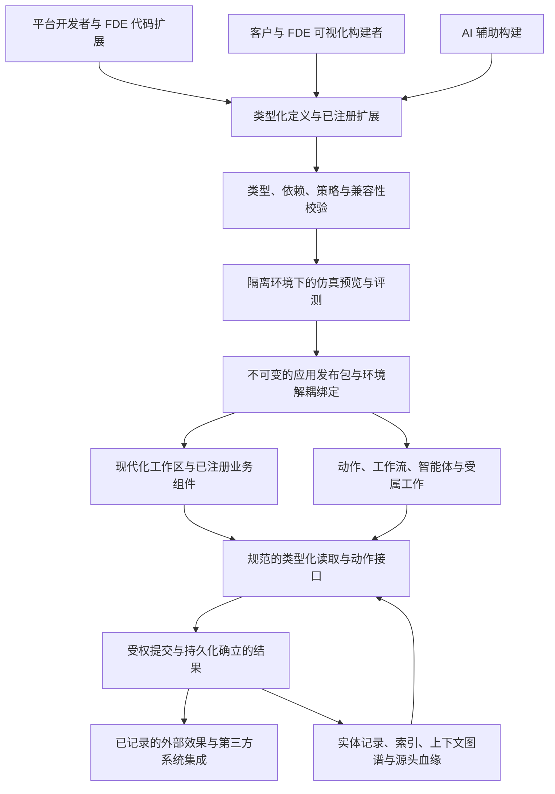

# 平台架构

业务平台的规范说明文档。具有持久成本的决策记录在 [ADR/](ADR/) 中；当前工作记录在 [WorkQueue.md](WorkQueue.md)；负责人的意图记录在 [Intent.md](Intent.md)。当本文档与代码不一致时，代码是既成事实，本文档陈述目标——将差距记录在工作队列中。

请与 [Intent.md](Intent.md) 一同阅读本文档。**§10 是未来一年的最高层级设计**，已于 2026-09-27 通过 [ADR-0031](ADR/0031-ai-application-platform.md) 接受。§2.4 归属已实现的能力地图；§2.9 跟踪未完成的 ADR 承诺；§10.2 对照产品目标解读审计出的差距；§10.3–10.6 定义目标及其验收标准。仅 WorkQueue.md 拥有任务状态。ADR 中早期的编号阶段属于历史；新的年度四阶段 W1–W4 不对其重新编号。

## 1. 目标

主线：**构建、编排、运行和演进业务软件**。应用定义各自的对象、关系、规则和动作，并贡献 UI 与运行时工作；软件由它们编排而成；当产品、流程、结构或业务本身发生变化时，能力得以添加、修改、替换或淘汰，而数据、历史、权限和正在进行的工作保持连续。内核概念和共享能力凭借它们对该主线的贡献而确立其地位。

多租户**业务平台，具备服务端与边缘/客户端运行时**。它支持多用户组织级应用（其中服务端为权威），以及支持离线工作的边缘客户端。**目标应用是 CRM、MES 和 ERP**（Intent.md）：这是它必须首先承载的业务软件，通过协议相遇。PMS、HCM 和 CSM 是参考应用。它们全部用于演练和证明平台能力；没有任何一个应用是平台的真理来源。

平台并不固化组织或应用当下的形态。它提供应用走向其*下一形态*所需的能力——新产品、新流程、新结构、新运营模型，乃至不同的主营业务——而无需重写底座。业务领域注定会发生重大变化；唯有当发现真正缺失的跨领域通用能力时，内核才应变更。

下一阶段将其打造为**面向 FDE 交付与客户自主构建的 AI 业务应用平台**：由统一的类型化模型支撑的受管对象、页面、工作流与 AI 构建器，辅以用于行业规则的代码扩展。目标是完整的应用生命周期（§10），同时内核保持不含领域词汇。

## 2. 产品模型

**当前实现**。本节描述 2026-09-27 审计时的代码现状，包括其局限性。特别是，代码编排的应用和多数旧入口的输入重放（input replay）仍是当前实现；受限提交与受属工作已有已入账结果的纯应用路径，但覆盖全部入口的基于结果的恢复仍是 §10 与 ADR-0038 的未完成目标。

### 2.1 分层

| 层级 | 承载内容 | 所在位置 | 变更时机 |
|---|---|---|---|
| **内核 (Kernel)** | 语言中立契约 K1–K9：身份标识、事实、决策、权威归属、租户隔离、模式版本、连接器、工作所有权（§4） | `contract/`（规范、测试向量、Go） | 内核假说被修订时（规范与测试向量先行） |
| **宿主运行时 (Host runtime)** | 编排、路由、日志与重放、快照、记录存储、受属工作、效果分发、模型调用；实现 `platform.Runtime` | `platformserver` | 平台扩展机制时 |
| **应用 API (App API)** | 应用所见表面：`Member`、`Caller`、`Manifest`、各项声明（实体、生命周期、动作、读取、工作流、智能体、作业、设置、效果类别）及 `Ledger`。应用仅通过 `Runtime` 访问宿主 | `platformserver/platform`；UI 层为 `@platform/app` | 应用需要宿主已具备的能力时 |
| **平台级应用 (Platform apps)** | 作为应用运行的跨行业通用能力：`platform`（控制台）、`org`、`relations`、`work`、`flow`、`ai`、`agent`、`knowledge` | `platformserver`（§9 风险 6） | 跨行业需求在第二个应用中出现时 |
| **协议 (Protocols)** | 应用提供和消费的版本化接口，附带一致性测试 | `protocols/` | 出现第二个提供方或消费方时 |
| **交付应用 (Apps)** | 某个行业或职能的规则、实体、工作流、智能体及 UI | `apps/`、`web/packages/*` | 其业务发生变化时 |

今天操作员配置数值（设置、绑定、端点、启用的模型）；结构性定义由代码表达。ADR-0031 将其扩展为类型化的客户定义模型、页面和规则（§6）。依赖项仅向下单向指向；内核不含领域词汇；宿主和平台级应用不感知具体应用。模型是一项工具，而非必须强行塞入每个文件的分类法：当实践表明边界有误时，通过 ADR 变更模型。必须成立的性质是：**当下层能力不随某个领域的演进而变更**。

归属裁决问题：在不同的行业中它是否仍然成立？在同一行业内转型后是否依然成立？它是“必须如此”还是“若干实现方式之一”？谁有权编写它、谁有权发布它、哪项不变式约束着它、以及哪项既有能力负责执行它？

### 2.2 整体协作方式

```text
 编排      解决方案 (Go，每个宿主一个) ─▶ 租户 ─▶ 各应用，每个为一个 Manifest：
             实体类型 · 生命周期 · 动作 · 读取 · 工作流 · 智能体 · 作业 · 设置 · 效果类别
             应用仅通过协议相遇（提供方 ◀─ 消费方），绝不直接相识

 写入      调用者：人员 · 服务账户 · 智能体 · 连接器 · MCP 或 A2A 客户端
             │ 提交 (submission，在目标上的动作) 或输入 (input，连接器页面、应答、模型步骤)
             ▼
           接收：认证 ─▶ 目录与角色 ─▶ 策略 (K6) ─▶ 需审批？（由 `work` 暂留）
             ─▶ 应用规则与决策 (K4)、事实 (K2, K3)、内存记录/意图
             ─▶ 记入日志被接受的输入 ─▶ 返回结果

 工作      记录/事件/意图 ─▶ 工作流 · 智能体的等待 · 订阅方
                          └─▶ 效果分发（Webhook、邮件、A2A；已声明的不可逆智能体效果被暂留）
                          └─▶ 通知 · 任务 · 时间线链接

 读取      记录 ─▶ 通用读取 · 聚合 · 上下文图谱 · 搜索 · 仪表盘
           派生的、可重建的状态：投影（PostgreSQL） · 知识段落与向量 · 快照

 人员      成员在每个应用中拥有一个角色；带有日期的组织结构中的单元限定其视野和审批者
 智能体    已声明的主体；每次运行的步骤、草稿、引用与人员反馈信号均被保留；
           评估以空跑形式重新执行已标记信号的运行；记忆是人员保留或遗忘的记录
```

写入流展示了大多数入口仍使用的直接提交顺序：`Tenant.Submit` 调用应用，其账本在内存中应用，随后将接受的输入记入日志。生产环境中日志追加失败会终止进程。ADR-0038 的受限例外包括已选择的生成动作、构建器发布、审批和多记录决定，以及部分受属工作：宿主私有暂存这些决定与意图，原子追加已接受结果后才应用其映像；新结果恢复不调用当前业务决策。其他入口仍在暂存边界外；§10.3 D 定义的是尚未完全实现的目标提交边界。

这些概念归入五个平面。每个平面拥有一个所有者。

| 平面 | 概念 | 所有者 |
|---|---|---|
| 编排 (Composition) | 解决方案、租户、应用、清单、协议、绑定、设置 | 代码（解决方案、应用）；绑定与设置属于控制台决策 |
| 真理 (Truth) | 提交、输入、决策、事实、日志分录、效果结果、用量 | 对目标数据类别拥有权威的应用（K5）；宿主记入日志 |
| 读取 (Reads) | 记录、历史、聚合、上下文、搜索、投影、段落、快照 | 宿主，从真理中派生 |
| 人员与工作 (People and work) | 成员、角色、单元、结构、审批请求、任务、通知、已存视图 | `platform`、`org`、`work` |
| 智能体 (Agents) | 智能体、运行、步骤、草稿、信号、评估、记忆、文档、对话抄录 | `agent`、`knowledge`、`ai` |

### 2.3 数据归宿

| 类别 | 包含内容 | 存储位置 | 重建方式 | 丢失成本 |
|---|---|---|---|---|
| **真理 (Truth)** | 每项被接受的顶级输入：提交、连接器页面、分发与作业结果、智能体步骤及其知识搜索结果、附带应答的效果结果、模型用量、启动的工作流版本 | PostgreSQL 日志，每个租户一个，故障即停 (fail-stop) | — | 一切；备份保存该日志 |
| **派生状态 (Derived state)** | 记录及其历史、内核日志、受属工作与队列、效果意图、通知、工作流实例、智能体运行、记忆 | 内存；快照 (ADR-0019) | 已支持的结果族直接应用已保存映像；其他旧入口仍通过相同代码重放 | 启动时间 |
| **派生索引 (Derived indexes)** | 投影 `tenant_<id>`（每个实体类型的类型化数据表）、按段落哈希索引的知识向量 | 位于日志旁的 PostgreSQL 中 | 启动时重建；向量作为受属工作重新生成嵌入 | 重建时间；嵌入模型成本 |
| **外部且有保留期 (Outside, with retention)** | 模型调用的完整对话抄录（默认保留 30 天）；密钥（按名称，位于部署环境中） | PostgreSQL 数据表；环境变量 | 不重建 | 旧模型调用的完整文本 |
| **易失性状态 (Volatile)** | 心跳、连接器上次拒绝原因、端点健康状态；个人读取审计（最近 5,000 条条目）。**注意**：受支持的 `work-result` 已保存作业 generation 与下次执行时间，旧作业路径仍可能不记无变化的运行 | 内存 | 受限工作从已接受结果恢复；其余 — | 运维诊断和未记入日志的旧式作业状态 |
| **代码 (Code)** | 声明：实体类型、动作、生命周期、工作流、智能体、协议、指令 | Go 和 TypeScript，随二进制文件版本化 | — | — |

**原始遥测数据绝不进入日志**（2026-09-26）：机器速率的采样在边缘（网关）按时间窗口聚合成具有明确含义的观察值——状态批次、停机、计数——仅将这些记入日志，以使重放体积保持较小；用于原始信号的流处理平面属于后续阶段门禁。应用所裁决的业务状态是**记录** (ADR-0016)。来自外部的观察与断言是**事实** (K2)，决策将其引用为证据；工厂将机器状态、ERP 断言与派生的停机时间保留为事实。从其他数值计算出的数值是派生值，绝不作为真理存储。

### 2.4 能力地图（当前已存在的能力）

仅列能力、归属与入口；实现细节/证据/限制由对应 ADR 的 As built 维护，不在此复制检查历史。内核语义见 §4。

| 能力 | 归属 | 当前摘要 | 入口 |
|---|---|---|---|
| 身份标识与重定向 (K1) | 内核 | 稳定不透明 ID，合并/拆分重定向。 | kernel.Identity |
| 事实、观察与断言 (K2, K3) | 内核 | 来源、时间及观察/断言，决策显式引用证据。 | kernel.FactLog |
| 决策 (K4) | 内核 | 幂等提交、修订与因果变更记录。 | kernel.ChangeLog |
| K4 幂等性有界证明 (ADR-0041) | 内核研发工具 | 选定 K4 模型/定理与向量/Go 测试映射，明示未证明前提。 | contract/lean, scripts/verify.sh formal；[ADR-0041](ADR/0041-first-kernel-proof.md) |
| 权威归属与发件箱 (K5) | 内核 | 按数据类别归属权威，Go/Rust/TS 发件箱。 | kernel.Authorities |
| 租户隔离与策略 (K6) | 内核 | 接收顺序与每次决策的策略边界。 | kernel.Receiver |
| 模式版本演进 (K7) | 内核 | 版本载荷与动态 Schema 注册；更广演进仍需验证。 | kernel.SchemaRegistry, Learn |
| 连接器 (K8) | 内核 | 推送/轮询共用描述符、游标和健康。 | kernel.Connectors |
| 工作所有权 (K9) | 内核 | 世代与过期结果作废；检查点未使用。 | kernel.Works |
| 编排与路由 | 宿主运行时 | 清单校验及动作/读取/输入路由。 | NewTenant, checkManifest |
| 日志、重放与快照 | 宿主运行时 | 每租户保序日志/快照；受限结果纯应用恢复与租户隔离，旧输入仍重判。 | Journal, Tenant.Replay |
| 记录存储与通用读取 (ADR-0016) | 应用 API、宿主运行时 | 实体、作用域/字段授权、搜索分页、历史/关联、标准动作与表单；提交字段整体替换。 | platform.Entity, Caller.Put；[ADR-0016](ADR/0016-application-model.md) |
| 编号序列 (ADR-0024) | 应用 API、宿主运行时 | 已接受决定分配年度连续编号，拒绝不占号。 | platform.Sequence, Caller.Next；[ADR-0024](ADR/0024-erp.md) |
| 聚合与投影 (ADR-0019) | 宿主运行时 | 权限内分组度量及每租户只读 PostgreSQL 投影。 | /v1/aggregates, -project；[ADR-0019](ADR/0019-read-models-analytics-snapshots.md) |
| 动作目录 | 应用 API、宿主运行时 | 统一声明与按调用者角色发现动作。 | platform.Action, /v1/actions |
| 已安装定义与有界页面 | 应用 API、宿主运行时、`@platform/app`、`@platform/ui` | 限定引用、依赖校验、授权目录、具类型记录选择/父来源绑定及只读样本预览。 | platform.AssetRef, Manifest.Pages；[ADR-0032](ADR/0032-shared-application-definitions.md)、[ADR-0040](ADR/0040-semantic-builder-and-relationship-model.md) |
| 发布候选审查与活跃闭包（ADR-0039 20a–20b） | 应用 API、平台应用 `build`、宿主、`@pkg/build` | 规范候选、差异/依赖校验、持久字节、可续接发布工作台与活跃/运行一致性；有界对象/页面/应用闭包提交后一起安装并激活。 | platform.Candidate, Build.DraftReleaseAssets；[ADR-0039](ADR/0039-minimal-definition-release.md) |
| 具名查询 (ADR-0040 21c) | 应用 API、宿主运行时、共享页面与智能体工具 | 成员、页面和 AI 共用受权纯查询；候选包含查询依赖。 | platform.NamedQuery, Tenant.RunQuery；[ADR-0040](ADR/0040-semantic-builder-and-relationship-model.md) |
| 应用工坊总览 | 平台应用 `build`、`@pkg/build` | 能力卡片与资产图、搜索/状态、编辑器入口、选中资产测试/发布和返回上下文。 | `StudioOverview`；[ADR-0040](ADR/0040-semantic-builder-and-relationship-model.md) |
| 租户原生流程编写 | 平台应用 `build`、`flow`、`work`、宿主 | 共享 Block IDE、类型化输入/绑定、分支/集合/并发、原生调用、固定测试及只读运行；原 Flow/Work 与精确版本绑定。 | build.Process/TestPlan；[ADR-0044](ADR/0044-capability-fabric.md) |
| 固定数据候选测试 (ADR-0040 21d) | 宿主、平台应用 `build`、共享 UI | 空内存租户的固定样本/预期/恢复核对；非物理沙箱。 | build.TestPlan, Tenant.SimulateCandidate；[ADR-0040](ADR/0040-semantic-builder-and-relationship-model.md) |
| 租户交付的应用 (ADR-0036) | 平台应用 `build`、宿主运行时、`web/apps/workspace` | 已发布页面及共享资源编组为应用，应用根闭合对象/流程/计算依赖并沿原候选激活；按成员可见页面进入启动器，不增加权限。 | platform.Application, Tenant.InstallApplication；[ADR-0036](ADR/0036-an-application-a-tenant-hands-to-its-people.md) |
| 由组件布局的页面 (ADR-0035 / 0040) | `@platform/app`、`@platform/ui`、平台应用 `build`、宿主运行时 | 按对象的选择/过滤、关联列表与详情/动作绑定、只读实时画布及原保存/发布校验。 | platform.Section, Tenant.checkSections；[ADR-0040](ADR/0040-semantic-builder-and-relationship-model.md) |
| 租户编排的页面 (ADR-0034 15b) | 平台应用 `build`、宿主运行时、`@pkg/build`、`@platform/ui` | Build 在已安装对象上编排并发布页面，草稿不改已发布镜像。 | build.page, Tenant.InstallPage；[ADR-0034](ADR/0034-tenant-defined-objects.md) |
| 租户定义的对象 (ADR-0034) | 平台应用 `build`、宿主运行时、`@pkg/build` | Build 强类型字段、动态注册、标准页面/动作及受控演进。 | apps/build, Tenant.Install；[ADR-0034](ADR/0034-tenant-defined-objects.md) |
| 租户定义的状态与动作 (ADR-0037 18a, ADR-0040 21a) | 平台应用 `build`、`@pkg/build`、账本生命周期 | 状态/动作、输入/条件/赋值编译为原生生命周期；条件可比较已声明的关联路径与类型兼容字段，审批放行重查申请人权限及当前来源。 | build.State, build.Action；[ADR-0037](ADR/0037-actions-and-access-a-tenant-defines.md), [ADR-0040](ADR/0040-semantic-builder-and-relationship-model.md) |
| 租户定义的访问控制 (ADR-0037 18b) | 平台应用 `build`、宿主运行时（`Scope`、`Standard`、账本） | 对象行范围、动词/动作角色与字段权限编译为统一读取和动作门禁。 | build.Access, checkAccess；[ADR-0037](ADR/0037-actions-and-access-a-tenant-defines.md) |
| 租户动作的审批 (ADR-0037 18c) | 平台应用 `build` 编译定义；平台应用 `work` 拥有请求、任务与决策 | 动作等待审批，沿原生 Work 处理层级/驳回/恢复。 | build.ActionApproval, checkProcess；[ADR-0037](ADR/0037-actions-and-access-a-tenant-defines.md) |
| 读取与读取授权 | 宿主运行时 | 成员读取统一收窄视野/字段，应用内读取走规范 Caller。 | Tenant.Read, Tenant.admits |
| 派生内容声明其来源 (ADR-0033, #130) | 应用 API、宿主运行时 | 显式来源声明，宿主读时重查并隐去无权派生字段。 | platform.Derivation, Entity.Derived；[ADR-0033](ADR/0033-derived-content-declares-its-sources.md) |
| 应用包账本 (Package ledger) | 应用 API | 应用各自账本，跨包因果边界保持显式。 | platform.Ledger |
| 受属工作：分发与作业 (ADR-0013, ADR-0027) | 宿主运行时 | 持久受属工作、事件/定时、重试/配额及世代校验。 | Manifest.Jobs, Tenant.Work；[ADR-0013](ADR/0013-platform-operations.md), [ADR-0027](ADR/0027-one-runtime-for-durable-work.md) |
| 托管连接器 | 宿主运行时 | 外部输入由声明与动作接入，支持轮询/推送及游标。 | Tenant.Connect, Caller.Deliver |
| 外部效果 (ADR-0014, 0022) | 宿主运行时 | 意图、尝试/回执、重试/熔断及受支持不可逆 AI 效果审批。 | Tenant.Dispatch, Caller.Emit；[ADR-0014](ADR/0014-outbound-effects.md) |
| 部署 | 宿主运行时 | 宿主标志、健康、遥测与生产路径；保证按实际边界声明。 | Deployment, Deployment.Seed |
| 身份提供商 | 宿主运行时 | OIDC 主体与租户成员映射。 | OIDC |
| 多语言支持 (ADR-0023) | 应用 API、宿主运行时、Web | 英文键与简体中文，API 元数据/拒绝及 UI 共用语言体系。 | platform.Languages, languages.go；[ADR-0023](ADR/0023-meaning-languages-api-contract.md) |
| 含义与词汇表 (ADR-0023) | 应用 API、平台应用 `knowledge` | 实体/字段语义、同义词和租户术语补充。 | Entity.Description, help；[ADR-0023](ADR/0023-meaning-languages-api-contract.md) |
| 宿主 API 契约 (ADR-0023) | 宿主运行时 | 宿主声明生成 TypeScript 类型，契约漂移检查。 | api.go, /v1/openapi.json；[ADR-0023](ADR/0023-meaning-languages-api-contract.md) |
| 开发者工具套件 (ADR-0023) | 应用 API、宿主运行时 | 应用脚手架、API 发现与既有 MCP 工具；MCP 鉴权/资源仍有余项。 | docs/Apps.md, cmd/new-app；[ADR-0023](ADR/0023-meaning-languages-api-contract.md) |
| 智能体对外门户 | 宿主运行时 | 受权 MCP/A2A 接入；非完整 AI 构建 SDK。 | POST /mcp, /a2a/<tenant>/<agent> |
| 控制台 | 平台应用 `platform` | 成员、角色和运行配置的宿主治理入口。 | console.go |
| 组织架构 (ADR-0012) | 平台应用 `org` | 随时间演进的单元、架构与成员归属。 | capabilities/server/apps/org, Caller.Units；[ADR-0012](ADR/0012-organization-model.md) |
| 关联、时间线、评论与关注者 | 平台应用 `relations` | 规范链接、记录动态、评论/提及/关注。 | capabilities/server/apps/relations, Caller.Link |
| 字段安全性与个人数据 (ADR-0028) | 应用 API、宿主运行时 | 行/字段/来源权限贯穿读取与派生；个人读取审计仍为易失状态。 | FieldInfo.Read, Write；[ADR-0028](ADR/0028-the-application-half.md) |
| 文件管理 (ADR-0028) | 平台应用 `files`、宿主 | 记录授权关联的 S3 字节、摘要、文本知识摄入与孤立上传清理。 | capabilities/server/apps/files, capabilities/server/filestore.go；[ADR-0028](ADR/0028-the-application-half.md) |
| 导入与导出 (ADR-0028) | 宿主运行时、`@platform/app` | CSV 动作化导入/预览/去重及受权导出。 | POST /v1/import/{type}, GET /v1/export/{type}；[ADR-0028](ADR/0028-the-application-half.md) |
| 图谱呈现 (#122, ADR-0040 D4 第一批次) | `@platform/ui`、`build` 中的语义适配器 | 共享 Graph/NodeCanvas 交互与语义适配，不新增图执行器或持久布局。 | CanvasFrame, Graph；[ADR-0040](ADR/0040-semantic-builder-and-relationship-model.md) |
| 通知系统 | 宿主、`platform` 中的读取状态 | 成员/角色通知、去重、邮件与任务关联已读。 | Caller.Notify |
| 生命周期、审批、任务、收件箱 (ADR-0017) | 应用 API、平台应用 `work` | 状态迁移、多级/代办审批、任务/升级与收件箱。 | platform.Lifecycle, platform.Approval；[ADR-0017](ADR/0017-lifecycles-approvals-tasks.md) |
| 工作流 | 应用 API、平台应用 `flow` | 原生动作/等待/人工/并行/子流程/AI/计算、持久 scope/frame、超时/补偿、取消与追踪。 | platform.Flow；[ADR-0044](ADR/0044-capability-fabric.md) |
| AI 提供商与模型 (ADR-0015, ADR-0029) | 平台应用 `ai` | 多供应商、受权模型、预算/熔断、SSE 及接受时模型绑定。 | capabilities/server/apps/ai/ai.go, aicall.go；[ADR-0015](ADR/0015-ai-providers.md), [ADR-0029](ADR/0029-ai-control-plane.md) |
| 类型化 AI 函数 (ADR-0043 24b–24c 部分实现) | 应用 API、宿主 AI 模型效果路径 | 强类型建议、Build 版本/独立结果、页面/Flow 复用与评测门禁；真实模型质量未验收。 | platform.AIFunction, Caller.RequestFunction；[ADR-0043](ADR/0043-typed-ai-functions.md) |
| 能力装配与代码计算 | 应用 API、宿主、Build、FileStore、独立 Go worker | 原生目录投影/共同调用，Go/TinyGo 隔离编译、候选制品、wazero、页面/Flow 复用；原接受结果及来源权限。 | platform.Operation/ValueSchema、build.code；[ADR-0044 §12](ADR/0044-capability-fabric.md#12-实际构建边界) |
| 智能体 (ADR-0021, 0022) | 应用 API、平台应用 `agent` | 受管主体、交集权限、工具、草稿确认、追踪/记忆/评估和暂停。 | platform.Agent, agent*.go；[ADR-0021](ADR/0021-agents.md) |
| 知识库 (ADR-0022) | 平台应用 `knowledge` | 权限内文本/向量检索、增量索引与引用来源；规模证据归 ADR-0033。 | knowledge.go, index.postings；[ADR-0022](ADR/0022-knowledge-memory-a2a.md) |
| 协议 (ADR-0011) | 协议 | 版本化跨应用动作/读取/应答；住宿暂留与生产确认。 | platform.Protocol, Caller.Probe；[ADR-0011](ADR/0011-apps-interoperate-through-protocols.md) |
| UI 库 | Web | 共享表格/表单/详情/工作区/画布；记录工作区集中任务、审批、流程，窄屏属性单列。 | @platform/ui |
| 应用设计台融合 (ADR-0046，F1/F2/F3a–F3m与F4a/F4b1–F4b2实现) | 应用 API、Build、共享 UI | V2嵌套页面树、稳定组件实例、受控区域权重/宽高/滚动与间距、组件暂存/作用域保留、主页面六类容器与完整Overlay根复制、父子Loop/浮层所有权重写、独立打开入口与绑定隔离、共享命令菜单及原冻结交付、版本化注册及端口/事件描述、Table/Button/Pivot/Chart专属检查器与按需加载、三栏编辑与历史；原生/租户模型目录、字段支持的引用图及属性/关系→页面绑定；页面级标量与记录/筛选/查询窗口变量、Tabs/Flow/Toolbar、显示/启用条件、独立Modal/Drawer与声明式按钮事件，有界Loop/item状态及原动作绑定、虚拟化与读取合并；关闭清理局部输入并返回焦点，成员/定义作用域隔离与旧响应拦截，类型化页面call/return与Overlay标量局部状态/Input绑定沿原保存/候选/激活路径，隐藏视图暂停全局浮层而保留内容身份。应用级标量声明、页面共享端口与显式实例隔离，原应用候选冻结声明，预览/成员/版本变化及关闭清理已接通；独立页面查询计划与参数编辑、精确具名查询绑定、无Table的Loop窗口读取及共享表格的受控窗口/搜索/分页/排序、所属选择清理已实现；租户复用查询资产的编辑/保留版本/候选冻结与页面精确绑定已接通，后续发布不替换旧页面版本；Overlay拥有的查询、record/object-set资源及同根表格/Loop消费、局部选择与关闭清理已接通；应用拥有的有界查询、页面只读共享窗口和对象要求、同实例读取/视图共享与实例退役清理已接通；Overlay筛选资源、同根原列表筛选与关闭清理已接通，页面和其他浮层独立，计划条件保留；应用记录资源与Table显式共享选择、同实例两页原详情/动作、选择来源和生命周期清理已接通；应用筛选资源、显式Filter/Table/Chart/Metric端口、共享与局部条件合并及字段裁剪已接通，计划窗口保持原条件；精确数值变量、原Input与查询参数、无效草稿拒绝及宿主精确条件比较已接通；授权记录字段的只读标量派生、页面/应用/item消费及候选字段绑定已接通；完整集合组合的宿主查询、设计器显式来源图、Table/Loop及应用共享消费与候选绑定已接通，固定版本与成员裁剪保持；原完整集合聚合及Metric/Chart端口、读取作用域/旧图清理已接通；两层父子Loop、类型化父引用驱动精确子查询、父路径局部状态隔离及展开预算已接通；完整集合count只读精确变量、派生交互条件及各原作用域读取/清理已接通；LinkType资产、原候选/版本族、关系编辑与语义图投影、页面精确版本/类型化起点绑定及原受权遍历/完整聚合已接通；Pivot完整集合两轴分析、有界分组/矩阵与过期读取清理，以及日期分桶趋势与可比非负份额饼图已接通；共享标量属性资产、字段精确来源与原候选/恢复API、共享属性编辑/版本选择、本体消费者投影及两对象复用旅程已接通；Logic租户查询精确版本端口、原流程候选依赖及受权运行已接通；记录时间轴的授权窗口、时间/资源映射、固定交付及原选择工作已接通；生命周期看板窗口、卡片/摘要、原动作移动及冻结交付已接通；就地原动作参数表单、版本冲突保留输入、审批及作用域清理已接通；原共享表格的显式标准编辑端口、字段权限投影、按行暂存/原动作提交、失败及冲突输入保留与冻结交付已接通；表格有界记录多选引用输出、独立活动记录槽、原记录授权确认及生产者/窗口/浮层清理已接通；Table有限选择事件、默认onSelect固定状态映射及原详情显示/局部生命周期已接通；有界表格列标题/宽度/字段格式与搜索入口声明、原字段顺序、权限裁剪及冻结交付已接通；详情空值策略、有界响应列布局、原字段/记录读取及冻结交付已接通；原生记录工作区四标签、原关联/历史/动作、局部状态清理及ObjectView有限导入已接通；有界按钮组的稳定控件、逐项有限状态事件、成员入口裁剪及原冻结交付已接通；独立关联组件的显式反向引用分组、原受权窗口/导航、成员分组裁剪与冻结依赖已接通；原生命周期状态跟踪的字段/阶段声明、当前项高亮、权限裁剪及冻结状态绑定已接通；真实指标卡的原全集聚合/显式条件、单位/格式/色调、空均值处理及冻结交付已接通；纯文本语义标题及同查询完整集合标题、原计数预算/权限和冻结绑定已接通；原查询窗口的记录画廊/列表、独立授权选择、原记录导航与字段/布局冻结已接通；源ChartXY分组平均柱图的原字段/完整集合聚合映射、权限/作用域清理与冻结交付已接通；逐记录XY窗口的原ID/顺序、重复标签独立点、有界呈现与原字段/排序冻结已接通；原全集count分布、饼图/环形/数值占比及ChartPie显式映射和冻结交付已接通；PivotTable双轴count、原全集矩阵/零交叉/合计及原轴冻结已接通；源KanbanBoard的原生命周期/卡片/生产者及固定目标移动映射、原条件/版本表单、可选字段/动作权限裁剪与冻结交付已接通；垂直事件列表的原业务时间/标题/严重度映射、30项有界顺序窗口、字段裁剪与原冻结交付已接通；月日记录日历的原业务日期/标题/初始月份、civil date/UTC规则、窗口日格计数、独立原记录选择及冻结交付已接通；固定区间甘特图的原混合日期/标题/状态色调、20项原窗口顺序、UTC范围与区间裁剪及冻结交付已接通；精确进度的分子/分母decimal端口、原全集count复用、文本到decimal有限派生/输入联动、无效/超额提示与冻结交付已接通；原完整数值聚合的number标量、query/measure统一读取与预算、仪表的最大值/阈值/标签/后缀、空值/字段权限及冻结交付已接通；同答复五项汇总的原字段/全集查询、statistics只读端口、一次请求共享、空值/权限裁剪与冻结交付已接通；原宿主Top-N排名的数值/ID排序、固定视图与独立记录生产者、具名排序兼容、权限/选择清理及冻结交付已接通；精确范围滑块的原双文本状态/asDecimal查询联动、步长/单位/空值保留、原子清空与冻结交付已接通；原布尔开关的共享状态/显示与启用条件/查询联动、严格类型、标签与冻结交付已接通；复选框的同布尔端口呈现、原生选择/标签点击、形态冻结及旧Switch兼容已接通；静态单选的同字符串端口/原查询联动、下拉/单选/分段三种形态、空与未匹配值保留、选项/形态冻结及作用域清理已接通；多选的原string-set端口/IN条件与共享Toggles、逐项差分/选择预算/未匹配项保留、集合冻结及作用域清理已接通；日期输入的原string草稿/asDate条件、真实公历/空与无效日期保留、无时区转换与原冻结交付已接通；外包Module页面JSON的三十五类组件有限配置映射、92类型迁移归属清单、原文/报告保留、定位拒绝、原子历史及原生冻结交付已接通；类型化多选/分面完整计数、可选空条件和数字文本查询转换已接通；引用关系反向唯一性及活动引用归档保护、原写入拒绝与冻结/内存恢复已接通；更多端口及92组件迁移仍待实施。 | platform/pageui、PageDocument、EditorWorkbench、app/semantic；[ADR-0046 §14](ADR/0046-application-studio-fusion.md#14-代价审阅点与当前实现边界) |
| Platform Catalog (ADR-0045) | UI/app/build owner、Web 目录 | 六层复用发现、真实示例、开发/构建视角与有界查询；Studio 模板沿原草稿创建，租户能力沿原作用域读取。 | web/apps/catalog、scripts/catalog.mjs；[ADR-0045 §11](ADR/0045-platform-catalog.md#11-当前实现边界) |
| 工作区与 UI 应用 API (ADR-0018) | Web | 统一登录/应用导航、记录与收件箱返回、编辑标签上下文；CRM/MES 建议复用记录与动作。 | @platform/app, web/apps/workspace；[ADR-0018](ADR/0018-one-workspace.md) |
| 边缘客户端与登录 | Web | HTTP 边缘客户端、发件箱、PKCE/OIDC 与可读拒绝。 | @platform/kernel |
| 设置中心 | Web | 系统治理与运行设置界面。 | @pkg/platform |
| 应用 UI 包 | Web | 业务视图组合共享 UI/API，跨记录共性能力归平台。 | @pkg/<id>, crm |

### 2.5 术语与归属权

容易混淆的概念：
- **应用 (App)** 是一项能力单元：一个 Go 清单 (manifest)，通常附带一个 UI 包。**平台级应用 (Platform apps)** 即 §2.1 中列出的 8 个应用。**参考应用 (Reference apps)** 位于 `apps/` 目录下（在 2026-09-26 内核验证阶段前曾被称为 `slices/`）。ADR-0008 和 ADR-0009 中的“应用包 (Package)”均指交付应用。
- **解决方案 (Solution)** 是针对某个特定宿主的一组应用编排，按其行业命名：`solutions/hospitality`、`solutions/manufacturing`；独立应用可在其开发宿主 `cmd/<id>-server` 上单独运行 (ADR-0025)。
- **事件 (Event)** 是已接受的决策在外部观察者眼中的形态。业务领域自身的术语“事件”（例如设备停机事件）不是此概念。

| 术语 | 含义 | 归属方 | 持久化形态 |
|---|---|---|---|
| **动作 (Action)** | 应用提供的声明式操作：模式、目标类型、角色、说明 | 应用的清单 (`Catalog`) | 代码 |
| **提交 (Submission)** | 在实体上执行某动作的请求 | 调用者 | — |
| **决策 (Decision)** | 被接受的提交：在对目标数据类别拥有权威的应用账本中的 K4 变更记录；受限结果路径上的拒绝另有不产生变更的持久答复 | 该应用的 `Ledger`；拒绝答复由宿主保存 | 受限动作、审批、嵌套及关系链接为 `accepted-result`；该路径的拒绝也使用同一日志类别但不应用记录；其他路径仍为 `submission` |
| **输入 (Input)** | 非提交类的顶级输入条目：连接器的批次或页面 | 声明该输入的应用 | 日志分录 `<input name>`；心跳不记入日志 |
| **事实 (Fact)** | 来源处真实发生的事情：**观察 (observation)**（亲眼目睹，如机器状态或 ERP 应答）或**断言 (claim)**（由来源声称，如计划工单） | 应用的事实日志 (K2) | 从记录该事实的输入或结果中重建 |
| **实体类型 (Entity type)** | 应用声明的 Go 结构体：字段、视野、生命周期、种子数据 | 应用 | 代码 |
| **记录 (Record)** | 单个实体的当前字段、版本与历史 | 由应用账本裁决，由宿主保存 | 从决策中重建 |
| **固定测试计划 (Fixed test plan)** | 对象草稿引用、固定成员/时间/动作输入及接受或拒绝预期；不存测试状态或对后续草稿的通过承诺 | 平台应用 `build` | `build.testplan` 标准记录，经已有接受结果与快照恢复 |
| **类型化 AI 函数 (Typed AI function)** | 具名、受权、有预算的单记录推断声明；输出是类型化建议，不授予业务动作权限 | 应用 API 定义声明，代码应用拥有函数，宿主 AI 路径执行 | 代码或 Build 发布版本；完整声明与接受时输入/来源/模型绑定保存在模型效果意图，回答/Reply/用量保存在同一已接受结果 |
| **函数调用记录 (Function call record)** | 独立保存已发布函数的请求主体、源记录、阶段、严格校验后的建议或拒绝和接受时绑定；不修改源业务记录 | 平台应用 `build` | `build.function-call` 标准记录及已接受模型效果/Reply；`Entity.Derived` 按当前来源视野收窄结果 |
| **生命周期 (Lifecycle)** | 实体类型上的状态与迁移；每次迁移为一个动作 | 应用 | 代码 |
| **节点目录 / 画布 (Node catalog / canvas)** | 从 owner 能力投影的节点与类型化端口，节点与边是视图/适配器 | `@platform/ui` 共用 BlockCanvas；资产 owner 拥有定义/校验/执行 | Process 保存布局元数据；布局不进入语义摘要、不决定执行次序 |
| **审批请求 (Approval request)** | 暂留的提交，直至各级审批人达成一致；最后一级审批通过后以申请人身份执行之 | `work` | 决策 |
| **任务 (Task)** | 分配给成员、角色或单元的工作，附带截止时间与回答操作 | `work`，由审批、工作流、智能体与应用开启 | 决策 |
| **事件 (Event)** | 提交后被接受的决策，以其动作模式或协议事件命名（`<protocol>#<event>`） | 宿主 | 从决策中重建 |
| **订阅 (Subscription)** | 应用对其自身决策或所消费协议事件声明的关注 | 应用的清单 | 代码 |
| **分发 (Delivery)** | 为单个订阅者排队的单个事件，作为受属工作尝试执行，按订阅者保序 | 宿主（分发类型的 `Task`） | 已选择的 `AcceptedWorker` 保存 `work-result`；其他旧分发重放 `delivery` 输入 |
| **作业 (Job)** | 应用声明并以 `app:<id>` 身份运行的定时工作 | 由应用声明，由宿主运行 | 已选择的 `AcceptedWorker` 保存 `work-result`，包括无业务写入的 generation/到期时间；其余旧路径仅在有决定或通知时记录 `job` |
| **工作 (Work)** | 对分发或作业的 K9 所有权：所有者、世代、状态 | 宿主，通过 `kernel.Works` | 通过重放重建；作业计数器属于易失性数据 |
| **工作流 (Flow)** | 已声明的长时间运行流程；**实例 (instance)** 是带有标记点、撤销栈与追踪信息的记录 | 由应用声明，由 `flow` 执行 | 代码；实例属于决策 |
| **连接器 (Connector)** | 入站源：一个 K8 描述符，其 ID 即为其登录所代表的成员 | 由部署环境连接，由宿主持有，由 `platform` 开关控制 | 游标与开关状态可重建；心跳与最近拒绝属于易失性数据 |
| **端点 (Endpoint)** | 出站目的地：Webhook、邮件服务器或外部 A2A 智能体 | `platform` 决策，由宿主持有 | 决策 |
| **效果类别 (Effect kind)** | 应用声明其发出的出站消息 (`Manifest.Emits`) | 应用的清单 | 代码 |
| **效果 (Effect)** | 针对单个端点的单个意图，源于事件、`Caller.Emit`、模型请求或通知；其键即为其 ID。当智能体引发不可逆类别时暂留等待人工确认 | 宿主 | 受限接受结果保存意图；旧输入重新生成意图；审批与废弃属于决策；尝试结果仍为 `effect` |
| **结果应答 (Answer)** | 端点针对应用效果返回的内容；应用将其记录为一项观察 | 应用 (`Answerer`) | 日志分录 `effect` |
| **通知 (Notification)** | 发送给成员的消息，在输入发生当日解析 | 由应用创建 (`Caller.Notify`)，由宿主存储；已读状态属于 `platform` 决策 | 从其输入中重建 |
| **设置 (Setting)** | 应用声明的类型化配置值 | 由应用声明；数值由 `platform` 决策设定 | 决策 |
| **提供商 (Provider)**、**模型 (Model)** | 模型来源，以及为全员或 AI 用户启用的某个具体模型 | `ai` 决策 | 决策 |
| **用量 (Usage)** | 单次模型调用的计量读数：成员、模型、Token、成本、延迟、结果 | 宿主，由 `ai` 应用记账 | 日志分录 `usage` |
| **智能体 (Agent)** | 已声明的主体 `agent:<app>.<name>`：指令、工具、预算、防护栏、接管人 | 应用 | 代码；通过设置经由 A2A 对外发布 |
| **运行 (Run)** | 智能体的单个目标求解过程：附带推导理由的步骤、草稿、引用、已消耗预算、最终结果 | `agent` | 日志分录 `agent`，决策 `agent.run.*` |
| **反馈信号 (Signal)** | 人工对智能体工作的反馈：已确认、已修改、已驳回、已批准、已丢弃、已撤销 | `agent` | 决策 |
| **评估 (Evaluation)** | 使用候选模型对已有反馈信号的运行进行空跑复现，与人工接受的结果进行比对 | `agent` | 日志分录 `agent` |
| **记忆 (Memory)** | 智能体保留的关于某人或针对全部运行的简要事实；除非人工决定保留，否则会自动过期 | `agent` | 决策 |
| **文档 (Document)**、**段落 (Passage)** | 知识库文本及其切分出的片段；向量属于派生数据 | `knowledge` | 决策；向量由其派生 |
| **术语 (Term)** | 租户词汇表中的词汇：在当前租户的含义、同义词、所引用的声明；叠置于模型之上，绝不修改模型本身 | `knowledge` | 决策 |
| **对话抄录 (Transcript)** | 模型调用的完整请求与应答文本 | 宿主，位于日志之外 | 受保留期设置控制 |

归属权规则：宿主持有共享运行时状态；`platform` 应用裁决管理员所做的每一次变更，各个领域裁决各自的目标类型；应用仅裁决属于自身数据类别的内容，通过 `Caller` 访问平台，应用彼此之间仅通过协议交互。

### 2.6 外部效果：生命周期与重放

```text
  智能体 + 不可逆类别 ──▶ 暂留 (held) ──批准 (人工决策)──▶ 待处理 (pending)
决策或应用输入 ──发出 (emit)──▶ 待处理 (pending) ──尝试──▶ 已分发 (delivered)
                                   ▲    │            ▶ 已拒绝 (4xx 除 408/429 外；私网地址；非法协议)
                           重试    │    └─ 5xx、408、429、超时、网络错误 ─▶ 重试中 ──(12次尝试)──▶ 失败
                         (决策)    │                                                     │
                                   └────────────── 失败 / 已拒绝 ◀────────────────────────┘
  暂留、待处理或重试中 ──废弃 (决策)──▶ 已废弃      端点被移除 ─▶ 其未决效果全部废弃
```

1. **创建**。在输入内部：
   - `emit` 将订阅了某决策对应事件的端点转化为效果。ID 为 `<tenant>:<app>:<change id>:<endpoint>`。
   - `Caller.Emit` 将应用发出的已绑定类别效果转化为效果。ID 为 `<tenant>:<app>:<kind>:<key>:<endpoint>`。当类别为不可逆且调用者为 AI 智能体时，该效果被暂留，并通知管理员。智能体的 `emit:<kind>` 工具执行相同逻辑并等待应答。
   - `Caller.Notify` 将发送给具备邮箱地址的成员的通知转化为邮件，发送给承载该应用的每个邮件端点。ID 为 `<tenant>:notice:<notification>:<endpoint>`。

   效果本身没有独立的日志分录。它是引发它的输入的一部分，重放时会以相同的 ID 重新生成。
2. **尝试**。`Dispatch` 获取每个端点到期效果的队列头部（按端点保序；被暂留的效果在顺序之外等待），并在租户锁之外发送。
   - Webhook 按照 Standard Webhooks 规范签名，`webhook-id` 和 `Idempotency-Key` 均设为该效果的 ID。
   - 邮件通过 SMTP 发送（支持时采用 STARTTLS），以效果 ID 作为其 Message-ID。
   - A2A 消息是发送给端点对应智能体的 `SendMessage`；任务的最终结果即为应答。
   - 除非端点明确允许，否则在连接建立时拒绝私有网络地址。
   - 在日志重放期间绝不调用 Dispatch。
3. **结果**。在启用接受结果的宿主中，每次尝试以一条 `effect-result` 封套入账，原子保存效果状态、应用回调的受支持记录/子决策、通知/意图和模型请求的用量；旧宿主仍写入 `effect` 分录。封套记录执行结果（delivered、rejected 或 retry）、详细信息、所发送报文主体的摘要，对于应用效果还包括应答数据（JSON，最大 64 KiB）。重试会设定下次执行时间：从 5 秒指数退避倍增至 1 小时，附带源自 ID 的抖动；自上次手动重试以来尝试达到 12 次后，该效果标记为失败。
4. **结果应答**。对于应用发出的效果，一旦完结，宿主在私有视图中调用应用的 `Answer` 接口并传入结果；提交成功后仅从保存的结果应用回调观察与子决策。旧 `effect` 历史仍重新调用当时的应答代码，尚未获得相同保证。
5. **幂等性**。至少一次分发：尝试与写入日志分录之间的系统崩溃会导致效果保持待处理状态；重启后会使用相同的 ID 再次发送；接收方按 ID 保证仅保留一份。
6. **审批、手动重试与废弃**属于 `platform` 决策。只有人类才能批准被暂留的效果；无论智能体拥有何种角色，其发起的审批都会被拒绝。批准或废弃智能体运行引发的效果，构成对该次运行的一项反馈信号。
7. **重放**从输入中重建意图，应用所有记录在案的结果，并将应答回传给应用。重放过程中绝不发起任何外部调用：`CheckReplay` 在检测到任何出站调用时均会导致测试失败。重放完成后，宿主在正常运行时使用原有的 ID 发送仍处于待处理状态的效果。

### 2.7 各类日志分录的重放语义

| 分录类别 | 写入时机 | 重放时的行为 |
|---|---|---|
| `accepted-result` | 已选择的生成动作（含构建器固定测试计划的记录映像：对象/流程/函数根、样本、身份、模型及固定回答）/生命周期转移、构建器可变发布（含函数定义）、函数调用记录、审批、多记录嵌套、关系链接和 Console 成员目录在正式状态可见前单行入账；ERP 适配器轮询、MES 设备状态及 PMS 渠道预订的 `input-result` 独立保存输入/答复、游标、事实/记录及应用私有状态；受属 `work-result` 独立占用工作键命名空间，原生构建器流程记录映像含启动依赖/发布绑定（ADR-0042），类型化步骤以 Token 保存调用 ID，模型/计算意图继承实例的保留发布（ADR-0044）；出站尝试的 `effect-result` 在同一封套中保存效果结果、受支持的回调状态和模型请求用量（含已校验类型化函数回答、自动 Reply 及 Build 函数逐调用度量）；`release-result` 格式 1 保存不可变候选/指针，格式 2 同时提交冻结发布元数据与有界安装闭包；普通计算/编译沿同一 Work/Effect 封套保存占用 generation、固定输入/模块、取消与完成结果；同路径的拒绝以无变更封套入账 | 校验版本、摘要、权威、前序及收据，纯应用记录/历史、编号、通知、观察投影、出站与模型请求意图（含接受时已解析的模型；类型化函数另含完整声明、输入、来源、发布版本及定义/依赖摘要）、受支持的回调及用量、部分应用归属状态、受限动作及三个已接入应用输入的连接器标记和工作 generation；发布恢复安装保存的定义映像、保留草稿并恢复指针/已应用键；拒绝直接返回已保存答复，不重新运行规则或发送效果 |
| `submission` | 顶级决策被接受时 | 运行相同的应用规则而不重新鉴权；重新将其事件排队；重新生成 Webhook 效果 |
| `<input>`（旧连接器批次或页面） | 旧式持久输入曾被接受时；新声明输入在正式结果宿主中必须接入 `input-result` | 历史分录仍运行当前的应用代码（包含游标校验），尚未完成版本化历史迁移 |
| `delivery` | 为订阅者尝试分发事件的每一次 | 再次尝试，必须达到完全相同的结果，否则重放终止 |
| `job` | 产生了决策或通知的作业运行 | 在记录的时间再次运行，必须达到完全相同的结果 |
| `agent` | 智能体模型选取的每一步骤，包含知识搜索到的内容；评估报告 | 应用记录的选择——工具被再次使用，其动作被再次决策——绝不调用模型、生成嵌入或执行搜索 |
| （任何分录，带有 `versions`） | 在处理该分录期间启动的工作流实例 | 在记录的版本上启动它，无论代码在此之后发生了何种声明变更 |
| `effect` | 旧宿主的外部效果尝试；正式宿主使用上述 `effect-result` | 旧分录应用记录的结果，并重新执行应用应答代码；绝不实际对外发送 |
| `usage` | 直接 Chat、智能体评估等旧模型调用路径；正式模型出站尝试的用量并入上述 `effect-result` | 应用计量读数；绝不实际调用模型 |

移除日志中已存在的动作模式、输入或效果类别需要执行数据迁移：否则重放过程会遭遇无代码能够接纳的分录。

**快照** (ADR-0019 D6) 在不改变重放语义的前提下缩短重放耗时：在特定日志位置保存租户的状态，仅对写入它的代码（二进制文件及其应用版本）有效，启动时恢复快照，随后仅重放后续日志分录。其他版本的代码会忽略该快照并完整重放整个日志。隔离租户在权威日志修复后可由其管理员原地重建新代际；验证成功后替换隔离代际并修复派生快照，损坏的权威日志仍拒绝恢复（ADR-0038，#135 受限路径）。

### 2.8 不变式及其守卫检查

这些检查覆盖当前的输入重放模型。它们不证明任意代码/声明变更后的正确性、完全的权限闭包或进程级租户隔离。目标不变式见 §10.3 及 ADR-0031。

| 不变式 | 守卫检查 |
|---|---|
| 重放能够重现一致性快照覆盖的持久状态，且不发起任何外部调用；在日志任意位置生成快照、恢复并重放剩余分录同样成立。易失性诊断数据（如个人读取审计）除外 | 宿主、MES、PMS、CRM、HCM 及酒店解决方案测试中的 `platformserver.CheckReplay`（每个测试均验证四个快照点）；演练环境的重启与恢复演练 |
| 重放绝不调用模型、生成嵌入或发起搜索 | 当重放发起模型调用时宿主测试报错失败（`TestAgents`、知识库测试） |
| 宿主无法履行的清单在编排时即被拒绝：未描述的动作、类型错误的设置、缺失执行间隔的作业、重复的效果类别、未声明的公开读取、工作流与智能体引用不存在的步骤或工具、引用无早期应用提供的协议 | `checkManifest` 和 `NewTenant`，由每次编排的测试执行 |
| 没有任何应用依赖另一个应用；协议不依赖任何应用；应用与协议仅导入应用 API，绝不导入宿主运行时 | `scripts/boundaries.sh`（验证步骤 `app-boundaries`） |
| 业务规则以输入发生时的时间划定视野范围，确保重放做出完全一致的决策 | `Caller.Units(structure, now)`；组织架构测试 |
| 每位调用者仅获得其角色所允许的动作；智能体执行的操作绝不超越其所代理的人员 | 目录测试、`TestAgents`、环境演练 |
| 每项被接受的顶级输入在向外部应答前，均严格记入日志一次 | 宿主测试与演练（重启与恢复） |
| 内核词汇始终保持无领域术语 | 验证步骤 `contract-vocabulary` |

### 2.9 已接受 ADR 的未完成承诺

接受设计不等于实现完成。当前实现/剩余保证只在各 [ADR](ADR/) 的 As built，近期顺序只在 [WorkQueue](WorkQueue.md)；未排期承诺不自动开工。旧限制的修订和取代关系保留于 ADR 的状态/前向说明，不另维护完成状态表。

## 3. 运行时与语言

```text
服务端运行时 (Go，参考实现)
  租户隔离 · 主体/策略 · 变更记录 · 身份标识/重定向 · 断言与裁决
  同步端点 · 服务端权威应用 · 工作流 · 智能体 · 连接器 · 外部效果 · 审计/运维
  Rust 仅用于经过实测证明收益的场景（求解器、撮合算法、文本指纹生成、网络协议栈）
        ▲  内核契约：语言中立的模式 + 语义规则 + 一致性测试向量
边缘 / 客户端运行时
  Web (TypeScript, React, @platform/ui)：每个宿主对外提供的工作区
  桌面端 (Tauri/Rust)：PMS 前台台式机，离线运行，附带 Rust K5 发件箱
  边缘网关 (候选 Rust/Go)：现场设备、PLC、传感器、离线物理网点
```

**内核是契约，而非代码库** ([ADR-0002](ADR/0002-kernel-as-contract.md))。它由模式、语义规则和一致性测试向量共同定义；Go 首先实现它。一个运行时要么完整实现该契约并通过完全相同的测试向量，要么在其边界上向其映射。跨语言边界仅在确有充分理由时才设立——绝不在四个端并行重复实现所有逻辑。边缘客户端原生实现该契约，而非共享一个 Rust 边缘核心库 ([ADR-0005](ADR/0005-no-shared-edge-core-yet.md))；Swift 的实现已随 Music 产品的下线而删除 ([ADR-0025](ADR/0025-one-shape-for-every-app.md) D5)。

内核契约涵盖边缘端与服务端为了交换决策所必须达成一致的规范。宿主的 HTTP API——动作、实体、记录、收件箱、上下文、搜索、知识库——是所有 Web 客户端、系统集成者和智能体使用的接口；其契约从宿主的 Go 类型自动生成为位于 `/v1/openapi.json` 的 OpenAPI 3.1 规范，Web 边缘端的 TypeScript 类型均由此规范生成 (ADR-0023 D7)。

## 4. 内核——当前定义（验证中的假说）

每一项均为可证伪的科学陈述。状态标记：**H** 假说 (hypothesis) · **2D** 在两个不同高压业务领域中经过验证且无特例 · **E** 经受住了演进演练的考验 · **S** 稳定 (stable，变更必须通过 ADR)。唯有标记为 S 的条目处于冻结状态；降级或删除某个条目同样是工程认知的进步。证据存在于代码、测试与工作队列中。

| # | 陈述 | 证伪条件 | 状态 |
|---|---|---|---|
| [K1 身份标识](../contract/spec/K1-identity.md) | 实体拥有平台分配的、不透明且稳定的全局唯一 ID；引用均为类型化的 ID；外部业务 ID 是断言而非身份本身；合并/拆分通过重定向表保持旧 ID 始终可解析 | 某个领域必须在 ID 中编码特定含义；重定向无法表达拆分场景；跨运行时引用需要领域专属知识才能完成解析 | **2D**（Music 重定向；制造领域的 SFC 与派生停机实体；创建规则 I10） |
| [K2 事实种类](../contract/spec/K2-K3-facts.md) | 持久化业务数据分为：**观察 (observation)**（仅追加，来源即权威）、**断言 (claim)**（多方共存，待裁决）、**决策 (decision)**（需权威归属，可能被拒绝，仅能通过新决策撤销）或**派生数据 (derived)**（可重新计算） | 出现了无法归入上述四类的业务数据，或需要第五种冲突解决语义 | **2D**（酒店渠道观察；制造状态批次、ERP 断言、派生停机） |
| [K3 来源出处](../contract/spec/K2-K3-facts.md) | 每项观察/断言/决策均记录来源（主体凭据或连接器）、发生时间以及置信度/权威依据 | 即使进行批处理，记录来源出处的开销在高频观察场景下依然不可接受 | **2D**（每 600 个样本批次记录一次来源已足够） |
| [K4 变更记录](../contract/spec/K4-change-record.md) | 每项被接受的决策均产生一个信封：变更 ID、租户、主体凭据、权威归属、目标引用、模式版本、生效时间、记录时间、因果关系/关联标识、幂等键。保留完整历史；事件与订阅均构建于其上 | 正确性要求该信封无法表达的跨变更原子性；审计保留要求与数据删除/隐私合规职责发生不可调和的冲突 | **E**（Music 数据修正，酒店客房预订；历经演练 E1、E2 及阶段 1–5 未受改动）。跨权威的全局原子性已被明确拒绝：一项决策仅变更单个应用，随后异步向其他应用提出请求 (ADR-0026) |
| [K5 权威归属与同步](../contract/spec/K5-authority.md) | 权威归属（设备端 / 租户服务端 / 外部系统 / 协商）按数据类别声明；同步行为由其直接推导；权威支持在线迁移 | 某个数据类别必须同时具备两个对等权威；推导的同步逻辑必须依赖按领域的特例代码 | **2D**（酒店与制造业的服务端权威，Music 的设备权威）；演练 E2 增加了 A10 采纳机制 (ADR-0006) |
| [K6 租户隔离与策略](../contract/spec/K6-tenancy-policy.md) | 租户是强隔离边界（数据、密钥、配置、配额、审计），而非组织架构模式。每项决策记录其操作主体；授权是一次可审计的统一策略评估（主体、动作、目标、上下文）。组织层级属于领域数据。个人空间是退化的单人租户 | 策略评估必须深度理解领域层级结构；个人单体应用必须背负沉重的企业租户开销 | **E**（酒店角色、制造产线；演练 E2 中的家庭角色；组织架构明确保持在内核之外，ADR-0012） |
| [K7 模式版本演进](../contract/spec/K7-schema-evolution.md) | 所有存储或传输的有效负载均附带版本与升级路径；实体类型可通过 K1 重定向进行拆分/合并；旧客户端与新服务端可以无缝共存（扩展 → 迁移 → 收缩） | 某次业务演进演练必须依赖全局停机的数据迁移 | H |
| [K8 连接器](../contract/spec/K8-connectors.md) | 外部系统通过单一描述符接入：能力集、身份映射 (K1)、同步游标、健康/认证状态；具体传输协议保留在能力/领域层 | 能力集需要的参数无法通过集合表达；推送源与轮询源必须拆分为两种完全不同的描述符 | H（推送网关与轮询 ERP 在统一描述符中表达；酒店渠道在 #98 中迁移至该机制） |
| [K9 工作所有权](../contract/spec/K9-work-ownership.md) | 长时间运行的工作具备明确所有者、取消机制、过期结果作废与可恢复检查点；关闭所有者绝不会静默回滚已提交的决策 | 服务端工作流与客户端前台任务无法共享这套语义 | H（宿主受属工作使用世代标识；检查点未被使用；客户端逻辑在 MSRU 的 `FeatureHost` 中） |

阶段 1–5 在没有改动内核的前提下构建了记录、生命周期、分析、工作流与智能体；Go 内核仅增加了用于快照的恢复函数，未引入任何新规则。明确**不属于**内核的范围：跨时间的容量分配、工作流引擎、资金流转、组织层级树、UI 外壳与路由系统、图计算工具包、多媒体播放。动作目录被所有应用和客户端广泛使用；一旦 TypeScript 之外的客户端明确需要它，它便成为内核契约的晋升候选（规范与测试向量先行）。

### 内核契约

内核由六大部分定义，全部位于 `contract/` 目录下。任何一部分均不可互相替代：模式仅阐明数据结构长什么样，绝不定义其业务含义。

| 组成部分 | 解决的问题 | 表现形式 |
|---|---|---|
| 数据契约 | 数据长什么样？ | `contract/proto` 中的 Protobuf 定义，由 `buf lint` 校验 |
| 语义规则 | 数据的业务含义是什么；什么才是合法的？ | 带有明确编号的规则条款 (MUST/MUST NOT)，附带每项违反所返回的精确错误码，见 [contract/spec/](../contract/spec/README.md) |
| 错误规范 | 所有运行时是否以完全相同的方式拒绝非法操作？ | 统一的错误代码全集，见 [contract/spec/errors.md](../contract/spec/errors.md)；仅错误代码属于契约本身 |
| 兼容性法则 | 如何在不破坏旧客户端或历史数据的前提下演进？ | 下文所述的具体兼容性规则 |
| 一致性与证明 | 实现如何与指定规则对应？ | `contract/vectors` 的语言中立向量由 Go 参考实现运行，Rust 与 TypeScript 运行 K5；选定 K4 分支的有界 Lean 模型及未证明前提见 [证明映射](../contract/lean/README.md)。向量通过不等于完整实现精化证明 |
| 范畴边界 | 哪些内容绝不属于内核；谁有权变更它？ | 本节、§4 晋升规则、各项 ADR |

**版本规范**。模式包、规范和测试向量共享统一标识符：当核心概念仍处于假说阶段时采用 `v1alpha1`（允许破坏性变更，但每次变更必须逐项列出），一旦概念彻底稳定则晋升为 `v1`（任何破坏性变更必须升级大版本号并撰写专项 ADR）。

**兼容性规则**。字段编号和枚举值绝不复用；废弃的字段编号予以保留 (reserved)。若某项变更导致任何既有测试向量失败、改变了既有错误码的返回时机、或在模式未变的情况下改变了字段的原有语义，则该变更视为破坏性变更 (breaking)。新增可选字段、新增错误代码或为先前未明确规定的行为补充测试向量属于次要变更 (minor)。读取端必须保留未知字段。

**一致性验证**。某项实现若能完整通过某个概念对应的全部测试向量，则视作其在该版本下与该概念完全一致。向量文件格式：`{contract, concept, vectors: [{id, rules, given, steps: [{<operation>, expect}], expectLog?}]}`。模式对象使用 Protobuf JSON 字段名并进行严格解析。由实现内部动态生成的值采用间接引用（`"$step:N"` 代表第 N 步生成的变更 ID；`sameAs: N` 代表第 N 步的重放结果）。权威时钟在每一步显式指定（`at`），以确保结果绝对确定。

**当前覆盖度** (`v1alpha1`)：K1 至 K9 全部具备形式化规范条款与 Go 参考实现完整通过的测试向量；边缘端实现已通过 K5。规范中记录的未闭合边界：协商权威 (K5)；跨权威的原子事务组已被正式拒绝 (K4, ADR-0026)；除错误码之外的详细拒绝原因 (F-23)；跨日志因果关联维持派生键与关联 ID 方案 (F-22)。

### 跨领域的业务事实种类

| 事实种类 | CRM | MES | ERP | PMS |
|---|---|---|---|---|
| 观察 (Observation) | 外部记录的邮件往来或通话记录 | 传感器读数、设备运行状态、计数器数值、ERP 的应答 | 银行对账单明细、收货入库时清点的实物数量 | 外部渠道发来的原始预订报文 |
| 断言 (Claim) | 来自第三方数据富化服务的线索企业信息 | 来自 ERP 的计划工单、供应商批次检验数据 | 供应商发票、供应商价格清单或交期承诺 | OTA 平台的住客档案、渠道挂牌价格 |
| 决策 (Decision) | 新建商机、推进商机赢单或输单 | 下达工单、开工与完工 SFC、发起不合格品处置 | 审批采购订单、过账日记账分录、下达生产订单 | 确认/排房/取消客房预订 |
| 派生数据 (Derived) | 销售管道总值、业绩预测 | 设备停机时间、OEE 指标、在制品 (WIP) 统计 | 会计科目余额、当前可用库存、MRP 计算出的计划订单 | 房态可用性、经营报表 |

## 5. 权威归属、同步与提交

- **设备端权威**（人员保存在自己本地设备上的数据，例如离线草稿；Music 的曲库在 2026-09-26 前证明了这一点）：本地变更立即生效应用；服务端作为从属副本与备份。
- **服务端权威**（客房预订、制造工单）：边缘端提交*操作意图 (intents)*；UI 界面在操作被接受或拒绝前展示挂起中状态。
- **观察数据**在其来源处即具备不可置疑的权威性，绝不产生“业务冲突”——它们仅以追加方式记录，后续可能被判定为不准确或无效。
- **权威迁移**（个人 → 共享、设备 → 服务端、外部系统 → 平台内部）必须能够在不重构业务领域模型的前提下完成。制造工厂证明了这一点 (ADR-0024)：其原有的 ERP 连接器与效果分发无缝转变为统一协议的提供者（ERP 应用或外部 ERP 适配器），而未对工厂既有规则做任何修改。

服务端权威意图的提交状态机：`pending → sending → confirmed | conflict | rejected | unknown`。状态 `unknown`（网络超时、连接断开）使用**相同的操作 ID 与参数**自动发起重试；出现业务冲突 (conflict) 或被拒绝 (rejected) 时保留草稿状态，绝不发起自动重试；用户修改后发起的重试视为一项全新的操作。瞬时网络错误与业务逻辑冲突绝不共享无限重试队列。切换租户或账号会彻底隔离队列与结果；旧身份的操作结果绝不展示给新登录的身份。增量同步机制必须健壮处理游标过期、分页一致性、墓碑标记 (tombstones)、权限撤销以及重复事件；服务端推送仅作为刷新建议提示，绝不作为唯一的数据来源。

## 6. 类型化代码与受管定义

平台代码实现底层核心机制与扩展接口。FDE 代码提供复杂的行业专属算法与高阶组件。客户定义通过受管编排组合已注册的对象、关系、动作、页面、条件约束、工作流与 AI 能力。单纯出现一个判断条件、引用关系或有界循环，绝不构成将开发人员强行赶去写 Go 语言代码的理由。恰恰相反，这正是严格明确其数据类型、求值语义、计算开销上限、授权范围与版本管理的理由。

所有构建路径均基于统一的、经过校验的定义模型，并共享完全相同的底层运行时能力 (§10.3)。代码支撑的扩展函数对外暴露严格类型化的输入/输出、所需能力集与外部效果边界；序列化的业务定义引用这些强类型函数，绝不直接序列化任意无约束的 Go 闭包代码。声明式规则绝不能逾越动作本身的业务不变式约束、权限检查或外部效果边界。纯计算表达式必须有界且无副作用；持久化的等待与重试机制必须收敛归属于工作流/受属工作。本平台绝不承诺支持无限制的外部 JavaScript、裸 SQL 或租户插件的任意执行。

[Apps.md](Apps.md) 中现有的开发者构建路径保持完全可执行。新的编辑器、资产注册表、发布体系与定义持久化属于未来要落地的新能力。运行时的迁移演进必须在声明的退出标准达成后，彻底淘汰旧有的竞争路径。编写权限、发布权限与最终的业务执行权限必须严格清晰分离，并在各自独立的边界上接受强校验。

## 7. 按关注点划分的立场

| 关注点 | 平台层（内核、宿主、平台级应用） | 应用层 |
|---|---|---|
| 状态与持久化 | 身份标识、变更信封、版本控制、记录存储、数据迁移职责；底层存储引擎具备可替换性 | 实体类型、业务规则、所保留的事实 |
| 寻址 / 路由 | 跨运行时可解析的稳定引用（带重定向表）；工作区内部的实体路由 | 应用内部的视图组织与页面导航 |
| 权限控制 | 主体凭据、按角色划分的动作目录、源自组织架构的记录视野、策略切入点、审计追踪 | 声明的角色、执行拒绝裁决的具体规则 |
| 业务流程 | 受属工作、生命周期、审批链、任务流、流程引擎、流程取消、故障恢复 | 具体的生命周期状态机与业务工作流定义 |
| 业务事件 | 变更记录是唯一不变式；因果关系/关联标识；作为受属工作的可靠分发 | 哪些工作流被触发启动或等待哪些特定事件 |
| 外部集成 | 连接器描述符、外部端点、出站效果、MCP、A2A | 领域协议（OTA 渠道、ERP 报文、OPC UA/MQTT） |
| 人工智能 (AI) | 提供商适配、用量计量、智能体底座、知识库引擎、记忆系统、离线评估体系 | 智能体的业务提示词、可用工具集与防护栏规则 |
| 时间概念 | 生效时间 (valid time) 与 记录时间 (recorded time) 的严格区分 | 业务日历、班次安排、酒店间夜、生产节拍 (takt) |

任何面向企业组织部署的底线运行要求：跨租户非法访问绝对被拒绝；重复提交的操作绝不生效两次；版本并发冲突绝不导致数据静默覆盖；本地草稿在离线或重启后完好存活；备份数据绝对可成功恢复，恢复流程必须经过日常演练；旧版本客户端通过“扩展/迁移/收缩”机制与新服务端保持良好兼容；权限撤销立即生效；日志包含端到端关联 ID 且绝不泄漏敏感业务机密。主从复制与网络同步绝不是备份。运行底线上当前尚未彻底闭合的事项：在令牌依然有效期间的实时权限撤销、日志的全面结构化、以及身份提供商运行时数据的自动备份。

## 8. 验证策略

应用是平台的验证载体，不是真理来源。跨领域复用检查是否出现补丁/重复路径，演进验证组织/流程/版本变化后能否保持身份、权限、在途工作和客户扩展；行业细节只做到探针需要的程度。

自动回归覆盖契约、授权、业务结果、幂等、版本和恢复，编排保留 CheckReplay；关键浏览器主路径核对规范入口接通。外观、一般交互与完整操作手感用截图及负责人走查，不做尺寸/样式断言或每批全设备矩阵。证据方法只在 [Testing](Testing.md)，阶段成果按 §10.6 判断。

核心边界：人工决策实体用不透明 ID；外部效果归顶级输入并在租户锁外派发；声明、协议及规范主人跨行业复用。历史演进试验过程保留 Git，不作为下一步队列。

### 参考应用的工业参照系

参考应用均严格依照各自行业中最成熟的标杆软件建模，绝不凭空捏造概念，确保所有架构摩擦力均真实源自真实的业务本质。但内核依然绝不直接借用这些系统的专有行业词汇。

| 业务领域 | 标杆系统参考 | 应用遵循的核心业务概念 |
|---|---|---|
| PMS (酒店管理) | Oracle OPERA Cloud, Mews; SiteMinder 风格的渠道直连管理器 (OTA/HTNG) | 按房型和间夜划分的库存控制（带超售限额配额）；客房预订生命周期；价格代码方案；住客档案；账单 Folio；附带外部确认号的渠道报文分发（含消息去重）。已构建：带超售的库存管理、创建/修改/取消预订、渠道直连分发 |
| 制造 (MES) | Siemens Opcenter Execution, SAP ME / Digital Manufacturing | 批次或单件 SFC 穿行于由设备工位构成的工艺路线、每工步开工/完工采集、工序数据收集、不合格品处置判定、暂挂/解挂、全链路物料追溯、设备资源状态、符合 21 CFR Part 11 的电子签名、向 ERP 确认生产订单执行 |
| CSM (客户服务) | ServiceNow ITSM 与 CSM | 按照服务优先级驱动的服务等级协议 (SLA) 工单、智能分诊、服务知识库、工单升级流转 |

**摩擦力**（特例补丁、绕行后门、代码重复、别扭映射、抽象泄漏、缺失能力）在应用开发活跃期简要记录在工作队列中，并闭环收敛为应用级改进、平台能力演进或带有专项 ADR 的内核变更。已解决的事项从队列中删除；沉淀下的持久结论合并至本文档。

## 9. 长期风险

1. **四种语言并行开发**具有极高的真实维护成本；每额外引入一种语言，其收益必须能够击败重新实现一次契约的高昂代价。
2. **目前尚未有真实的外部企业组织在生产中运行该平台**。PMS 是合成的，MES 是基于规范推演的；真实客户的使用对假设的证伪力度将远超任何内部演练。
3. **ERP 的庞大复杂度可能吞噬整体规划**。它是所有目标应用中最庞大深邃的一个；必须坚决让其保持轻量。它对平台的价值在于带来资金流、复式记账、会计期间控制和生产订单下达的强架构压力，而非广袤的边缘特性。
4. **构建语言过度膨胀无界的风险**。类型化编排需要足够的表达力来承载真实工作，并依靠代码扩展支撑复杂算法。引入多套表达式引擎、未经校验的脚本或权限边界割裂的配置体系，将摧毁平台的可维护性。
5. **服务端实现绝不等于内核本身**；将其混为一谈会把平台强行重新绑定到单一的特定部署形态上。
6. **宿主运行时收容了其自身的内置应用** (#113, ADR-0025 D4, 8c 已构建)。`relations`、`org`、`work`、`flow`、`ai` 和 `knowledge` 是位于 `capabilities/server/apps` 下的独立包，仅依赖应用 API 与 `internal/host`，通过宿主检测到的角色接口（`Attached`、`Observer`、`Linker`、`Directory`、`Tasks`、`Processes`、`Runs`、`Listener`）进行交互，并由 `scripts/boundaries.sh` 实施强校验。智能体运行时与控制台依据决策（D4 修订）保留在宿主内部：前者属于宿主执行核心——模型调用、全应用工具调用、搜索、逐步骤记入日志——而后者是宿主每次请求都必须读取的全局配置；若将它们移出，几乎整个宿主都要暴露在 `internal/host` 之后。经验 6 同样适用于宿主自身。
7. **文档内容漂移滞后**。在本次梳理之前，相同的状态在五个不同地方维护，且全部发生了陈旧滞后。每项事实必须有且仅有一个唯一归宿（本文档头部的权威声明）；每次代码批次必须伴随文档更新一同收尾（AGENTS.md 规则 8）。
8. **在单机环境下验证的局部性风险**曾经是核心短板，直到 CI 落地 (#112)；Docker 全组件演练目前仍仅在负责人的 Mac 上运行，时间边界测试仅在 `PLATFORM_TIMING` 不为 `0` 时激活。
9. **智能体严重依赖平台不可控的外部基础模型**。反馈信号机制与离线评测体系是核心守卫；调用配额与速率限制守卫在每次调用必经的唯一关口 (ADR-0029 12a)。
10. **能力抽象泄漏与业务过度拟合** (2026-09-27)。由人类或 AI 逐个任务编写代码时往往走阻力最小的捷径：应用手工拼凑一个 UI 库已有的表格，或者自建私有的面板、时间线或签名组件，系统直到同一种事物出现两套不同行为时才会暴露问题；通过应用做测试很容易退化为单纯测试应用本身的业务深度。防御措施：每项能力明确单一归属方与唯一规范路径（AGENTS.md 规则 11，`scripts/escapes.sh`，其已知豁免白名单只减不增，#129），应用仅作为探针角色（规则 12），测试步骤必须清晰陈述其所验证的平台底层保证 (docs/Testing.md)。
11. **详尽的能力清单可能掩盖一个不可用的实体产品**。组件与自动生成的页面只是底层机制存在的证据。构建器闭环、前端质感与客户成功交付，必须通过真实观察到的用户任务与显式验收来确立。
12. **规划范畴可能超出证据积累与团队带宽**。目前尚无真实的客户生产部署或独立的 FDE 交付团队确立时间、吞吐量或复用率指标。各阶段推进周期是规划时间窗口；在人力受限时必须优先保卫完整的产品增量。
13. **已知的授权与故障恢复缺口**。#130 第一批次修复了知识库源记录视野、上下文链接/任务/工作流摘要读取的权限漏洞，并防止被注销的主体凭据残留为自动运行脚本。第二批次将先前已记入日志的智能体观察、引用、草稿、结果与记忆事实，严格收敛至读取者当前依然有权读取的源数据与字段，对运行记录的模型调用施加完全相同的门禁，并在每个读取入口坚决拒绝外来租户的成员。#130 中仍未闭合的事项：更大体量数据下的源数据同步与实测延迟，以及其他业务应用持有的派生数据是否声明了其来源。输入重放当前与不断变动的代码声明强耦合 (F-44)，部署期底层失败可能导致宿主直接退出。这些阻碍了平台做出更高等级的安全与稳健性承诺 (§10.2)。

## 10. 未来方向

**已接受的设计方向，2026-09-27；规划周期 2026 年 10 月 – 2027 年 9 月。** 本节为后续所有由人类与 AI 进行的架构重构与长期工作提供最高指导原则。[ADR-0031](ADR/0031-ai-application-platform.md) 记录了修订早期限制的核心决策。代码事实保留在 §2.4；具体任务状态由 [WorkQueue.md](WorkQueue.md) 唯一归属。

### 10.1 目标终点、构建者与参考产品

最终目标是打造这样一个业务平台：FDE（前线部署工程师）能够在其上连接行业既有系统、清晰表达其业务含义与规则、拼装出高品质的操作级 UI、注入受管的 AI 智能体，并交付出客户能够安全自行演进修改的企业级应用。三层构建体系共享统一底座：平台开发者编写通用底层能力；FDE 编排并扩展特定行业解决方案；客户侧构建者在受控范围内编排允许的模型、页面、流程与 AI 逻辑。AI 通过相同的开放 API 协助各个层级的构建工作。业务操作人员获得清晰易懂的现代化业务软件，而无需面对平台底层的晦涩实现概念。

**构建体验对标 Retool 与 Appsmith，组件的语义绑定对标 Palantir Workshop。** 工作流编辑以 [Retool Workflows IDE](https://docs.retool.com/workflows/quickstart) 的可见操作闭环为 1:1 交互标杆：节点目录与画布编排、选中配置、连线与分支、运行/逐节点结果、历史诊断、草稿与发布版本在同一工作上下文完成。1:1 指 FDE 的操作体验与反馈完整度；定义、权限与执行使用本平台类型化契约及原生 Flow/Work，不引入 Retool 的任意 JavaScript 或资源查询执行模型。[ADR-0044](ADR/0044-capability-fabric.md) 设计共享 React Flow IDE、统一原生/Wasm Block 和 Go/wazero 计算；不搬 Retool 的执行栈，不新增外部编排引擎。页面与工作区遵循相同的导航和反馈语言。

**前端品质延续 [ADR-0004](ADR/0004-web-ui-stack.md) 的 shadcn 设计约定与 Palantir 紧凑信息质感。** 补充借鉴 [Apple HIG 设计原则](https://developer.apple.com/design/human-interface-guidelines/design-principles) 的清晰层级、视觉/行为一致、上下文保留和反馈；具体实现使用原 UI Kit、语义 token 与交互模式，以企业任务需要决定密度。代码品味是简单组合、公共契约和单一归属；代表性任务可用与必要检查通过后收尾，品质标准不要求每批无限打磨。Catalog 的应用标准见 [ADR-0045 §2](ADR/0045-platform-catalog.md#2-采用的方式与参考边界)。

“达到与 AIP 相当的水准”意味着提供一条端到端无缝衔接的完整闭环体验：**连接 (connect) → 语义对齐 (ground) → 组装构建 (construct) → 测试仿真 (test) → 正式发布 (publish) → 运维运营 (operate) → 持续优化 (improve)**。AIP Logic 是官方针对可组合 AI 函数能力的产品命名。模型接入、智能体运行和可视化执行追踪只是该体验的部分组成拼图；仅靠其中任何一块都不足以建立对等竞争力。

下表限定各参考产品的采纳范围；除上述工作流编辑交互外，产品名称不构成逐项复刻或系统依赖。

| 参考产品 | 值得借鉴的核心能力 | 明确的采纳边界 |
|---|---|---|
| Palantir [AIP 架构](https://www.palantir.com/docs/foundry/architecture-center/aip-architecture), [Logic](https://www.palantir.com/docs/foundry/logic/overview), [Evals](https://www.palantir.com/docs/foundry/aip-evals/overview) | 基于企业本体 (Ontology) 的业务上下文对齐；可复用的类型化 AI 函数；构建、测试、评估、发布与运营反馈闭环 | 构建于我们自身动作、工作流与智能体底座之上的统一 AI 资产全生命周期；绝不搞重复的执行引擎或全盘复刻 Foundry |
| Palantir [Workshop](https://www.palantir.com/docs/foundry/workshop/overview), [Ontology SDK](https://www.palantir.com/docs/foundry/ontology-sdk/overview) | 绑定业务对象的现代化操作组件、布局/事件响应系统，以及面向同一套语义模型的类型化代码编程访问 | 基于我们原生规范读取/动作接口的页面编排器与前端代码 SDK；完整保留类型化代码扩展能力 |
| ServiceNow [App Engine 逻辑与自动化](https://www.servicenow.com/docs/r/application-development/app-engine-studio/add-automation.html) | 应用构建器内部由业务人员编写的业务决策与流程自动化能力 | 严格受限的类型化规则与可复用工作流能力；绝不引入 ServiceNow 庞杂专有的对象分类体系 |
| Salesforce [组件目标标准](https://developer.salesforce.com/docs/platform/lwc/guide/use.html) | 代码组件对外暴露标准元数据，使可视化构建器能够将其无缝拼装进应用与流程画布 | 具备明确输入、输出、权限与兼容性标准的已注册组件契约；绝不引入第二套 UI 组件库 |
| SAP CAP [领域模型](https://cap.cloud.sap/docs/guides/domain/), [可扩展性机制](https://cap.cloud.sap/docs/guides/extensibility/) | 共享语义领域模型、可复用切面 (aspects) 与受控的客户化扩展机制 | 一次建模，全面服务于 API、UI、规则与 AI；设立明确的扩展切入点与版本升级兼容性校验 |
| Microsoft [解决方案与 ALM](https://learn.microsoft.com/en-us/power-platform/alm/solution-concepts-alm), [Copilot Studio ALM](https://learn.microsoft.com/en-us/microsoft-copilot-studio/guidance/alm) | 具备清晰依赖关系、多环境部署与可复用构件的应用及智能体资产包 | 软件定义资产的发布与环境凭据彻底解耦；面向自闭合的资产集合进行严格测试与环境晋级 |
| Odoo [Studio 字段系统](https://www.odoo.com/documentation/19.0/applications/studio/fields.html), Frappe [DocTypes](https://docs.frappe.io/framework/user/en/basics/doctypes) 与 [Studio](https://docs.frappe.io/studio/introduction) | 从对象模型到生成表单的高速开发体验，加上直观的布局与交互编排 | 保持元数据高复用带来的极速构建能力，超越简单的 CRUD 界面，迈向工业级完整工作区 |
| Oracle [APEX 应用构建器](https://apex.oracle.com/en/learn/getting-started/app-builder/) | 页面可视化设计、共享通用组件与打包支撑对象 | 可复用的页面资产与交付包；绝不将所有业务语义与特定单一数据库 UI 绑死 |
| [Retool 经典应用 IDE](https://docs.retool.com/apps/concepts/ide), [全新 AI 辅助构建器](https://docs.retool.com/build/apps) 与 [组件库](https://docs.retool.com/apps/concepts/components/); [Appsmith 的组件体系](https://docs.appsmith.com/reference/widgets) 与 [数据绑定](https://docs.appsmith.com/core-concepts/building-ui/dynamic-ui) | **编辑体验本身**：左侧组件调色板、中间实时交互画布、右侧上下文属性检查器，以及所见即所得的即时反馈。Retool 现将上述三栏 IDE 标为经典版并力推其 AI 辅助构建器；我们将其经典交互范式作为体验参考，而非对其最新产品的对等宣称 | 我们所有构建器界面乃至工作区自身页面的前端基准交互体验：统一的三栏交互语法、一致的即时反馈感、单一位置完成配置。但绝不照搬其数据模型、JavaScript 绑定机制或在租户端执行任意代码——组件只能绑定到平台能够形式化校验的已声明对象、字段与动作上 (ADR-0035) |
| [Retool Workflows](https://docs.retool.com/workflows/quickstart) | 在画布拖放并连接块、配置分支、测试运行、查看每块状态与运行历史；草稿修改与版本化发布分离 | 对齐其工作流 IDE 的可见操作与反馈闭环；节点引用已注册的类型化能力，测试、发布沿候选闭包与版本绑定；原生/Wasm Block 与原 Flow 必要扩展见 ADR-0044，一手选型证据由该 ADR 维护 |

### 10.2 已审计能力矩阵与稳健性

2026-09-27 的基线 `49fd4cf` 及 21a 之前的构建器审查揭示同一差距：源码开发能力较完整，面向 FDE/客户的语义、可视编写、测试发布与操作体验尚未连成产品。历史逐项矩阵和后续修复过程保留在 Git，不再作为当前状态维护。

当前能力摘要见 §2.4，精确实现/限制见 ADR As built。年度仍需证明两行业交付复用、连贯构建与操作、权限闭包、沙箱、版本/升级、恢复和真实 AI 质量；这些是目标差距，活动批次只由 WorkQueue 决定。

当前已进入 **W1 的整合收口**：对象/页面/流程/AI/Go-Wasm、共同候选激活、共享工作区与 Catalog 已有工程路径；这不等于完整客户交付或年度平台实现。按任务判断剩余距离：

| 目标结果 | 已有基础 | 仍缺的实质能力 / 证据 |
|---|---|---|
| 客户自行组装完整业务界面 | 记录、12 类 Widget、关联/查询绑定、流程和代码计算 | 通过一条陌生装配任务确定必要的页面变量/事件、关系规则或布局扩展；整体使用体验仍待认可 |
| 安全测试后正式上线 | 不可变候选、依赖/差异审查与原子激活 | 当前样本租户/固定回答不等于物理应用沙箱；更广候选执行须按权限与效果隔离扩展 |
| 带业务数据持续升级 | 精确运行版本、受限兼容检查及结果恢复 | 有记录的存储迁移、动作退役、环境晋级、客户扩展及在途工作升级仍未闭合 |
| 可运营、可恢复的交付产品 | 有界 accepted-result、租户隔离、内部两行业探针 | 实际触及入口的恢复/诊断闭合、真实模型质量、外部 FDE 独立交付证据 |

最近的目标是完成可独立操作的首版构建交付闭环；商业化平台仍需装配广度、隔离、演进与真实交付四方面的工作。没有同一任务的交付耗时与返工实测前，不用百分比或日期宣称距离，也不以此扩张每批停止条件。

### 10.3 目标架构与不变式

本节定义即将落地实现的目标软件架构，而非当前已可直接调用的 API 现状。在确定最终序列化格式或增设代码包之前，必须首先确立其核心命名与边界。



#### A. 统一的语义定义模型，多元的构建创作界面

应用 API 拥有对外公开的定义契约；宿主负责对定义实施严格校验与执行。构建器作为一项平台级能力，通过该公开 API 管理草稿、校验、仿真预览与正式发布。`@platform/app` 负责前端数据/动作绑定以及与构建器底座的无缝集成；`@platform/ui` 拥有所有组件并确立其交互规范标准。各垂直行业的业务资产对这些通用图元进行声明与装配。在正式构建该能力时，由专项实现 ADR 决定最终的代码包归属；绝不允许在构建器内部私自塞入第二套业务运行时。

| 资产类型 | 必须满足的标准契约 |
|---|---|
| 对象与关系类型 | 具备全局唯一的限定命名身份标识、版本控制、字段与关系的强类型定义及基数约束 (cardinality)、明确的业务含义说明、数据源映射映射、读取/写入视野范围、可扩展性与版本演进规则 |
| 动作与确定性函数 | 严格强类型的输入/输出参数、权威归属归宿、静态校验逻辑与业务不变式约束、所需底层平台能力、可能引发的外部效果；必须将纯粹的无副作用计算与已接受的业务状态变更严格区分 |
| 页面与组件 | 已注册组件的全局唯一标识与版本号、类型化属性 (props)/插槽 (slots)/事件 (events)、允许绑定的查询与动作范围、局部交互状态管理、响应式弹性布局、国际化本地化支持与无障碍 (a11y) 标准 |
| 工作流与智能体 | 不可变的版本化定义、输入参数集、各执行步骤与可用工具集、权威归属与资源预算、挂起等待/异常重试/超时熔断/人工接管机制、流程实例与特定版本的版本绑定策略及数据迁移规则 |
| AI 函数 | 严格类型化的输入/输出；由确定性转换、受权上下文检索、大模型推理与拟执行动作草稿构成的结构化步骤；显式的模型策略控制、权限范围、调用预算限额、验证测试用例集与离线评测指标 |
| 集成与查询 | 数据源/连接器类型、字段映射与身份对齐机制、同步游标/数据质量校验/血缘归属、参数集与结果类型定义、有界的读取范围与授权边界；所有敏感凭据与网络地址均作为环境绑定注入 |
| 交付应用/行业方案包 | 全局稳定标识与不可变发布版本；所引用的全部资产依赖项及所需的底层代码/运行时版本；自闭合的依赖图谱、面向客户的安全扩展切入点、权限集、自动化测试集与平滑升级方案 |

应用定义是具有严格形式化语义的数据本身，绝非任意可执行的无约束字符串。无论是代码导出工具、可视化拖拽编辑器还是 AI 辅助生成的修改，都必须面对这同一套模型进行严苛校验。纯代码编写的扩展函数依然保留为源码形态，并通过强类型、版本化的契约向外暴露；系统绝不追求将任意由人类编写的 Go 或 React 源码无损双向转译为可视化编辑图表。唯一 ID 用于标识资产本身；内容哈希摘要 (content digest) 用于精确锁定不可变的特定版本；业务对象即使在其内容被修改更新后，其不透明的身份标识始终保持绝对不变。

**能力装配层（Capability Fabric）** 将原生查询、动作、普通计算、AI 函数与流程投影到现有 owner 目录；Go/TinyGo Wasm 由 Go/wazero 执行，算法不直接取得业务写入权。当前实现及基准边界归 [ADR-0044 §12](ADR/0044-capability-fabric.md#12-实际构建边界)；复用原 Flow/Work、发布与结果日志。

客户侧的扩展允许添加经过审批的定制字段、对象、关系、专属视图与运营逻辑。但受保护的核心行业不变式依然必须由其归属的原生动作强制捍卫。基础核心应用包、客户个性化扩展与具体环境绑定三者属于截然不同的资产实体，具备显式的优先级覆盖规则、冲突检测机制与升级兼容性校验体系；绝不允许为每个客户全量复制拷贝一整套基础应用源码。

#### B. 前端与构建器产品体验

三类工作上下文共用外壳与设计系统：**业务运营 (operate)**、**应用工坊 (build)**、**系统治理 (administer)**。应用工坊提供应用全貌与资产依赖入口；打开对象、页面、工作流、AI 或发布审查时保持当前应用、选中资产和未保存状态，相关资产可在上下文中直达。平台统一规定导航、信息层级、密度、状态色、字体、间距、键盘焦点、浮层与过渡反馈。生成的记录页面是默认入口，不是唯一操作界面。

**应用设计台融合方向（2026-10-01）。** 负责人指定外包 Workshop 原型的页面编辑和本体设计交互作为目标体验；在现有 Go/React 平台中吸收布局文档、编辑操作、类型化绑定与语义资源工作台。当前 12 类平铺部件是已有切片，不是体验和表达能力上限。具体的 V2 页面、本体语义映射、组件契约、归属与迁移提案见 [ADR-0046](ADR/0046-application-studio-fusion.md)；设计提案不代表功能已经实现，原业务执行与发布权威保持既有归属。

**Platform Catalog / 平台资产目录** 已替换 Gallery，作为体验规范与装配资产入口：基础规范→原子控件→功能组合→语义组件→页面/交互模式→场景装配；人类与 AI 共用 owner 维护的内容，构建使用与开发接入各有明确产物。当前边界见 [ADR-0045 §11](ADR/0045-platform-catalog.md#11-当前实现边界)；层级不参与授权或装配资格，Catalog 不取代原动作目录或能力执行入口。

共享 `@platform/ui` 先深化已存在的外壳、`StatusTag`、虚拟化 `DataTable`、记录视图、表单、抽屉和节点画布，再组合成主从工作台、实体 360、受控动作向导、审批队列与候选发布审查。优先补齐表格列可见性与组合过滤、复杂表单条件联动、上下文侧栏以及加载/空/失败/无权/冲突/成功反馈。组件契约声明类型化绑定和事件，组合模式由两个行业的任务复用证明；200 个零件和 48 种模式构成候选能力库，不设数量完成门槛。看板、甘特、GIS 与透视分析只在具体任务需要时进入队列。

共享 `NodeCanvas` 负责选择、拖放、连线、缩放与键盘替代路径；对象生命周期、工作流和 AI 适配器各自拥有类型、权限和执行校验 (ADR-0040 D4)。工作流编辑器将节点目录、画布、属性检查器、测试输入、逐节点结果、运行历史和发布状态连成一个界面流程；编辑草稿、隔离测试与已发布运行均可追溯到同一节点及定义版本。布局坐标不成为执行语义。增添节点类型须扩展其规范能力主人。

构建者在画布中修改草稿，系统在源头处实时标红显示类型与引用错误，支持在完全隔离的沙箱中仿真预览候选版本，清晰呈现上下游依赖与修改影响面，随后在独立的专属发布授权保护下完成正式发布。生产运行时与构建期预览均通过完全相同的底层组件系统进行渲染展示。AI 辅助可以为构建者生成可供人类审查的定义变更方案与自动化测试用例，提供直观的 diff 差异比对与沙箱预览，且必须走完全相同的正式发布门禁。AI 绝无可能静默扩大系统的执行权限。

#### C. AI 的构建组装与运行治理

将 **AI 函数** 作为可复用、强类型的标准资产对外暴露，与智能体及持久化工作流并驾齐驱。单个 AI 函数可以有机融合：确定性的数据转换、受权限管控的对象/知识库检索、大语言模型推理请求、结构化 JSON 输出校验，以及最终拟执行的业务动作草稿生成。长时间跨度的异步等待、重试机制的所有权归属以及需要人工介入的待办任务，完全复用现有成熟的工作流/受属工作语义。页面、业务动作与工作流均可通过明确声明的 API 规范调用同一个已发布的 AI 函数；任何不可逆的实际业务执行，仍然必须遵循统辖该动作的既有鉴权规则与人工审批流策略。

调试器必须完整提供每一步骤的输入/输出明细、所调用的具体工具、知识引用溯源、错误堆栈、耗时统计、Token 成本以及面向用户的公开解释。离线评估系统严格绑定：候选定义版本、大模型参数配置、基准评测数据集、评测指标规则以及用于打桩的外部数据/依赖环境测试夹具；通过重复多轮跑批暴露大模型输出的随机波动方差。测试用例允许在物理隔离的环境中模拟推演真实的业务状态变更。绝不能仅仅因为提示词文本完全一致，就想当然地宣称测试结果绝对可重现。生产环境中捕获的执行失败与终端用户的负向反馈信号，均可一键归档转化为经过人工审查的回归测试用例集。完整保留并继承既有的调用配额、紧急熔断暂停、调用全链路追踪与自动化测试套件，并将其深度融入全生命周期管理中。

每一次运行都必须在日志中如实记录其所依据的定义版本号以及所有关键依赖项的具体版本。正在执行中的长工作流与智能体实例，始终严格保持在其启动时绑定的旧版本语义下运行，直至触发被官方明确支持的数据迁移方案。上下文组装与知识检索必须严格遵守单条记录与单个字段的访问控制权限，包括关联引用、数据源标题、结果引用及历史追踪。在扩大应用暴露面前，必须彻底闭合已知的所有知识库权限漏洞。彻底统一横跨外部效果分发与系统协议的不可逆动作治理策略 (F-29)。

#### D. 持久性保证、时间模型与故障恢复边界

目标设计的业务日志必须记录**已接受的已提交结果 (accepted commit result)**：全局标识、操作主体/权威归属与当前定义版本、经过严格合法性校验的最新状态变更增量、引用的客观证据溯源、系统自动生成的确定性标识符，以及持久化的受属工作/外部效果执行意图。在达成持久化落盘确认之前，提交过程绝不对外发布任何事件。将已保存的结果应用到内存状态中时，**绝不能重新运行当前的业务决策代码，绝不能对历史记录重新执行授权鉴权，绝不能向外部系统发起任何实际网络调用**。校验失败或写入日志失败的操作，绝不能向外泄漏任何部分生效的中间状态。具体实现必须形式化明确其保序逻辑、序列化格式/版本机制、幂等状态存储、底层原子性及系统崩溃点假设；仅仅依赖泛型的消息有效负载或单个 PostgreSQL 数据库事务，无法自动成立此项保证。

重放机制通过严格按版本应用已落盘的确定性结果来无损重构系统内存状态。重建只读投影视图、迁移历史存储数据、恢复未决的实时生产工作，以及出于审计比对目的使用新算法重新评估历史业务决策，在概念与实现上必须严格区分为四项完全独立的操作。全新设计完整保留因果关系证据链并全力支持显式的追溯更正。必须将生效业务时间 (valid time)、记录/事务发生时间 (transaction time)、源头物理采集时间 (source time) 以及定义版本号进行严格的形式化区分；提供一个基于特定事务时间点的快照视图，绝不自动等于系统拥有了完整的双时态 (bitemporal) 业务模型。

PostgreSQL 依然是整个平台最坚固的事务性持久化基石。明确最小化的原子提交边界，充分利用数据库的强外键约束、行级排他锁与事务机制来守护其中的持久化真理。日志追加落盘后在 Go 内存中应用状态的过程，必须能够完全从该持久化提交记录中实现百分之百的幂等恢复，在真正落盘前绝不允许提前向调用方返回成功应答或对外分发异步事件。面对跨多个权威以及外部异构系统的大协同，必须通过显式的业务协议、全局幂等键与反向补偿工作流来实现最终一致；绝不假定存在跨系统的分布式两阶段提交事务，亦不妄言全链路全局绝对的“恰好一次 (exactly-once)”外部效果交付。

租户在系统中必须具备显式且可实时观测的生命周期状态：正在启动中、健康运行中、降级/检疫隔离中，以及灾难恢复中。针对某个特定租户的日志损坏或恢复失败，必须立即阻断该租户内部的所有不安全操作并将其安全检疫隔离；而其他健康的正常租户必须在既定承诺的边界内不受丝毫干扰地继续平稳运行。针对 Go 运行时引发的进程级崩溃恐慌 (panic)、底层硬件资源耗尽以及共享主数据库的突发宕机，必须建立独立的故障假设体系，并在必要时实施基于独立操作系统进程或容器的物理资源强隔离。监督树重启机制仅允许无缝重启那些具备确定性幂等恢复逻辑与自洽状态定义的受损工作。

平台负责人明确批准建立全新的开发期日志基线。系统不需要为了兼容旧代码而背负沉重的历史废弃开发数据迁移包袱。一旦系统面向真实生产发布并开始承载真实客户数据，严格的版本兼容与平滑迁移承诺将全面生效。这是为架构师赋予设计一个纯粹、优雅的目标架构的宝贵许可，绝不是要求随意抹除生产业务数据的长期通行令。

#### E. 业界标杆工程借鉴：在恰当的架构边界上吸纳其理论保证

| 业界标杆参考 | 值得全面采纳的技术机制 | 适用的具体架构范畴与明确边界 |
|---|---|---|
| [Palantir Ontology](https://www.palantir.com/docs/foundry/architecture-center/overview) | 将对象、关系、动作与权威归属作为统一的顶层业务语义标准 | 仅作为应用模型与代码 SDK 的设计规范；绝不搞整个 Foundry 产品的无脑复刻 |
| [Datomic](https://docs.datomic.com/reference/filters.html) | 不可变事实累加的客观证据模型与历史事务时间旅行视图 | 显式厘清并规范自身的时间维度模型；绝不更换底层通用数据库，亦不空想全量双时态支持 |
| [PostgreSQL 事务机制](https://www.postgresql.org/docs/18/tutorial-transactions.html), [MVCC 原理](https://www.postgresql.org/docs/18/mvcc-intro.html) | 强持久化的原子提交保证、表级/行级完整性约束与高并发无锁读取 | 仅作用于关系数据库边界内部；绝不虚妄宣称 Go 内存中的全部状态都能随数据库事务自动回滚 |
| [Kubernetes 控制器模式](https://kubernetes.io/docs/concepts/architecture/controller/) | 期望状态声明、持续观察与闭环对账调和机制 (reconciliation) | 专用于环境解耦绑定、发布状态维系、只读索引刷新与托管云资源治理；而日常业务决策依然严格属于动作范畴 |
| [Temporal 工作流引擎](https://docs.temporal.io/workflow-definition) | 确定性的持久化执行历史回放与严格显式的版本演进/重试语义 | 专门统辖长生命周期运行的业务工作流；而日常的普通同步业务规则坚决保持为普通的简单动作 |
| [Erlang/OTP](https://www.erlang.org/docs/27/system/design_principles.html) | 分层监督树架构、故障物理隔离与有界限的自愈重启语义 | 专用于租户管控平面与后台工作运行器的异常容错处理；重启自愈绝不能替代底层数据的一致性保障 |
| [Rust 所有权模型](https://doc.rust-lang.org/book/ch04-00-understanding-ownership.html) | 显式的所有权转移控制与强类型能力边界约束 | 专用于指导底层资源生命周期管理与内部 API 的强契约设计；跨网络分布式权威依然依赖协议本身 |
| [Git 内部原理](https://git-scm.com/book/en/v2/Git-Internals-Plumbing-and-Porcelain) | 基于内容哈希的不可变资产唯一标识与基于 DAG 的版本依赖溯源图谱 | 专用于业务应用定义与交付发布包的生命周期治理；而动态的实时业务数据绝不是一个 Git 仓库 |
| [Nix 可重现性理论](https://reproducible.nixos.org/) | 自闭合的完备依赖图谱、严格锁定的确定性环境与严苛的构建可重现性检验 | 专用于构建制品与正式发布包的输入源管理；依赖闭包本身并不能直接证明二进制完全相同，亦无法让活的业务数据变成纯函数 |
| [Lean 定理证明器](https://lean-lang.org/doc/reference/latest/) | 形式化显式模型与经过机器严格检查的数学不变式证明 | 专用于形式化证明关键核心有限边界状态，并与实际可执行的自动化测试建立强追踪映射；绝非试图形式化证明所有海量繁杂的行业业务逻辑 |

下述条款为平台**未来必须兑现的形式化形式化证明与自动化测试职责**，而非对当前代码现状的既成事实陈述。设 `S` 为租户持久化状态，`c` 为落盘接受的不可变业务结果，`apply(S,c)` 为其按特定版本规则的状态应用函数，`R` 为一个正式发布的交付应用版本。

| 形式化理论职责 | 必须精确形式化定义并严格验证的边界 |
|---|---|
| 提交与恢复正确性 | 在声明的数据格式与版本假设下，严格满足：`recover(log ++ [c]) = apply(recover(log), c)`；故障恢复重放过程中绝对不发起任何外部网络调用。业务校验失败或底层持久化追加失败的任何操作，绝不能被系统当成已确认提交的成功结果 |
| 业务幂等性保障 | 在指定的作用域操作键与业务契约范围内，使用相同操作键重复发起重试，必须直接返回前一次已确立的执行结果，而绝不产生第二次状态变更；将一个已经应用过的提交结果再次应用，基于提交标识符必须被明确拒绝或等价于空操作 (no-op)。使用相同操作键但携带了不同的业务参数，必须返回显式的非法错误 |
| 发布自闭合性 | 从发布版本 `R` 出发可达的任意资产引用，必须能够无歧义解析为一个兼容的不可变版本或一个已明确声明的环境解耦绑定；发布校验引擎坚决拒绝包含任何悬空未决引用的发布包。所有可执行依赖项必须锁定具体版本并拥有完备的测试验证 |
| 授权完全闭包 | 任何派生读取表面，绝对不能向外泄露当前有效主体凭据在源头无权阅读的受保护源字段、实体标题或关联引用；任何已发布的界面或规则编排，绝对不能在运行时暗中越权放大底层的实际执行权限 |
| 工作所有权单调性 | 任何来自已被取消或已被新世代取代的旧工作实例的执行结果，绝对不能被当前所有者接受提交。被系统接受的外部效果必须具备持久化的意图记录与稳定的重试唯一标识；绝不在对外通信层盲目推断全局绝对的“恰好一次”交付 |
| 租户强隔离边界 | 在技术文档明确公开的共享底层资源假设下，租户 `a` 内部发生的任何业务动作或异常崩溃，绝对不能篡改租户 `b` 内部已持久化接受的业务状态；服务高可用性与进程级崩溃隔离必须通过专项的故障注入测试给予证明 |
| 软件版本连续性 | 运行中的长流程实例必须始终在其被绑定的特定定义版本下平稳执行，或者通过官方明确支持的数据迁移机制升级；新版定义的发布生效绝对不能暗中对已经持久化提交的历史记录产生语义篡改 |

**形式化证明推进路线图。** 在阶段 W1 中正式启动 Lean 项目，绑定严格锁定的工具链版本，梳理出具备技术文档支撑的明确信任边界，并率先针对操作幂等性、版本修订/世代所有权安全及资产定义引用解析建立轻量级的形式化模型。W2 阶段扩展至事务提交/故障恢复状态机与持久化工作状态迁移的形式化证明；W3 阶段覆盖多权威归属/能力组装编排及特定的跨版本数据迁移；W4 阶段面向最终形式化假说严格审验系统编排与平滑升级机制。每一个数学定理都必须清晰标注其所对应的内核规范条款、底层前置假设、所关联的可执行测试向量/基于属性的测试 (property-based tests)，以及哪些边界依然处于该定理证明之外。诚实公开追踪尚未被证明的形式化职责；绝不允许用一个与实际运行代码完全脱节的空洞数学模型，去自欺欺人地替代真实的一致性测试、集成测试或故障注入演练。

### 10.4 应用如何生长

平台对外交付的最小商业化产品单元，是**一个版本化的、能够由人类顺畅构建并稳定运营的行业解决方案**。无论是在高精度的离散制造业还是在充满温情的酒店客房服务业，尽管底层的业务语义大相径庭，该产品单元在平台内部的全生命周期完全统一。

| 推进阶段 | 构建者或操作人员执行的动作 | 平台底层所赋予的技术支持 | 沉淀出的可复用资产产出物 |
|---|---|---|---|
| 场景发现 (Discover) | 梳理定义核心业务活动、参与角色主体、预期交付结果及各种异常边界分支 | 提供项目标准模板入口与可量化的业务任务基准基线 | 行业标准化业务任务规范与全链路验收测试用例集 |
| 数据连接 (Connect) | 映射接入外部业务系统数据记录与事件报文；完成各方身份标识的对齐消歧 | 提供标准的连接器契约、映射工具、即时预览沙箱、血缘追踪与错误处理机制 | 剥离了敏感生产凭据的通用连接与字段映射配置模板 |
| 语义建模 (Model) | 命名并构建业务对象、关联关系类型、业务动作与合规校验规则 | 提供强类型的可视化语义编辑器/代码 SDK、权威归属划分与静态类型校验 | 具备不可变版本的领域模型与确定性业务函数资产 |
| 界面组装 (Assemble) | 编排装配面向不同岗位的操作工作区、业务页面与复杂协同工作流 | 提供已注册的工业级业务组件库、有界规则编排器与业务流程建模工具 | 标准业务页面、UI 组件装配包与工作流定义规范 |
| 注入 AI (Add AI) | 对齐具体业务任务、组装编排 AI 函数/智能体，并设定人工接管规则 | 提供统一模型网关、受权上下文检索、工具集调用、配额预算与离线评测底座 | 版本化的 AI 函数资产、智能体包与标准基准测试集 |
| 仿真验证 (Validate) | 全面演练正常业务流、无权非法访问、突发故障注入与灾难恢复流程 | 提供物理隔离的沙箱预览、业务仿真器、依赖自闭合检查与版本兼容性比对 | 与发布候选版本紧密绑定的、可供人类全面审查的验证报告证据链 |
| 正式发布 (Publish) | 将经过严格测试验证的版本正式晋级发布至目标生产部署环境 | 生成不可变的正式交付发布包、角色授权集、环境解耦绑定与数据平滑迁移方案 | 具备明确自闭合依赖图谱的、高度可重现的系统安装实例 |
| 运营演进 (Operate and evolve) | 顺畅完成日常业务生产、快速排查定位运行故障、敏捷迭代修改业务应用 | 提供立体化监控告警、用户反馈闭环、全链路血缘追踪、平滑升级/快速回滚或前向修复工具 | 持续优化演进的共享行业资产包，以及被完好保留的客户专属定制扩展 |

首批业务探针全面依托现有的离散制造（MES/ERP 协同）与酒店客户服务业务应用。平台核心开发者负责打磨共享通用的构建组装与运行治理底层能力；上述两套业务应用仅负责提供足以证伪或验证这些通用平台能力的最精简代表性业务任务。更大范围的专业 FDE 行业交付工作，必须严格等待 §10.6 中定义的平台基石门禁实质性达成后方可全面展开。验证探针必须包含：一项受控的客户专属业务规则与页面定制调整、一次外部异构系统的通信中断故障、一次受管控的 AI 智能体业务决策建议生成，以及一次在业务生产进行中的不停机平滑升级演练。当获得真实的外部 FDE 渠道并能提供更强有力的验证证据时，允许使用一个此前陌生的全新行业场景替换现有的某个内部探针；但绝不允许把两套内部合成的虚构演示配置，自欺欺人地宣称为两次真实的商业客户生产落地部署。

### 10.5 一年期主线与支撑路线

主线是 **共享定义 → 对象/页面构建 → 工作流与 AI → 集成与复用 → 发布与演进**。共享前端、语义/API、运行时和交付保障围绕同一用户任务推进；发布从 W1 开始，工业化加固留在后续阶段。平台基石领先于行业深度，“80–90%”是优先级信号，不是代码完成度指标。

下表是阶段成果和退出证据，不是每次开发的检查清单。日期为规划窗口，实际批次与顺序只在 WorkQueue；小批次只修当前旅程依赖的边界，阶段出口再核对累积的完整证据。批次完成后继续下一段任务，不能因年度目标尚未全部实现而在一个局部持续加码。

| 阶段 | 主线成果 | 支撑保障 | 阶段退出证据 |
|---|---|---|---|
| **W1 · 2026年10月–12月：首个可视化构建闭环** | 工坊贯通对象、页面、现有流程、候选测试与发布；统一工作区/关键组件体验，代码与构建器共用类型化契约 | 当前旅程的权限、提交/恢复与版本边界；固定 Lean 工具链及首批证明 | 两行业构建→测试→发布→操作自动路线；桌面/窄屏、键盘、中文和失败反馈可复核。负责人体验单独记录，未完成沙箱/升级保证保留范围 |
| **W2 · 2027年1月–3月：业务流程与 AI Logic** | 工作流、人工协同、类型化 AI 函数、节点诊断与基准评测；复杂表单与主从任务 | 实例版本绑定、物理隔离的有状态仿真与外部替身、协议/效果的 AI 审批、官方支持结果/恢复路径闭合、逻辑租户监督；提交/受属工作证明 | 客户可修改授权流程与函数，页面与后台复用同一函数；仿真不影响生产，旧实例保持版本，受损租户隔离且健康租户在声明边界内工作 |
| **W3 · 2027年4月–6月：跨行业平台级验证** | 复用模板、数据映射/入驻、客户扩展；按需求加入看板/排程；AI 辅助 diff、影响分析与测试 | 安全血缘/检索与规模查询、发布依赖闭包、数据对账、升级预检；版本连续性/权威组合证明 | 第二行业以组装承载任务，不改内核或基础 UI 图元；两独立客户的定制在基础包升级后保留。无真实客户时标明内部演练 |
| **W4 · 2027年7月–9月：可重现运营与工业级升级** | 方案目录、环境晋级、跨数据/定义/AI/效果的诊断、外部 FDE 入驻与升级 | 锁定依赖与可重现制品、备份恢复、故障/容量/SLO 演练、有界进程隔离、剩余证明及演进验证 | 外部 FDE 完成 §10.4，客户可执行授权定制；升级/恢复保留定制和在途流程。按 §10.6 如实判定达标及差距 |

可靠性、安全与形式化是所依赖能力的发布保障，按实际边界建设。ERP 深度、泛连接器目录、任意租户代码托管、公共应用市场、高频 IoT 和复杂 3D 只有主线探针明确需要时才立项。

保留既有内核、动作、Flow、Agent 和通用组件；替换路径时明确归属、迁移与旧代码移除条件。开发期日志可另建基线，不因此丢弃有效能力或真实客户数据。

### 10.6 验收与证据

本节是阶段及年度产品验收标准，不是日常批次的全部停止条件。工程增量以本批任务、适用检查及必要文档收尾；在集成检查点贯通构建者与操作员结果，并由负责人集中判断外观与手感。截图不等于视觉认可，认可缺失时记为未验收。[Testing](Testing.md#检查选择与停止) 管检查方法，[WorkQueue](WorkQueue.md) 管批次与状态，ADR 的 As built 管实现证据。

**全面展开行业深度前的基石门禁。** 共享语义注册表和代码/构建器契约；对象/页面/流程/AI 的构建发布闭环；负责人认可的桌面/窄屏任务体验；派生授权闭包和物理隔离预览；持久结果恢复与租户故障隔离；无第二执行器的第二行业复用。逐项以证据标为通过、部分通过或未完成。未通过时业务应用只承担最小验证探针；这项行业范围限制不要求每个平台批次先补齐所有门禁。

| 评估维度 | 年度终极交付门禁标准 | 必须具备的客观证据与判定边界 |
|---|---|---|
| FDE 独立交付能力 | 平台研发团队之外的专业人员，能够完全依托共享的底层平台底座，在两个不同的垂直行业场景中自主走通 §10.4 的全生命周期流程 | 详细记录：任务范畴、数据源准备完备度、端到端交付耗时、编写的定制代码量、引发的平台底层改动次数及返工成本。初期的规划校准目标：针对具备成熟准备数据的一个业务切片在 **5 个工作日** 内完成交付上线，针对平台原生支持的常规业务调整在 **1 个工作日** 内快速交付。上述指标属于在 W1 阶段需要逐步校准的预期目标，绝非已实测达成的现状宣称，更不是承诺在五天之内从零手写出一整套庞大的商业 ERP |
| 客户自主构建体验 | 被授予权限的客户侧业务构建者，能够在完全不触碰、不编写任何一行 Go 源码或 React 代码的前提下，自主修改业务页面、扩展对象字段、调整业务工作流与 AI 函数，并正式发布一个完全合法且经过安全校验的交付版本 | 全程实测观察记录构建者的任务完成度、操作遇到的阻碍以及系统提供的辅助提示；任何越权的能力调用与非法的坏依赖项，必须在服务端被绝对拦截拒绝 |
| 现代化前端品质 | 负责人认可桌面/窄屏的完整操作任务；状态、成功/拒绝和恢复反馈清晰 | 启动并查看关键页面截图，负责人实际检查视觉、键盘、中文、布局和手感；用指定设备/数据记录任务耗时与必要响应预算。保留核心行为冒烟，不要求像素快照、尺寸断言或全面样式自动化 |
| 语义一致性体系 | 系统底层代码、前端 UI 界面、AI 智能体、对外 API 接口以及后台自动化任务，全部严格遵循完全相同的资产身份标识体系、强类型定义及受权动作目录 | 跨越所有交互表面的强形式化一致性证明；重命名或修改任意核心资产时，在正式发布前必须能够向构建者清晰列出所有上下游影响面；整个系统内部绝对杜绝出现两套各自为政的领域真理来源 |
| AI 品质与治理掌控 | 不可变版本化的 AI 函数能够同时被前台业务页面与后台长流程直接无缝复用；候选版本在正式晋级发布前，必须在任务专用的基准评测集上高标准跑赢质量、成本与延迟设定的硬性阈值 | 评测用例集/基准真实数据集/打分规则必须与资产版本号强力绑定归档；一旦模型输出置信度不足或发生异常，必须平滑降级转交人类介入；各项红线阈值必须根据每个具体的真实业务场景因地制宜量身定制，绝不盲目依赖通用的基准大模型宣称的所谓准确率数值 |
| 物理隔离与授权完全闭包 | 未经当前身份被授予权限阅读的任何底层源数据内容，绝对不能在任何经过测试的派生界面上发生泄露；沙箱预览绝对无法篡改真实的生产状态或触发实际的外部效果；单一租户发生极端故障绝对无法侵蚀损坏任何其他租户 | 在同一应用内部全面通过基于所有者/组织单元/Through 穿透及跨租户边界的严苛渗透测试；完成故障注入演练、外部凭据安全隔离，并对共享物理进程的极限边界建立清晰的技术文档界定 |
| 故障自愈恢复与系统演进 | 已经持久化落盘确认的业务状态与持久化受属工作/外部效果意图，在遭遇系统突然崩溃并在重启恢复后完好无损地继续推进；系统底层代码的修改绝对不会篡改历史已决事实的裁决结果；官方支持的版本平滑升级能够百分之百完好保留执行中的流程版本以及客户的个性化定制扩展 | 通过精细的断电崩溃点测试套件、基于新基线的已接受结果重放测试、数据迁移自动化套件以及生产级真实恢复演练。仅当数据完全向前兼容时才允许系统回滚；否则必须强制采用显式的前向修复手段解决故障 |
| 代码复用度与可维护性 | 第二次针对新行业交付应用时，能够高度复用平台通用底座与行业共享资产，仅添加确有充分业务依据的定制扩展；绝不在平台内部形成永久性的重复运行时引擎，绝不允许发生底层的能力抽象泄漏 | 严格 diff 比对两次交付所产生的代码差异与资产定义变更集合；通过依赖图谱审查、所有权边界检查、升级差异报告、关闭的过渡迁移路径审查以及高聚焦的专项测试来加以保障 |
| 形式化理论保证 | 针对系统选定的关键核心不可变业务规则，必须提供经过 Lean 形式化定理证明器严格检查的数学证明，并与实际可执行的一致性测试建立双向映射追踪，且必须将所有底层未证明的信任前置假设诚实公开 | 在 CI 持续集成流水线中集成固定的 Lean 证明检查构建，建立从规范条款到数学定理再到自动化测试的清晰全链路映射；绝不空谈虚无缥缈的所谓“全系统完整形式化证明” |

若在阶段推进中暂时缺乏外部真实商业客户的合作渠道、团队研发带宽受限或生产运营数据暂时匮乏，必须实事求是地诚实对外报告，并严格使用具有清晰标明的“受控内部演练实验”来推进工作；绝不允许把一场由内部合成虚构的演示场景，包装吹嘘成具有真实生产说服力的工业级成果。在阶段退出评审会议上，可以根据现实情况审时度势地动态微调业务广度或交付日期，但是任何对平台核心战略宗旨的偏离修改，或者对已经正式接受的底层质量保证的随意削弱妥协，都必须通过正式立项并撰写专门的 ADR 决策记录方可生效。
