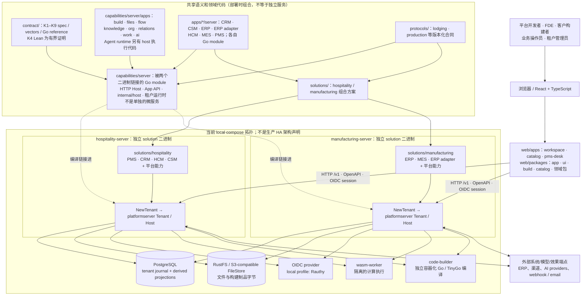
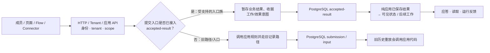
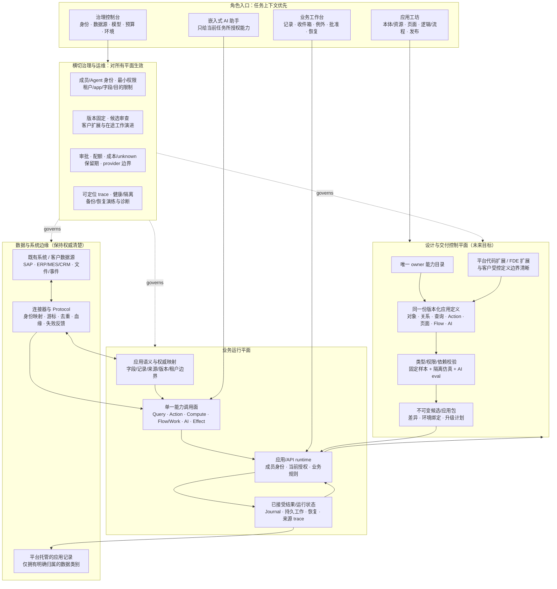

# 平台影响优先级与架构保证

**复核日期：** 2026-10-05（America/Los_Angeles）　**代码基线：** `87b8307`　**范围：** 原 `docs/review/01–06` 对产品/架构、内核与运行时、能力供给、前端、文档治理和整改顺序的对抗性复核。仅审阅文档及静态代码；不改源码、产品方向或 `WorkQueue`。

## 执行判断

**旧评审识别了真实的边界问题，但把“需要说清”误排成了“必须先重做”：** 前一版把文档很长、能力矩阵粒度混杂、多个入口需要交叉阅读，推导成先暂停非阻塞能力、再裁决产品身份、重画一套架构基线并建立总阶段门禁。复核后，这些改动的当前用户收益不足，且不少内容与现有目标/队列重复；因此撤回“总体停工、先重构蓝图”的最高优先建议。

平台影响更大的事实是：**内核级规范与少量有界证明并不覆盖所有宿主提交和恢复入口。** 但仓库已经显式记录这项边界并安排工作。产品方向也已足以指导当期开发。最高收益是按现有次序把构建、交付、恢复和最小演进做成可走查的用户任务；不是新建五张图，也不是拿功能/文档数量评判平台。

## 按用户收益 / 平台影响排序

### 1. 持久结果路径并非全覆盖：维持精确的“入口级保证”

**影响：平台级数据完整性和恢复承诺。状态：已知边界，尚非本轮发现的新事故。**

- `capabilities/server/host.go` 的 `Tenant.Submit`（约 296 行）仅在 `AcceptResult` 已配置、应用实现 `platform.ResultApp` 且提交满足 `acceptsGenerated` 等条件时，选择 `submitAccepted` 路径（约 401 行）。接受结果保存与完成逻辑位于 `submitAccepted` / `finishCommittedResult`。
- `capabilities/server/journal.go` 明确区分：旧 `submission`/legacy entries 在恢复时重放应用代码；`accepted-result` 保存结果字节并应用已保存结果。当前并存的是不同的持久化/恢复路径，不是一项覆盖所有入口的统一保证。`Platform.md` §4/§8 与 ADR-0038 进一步列明 accepted-result 已覆盖的操作，以及仍未覆盖的 Chat/Agent、私有状态、旧入口/历史、正式升级结果等边界。
- K1–K9 的规范与 Go 参考实现测试向量覆盖契约行为；ADR-0041 的 Lean 证明只针对选定 K4 幂等分支及其明确前提。它们不证明每个 `Tenant.Submit`、worker、PostgreSQL 事务或崩溃点均与规范精化。反过来，存在旧重放路径本身也不足以证明发生了数据损坏。
- 仓库对跨应用全局原子事务已有显式边界：ADR-0026 拒绝跨权威强一致事务组，要求跨应用变更经请求/回执异步处理；不要把被正式否决的设计重新包装成“必须先补齐系统级全局原子性”。

**收益最高的应对：** 延续 WorkQueue #135/#123 的持久环境、交付定位和恢复走查，及 #136/#131 的带数据最小演进；对每个操作入口分别陈述已验证保证和未覆盖范围。只有新证据表明已有用户路径会丢失已接受结果，才由 owner 依据影响重排批次。**不要**新增一支“全入口恢复矩阵”队列，也不要宣称全平台恰好一次。

### 2. 端到端客户任务的证据比资产清点更值钱

**影响：是否能缩短构建和运营业务应用的实际时间。状态：产品方向明确；真实客户/外部构建者结果未由本次复核验证。**

`docs/Intent.md` 已将产品定义为“面向 FDE 与客户构建者的 AI 业务应用平台”，给出数据接入→语义建模→动作/流程/AI→界面→测试发布→运营演进的生命周期，并以交付耗时、任务完成、资产复用和升级成本为衡量方向。它也说明 AI 与人使用相同语义、权限和 API。故旧报告称平台“仍无法裁决是在做应用系统还是运营层”“首要 persona 无定义”不准确：**原则级边界已具备，但优先业务任务的真实外部价值仍待验证**。

当前 WorkQueue 已有明确闭环节奏：

1. **#141 当前批次：** 负责人已要求先融合应用设计体验，沿资源身份、授权编辑、页面/流程/发布路径走查。
2. **#135/#123：** 固定持久环境，验证重启后续跑；由失败业务任务定位原流程/计算/审批与恢复动作。
3. **#136/#131：** 在持久环境对已有数据做受控、最小字段升级，保留旧值和在途工作。
4. **#134：** 一个有界可配置外部 JSON 数据源，预览/校验/重试不重复写入。

这比“先找一条主线”的新建议更具体，也已带有结果与停止条件。应按队列完成，不另开第二队列或同时扩展行业专用应用。走查可以使用当前所选任务；成功指标沿 Intent 已有衡量，不要因评审而发明一组基线值或 KPI。

### 3. 授权隔离与 AI 取消竞态：高影响、尚待复现

流程 Agent 内置读取是否严格限制在预期应用范围、以及取消/暂停时迟到工具调用是否仍能产生副作用，是跨租户/业务数据边界的问题。此前 AI 专项发现的是**高影响静态路径，不是已证实漏洞**；复核见 [AI 权限、成本与产品路径](ai-priorities.md)。若测试复现，应先按安全/数据影响由负责人评估处理优先级；本报告不将未验证发现伪装成已排定队列项目，也不建议为“遵守现有队列”而忽略确证风险。

### 4. 发布、升级、连接器：从现有任务最小化验证

应用候选/发布、运行操作、数据接入、版本演进不是全部结束；它们在队列中分别对应 #141、#135/#123、#134、#136/#131。前一版主张的“两行业同一旅程”“固定数据、外部系统故障注入、第二行业独立验收”超出现有批次的已授权范围，而且当前 WorkQueue 明确要求先完成固定任务路线、仅在实际任务需要时扩展。不要因评审把第二行业复用或生产级 RPO/RTO/SLO 变成新退出门槛；继续只声明已有证据。

## 前版评审逐项收敛

| 原评审议题 | 保留的有效观察 | 本轮修正/撤回 |
|---|---|---|
| **01 意图与总体架构** | `Platform.md` 信息密集；当前层、目标方向和历史决定分布在不同文件，陌生读者需跟链接核对实现状态。 | Intent 已给出产品身份、主要用户、生命周期与结果衡量。不能称为没有战略边界；将问题缩窄为“哪些业务结果仍未由真实用户验证”。`Platform.md` §2 与 §10 也已尝试区分当前实现与未来方向，并非完全没有状态区分。 |
| **02 内核与运行时** | 契约向量和 K4 有界证明不等于整个 Host/PostgreSQL/恢复系统证明；accepted-result 覆盖范围要按入口表述。 | 这项是最重要的架构边界，但 ADR-0038 和 WorkQueue 已承载。跨应用全局事务组在 ADR-0026 已明确否决；不要重新要求不可实现的全局原子保证。 |
| **03 能力供给/目录** | 稳定能力、UI 组件、工作项切片属于不同抽象层，成熟度计数容易误导。 | `Platform.md` 能力目录的行数和 Widget/Inspector 数不是最高风险或优先级依据；既有当前队列已将任务路线和组件整改相连。未证明“目录混杂”已造成当前开发阻塞。 |
| **04 前端入口** | 建立者、管理员、操作员应能回到业务结果、版本和恢复动作，不能以页面/截图数验收。 | #141 已在推进应用设计体验，#135/#123 明确由失败任务反向定位并给出恢复动作。再加四条强制路线/额外 UI 验收层会重复现有安排；实际走查按 WorkQueue 停止条件即可。 |
| **05 文档与治理** | 必读资料较多；长期事实、当前批次与 As built 应保持各自唯一归属。 | 仓库已有短 `AGENTS.md` 入口、单一近期 `WorkQueue`、ADR、`Testing.md` 和定向技能。文档多或体量大本身不证明治理失效；除非有死链、重复事实冲突、找不到 owner 或实际任务受阻，不做全面改写。 |
| **06 总体建议** | 结果验收应高于组件数，生产承诺要有对应证据。 | “短期暂停非阻塞新能力”“先裁决产品边界”“先重画部署/调用图”“增加 G0–G4 全局门禁”等建议撤回。它们的机会成本高、与现队列重复，也没有相应损失证据。保留“能力扩大不等于用户结果”的原则，但沿现有批次检验。 |

## 分层的证据表述

### 当前仓库能支持的陈述

- `Intent.md` 有清晰的 FDE/客户构建者产品使命和任务生命周期；首要业务情境还需以真实走查和用户结果验证。
- `Platform.md` 记录 K1–K9 的语言中立规范和 Go 参考实现测试向量；K4 Lean 有界模型有专属证明映射。它们为架构提供可信基础，但范围有明确边界。
- `Platform.md` §4 对不同日志/权威路径作了区分；`journal.go` 注释和宿主代码表明 accepted-result 与旧提交条目具有不同恢复语义。
- `WorkQueue.md` 当前主线由 #141 开始，并给出 #135/#123、#136/#131、#134 的结果、停止条件与检查选择；不要求另造计划队列。

### 当前不能据此声称

- 所有宿主、Chat/Agent、worker、发布、历史和私有状态在崩溃后均可恢复，或所有操作具备统一事务性/恰好一次保证。
- 一个选定 K4 的 Lean 证明等同完整系统证明；Go 测试通过等同生产租户数据、横向扩容、故障恢复已验收。
- 参考应用完整代表可销售 ERP/MES/CRM；内建组件多等同用户任务更快；自动化测试等同外部用户体验。
- WorkQueue 中的某项“待执行”就是已完成验证，或 ADR 中的“Accepted/As built”都属于本轮新运行的测试。
- AI 流程 Agent 权限/取消问题已被利用，或当前代码一定存在真实数据外泄/迟到副作用；需要专门隔离与并发测试确认。

## 本次仍需 owner 决定的边界

这些是决策，不是 Review 可自行裁决的已知缺陷：

1. 对未覆盖持久化入口，在哪些客户场景前必须补做恢复测试；优先级由数据风险决定，不由“保证范围要一致”本身决定。
2. 流程 Agent 的无用户主体究竟可以读哪些应用/字段；静态代码与注释/ADR 预期出现的分歧需明确后测试。
3. 特殊数据是否允许按当前读取权限发送到租户配置的模型 Provider；数据可读与可外发是两项决策。
4. 何时将某条内部走查称为外部业务价值证据；不得从编译通过、固定样本、参考应用或研发本人走查推导客户成功。

## 平台整体蓝图：现状（As-Is）与方向（To-Be）

这两张图和下面的能力/用户矩阵都收在本报告中，因此 `docs/review/` 仍然**恰好三份文档**。它们不替代正式架构事实源：[Platform.md](../Platform.md) 和各 ADR 继续记录已接受设计/代码边界，[WorkQueue.md](../WorkQueue.md) 继续拥有执行顺序。当前图按**代码基线 `87b8307`** 绘制；本报告中的未来图是基于评审的**产品/架构提案**，未被负责人接受、未替换 ADR-0031 或当前队列，也不能当作已实现功能。

专业说法就是：**As-Is 代码架构图 + To-Be 产品/架构蓝图 + 能力矩阵 + 用户/任务矩阵 + 竞争定位**。下面将它们分开，避免把“现在有的”和“希望变成的”画进同一张图。

### A. 当前蓝图：代码和本地部署实际结构

**读图注意。** `platformserver` 是 Go module，宿主/平台应用代码被不同 solution 二进制链接；并不是一个独立部署的中心化平台服务。`deploy/local/compose.yaml` 当前展示两套 solution server，共用本地 PostgreSQL、RustFS、Rauthy 和编译/执行服务。前端开发服务器不属于这份 Compose 拓扑。没有据此推断线上生产部署、HA、多区域、SLO 或客户级资源隔离。Wasm worker 与 code-builder 在本地配置中分离；builder 虽有独立容器和资源/网络约束，但也挂载 Docker socket，不能把这项本地设置当成无条件的租户安全边界。整个租户运行时也没有因此获得物理隔离保证。

**当前数据路径不是单一保证。** Web/API 经身份和 tenant/runtime 检查，进入应用动作、查询、Flow/Work、AI/Agent、效果或 Build。所选 `accepted-result` 入口会暂存、先写入 PostgreSQL Journal，再应用已保存结果；其他旧 `submission`/`input` 仍可能在恢复时重放应用代码。具体已接入入口与缺口见 ADR-0038。外部跨应用通过 Protocol；跨权威的全局 ACID 不属于目标保证。

上图是**范围示意**，不是所有 API 都从同一路由、在所有部署中使用同一 handler 的精确时序图。不得把部分结果路径、契约向量或 K4 证明外推为所有入口的原子提交、全系统精化证明或外部效果恰好一次。

### B. 当前能力矩阵：有实现，不等于已达产品承诺

标记含义：`●` 表示代码/规范中有实在实现；`◐` 表示仅覆盖部分用户路径或需额外证据；`△` 表示评审建议的目标。它们不是“质量打分”，也不替代各 ADR As built。

| 能力层 | 当前代码证据 | 状态 | 主要边界/用户影响 |
|---|---|:---:|---|
| **契约与领域语义** | `contract/spec`、向量、Go 参考内核；`platform` app API；业务 app 的 manifest、实体、规则和 protocol | ● | K1–K9 定义与参考测试覆盖部分契约；有界 K4 证明不证明整个 host/runtime。 |
| **多应用宿主** | `capabilities/server` 的 tenant、路由、authorization、Journal、replay、snapshot、effects、API | ●/◐ | 共享 Go module 中的宿主实现；部署故障域按实际二进制，不能凭分层名称推断为微服务。恢复范围按 ADR-0038。 |
| **平台通用能力** | `build`、`files`、`flow`、`knowledge`、`org`、`relations`、`work`、`ai` app；Agent 执行有 host 代码 | ●/◐ | 工程机制较多；部分私有状态、旧入口和用户旅程仍有边界。 |
| **行业应用与方案** | CRM、CSM、ERP、ERP adapter、HCM、MES、PMS；hospitality/manufacturing solutions；lodging/production protocols | ●/◐ | 可作探针/演练；不是可与 SAP ERP 广度、法规覆盖或真实生产案例等同的完整行业套件。 |
| **对象/页面/流程构建** | `apps/build`、`web/packages/build`、Catalog、对象/页面/候选/发布、类型化流程/Block、共享 UI | ◐ | 足以作为 Studio 工作的代码基底；负责人当前选择的 #141 仍在收敛应用设计体验。 |
| **接入与外部效果** | K8 描述符、ERP adapter、protocols、FileStore、异步 effects | ◐ | 配置型通用数据接入仍在 WorkQueue #134；每个外部源的映射、凭据和恢复保证需逐一描述。 |
| **工作流与操作** | `flow`、`work`、工作/任务/审批/运行详情、规则动作 | ●/◐ | 可支持若干人机任务；系统级运营恢复/定位由 #135/#123 继续验证。 |
| **AI / Agent** | Provider、模型、Chat、typed AI function、Agent、Knowledge、Eval、Usage/trace | ●/◐ | 组件已实现，不等于真实模型质量/成本、安全边界已验收；风险与证据见 [AI 报告](ai-priorities.md)。 |
| **持久化与版本演进** | PostgreSQL Journal、accepted-result、候选冻结/激活、文件对象、重放/恢复测试 | ◐ | accepted-result 不是所有入口；有数据最小升级在 #136/#131，不能宣称所有客户定义/在途工作均可自动迁移。 |
| **开发/部署/企业运维** | 多个 Go module、脚本、CI、local compose，PostgreSQL/RustFS/OIDC、builder/worker | ◐ | 本地环境和 CI 是工程证据，不是外部用户交付、SLA、生产规模、备份演练或多区域部署证明。 |

### C. 当前用户/任务矩阵

| 用户/角色 | 典型任务 | 当前入口/可见能力 | 当前尚未证明的结果 |
|---|---|---|---|
| **平台工程师** | 定义契约/API/共享运行时，维护 UI/平台服务 owner，支撑新行业 | Go `contract/`、`capabilities/server`、共享 Web packages、scripts/CI | 新平台能力是否让外部任务交付更快，以及多个 owner 的维护成本是否下降。 |
| **FDE / 解决方案工程师** | 对接客户系统、组织领域对象/权限/页面/流程/代码扩展，交付可运行应用 | 业务 app/solution Go modules、Build/Studio、Catalog、Go/Wasm 路径 | 独立 FDE 能否在限定时间内完成陌生行业任务；当前没有被本轮证实的外部交付耗时/返工基线。 |
| **客户构建者** | 在授权范围内改字段、页面、表单、流程/AI 定义，测试并发布 | `build.builder`、受控 Build assets、工作区/页面编辑和发布候选 | 完整 customer-safe 的增改、兼容升级、变更影响与自助恢复闭环。 |
| **业务操作员** | 查看记录/任务/审批/流程，处理业务例外并回到业务上下文 | Workspace、领域应用 UI、Work/Flow/Inbox；PMS Desk 作为桌面端 | 一条真实业务路线的任务成功率、故障定位时间、失败后恢复体验。 |
| **租户管理员 / 安全 owner** | 配成员/角色/组织、连接器、模型、预算、留存、发布与运行政策 | OIDC、Console、`org`/`platform`/`ai` 设置和部署配置 | provider 数据政策、审计/留存、配额边界、用户友好诊断及生产级运维证据。 |
| **外部系统/集成 owner** | 映射记录/ID/事件，处理游标、重试、拒绝与外发效果 | `protocols/`、K8、ERP adapter、Effects、FileStore/API | 首个完全配置化接入流程由 #134 覆盖；更广身份对账/血缘/来源治理仍是未来范围。 |

## 目标蓝图：以“业务任务到可持续应用”而不是功能数量竞争

### 提议的产品方向

**产品类别建议：受治理的行业业务应用交付与运营平台（面向 FDE、客户构建者和一线业务人员）。** 不是先卖通用 AI 聊天或单独的低代码工具，而是把一项真实业务任务变成可部署、可操作、可恢复、可演进的应用。

**不是宣称全盘超越 SAP 或 Palantir，也不是推翻既有 Intent。** 我建议把它进一步聚焦为：

> **面向 FDE 与客户构建者的、可接入既有系统、可构建/运行/演进行业业务应用的受治理平台；让同一套业务语义、授权和类型化能力贯穿代码、可视化、AI 与操作界面，并把“已交付且可恢复的业务任务”作为产品单位。**

它不是简单复制一个 Ontology/语义层、不是“要替代 S/4HANA 的全功能 ERP”、也不是给所有人一个空白聊天框。它可以承载平台自己拥有的有限业务权威，也可以连接由 SAP/ERP/MES/CRM 等继续拥有的权威；每一类数据都需明确 source-of-truth、映射、权限和外部写回路径。

### D. 提案目标架构图

目标图不是“再造一个平台后端”。它强调三件事：**一份 app/能力语义**、**一套受权执行与版本化结果**、**分别满足构建/运营/治理的用户入口**。AI 是这套系统中的协作者，执行仍走原权限、规则与受控工具；不是高权限第四个系统。集成采取“异构系统仍可拥有数据 + 平台应用可拥有经声明的数据”的双模式，不把所有外部系统数据复制成平台自己的真理。

### E. 目标产品/功能矩阵

| 产品层 / 用户价值 | 目标功能 | 当前基础/缺口 | 成为竞争力的验收结果 |
|---|---|---|---|
| **连接：接入现有工作，而非要求替换 ERP** | 配置数据源、身份与字段映射、读取/写回授权、游标、去重、来源追踪、失败恢复 | K8、protocol、ERP adapter 已有；首个配置型 JSON 接入在 #134 | FDE 能安全接入一个既有系统，业务人员看得到记录来源，失败可定位且重试不重复写。 |
| **语义：把记录/来源/业务操作说清楚** | 类型化对象/关系/查询/Action/owner，兼容性、版本和 source-of-truth 映射 | `contract`、App API、Build object/query/action 已有；外部映射/升级面仍在演进 | 同一字段定义跨 UI/API/流程/AI，不形成第二套业务真理；授权与字段来源可见。 |
| **构建：一个版本定义，多种创作方式** | 专业代码、受控视觉构建、AI 协助 diff/测试；同一校验器、能力目录、依赖闭包 | Build、Catalog、Go/Wasm、ADR-0046 设计在推进；#141 当前主线 | FDE 可用最短路径交付一个可操作场景；客户构建者只改授权范围内的定义，无代码旁路。 |
| **运行：人在真实任务上下文中完成工作** | 业务主页/记录/任务/审批、流程步骤、失败和恢复入口，桌面/窄屏一致 | Workspace、领域 UI、Work/Flow 有实现；整条运行路线待走查 | 业务操作者能从通知/例外到完成或恢复，不需要懂平台对象 ID/内部状态。 |
| **AI：协助理解/提议/执行，但不超越权限** | 对象上下文、可引用来源、typed plan/action、人工确认、在途取消、评测与预算 | AI/Agent/Knowledge 已有组件；`ai-priorities.md` 列出未验证边界 | AI 每次结果可追踪到主体、来源、动作和预算；撤权/取消可验证，任务成本/unknown 明确。 |
| **交付与演进：客户改动能安全活过升级** | 不可变候选、依赖差异、环境绑定、数据迁移、客户扩展分层、在途工作版本固定 | 发布 candidate/release 已有；持久环境/最小存储演进为 #135/#123、#136/#131 | 从失败任务定位到原版/恢复；新版本保留旧值与在途任务；不支持迁移明确拒绝。 |
| **治理与运营：能证明谁能做、发生什么、如何恢复** | 权限闭包、审计/trace、预算/保留策略、tenant 状态、限额、备份恢复 | 多项已有机制；完整责任与生产证据未通过本轮确认 | 管理员能审计来源和执行者，发现并处理失败；不把本地 Compose 当生产承诺。 |
| **行业产品：不止开发工具，而是可用方案** | 以 CRM/MES/ERP 任务模板作为验证，提供领域规则、屏幕、审批和接入 | 参考/目标 app 存在；行业套件深度与真实客户结果有限 | 至少一项真实任务外部验证；第二领域主要是定义/规则差异，不产生另一套平台执行栈。 |

### F. 目标用户矩阵（产品的“谁做什么、得到什么”）

| 用户 | 要完成的工作 | 目标入口/产品责任 | 成功证据（不是功能数量） |
|---|---|---|---|
| **平台开发者** | 增加跨应用复用的能力，同时保持唯一 owner、稳定契约和安全默认值 | 内核/API/能力目录/可复用 UI 与工具链 | 新行业任务复用现有运行路径；共性只实现一次；变更边界与兼容性可检验。 |
| **FDE / 行业交付者** | 从客户数据和实际流程快速交付一份可运营业务应用 | 领域连接器、语义映射、代码+视觉工作区、测试/发布及现场诊断 | 第一次端到端交付的周期/返工下降；错误映射和权限问题在发布前暴露。先建立基线，不先造“五天达成”承诺。 |
| **客户构建者 / 管理型 builder** | 在授权范围内改页面、字段、表单、流程或 AI 定义，并安全发布 | 受控的 Builder/Studio、预览/diff、候选与升级计划 | 不写平台源码也完成允许的变化；发布边界清楚；客户自定义不被基础包升级覆盖。 |
| **业务操作员** | 处理一个具体客户/订单/服务/生产任务及其异常 | 任务/记录/收件箱、嵌入式协助、说明与恢复按钮 | 任务完成率、用时、返工/重复动作、异常后的恢复率改善。 |
| **业务主管 / 审批者** | 检查受影响数据、证据、风险和待确认动作 | 有上下文的审批/例外工作台，显示原记录、版本、来源和后果 | 能快速决定、减少错误批准；高风险动作不会藏在泛化“Approve AI”按钮里。 |
| **租户管理员 / 安全 owner** | 配置身份、组织、接入、Provider、预算/数据留存、发布策略 | 一个 Admin / Trust 面，不打断业务操作上下文 | 权限/成本/留存策略可检查且可撤销；真实与未知费用/数据去向看得见。 |
| **外部系统负责人 / 集成伙伴** | 提供可靠授权 API/数据源，理解失败、回执、游标和重新发送 | 版本化 Protocol/Connector、凭据边界与诊断 | 接入/重试能幂等，出现问题可定位；外部系统保留的权威不被隐性覆盖。 |

### G. SAP / Palantir 对照：选择战场，不承诺全面胜出

截至本次复核，SAP 官方扩展指南描述 SAP Build 支持对 S/4HANA 的 on-stack 与基于 BTP 的 side-by-side 扩展；SAP BTP 汇聚应用开发、流程自动化、集成、数据/分析、AI 等能力。Palantir 官方架构把 Ontology 描述为数据、逻辑、动作、安全的共同语义/执行系统；其 AIP/Foundry 还覆盖模型接入、上下文、治理、Agent 生命周期、观测、构建和交付。两者都远不止单一 UI 或 Agent 工具。

| 比较维度 | SAP 的强项/产品上下文 | Palantir 的强项/产品上下文 | 我建议的平台选择（目标，不是现状宣称） |
|---|---|---|---|
| **记录权威与业务深度** | 广泛的标准 ERP 业务流程、S/4HANA 的系统记录及 BTP on-stack/side-by-side 扩展 | 通过 Ontology 连接已有数据/逻辑/动作，面向运营决策和执行 | 不从零复制所有 ERP。可连接 SAP/CRM/MES；只托管有明确 owner 的新应用数据，优先把一项行业工作流做得小而完整。 |
| **统一语义/操作** | 公共 domain/API/event、跨 SAP 流程与应用体验 | Ontology 连接对象、关系、逻辑、动作、安全，Workshop 面向对象构建应用 | 不是只加一层 Ontology；让同一应用定义确实贯通业务 UI、API、流程、AI 与客户版本演进，并保留来源/数据权威。 |
| **构建者覆盖** | SAP Build 支持多种技术等级、on-stack 和 side-by-side 扩展 | Workshop/no-code、OSDK/React、Pilot AI 辅助构建和自定义扩展 | 代码、受控视觉和 AI 协作产生同一类可验证定义；FDE 做专业扩展、客户 builder 做安全范围内修改。不能声称当前体验更成熟。 |
| **AI 与人机协作** | SAP 将 AI 与现有业务应用/开发扩展结合 | AIP 把模型、上下文、Ontology、安全、Agent、评测/观测集成 | AI 作为任务中的受权协作者，typed proposal→原动作/审批→可恢复结果；以真实任务的质量、成本、撤权/取消证据竞争，而不是“有聊天”竞争。 |
| **发布、升级、客户扩展** | Clean-core 与 SAP 的扩展/生命周期模型 | Foundry 的产品/开发交付体系与 Ontology 资产路径 | 重点证明“客户扩展 + 基础定义 + 在途工作”能共同演进、显式迁移和恢复；不暗示此项现已闭合。 |
| **生态与行业套件** | SAP 有成熟生态与广泛行业业务深度 | Palantir 有数据/应用/交付产品族与用户基础 | 先以平台产品聚焦少数高价值行业任务获得复用证据，不比“连接器、应用、功能列表更长”。 |

**“超越”在此蓝图中的可检验定义：** 不是覆盖 SAP 的 ERP 深度，也不是超过 Palantir 全栈/生态；而是在一个目标客户任务上，能以更低的交付和变更摩擦，从异构系统开始，构建可用应用，治理 AI/权限，可靠运营，并让客户自己安全演进。如果真实用户、独立 FDE 和升级/恢复证据没有优于替代方案，就不能对外称为“超越”。

官方参照：SAP [BTP 能力概览](https://help.sap.com/docs/btp/sap-business-technology-platform/sap-business-technology-platform) 与 [SAP/S/4HANA 扩展架构](https://help.sap.com/docs/sap-btp-guidance-framework/extension-architecture-guide/getting-started-with-extensibility)；Palantir [Ontology 架构](https://www.palantir.com/docs/foundry/architecture-center/ontology-system)、[AIP 架构](https://www.palantir.com/docs/foundry/architecture-center/aip-architecture)、[应用构建](https://www.palantir.com/docs/foundry/app-building/overview) 及 [2026 公告](https://www.palantir.com/docs/foundry/announcements/2026-09)。访问日期：2026-10-05。此比较是按公开产品说明提炼的战略参照，不是对双方产品的独立竞争评测。

### H. 从当前代码走向目标产品：不改当前队列

目标方向只在“产品假设”层比当前更清楚；近期实施仍尊重现有 WorkQueue：

1. **当前 #141**：将 Builder/Studio 走查成一条可见页面/资源任务，保持语义与代码执行一致。
2. **随后 #135/#123**：完成持久环境中的稳定交付、运行定位与恢复入口。针对实际触及的结果路径证明边界。
3. **随后 #136/#131**：最小、有数据的应用演进，保护旧值和在途工作。
4. **随后 #134 与 #138/#132**：有界连接器、表单联动；沿原能力 owner，不开连接器市场/行业套件大扩张。
5. **将来再决定 AI-first 业务入口**：先由安全/产品 owner 裁决前文权限、取消、成本和留存问题，再选单一真实工作任务评估 AI 帮助。CSM 分诊/答复草稿可做候选，但不自动插入当前队列。

这并不是另起一条 roadmap。若负责人想把 To-Be 提案升级为正式战略，应先选择一个目标行业/买方任务、明确非目标，然后单独修订 Intent/Platform 与 ADR/WorkQueue；本次只提供蓝图建议，没有自行改变已接受计划。

## 参考入口

- [产品意图](../Intent.md)　·　[当前执行队列](../WorkQueue.md)　·　[平台现状/目标](../Platform.md)
- [ADR-0026：跨应用决策边界](../ADR/0026-decisions-across-apps.md)　·　[ADR-0038：accepted results 与租户恢复](../ADR/0038-accepted-results-and-tenant-recovery.md)　·　[ADR-0041：首个 K4 有界证明](../ADR/0041-first-kernel-proof.md)
- [Testing](../Testing.md)　·　[AGENTS](../../AGENTS.md)　·　[AI 权限、成本与产品路径](ai-priorities.md)
